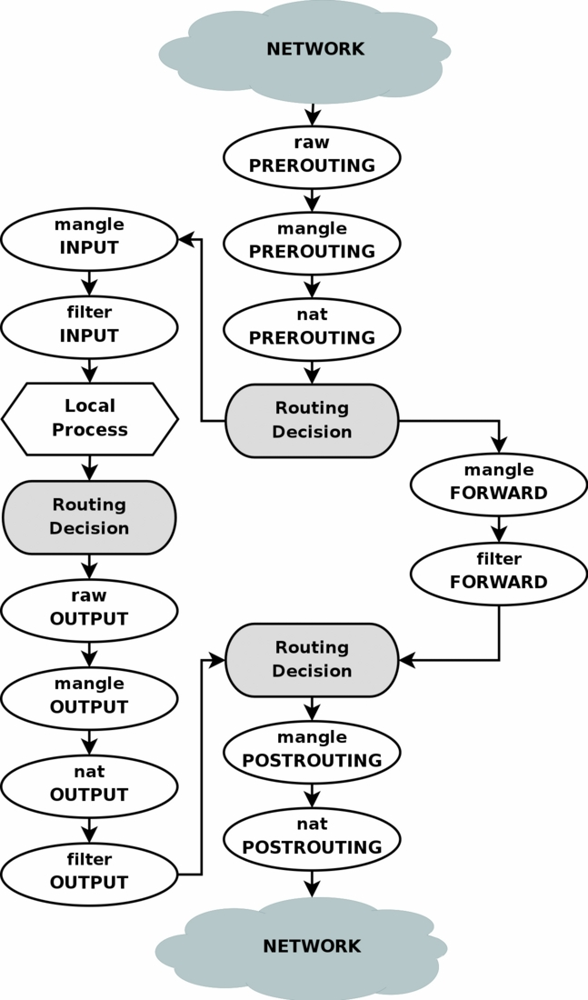
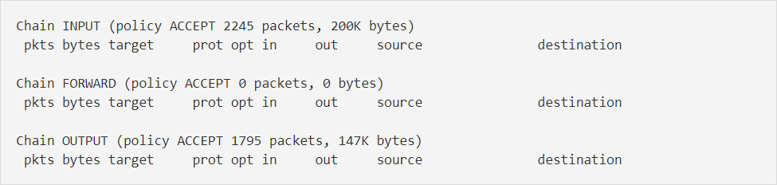

## IPtables

IPtables là 1 tường lửa dựa trên lọc gói, miễn phí và có sẵn trên linux

Thực chất IPtables chỉ là giao diện dòng lệnh để tương tác với tính năng lọc, chỉnh sủa gói, NAT của netfilter framework

IPtables/netfilter gồm 2 phần là netfilter ở trong nhân linux và IPtables nằm ngoài nhân. IPtables chịu trách nhiệm giao tiếp với người dùng và sau đó đẩy các luật của người dùng vào cho netfilter xử lý. Netfilter tiến hành lọc các gói dữ liệu ở mức IP. Netfilter làm việc trực tiếp trong nhân, nhanh và không làm giảm tốc độ của hệ thống

#### Lịch sử

Trước IPtables, các gói phần mềm dùng để quản lý tường lửa trên linux là ipchains trong linux kernel 2.2.x và ipfwadm trong linux kernel 2.0.x, dụa trên BSD. Cả 2 chương trình này đều thay đổi mã mạng để chúng có thể thao tác các gói, vì nhân linux thiếu khung kiểm soát gói chung cho đến khi netfilter được giới thiệu

IPtables giữ lại các ý tưởng chính trong ipfwadm: các danh sách luật, trong đó mõi luật chỉ ra những dấu hiệu cần tìm trong 1 gói tin và các hành động sẽ thực hiện với 1 gói tin thảo mãn các dấu hiệu. ipchains thêm khái niệm chains rules và IPtables mở rộng ra tables. 1 table được tra cứu khi cần quyết định phải nat gói tin, vaf1 table khác chỉ ra phải lọc gói như thế nào.

Cách phân chia này cho phép IPtables sử dụng thông tin mà lớp giám sát kết nối thu được từ gói tin, những thông tin thường gặp trong nat. Điều này làm cho IPtables hiện đại hơn ipchains vì nó có khả năng giám sát trạng thái của kết nối và chuyển hướng, thay đổi hay dừng các gói tin dựa trên trạng thái của kết nối, không chỉ dựa vào nguồn, đích hay nội dung gói tin. 1 tường lửa sử dụng IPtables theo cách này còn được gọi là stateful firewall, trong khi ipchains chỉ là stateless firewall. Ta có thể nói rằng IPtables có thể nhận thức được ngữ cảnh của gói tin đang di chuyển, từ đó đưa ra 1 quyết định đúng đắn hơn cho các gói tin và kết nối

Hiện nay chúng ta có nftables - một sự thay thế cho IPtables được sử dụng trên các bản phân phối linux mới gần đây (ví dụ CentOS 8)

#### Những việc IPtables có thể làm

- xây dựng tường lửa cho hệ thống dựa trên stateless và stateful packet filtering

- triển khai các cụm cluster stateless và stateful firewall với tính sẵn sàng cao

- sử dụng NAT và masquerading để chia sẻ truy cập internet nếu bạn không có đủ địa chỉ IP công cộng

- sử dụng NAT để thực hiện transparent proxies

- hỗ trợ các hệ thống tc và iproute2 được sử dụng để xây dựng các bộ định tuyến theo chính sách và QoS tinh vi

- thực hiệm một số tác vụ (thêm, gây xáo trộn) với packet như thay đổi TOS/DSCP/ECN trong IP header

#### Các thành phần trong IPtables

Cơ chế packet filtering của iptables hoạt động bao gồm 3 thành phần sau: tables, chains và targets.

1. Table

Tường lửa IPtables sử dụng các bảng để tổ chức các quy tắc của nó. Các bảng này phân loại các quy tắc theo loại quyết định mà chúng được sử dụng để đưa ra. Hiện nay IPtables bao gồm 4 bảng:

- Filter table: là một trong những bảng được sử dụng rộng rãi nhất trong iptables. Bảng Filter được sử dụng để đưa ra quyết định về việc có nên để gói tin tiếp tục đến đích dự định hay từ chối yêu cầu của nó hay không. Theo cách nói tường lửa, đây được gọi là "lọc" gói. Bảng này cung cấp phần lớn các chức năng mà mọi người nghĩ đến khi thảo luận về tường lửa

- NAT table: Bảng NAT được sử dụng để thực hiện các quy tắc dịch địa chỉ mạng. Khi các gói vào network stack, các quy tắc trong bảng này sẽ xác định xem và cách sửa đổi địa chỉ nguồn hoặc đích của gói để tác động đến cách gói và bất kỳ lưu lượng phản hồi nào được định tuyến. Điều này thường được sử dụng để định tuyến các gói đến các mạng khi không thể truy cập trực tiếp

- Mangle table: được sử dụng để thay đổi các tiêu đề IP của gói theo nhiều cách khác nhau. Chẳng hạn, bạn có thể điều chỉnh giá trị TTL (Time To Live) của một gói, kéo dài hoặc rút ngắn số bước nhảy mạng hợp lệ mà gói có thể duy trì. Các tiêu đề IP khác có thể được thay đổi theo cách tương tự. Bảng này cũng có thể đặt "dấu" nhân bên trong trên gói để xử lý thêm trong các bảng khác và bằng các công cụ mạng khác. Dấu này không chạm vào gói thực tế, nhưng thêm dấu vào kernel's representation của gói

- Raw table: tường lửa IPtables có trạng thái, nghĩa là các gói được đánh giá liên quan đến mối quan hệ của chúng với các gói trước đó. 1 gói tin có thể thuộc một kết nối mới hoặc cũng có thể là của 1 kết nối đã tồn tại. Các tính năng theo dõi kết nối được xây dựng trên đỉnh của bộ lọc mạng cho phép IPtables xem các gói như một phần của kết nối hoặc phiên liên tục thay vì như một luồng các gói rời rạc, không liên quan. Theo dõi kết nối một cách logic thường được áp dụng rất sớm sau khi gói truy cập vào giao diện mạng. Bảng raw có chức năng được xác định rất hẹp. Mục đích duy nhất của nó là cung cấp một cơ chế đánh dấu các gói để từ chối theo dõi kết nối

Ngoài ra con 1 bảng là Security Table: được sử dụng để đặt các dấu hiệu bối cảnh bảo mật của Selinux bên trong trên các gói, điều này sẽ ảnh hưởng đến cách Selinux hoặc các hệ thống khác có thể diễn giải các bối cảnh bảo mật của Selinux xử lý các gói. Các dấu này có thể được áp dụng trên cơ sở mỗi gói hoặc mỗi kết nối.

Sơ đồ sau đây cho thấy ba bảng quan trọng trong iptables:


2. Chains

Mỗi table được tạo với một số chain nhất định. Chains cho phép lọc gói tin tại các điểm khác nhau. IPtables có thể thiết lập với các chains như bên dưới và bạn có thể thấy, tên của các chain gần như trùng với tên của các netfilter hook mà chúng được liên kết với

- PREROUTING: được kích hoạt bởi hook NF_IP_PRE_ROUTING, các rule thuộc chain này sẽ được cáp dụng ngay khi gói tin vừa vào đến network interface. Nó sẽ được thực thi trước khi quá trình routing diễn ra, thường dòng cho DNAT (destination NAT). Chain này có ở 3 table Raw, Mangle và NAT

- INPUT: được kích hoạt bởi hook NF_IP_LOCAL_IN, các rule thuộc chain này áp dụng cho các gói tin ngay trước khi các gói tin được đưa vào hệ thống. Chain này có trong 2 table là Mangle và Filter

- FORWARD: được kích hoạt bởi hook NF_IP_FORWARD, các rule thuộc chain này áp dụng cho các gói tin chuyển tiếp qua hệ thống, nghĩa là gói tin có đích là 1 máy khác nhưng không được tạo ra từ máy bạn. Chain này là cách cơ bản để cấu hình máy bạn để route các request tới 1 thiết bị khác. Chain này có trong 2 table là Mangle và Filter

- OUTPUT: được kích hoạt bởi hook NF_IP_LOCAL_OUT, các rule thuộc chain này áp dụng cho các gói tin ngay khi gói tin đi ra từ hệ thống, hay là các gói tin được tạo từ máy bạn. Chain này có trong các table là Raw, Mangle, NAT và Filter

- POSTROUTING: được kích hoạt bởi hook NF_IP_POST_ROUTING, các rule thuộc chain này được cáp dụng cho các gói tin đi ra bên ngoài hệ thống (kể cả những gói được tạo từ máy bạn hay nhưng gói được forward sau khi quá trình routing hoàn tất), chỉ trước khi no tiến vào đường truyền, thường dùng cho SNAT (source NAT). Chain này có trong 2 table là Mangle và NAT

Mặc định thì mỗi table đều có chains trống. Bạn cũng có thể tự tạo chain cho mình. Mỗi chain sẽ có policy, policy này sẽ quyết định trạng thái của gói tin truong trường hợp nó không match với bất cứ rules nào. Policy chỉ có 2 target là ACCEPT và DROP, mặc định là ACCEPT. Các chain được tạo bởi user sẽ có policy mặc định và không thay đổi được có target là RETURN. Chain cho phép quản trị viên kiểm soát vị trí trong đường dẫn phân phối của gói, quy tắc sẽ được đánh giá.

Bảng bên dưới chỉ ra các chains có sẵn trong mỗi table khi được đọc từ trái sang phải. Chẳng hạn, chúng ta có thể nói rằng bảng RAW có cả 2 chain PREROUTING và OUTPUT. Khi đọc từ trên xuống dưới, nó cũng hiển thị thứ tự mỗi chain được gọi khi netfilter hook liên kết được kích hoạt.

| Table ↓ / Chains → | PREROUTING | INPUT | FORWARD | OUTPUT | POSTROUTING |
| --- | --- | --- | ----| --- | --- |
| (routing decision) | | | | ✓ | |
| RAW | ✓ | | | ✓ | |
| (connection tracking enabled) | ✓ | | | ✓ | |
| Mangle | ✓ | ✓ | ✓ | ✓ | ✓ |
| NAT (DNAT) | ✓ | | | ✓ | |
| (routing decision) | ✓ | | | ✓ | |
| Filter | | ✓ | ✓ | ✓ | |
| NAT (SNAT) | | ✓ | | | ✓ |

Khi 1 gói kích hoạt netfilter hook, các chain liên kết sẽ được xử lý khi chúng được liệt kê trong bảng ở trên từ trên xuông dưới. Các hook mà một gói sẽ kích hoạt phụ thuộc vào việc nó là gói đến hay đi, các quyết định định tuyến được đưa ra và liệu gói có vượt qua các tiêu chí lọc hay không

Một số sự kiện sẽ khiến chains của bảng bị bỏ qua trong quá trình xử lý. Chẳng hạn, chỉ gói đầu tiên trong kết nối sẽ được đánh giá theo các quy tắc NAT. Bất kỳ quyết định nat nào được thực hiện cho gói đầu tiên sẽ được áp dụng cho tất cả các gói tiếp theo trong kết nối mà không cần đánh giá bổ sung.

3. Targets

Target có thể hiểu đơn giản là các hành động được áp dụng cho các gói tin. Target được chia ra làm 2 nhóm sau:

- Terminating targets: là loại target thực thi hành động mà nó sẽ chấm dứt việc kiểm tra gói tin và trả lại quyền kiểm soát cho netfilter hook. Tùy thuộc vào rule thiết lập, nó có thể DROP, ACCEPT hoặc REJECT gói tin

- Non-terminating targets: là loại target mà nó thực thi hành động và vẫn tiếp tục việc kiểm tra gói tin dựa theo các rule khác. Ví dụ target LOG, nó ghi log vào file và packet đó vẫn chịu sự kiểm tra của các rule còn lại

Đối với những gói tin đúng theo rule mà chúng ta đặt ra thì các hành động (TARGET) có thể thực hiện được đó là:

- ACCEPT: chấp nhận gói tin, cho phép gói tin đi vào hệ thống

- DROP: loại bỏ gói tin, không có gói tin trả lời, phía nguồn gửi sẽ không biết đích có tồn tại hay không

- REJECT: loại bỏ gói tin nhưng có gói tin trả lời, ví dụ với gói TCP là "connection reset" hoặc "destination host unreachable" với gói UDP và ICMP

- LOG: chấp nhận gói tin nhưng có ghi lại log

Gói tin sẽ đi qua tất cả các rule chứ không dừng lại khi đã đúng với 1 rule đặt ra. Đối với những gói tin không khớp với rule nào cả thì mặc định sẽ được chấp nhận

#### Các khái niệm khác

- Rules: bao gồm 1 hay nhiều tiêu chuẩn để xác định packets nào sẽ phải chịu ảnh hưởng và target để xác định hành động nào sẽ được thực thi với packet ấy. Cả 2 yếu tố của rule đó là match và target đều là tùy chọn

Cấu trúc của 1 rule trong IPtables như sau:

`TARGET		PROT		OPT		IN		OUT		SOURCE		DESTINATION`

TARGET: hành động sẽ được thực thi với gói tin

PROT: viết tắt của protocol, giao thức được áp dụng cho rule này, ở đây ta có 3 lựa chọn là all, tcp, udp

IN: chỉ ra rule sẽ áp dụng cho packet đi vào từ interface nào (ví dụ: lo, eht0, ens33 ...) hoặc any là áp dụng cho tất cả interface

OUT: tương tự như IN, chỉ ra rule sẽ áp dụng cho packet đi ra từ interface nào

SOURCE: địa chỉ nguồn của lượt truy cập hoặc gói tin được phép áp dụng quy tắc

DESTINATION: tương tự SOURCE nhưng đây là địa chỉ đích

Để xem các rule đang có trong IPtables, dùng lệnh sau

`iptables -L -v`

- Matching trong IPtables

Để 1 rule trong IPtables được xem là matched thì gói tin đi qua phải đáp ứng các tiêu chí của rule đó để hành động tiếp theo hoặc target được thực thi

Hệ thống matching của IPtables rất linh hoạt và có thể được mở rộng đáng kể với các tiện ích mở rộng (extensions) cảu IPtables có sẵn trên hệ thống. Rule có thể xây dựng các tiêu chí để match bao gồm các loại protocol, dest hoặc source address, dest hoặc source port, input hoặc output interface, header, các trạng thái state của kết nối. Chúng có thể được kết hợp để tạo ra các bộ quy tắc khác phức tạp để phân biệt giữa các gói tin khác nhau

- Connection tracking trong IPtables

Theo dõi kết nối được áp dụng rất sớm sau khi các gói vào networking stack. Chain table RAW và một số kiểm tra sơ bộ cơ bản là logic duy nhất được thực hiện trên các gói trước khi liên kết các gói với kết nối.

Connection tracking cho phép IPtables đưa ra quyết định cho mỗi gói tin mà nó nhìn thấy dựa vào ngữ cảnh (context) của kết nối đang diễn ra. Quá trình connection tracking điễn ra khá sớm trong vòng đời (lifecycle) của 1 gói tin. Hệ thống sẽ kiểm tra gói tin với tập hợp các kết nối đang có trên hệ thống, cập nhật trạng thái (state) nếu cần hoặc thêm kết nối mới. Các gói tin được đánh dấu bằng target "NOTRACK" từ RAW table sẽ được bypass quá tình tracking

- Các trạng thái (state)

	Các kết nối được theo dõi bởi hệ thống connection tracking sẽ ở 1 trong các trạng thái sau:

	- NEW: kết nối chỉ có 1 gói tin đầu tiên của 1 kết nối được đánh trạng thái này, áp dụng cho cả TCP và UDP
	
	- ESTABLISHED: trạng thái chuyển NEW to ESTABLISHED khi nhận được phản hồi hợp lệ từ phía đối diện của kết nối. Với kết nối TCP, nó chính là SYN/ACK và với UDP/ICMP, là phản hồi mà ở đó địa chỉ nguồn và đích được hoán đổi
	
	- RELATED: các gói tin không phải là 1 phần của kết nối hiện có, nhưng được liên kết với 1 kết nối đã có trong hệ thống được găn nhãn RELATED
	
	- INVALID: các gói được đánh dấu là INVALID nếu chúng không được liên kết với 1 kết nối hiện có và không phù hợp để mở 1 kết nối mới
	
	- UNTRACKED: các gói tin được đánh dấu UNTRACKED nếu nó được gắn cờ để bypass quá trình tracking từ RAW table
	
	- SNAT: đó là trạng thái được đánh dấu khi gói tin được chỉnh sửa phần source address bởi quá trình NAT. Nó được dùng bởi hệ thống connection tracking để thay đổi lại source address ở gói tin phản hồi lại
	
	- DNAT: đó là trạng thái được đánh dấu khi gói tin được chỉnh sửa phần destination address bởi quá trình NAT. Nó được dùng bởi hệ thống connection tracking để thay đổi lại destination address ở gói tin phản hồi lại
	
- Stateful và stateless firewall


Tường lửa trạng thái (stateful firewall) - 1 tường lửa trạng thái nhận thức được các kết nối đi qua nó và giám sát toàn bộ trạng thái của các kết nối mạng hoạt động. Nó có thể xem các luồng traffic từ đầu đến cuối. Nó nhận thức được các đường dẫn liên lạc và có thể thực hiện các chức năng bảo mật IP (IPsec) khác nhau như đường hầm và mã hóa. Về mặt kỹ thuật, điều này có nghĩa là tường lửa có trạng thái có thể cho biết kết nối TCP đang ở giai đoạn nào (mở, gửi mở, đồng bộ hóa, xác nhận đồng bộ hóa hoặc thiết lập). Nó có thể cho biết MTU đã thay đổi hay chưa và các gói có bị phân mảnh hay không, v.v. Nó thêm và duy trì thông tin về các kết nối của người dùng trong một bảng, được gọi là bảng kết nối. Sau đó, nó sử dụng bảng kết nối này để thực hiện các chính sách bảo mật cho các kết nối của người dùng. Một ví dụ về tường lửa có trạng thái là PIX, ASA, Checkpoint.

Tường lửa không trạng thái (stateless firewall) - (Lọc gói) Tường lửa không trạng thái, mặt khác, không nhìn vào trạng thái của các kết nối mà chỉ nhìn vào chính các gói. Stateless firewall xem lưu lượng mạng và hạn chế các gói dựa trên địa chỉ nguồn và đích hoặc các giá trị tĩnh khác. Nó không "nhận thức" về các mẫu lưu lượng hoặc luồng dữ liệu. Tường lửa không trạng thái sử dụng các bộ quy tắc đơn giản, không tính đến khả năng gói tin có thể được nhận bởi tường lửa đã "giả vờ" là thứ người dùng yêu cầu. Bộ lọc tường lửa không trạng thái, còn gọi là danh sách kiểm soát truy cập (ACL), không kiểm tra trạng thái lưu lượng mạng. Thay vào đó, nó đánh giá nội dung gói tĩnh và không theo dõi trạng thái của các kết nối mạng. Một ví dụ về tường lửa lọc gói là Danh sách điều khiển truy cập mở rộng trên Bộ định tuyến Cisco IOS.

Sự khác biệt giữa cả Tường lửa không trạng thái và trạng thái được nêu trong bảng dưới đây

| Thông số | Stateless firewall | Stateful firewall |
| --- | --- | --- |
| Philosophy | xử lý từng gói trong sự cô lập và không kết nối trạng thái | tường lửa trạng thái duy trì bối cảnh về phiên hoạt động và sử dụng "thông tin trạng thái" để tăng tốc độ xử lý gói |
| Filtering decision | dựa trên thông tin trong tiêu đề gói | dựa trên luồng dữ liệu |
| Memory and CPU intensive | thấp | cao |
| Security | thấp | cao |
| Connection status | unknow | know |
| Performance | nhanh | chậm hơn |
| Related terms | thông tin header, địa chỉ IP, số port, ... | thông tin trạng thái, khớp mẫu, ... |

#### Cách hoạt động của IPtables

IPtables hoạt động bằng cách só sánh network traffic với 1 danh sách các rule. Rule định nghĩa các tính chất mà packet cần có để matched với rule kèm theo những hành động sẽ thực thi với những matching packet

Có rất nhiều các option để thiết lập rule sao cho nó match với packets đi qua như protocol, ip, port, interface ... Khi 1 packet match, target được thực thi. Target có thể là quyết định cuối cùng áp dụng với packet như ACCEPT, DROP. Nó cũng có thể chuyển packet tới chain khác để xử lý hoặc đơn giản ghi log lại

Các rule này được gộp lại thành nhóm gọi là chains. Chains là danh sách các rules và nó sẽ được check lần lượt. Khi 1 packet match với 1 rule, nó sẽ được thực thi với hành động tương ứng và không cần phải check với các rule còn lại

Mỗi chain có thể có 1 hoặc nhiều rule nhưng mặc định nó sẽ có 1 policy. Trong trường hợp packets không match với bất cứ rule nào, policy sẽ được thực thi, bạn có thể accept hoặc drop gói

> Lưu ý: Nếu gói tin không khớp với bất cứ rule thuộc chain nào, IPtables sẽ áp dụng "default policy" cho gói tin đó. Mặc định "default policy" của các chain là cho phép gói tin

#### Quá trình xử lý gói tin trong IPtables

- Với những gói tin có đích đến là server của bạn

| Step | Table | Chain | |
| --- | --- | --- | --- |
| 1 | | | Trên đường mạng (internet) |
| 2 | | | Tới network interface |
| 3 | RAW | PREROUTING | Chain này được dùng để kiểm soát gói tin trước khi thiết lập giám sát đường truyền (connection tracking) |
| 4 | | | Thiết lập giám sát đường truyền |
| 5 | Mangle | PREROUTING | Dùng để mangle gói tin (ví dụ như thay đổi ToS ...) |
| 6 | NAT | PREROUTING | Sử dụng chủ yếu cho DNAT (thay dổi destination address), không dùng filter ở chain này vì có 1 số gói tin có thể bypass |
| 7 | | | Các routing decision được thiết lập để xác định đích đến gói tin |
| 8 | Mangle | INPUT |Mangle gói tin sau khi route nhưng vẫn chưa được gửi tới process trên máy |
| 9 | Filter | INPUT | Đây là nơi filter với mọi gói tin được gửi đến server. Lưu ý rằng mọi packets có đích đến là server đều phải đi qua chain này |
| 10 | | | Quá trình xử lý trên máy (local process hoặc application) |

- Các gói tin bắt đầu từ server của bạn

| Step | Table | Chain | |
| --- | --- | --- | --- |
| 1 | | | Local process / application |
| 2 | | | Routing decision được đưa ra, source address, interface nào sẽ được sử dụng |
| 3 | RAW | OUTPUT | Đây là nơi bạn đưa ra 1 số quyết định trước khi gói tin được thiết lập trạng thái giám sát |
| 4 | | | Thiết lập trạng thái giám sát |
| 5 | Mangle | OUTPUT | Nơi ta có thể mangle packets |
| 6 | NAT | OUTPUT | Sử dụng để nat các gói tin đi từ phía firewall ra ngoài |
| 7 | | | Thêm routing decision bởi có thể quá trình mangle và nat làm thay đổi đích đến của gói tin |
| 8 | Filter | OUTPUT | Nơi ta filter các gói tin đi từ phía local |
| 9 | Mangle | POSTROUTING | Được sử dụng chủ yếu nếu ta muốn mangle gói tin sau khi nó được route nhưng chưa rời khỏi host |
| 10 | NAT | POSTROUTING | Nơi ta SNAT (thay đổi source destination) |
| 11 | | | Đi ra 1 interface |
| 12 | | | Ra đường truyền |

- Các gói tin được forward

| Step | Table | Chain | |
| --- | --- | --- | --- |
| 1 | | | Trên đường mạng (internet) |
| 2 | | | Tới interface |
| 3 | RAW | PREROUTING | Chain này được dùng để kiểm soát gói tin trước khi thiết lập giám sát đường truyền (connection tracking) |
| 4 | | | Thiết lập giám sát đường truyền |
| 5 | Mangle | PREROUTING | Dùng để mangle gói tin (ví dụ như thay đổi ToS ... ) |
| 6 | NAT | PREROUTING | Sử dụng chủ yếu cho DNAT, khoong dùng filter ở chain này vì 1 số gói tin có thể bypass |
| 7 | | | Các routing decision được thiết lập để xác định đích đến gói tin |
| 8 | Mangle | FORWARD | Dùng để mangle các packets sau khi routing decision được đưa ra nhưng trước routing decision cuối cùng |
| 9 | Filter | FORWARD | Sau khi đã được route thì chỉ những forwarded packets mới có thể tới chain này, đây là nơi ta filter |
| 10 | Mangle | POSTROUTING | Dùng để mangle các gói tin sau khi tất cả routing decision được thiết lập nhưng vẫn chưa ra khỏi host |
| 11 | NAT | POSTROUTING | Dùng cho SNAT |
| 12 | | | Đi ra 1 interface |
| 13 | | | Ra đường truyền |


- Toàn bộ quá trình

Bạn có thể xem ảnh dưới



Đầu tiên, khi gói tin đi vào từ mạng sẽ qua chain PREROUTING trước. Tại đây gói tin sẽ qua bảng mangle để thay đổi một số thông tin của header, sau đó đi tới bảng NAT để quyết định xem có thay đổi IP đích không (DNAT), tiếp theo sẽ đi vào bộ định tuyến routing để quyết định xem gói tin có được qua filewall không. Ở đây sẽ có 2 trường hợp:

	- Nếu là local packets thì sẽ được đưa tới chain INPUT. Tại chain INPUT, packets sẽ đi qua bảng mangle và bảng filter để kiểm tra các chính sách (rule), ứng với mỗi rule cụ thể sẽ được áp dụng cho mỗi target, packet có thể được chấp nhận hoặc hủy bỏ. Tiếp theo packet sẽ được chuyển lên cho các ứng dụng (client/server) xử lí local và chuyển ra chain OUTPUT với các bảng mangle, nat, filter, gói tin có thể bị thay đổi các thông số, bị lọc hoặc bị hủy bỏ.

	- Nếu là forwarded packets, gói tin sẽ đi tới chain FORWARD, qua table mangle và filter. Đây là chain được sử dụng rất nhiều để bảo vệ người dùng trong mạng LAN với người sử dụng internet, các gói tin phải thỏa mãn các rule mới được chuyển qua các card mạng với nhau.

Sau khi đi qua chain OUTPUT hoặc FORWARD, gói tin đi tiếp tới chain POSTROUTING (sau khi được định tuyến), tại chain này packets đi qua bảng mangle, nat có thể bị thay đổi ip nguồn (SNAT) hoặc Masquerade trước khi đi ra ngoài mạng

#### Các thao tác, câu lệnh làm việc với IPtables

IPtables thường được cài đặt mặc định trên các hđh linux

CentOS: `yum install iptables`

Ubuntu: `apt-get install iptables`

CentOS 7 sử dụng FirewallD làm tường lửa mặc định thay vì IPtables, nên để sử dụng IPtables thì cần vô hiệu hóa FirewallD và khởi dộng IPtables lên

Disable FirewallD service:

`systemctl mask firewalld`

Active iptables và ip6tables services khi boot:

```
systemctl enable iptables
systemctl enable ip6tables
```

Chuyển đến thư mục /etc/sysconfig và xác định quy tắc của bạn trong các tệp iptables, ip6tables, iptables-config và ip6tables-config.

Stop FirewallD service:

`systemctl stop firewalld`

Start iptables và ip6tables services:

```
systemctl start iptables
systemctl start ip6tables
```

Trên Ubuntu thì ssử dụng ufw, nên ta cần tắt ufw đi để tránh xung đột

`ufw disable`

Trên Ubuntu, IPtables là chuỗi lệnh không phải là 1 services nên bạn không thể start, stop hay restart. Một cách đơn giản để vô hiệu hóa là bạn xóa hết toàn bộ các quy tắc đã thiết lập bằng lệnh flush:

`iptables -F`

Để lưu lại thì cần cài thêm service iptables-presistent vì mặc định khi reload lại máy thì các rules iptables sẽ mất:

```
apt-get install iptables-presistent
netfilter-presistent seve
netfilter-presistent reload
```

- Bắt đầu với IPtables

Để xem danh sách các rule có trong IPtable thì ta sử dụng câu lệnh `iptables -L -v`. Mặc định thì IPtables sẽ không có bất cứ quy tắc nào cả

Ta có ví dụ 1 số rule như sau:

```
target		prot		opt		in		out		source		destination
ACCEPT		all		--		lo		any		anywhere	anywhere
ACCEPT     	all		--		any		any		anywhere	anywhere		ctstate RELATED,ESTABLISHED
ACCEPT    	tcp		--		any		any		anywhere	anywhere		tcp	dpt:ssh
ACCEPT    	tcp		--		any		any		anywhere	anywhere		tcp	dpt:http
ACCEPT    	tcp		--		any		any		anywhere	anywhere		tcp	dpt:https
DROP      	all		--		any		any		anywhere	anywhere
```

Để cho dễ hiểu hơn thì ta cùng đi vào phân tích các rule

`ACCEPT		all			--		lo		any		anywhere	anywhere`

rule này sẽ chấp nhận toàn bộ kết nối thông qua thiết bị lo, lo ở đây là "loopback interface", là 1 thiết bị mạng ảo nội bộ, chẳng hạn như IP 127.0.0.1 là kết nối qua thiết bị này

`ACCEPT     	all  		--  	any    	any     anywhere    anywhere		ctstate RELATED,ESTABLISHED`

cho phép giữ lại các kết nối hiện tại, nghĩa là nếu bạn đang có 1 kết nối ssh và sửa đổi lại firewall, nó sẽ không đá bạn ra khỏi ssh nếu bạn không thỏa mãn quy tắc

`ACCEPT    	tcp    		--   	any  	any   	anywhere   	anywhere    	tcp	dpt:ssh`

cho phép kết nối vào ssh server ở bất cứ thiết bị nào và ở bất cứ đâu. Mặc định thì nó sẽ hiển thị dpt:ssh để biểu diễn cổng 22 của ssh, nếu bạn đổi ssh thành cổng khác thì nó sẽ hiện số cổng

`ACCEPT    	tcp    		--   	any  	any   	anywhere   	anywhere    	tcp	dpt:http`

cho phép kết nổi vào cổng 80, mặc định nó sẽ biểu diễn bằng chữ http

`ACCEPT    	tcp    		--   	any  	any   	anywhere   	anywhere    	tcp	dpt:https`

cho phép kết nối vào cổng 443, mặc định nó sẽ biểu diễn bằng chữ https

`DROP      	all    		--   	any  	any   	anywhere   	anywhere`

ngắt các kết nối ở mọi kết nối khác nếu không thuộc những loại trên

- Cách tạo 1 quy tắc mới

Nếu IPtables trên máy bạn chưa được thiết lập thì bạn gõ lệnh `iptables -L -v` nó sẽ trả về kết quả tương tự như dưới đây



Tại đoạn trên, bạn sẽ thấy nó được chia ra làm 3 nhóm với 3 kiểu quy tắc đó là:

	- INPUT: áp dụng cho các kết nối đi vào.

	- FORWARD: áp dụng cho các kết nối đã được trỏ đến một vị trí khác.

	- OUTPUT: áp dụng cho các kết nối ra ngoài từ máy chủ.

Vậy, bây giờ chúng ta sẽ thêm 1 quy tắc đơn giản vào IPtables với lệnh sau:

`iptables -A INPUT -i lo -j ACCEPT`

trong đó:

"-A INPUT": khai báo kiểu kết nối sẽ được áp dụng (A nghĩa là Append)

"-i lo": khai báo thiết bị mạng được áp dụng (i nghĩa là interface)

"-j ACCEPT": khai báo hành động sẽ được áp dụng cho quy tắc này (j nghĩa là Jump)

và bây giờ nếu bạn gõ lại lệnh `iptables -L -v` bạn sẽ thấy quy tắc vùa thêm vào sẽ được xuất hiện trong đó


Sau khi thêm 1 quy tắc hay làm bất cứ việc gì xong, hãy nhớ lưu lại và khởi động lại IPtables để nó áp dụng những thay đổi

```
service iptables save
service iptables restart
```

Tiếp tục bây giờ chúng ta thêm 1 quy tắc để cho phép lưu lại các kết nối hiện tại để tránh việc bị ngắt kết nối khỏi máy chủ

`iptables -A INPUT -m conntrack --ctstate RELATED,ESTABLISHED -j ACCEPT`

câu lệnh bên trên cũng tương tự như quy tắc ta vừa thêm, nhưng có thêm 2 tham số, đó là:

"-m conntrack": áp dụng cho các kết nối thuộc module tên là "Connection tracking". Module này sẽ có 4 kiểu kết nối là NEW, ESTABLISHED, RELATED và INVALID. Cụ thể là ở quy tắc này ta sẽ sử dụng kiểu RELATED và ESTABLISHED để lọc các kết nối đang truy cập

"-ctstate RELATED,ESTABLISHED": khai báo loại kết nối của module Connection tracking ở bên trên

Và đây là đoạn quy tắc cho phép truy cập cổng 22 cảu ssh`

`iptables -A INPUT -p tcp --dport 22 -j ACCEPT`

"-p tcp": giao thức được áp dụng (ở đây là tcp, còn p nghĩa là protocol)

"--dport 22": cổng cho phép áp dụng (dport nghĩa là destination port)

và cho phép truy cập cổng 80

`iptable -A INPUT -p tcp --dport 80 -j ACCEPT`

Nhưng sẽ khóa toàn bộ các kết nối còn lại

`iptables -A INPUT -j DROP`

- Bổ sung 1 quy tắc

Ở phần tạo quy tắc, ta sử dụng tham số "-A" (tức là Append) để thêm 1 quy tắc mới vào danh sach các quy tắc của iptables, mỗi khi tạo mới 1 quy tắc nó sẽ tự động đưa vào cuối cùng

Nhưng nếu bạn muốn thêm 1 quy tắc và đặt nó vào vị trí nhwu mong muốn thì hãy sử dụng tham số "-I" thay cho "-A", ví dụ như

`iptables -I INPUT 2 -p tcp --dport 443 -j ACCEPT`

trong đó "-I INPUT 2" nghĩa là đặt quy tắc này vào dòng thứ 2 trong danh sách các quy tắc thuộc kiểu INPUT

- Xóa 1 quy tắc

Ở trên thì mình đã nói qua cách thêm 1 quy tắc để cho phép kết nối vào cổng 22 của ssh, nhưng nếu bạn đã đổi cổng ssh rồi thì dĩ nhiên chúng ta sẽ không cần quy tắc này nữa nên ta sẽ xóa nó đi

Trước khi xóa 1 quy tắc thì bạn cần phải xác định được quy tắc này nằm ở hàng thứ mấy và thuộc kiểu nào (INPUT, OUTPUT, FORWARD). Nhập lệnh `iptables -L` để xem và đếm

ví dụ:

```
Chain INPUT (policy ACCEPT)
target		prot		opt		source		destination
ACCEPT		all		--		anywhere	anywhere
ACCEPT		tcp		--		anywhere	anywhere		tcp dpt:https
ACCEPT		all		--		anywhere	anywhere		ctstate RELATED,ESTABLISHED
ACCEPT		tcp		--		anywhere	anywhere		tcp dpt:ssh
ACCEPT		tcp		--		anywhere	anywhere		tcp dpt:http
DROP		all		--		anywhere	anywhere
 
Chain FORWARD (policy ACCEPT)
target		prot		opt		source		destination
 
Chain OUTPUT (policy ACCEPT)
target		prot		opt		source		destination
```
ta thấy rule cho phép ssh qua cổng 22 là ở dòng thứ 4 của chain INPUT, vì vậy ta sẽ xóa dòng thứ 4 đi

`iptables -D INPUT 4`

Ngoài ra, nếu muốn xóa toàn bộ các quy tắc chứa hành động DROP thì có thể sử dụng lệnh sau

`iptables -D INPUT -j DROP`

- Chặn 1 địa chỉ IP

Để chặn 1 địa chỉ ip không cho kết nối đến server, ta cần thêm 1 rule mới vào chain INPUT của table Filter

`iptables -t filter -A INPUT -s <địa chỉ ip> -j REJECT`

hoặc chặn cả 1 dải đại chỉ ip

`iptables -A INPUT -s <dải địa chỉ/subnet mask> -j REJECT`

Tương tự bạn có thể chặn traffic đi tới một IP hoặc 1 dải IP nào đó bằng cách sử dụng OUTPUT chain

`iptables -A OUTPUT -d <địa chỉ ip> -j DROP`

- 1 số các tùy chọn khi sử dụng

| Tùy chọn | Ý nghĩa |
| --- | --- |
| -A chain rule | Thêm Rule vào chain |
| -D [chain] [index] | Xóa rule có chỉ số trong chain đã chọn |
| -E [chain][new chain] | đổi tên cho chain |
| -F [chain] | Xóa tất cả các rule trong chain đã chọn, nếu ko chọn chain mặc định sẽ xóa hết rule trong tất cả các chain |
| -L [chain] | Hiển thị danh sách tất cả các rule trong chain, nếu ko chọn chain thì mặc định nó sẽ hiện hết chain trong một table |
| -P [chain][target] | Áp dụng chính sách đối với chain |
| -Z [chain] | Xóa bộ đếm của chain đi |
| -N [name new chain] |	Tạo một chain mới |
| -j [target] | dùng để chỉ rõ gói tin sau khi thoải mãn rule sẽ được nhảy đến taret để xử lý |
| -m [match] | dùng để mở rộng rule đối với với một gói tin (*) |
| -t [table] | dùng để chọn bảng. nếu bạn không chọn thì mặc định iptable sẽ chọn bảng filter |
| -p [protocol] | chỉ ra gói tin thuộc loại nào: tcp, udp, icmp,... |

Để xem chi tiết, hãy truy cập trang man iptables bằng cách gõ lệnh

`man iptables`