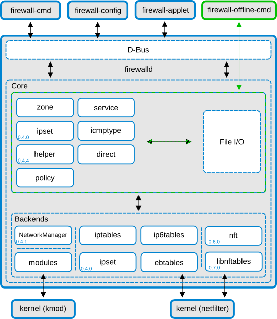
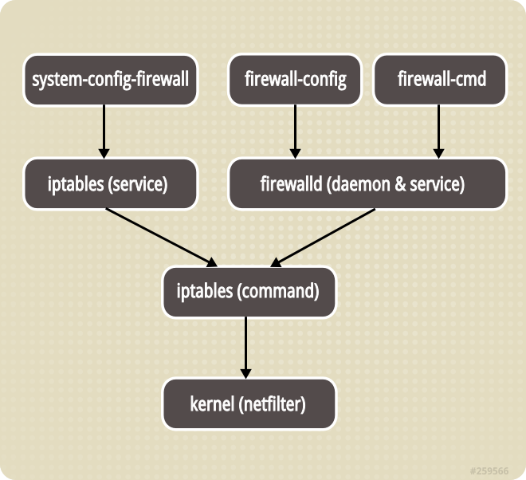
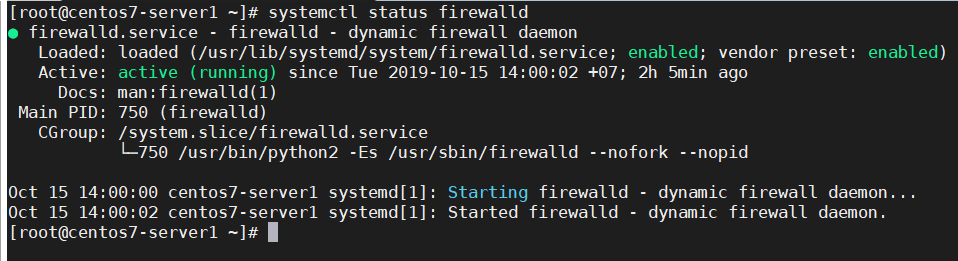
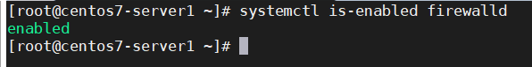
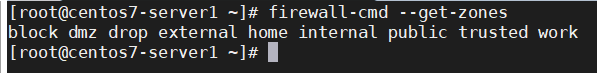
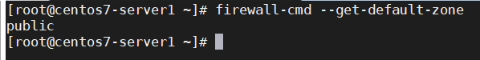
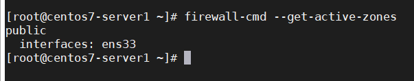
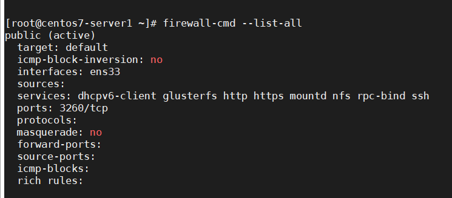
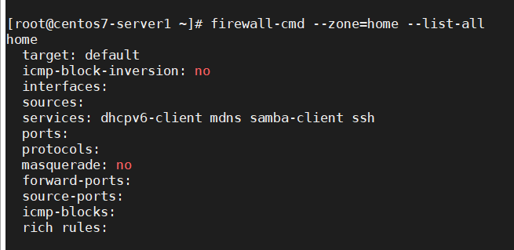
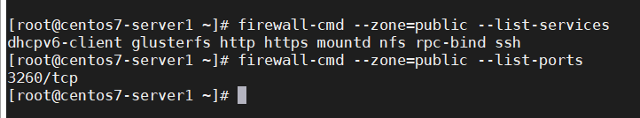

## Firewalld

Firewalld cung cấp một tường lửa được quản lý động với sự hỗ trợ cho các mạng / vùng tường lửa xác định mức độ tin cậy của các kết nối hoặc giao diện mạng. Nó có hỗ trợ cho các cài đặt tường lửa IPv4, IPv6, cầu nối ethernet và bộ IP. Có một sự tách biệt giữa thời gian chạy và các tùy chọn cấu hình vĩnh viễn. Nó cũng cung cấp giao diện cho các dịch vụ hoặc ứng dụng để thêm các quy tắc tường lửa trực tiếp.

#### Lợi ích khi sử dụng Firewalld

Các thay đổi có thể được thực hiện ngay lập tức trong môi trường runtime. Không cần khởi động lại các dịch vụ hoặc các deamon

Với giao diện tường lửa D-Bus, thật đơn giản cho các dịch vụ, ứng dụng và cả người dùng để điều chỉnh các cài đặt tường lửa. Giao diện hoàn tất và được sử dụng cho các công cụ cấu hình tường lửa firewall-cmd, firewall-config và firewall-applet.

Việc tách biệt cấu hình runtime và vĩnh viễn giúp có thể thực hiện các phép thử và kiểm tra trong thời gian chạy. Cấu hình runtime chỉ hợp lệ cho đến khi dịch vụ được reload, restart lần tiếp theo hoặc khi hệ thống được khởi động lại. Sau đó cấu hình vĩnh viễn sẽ được tải lại. Với môi trường runtime, có thể sử dụng để dành cho các cài đặt chỉ hoạt động trong 1 khoảng thời gian giới hạn. Nếu cấu hình runtime đã được sử dụng để đánh giá và không có bất cứ trục trặc khi hoạt động nào thì nó có thể lưu vào cấu hình vĩnh viễn

#### Đặc trưng

- API D-Bus hoàn chỉnh

- Hỗ trợ IPv4, IPv6, cầu nối và ipset

- Hỗ trợ NAT IPv4 và IPv6

- Firewall zones

- Danh sách các zones, services và icmptypes được xác định trước

- Simple service, cổng, giao thức, cổng nguồn, masquerading, port forwarding, icmp filter, rich rule, interface và source address handlig trong zones

- Định nghĩa dịch vụ đơn giản với các cổng, giao thức, cổng nguồn, mô-đun (netfilter helpers) và xử lý địa chỉ đích

- Ngôn ngữ phong phú cho các quy tắc linh hoạt và phức tạp hơn trong zones

- Thời gian quy tắc tường lửa trong zones

- Nhật ký đơn giản của các gói bị từ chối

- Giao diện trực tiếp

- Khóa cứng: Whitelist các ứng dụng có thể sửa đổi tường lửa

- Tự động tải các mô-đun hạt nhân Linux

- Tích hợp với Puppet

- Gợi ý dòng lệnh cho cấu hình trực tuyến và ngoại tuyến

- Công cụ cấu hình đồ họa bằng gtk3

- Applet sử dụng Qt4

#### Các distro sử dụng

Firewalld được sử dụng trên các bản phân phối linux sau làm công cụ quản lý tường lửa mặc định

- Rhel 7, CentOS 7

- Fedora 18 và mới hơn

- Có sẵn cho 1 số bản phân phối khác

#### Cấu trúc

Firewalld có thiết kế 2 lớp: lớp lõi ở dưới và lớp D-Bus ở trên cùng. Lớp lõi chịu trách nhiệm xử lý cấu hình và back ends như iptables, ip6tables, ebtables, ipset và bộ nạp module

Giao diện tường lửa D-Bus là cách chính để thay đổi và tạo cấu hình tường lửa. Giao diện được sử dụng bởi tất cả các công cụ trực tuyến do tường lửa cung cấp, ví dụ như firewall-cmd, firewall-config và firewall-applet. firewall-offline-cmd không giao tiếp với firewalld, nhưng thay đổi và tạo các tệp cấu hình firewalld sử dụng trực tiếp lõi firewalld với trình xử lý IO. firewall-offline-cmd có thể được sử dụng trong khi firewalld đang chạy, nhưng điều này không được khuyến khích



#### Sự khác biệt giữa IPtables với firewalld

Firewalld là phiên bản firewall mới mặc định được sử dụng trong các phiên bản Rhel 7 để thay thế cho interface của IPtables. Về bản chất nó vẫn kết nối tới netfilter kernel code. Tuy nhiên, trái ngược với IPtables, firewalld có thể thay đổi cài đặt trong quá trình hoạt động bình thường mà không bị mất kết nối

Hình dưới đây mô tả mối quan hệ giữa IPtables và firewalld



Như vậy cả 2 đều sử dụng IPtables tool để giao tiếp với kernel packet filter

Đối với các tệp cấu hình, IPtables sử dụng /etc/sysconfig/iptables và /etc/sysconfig/ip6tables, còn firewalld lại lưu nó dưới dạng 1 loạt các file xml trong /usr/lib/firewalld và /etc/firewalld. Tuy nhiên các tệp iptables và ip6tables sẽ không tồn tại nếu chưa cài đặt IPtables service bởi mặc định firewalld mới là dịch vụ được cài đặt

Firewalld sử dụng "zones" và "services" thay vì "chain" và "rules" trong IPtables

Firewalld quản lý các quy tắc được thiết lập tự động, chỉ những thay đổi mới được áp dụng, có tác dụng ngay lập tức mà không làm mất đi các kết nối và session hiện có

Đối với IPtables, mỗi 1 thay đổi đồng nghĩa với việc hủy bỏ toàn bộ các rules cũ và load lại 1 loạt các rules mới trong tệp iptables hoặc ip6tables.

#### 1 số khái niệm trong firewalld

- Zones

Trong firewalld, zone là 1 nhóm các quy tắc nhằm chỉ ra những luồng dữ liệu được cho phép, dựa trên mức độ tin tưởng của điểm xuất phát luồng dữ liệu đó trong hệ thống mạng. Có một số zones được xác định trước được cung cấp bởi firewalld.

Các zones được xác định trước theo mức độ tin cậy, theo thứ tự từ ít tin cậy nhất đến đáng tin cậy nhất

1. drop: ít tin cậy nhất, toàn bộ các kết nối đến sẽ bị từ chối mà không phản hồi, chỉ cho phép duy nhất kết nối đi ra

2. block: tương tự như drop nhưng các kết nối đến bị từ chối và phản hồi bằng thông báo từ icmp-host-prohibited (hoặc icmp6-adm-prohibited)

3. public: đại diện cho mạng công cộng, không đáng tin cậy. Các máy tính / services khác không được tin tưởng trong hệ thống nhưng vẫn cho phép các kết nối đến trên cở sở chọn từng trường hợp cụ thể

4. external: hệ thống mạng bên ngoài trong trường hợp bạn sử dụng tường lửa làm gateway, được cấu hình giả lập nat để giữ bảo mật mạng nội bộ mà vẫn có thể truy cập

5. internal: đối lập với external zone, sử dụng cho phần nội bộ của gateway. Các máy tính / services thuộc zone này khá đáng tin cậy

6. dmz: sử dụng cho các máy tính / services trong khu vực dmz (demilitarized) - cách ly không cho phép truy cập vào phần còn lại của hệ thống mạng, chỉ cho phép 1 số kết nối đến nhất định

7. work: sử dụng trong công việc, tin tưởng hầu hết các máy tính và 1 vài services được cho phép hoạt động

8. home: môi trường gia đình - tin tưởng hầu hết các máy tính và thêm 1 vài services được cho phép hoạt động

9. trusted: đáng tin cậy nhất - tin tưởng toàn bộ thiết bị trong hệ thống

- Rule

1 quy tắc là 1 phần của zone, là thẻ phần tử tùy chọn và có thể được sử dụng nhiều lần để có mục nhập rich language rule. 1 vùng có thể chứa 1 số quy tắc. Nếu 1 số quy tắc tương tác / mấu thuẫn, quy tắc đầu tiên phù hợp sẽ "chiến thắng"

Cấu trúc quy tắc chung

```
<rule [family="ipv4|ipv6"]>
  [ <source address="address[/mask]" [invert="True"]/> ]
  [ <destination address="address[/mask]" [invert="True"]/> ]
  [
    <service name="string"/> |
    <port port="portid[-portid]" protocol="tcp|udp"/> |
    <protocol value="protocol"/> |
    <icmp-block name="icmptype"/> |
    <masquerade/> |
    <forward-port port="portid[-portid]" protocol="tcp|udp" [to-port="portid[-portid]"] [to-addr="address"]/> |
    <source-port port="portid[-portid]" protocol="tcp|udp"/> |
  ]
  [ <log [prefix="prefixtext"] [level="emerg|alert|crit|err|warn|notice|info|debug"]/> [<limit value="rate/duration"/>] </log> ]
  [ <audit> [<limit value="rate/duration"/>] </audit> ]
  [
    <accept> [<limit value="rate/duration"/>] </accept> |
    <reject [type="rejecttype"]> [<limit value="rate/duration"/>] </reject> |
    <drop> [<limit value="rate/duration"/>] </drop> |
    <mark set="mark[/mask]"> [<limit value="rate/duration"/>] </mark>
  ]
</rule>
```

- Services

Firewalld service có thể là 1 danh sách các local port, các giao thức cũng như các đích đến và cũng là 1 danh sách các module trình hỗ trợ tường lửa được tải tự động nếu 1 dịch vụ được kích hoạt. Việc sử dụng các dịch vụ được xác định trước giúp người dùng dễ dàng kích hoạt và vô hiệu hóa quyền truy cập vào 1 dịch vụ

1 dịch vụ có chính xác 1 thuộc tính

`name="string"`

tên của dịch vụ sẽ được kích hoạt. Để có được 1 danh sách các tên dịch vụ hợp lệ, hãy nhập `firewall-cmd --get-services`

- Port

Là các cổng được sử dụng cho kết nối. Tất cả các thuộc tính của 1 mục nhập cổng là bắt buộc

`port="portid[-portid]"`

Port có thể là 1 cổng đơn "portid" hoặc nhiều cổng "portid portid portid"

- Rich rule

Rich rule là 1 tính năng bổ sung của firewalld cho phép bạn tạo các quy tắc tường lửa tinh vi hơn. Ví dụ

	- whitelist 1 phạm vi ip ngoại trừ 1 ip trong phạm vi này
	
	- định tuyến lại yêu cầu đến từ 1 cổng và chuyển tiếp nó đến 1 cổng khác
	
	- giới hạn số lượng yêu cầu đến trong mỗi giây / phút / giờ / ngày
	
	- ghi các mục nhật ký cụ thể vào /var/log/message khi có yêu cầu nhất định đi qua

Định dạng của lệnh để thêm rich rule như sau

`firewall-cmd [--zone=zone] --add-rich-rule='rule' [--timeout=timeval]`

tham số timeout được cung cấp, quy tắc hoặc các quy tắc chỉ duy trì hoạt động trong khoảng thời gian được chỉ định và sẽ tự động bị xóa sau đó. Giá trị thời gian có thể được theo sau bởi s(giây), m(phút) hoặc h(giờ) để chỉ định đơn vị thời gian. Mặc định là giây.

nếu muốn xóa bỏ

`firewall-cmd [--zone=zone] --remove-rich-rule='rule'`

- Source

Là 1 thẻ phân tử trống tùy chọn được sử dụng để liên kết 1 địa chỉ nguồn, dải địa chỉ, địa chỉ MAC hoặc ipset với 1 zone. 1 mục nguồn có chính xác 1 trong những thuộc tính sau

	- nguồn là địa chỉ ip hoặc địa chỉ ip mạng có subnet mask cho IPv4 hoặc IPv6. Địa chỉ phải phù hợp với họ quy tắc (IPv4 / IPv6). Subnet mask được thể hiện bằng các ký hiệu dấu chấm thập phân (/xxxx) hoặc tiền tố mạng (/x) cho IPv4 và ký hiệu tiền tố (/x) cho các địa chỉ mạng IPv6. Có thể đảo ngược ý nghĩa của 1 địa chỉ bằng cách thêm "not" trước "address". Tất cả trừ địa chỉ được chỉ định sẽ được khớp sau đó
	
	`address="address[/mask]"`
	
	- nguồn là 1 địa chỉ MAC, nó phải có hình thức `XX:XX:XX:XX:XX:XX`
	
	`mac="MAC"`
	
	- nguồn là 1 ipset
	
	`ipset="ipset"`
	
#### Cài đặt firewalld
	
- Firewalld được cài đặt mặc định trên CentOS / Rhel 7. Nếu chưa cài đặt, hãy chạy lệnh sau

`yum install firewalld`

- Khởi động firewalld

`systemctl start firewalld`

- Kiểm tra tình trạng hoạt động

`systemctl status firewalld`



- Thiết lập firewalld khởi động cùng hệ thống

`systemctl enable firewalld`

- Kiểm tra lại

`systemctl is-enabled firewalld`



Ban đầu, bạn không nên cho phép firewalld khởi động cùng hệ thống cũng như thiết lập permanent, tránh bị khóa khỏi hệ thống nếu thiết lập sai. Chỉ thiết lập như vậy khi bạn đã hoàn thành các quy tắc tường lửa cũng như test cẩn thận.

- Khởi động lại

```
systemctl restart firewalld
firewall-cmd --reload
```

- Dừng và vô hiệu hóa firewalld

```
systemctl stop firewalld
systemctl disable firewalld
```

#### Cấu hình firewalld

Firewalld được cấu hình với các tệp xml. Ngoại trừ các cấu hình rất cụ thể, bạn sẽ không cần đến chúng và thay vào đó nên sử dụng firewall-cmd

Các tệp tin cấu hình được đặt trong 2 thư mục
	
	- /usr/lib/firewalld: giữ cấu hình mặc định như các zone default hay các dịch vụ chung. Tránh cập nhật chúng vì những tệp đó sẽ bị ghi đè bởi mỗi bản cập nhật gói tường lửa
	
	- /etc/firewalld: giữ tập tin cấu hình hệ thống. Những tập tin này sẽ ghi đè lên 1 cấu hình mặc định

- Quy tắc runtime/permanent

Trong firewalld, các quy tắc được cấu hình thời gian hiệu lực runtime hoặc permanent

	- runtime (mặc định): có tác dụng ngay lập tức, mất hiệu lực khi reboot hệ thống
	
	- permanent: không áp dụng cho hệ thống đang chạy, cần reload mới có hiệu lực, vẫn có hiệu lực vĩnh viễn ngay cả khi reboot hệ thống

Ví dụ thêm quy tắc cho cả thiết lập runtime và permanent

```
firewall-cmd --zone=public --add-service=http
firewall-cmd --zone=public --add-service=http --permanent
firewall-cmd --reload
```

Việc restart/reload sẽ hủy bỏ các thiết lập runtime đồng thời áp dụng thiết lập permanent mà không hề làm mất các kết nối và session hiện tại. Điều này giúp kiểm tra hoạt động của các quy tắc trên tường lửa và dễ dàng khởi động lại nếu có vấn đề xảy ra

- Thiết lập các zones

Liệt kê tất cả các zones trong hệ thống

`firewall-cmd --get-zones`



Kiểm tra zone mặc định

`firewall-cmd --get-default-zone`



Kiểm tra zone active (được sử dụng bởi network interface)

`firewall-cmd  --get-active-zones`



Thay đổi zone mặc định, ví dụ thay đổi thành "home"

`firewall-cmd --set-default-zone=home`

- Các lệnh liệt kê

Liệt kê toàn bộ các quy tắc của các zone

`firewall-cmd --list-all-zones`

Liệt kê toàn bộ các quy tắc trong zone mặc định và zone active

`firewall-cmd --list-all`



Liệt kê toàn bộ các quy tắc trong 1 zone cụ thể, ví dụ home

`firewall-cmd --zone=home --list-all`



Liệt kê danh sách services/port được cho phép trong zone cụ thể

```
firewall-cmd --zone=public --list-services
firewall-cmd --zone=public --list-ports
```



- Thiết lập cho service

Đây chính là điểm khác biệt của firewalld so với IPtables - quản lý thông qua các services. Việc thiết lập tường lửa đã trở nên dễ dàng hơn bao giờ hết - chỉ việc thêm các services vào zone đang sử dụng

Firewalld có thể cho phép lưu lượng dựa trên các quy tắc được xác định trước cho các dịch vụ mạng cụ thể. Bạn có thể tạo quy tắc dịch vụ tùy chỉnh của riêng mình và thêm chúng vào bất kỳ khu vực nào. Các tệp cấu hình cho các dịch vụ được hỗ trợ mặc định được đặt tại /usr/lib/firewalld/services và các tệp dịch vụ do người dùng tạo sẽ nằm trong /etc/firewalld/services

Đầu tiên để xác định các services trên hệ thống

`firewall-cmd --get-services`

Hệ thống thông thường cần cho phép các services sau: ssh(22/TCP), http(80/TCP), https(443/TCP), smtp(25/TCP), smtps(465/TCP) và smtp-submission(587/TCP)

Thiết lập cho phép service trên firewalld, sử dụng "--add-service", ví dụ

```
firewall-cmd --zone=public --add-service=http
firewall-cmd --zone=public --add-service=http --permanent
firewall-cmd --reload
```

Vô hiệu hóa services trên firewalld, sử dụng "--remove-service"

```
firewall-cmd --zone=public --remove-service=http
firewall-cmd --zone=public --remove-service=http --permanent
firewall-cmd --reload
```

- Thiết lập cho port

Trong trường hợp bạn thích quản lý theo cách truyền thống qua port, firewalld cũng hỗ trợ bạn điều đó

Mở port với tham số "--add-port"

```
firewall-cmd --zone=public --add-port=9999/tcp
firewall-cmd --zone=public --add-port=9999/tcp --permanent
firewall-cmd --reload
```

Mở 1 dải port

```
firewall-cmd --zone=public --add-port=4990-5000/tcp
firewall-cmd --zone=public --add-port=4990-5000/tcp --permanent
firewall-cmd --reload
```

Kiểm tra lại

`firewall-cmd --zone=public --list-ports`

Đóng port với tham số "--remove-port"

```
firewall-cmd --zone=public --remove-port=9999/tcp
firewall-cmd --zone=public --remove-port=9999/tcp --permanent
firewall-cmd --reload
```

Port forwarding

Ví dụ bên dưới chuyển tiếp lưu lượng truy cập từ cổng 80 đến cổng 12345 trên cùng một máy chủ

`firewall-cmd --zone=public --add-forward-port=port=80:proto=tcp:toport=12345`

Nếu muốn chuyển tiếp một port đến 1 máy khác

	- Kích hoạt tính năng masquerade
	
	`firewall-cmd --zone=public --add-masquerade`
	
	- Thêm quy tắc chuyển tiếp, ví dụ sau chuyển tiếp lưu lượng truy cập từ cổng cục bộ 80 sang cổng 8080 trên máy chủ từ xa có địa chỉ ip 10.10.10.10
	
	`firewall-cmd --zone=public --add-forward-port=port=80:proto=tcp:toport=8080:toaddr=10.10.10.10`

Để loại bỏ các quy tắc, thay thế "--add" bằng "--remove"

`firewall-cmd --zone=public --remove-masquerade`

- Cấu hình nâng cao

Rich rules

Cho phép tất cả lưu lượng ipv4 từ máy chủ 10.10.10.20

`firewall-cmd --zone=public --add-rich-rule 'rule family=ipv4 source address=10.10.10.20 accept'`

Từ chối lưu lượng ipv4 qua tcp từ máy chủ 10.10.10.20 đến cổng 22

`firewall-cmd --zone=public --add-rich-rule 'rule family=ipv4 source address=10.10.10.20 port port=22 protocol=tcp reject'`

Cho phép lưu lượng truy cập ipv4 qua tcp từ máy chủ 10.10.10.20 đến cổng 80 và chuyển tiếp cục bộ sang cổng 8000

`firewall-cmd --zone=public --add-rich-rule 'rule family=ipv4 source address=10.10.10.20 forward-port port=80 protocol=tcp to-port=8000'`

Chuyển tiếp tất cả lưu lượng truy cập ipv4 trên cổng 80 sang cổng 8080 trên máy chủ 10.10.10.20 (tính năng masquerade phải được kích hoạt trên zone)

`firewall-cmd --zone=public --add-rich-rule 'rule family=ipv4 forward-port port=80 protocol=tcp to-port=8080 to-addr=10.10.10.20'`

Để liệt kê rich-rule hiện tại ở zone public

`firewall-cmd --zone=public --list-rich-rules`

- IPtables Direct Interface

Để sử dụng cho các tính năng nâng cao hoặc dành cho các chuyên gia IPtables, firewalld cung cấp giao diện trực tiếp cho phép các lệnh IPtables đuwọc truyền qua nó. Quy tắc giao diện trực tiếp không liên tục trừ khi tham số "--permanent" được sử dụng

Điều này cho phép truy cập trực tiếp hơn vào tường lửa nhưng nó cũng yêu cầu người dùng phải biết các khái niệm iptables/ip6tables/ebtables cơ bản, nghĩa là bảng (filter/mangle/nat/...), chain ( INPUT/OUTPUT/FORWARD/...), lệnh (-A/-D/-I/...), tham số (-p/-s/-d/-j/...) và target (ACCEPT/DROP/REJECT/...). Cấu hình trực tiếp chỉ nên được sử dụng như là phương sách cuối cùng khi không thể sử dụng firewalld.zone

Một tập tin cấu hình trực tiếp tường lửa chứa thông tin về permanent direct chains, các rule và passthrough ...

Đây là cấu trúc của tệp cấu hình trực tiếp

```
<?xml version="1.0" encoding="utf-8"?>
<direct>
  [ <chain ipv="ipv4|ipv6|eb" table="table" chain="chain"/> ]
  [ <rule ipv="ipv4|ipv6|eb" table="table" chain="chain" priority="priority"> args </rule> ]
  [ <passthrough ipv="ipv4|ipv6|eb"> args </passthrough> ]
</direct>
```

trong đó:

	- direct: thẻ bắt đầu và kết thúc bắt buộc, chỉ có thể được sử dụng 1 lần trong tệp cấu hình, không có thuộc tính đi kèm

	- chain: là 1 thẻ phần tử trống tùy chọn, có thể sử dụng nhiều lần, có thể được sử dụng để xác định tên cho chain bổ sung. 1 chain entry có chính xác 3 thuộc tính

	`ipv="ipv4|ipv6|eb"` họ ip nơi chain sẽ được tạo, có thể là ipv4, ipv6 hoặc eb
	
	`table="table"` tên bảng nơi chain sẽ được tạo
	
	`chain="chain"` tên của chain, sẽ được tạo ra, cần đảm bảo không có chain nào khác có trùng tên
	
	- rule: là 1 thẻ phần tử tùy chọn và có thể được sử dụng nhiều lần, có thể được sử dụng để thêm các quy tắc vào 1 built-in hoặc added chain. 1 rule entry có chính xác 4 thuộc tính
	
	ngoài 3 thuộc tính giống như bên trên, ở đay còn có thêm `priority="priority"`. Nó được sử dụng để đặt hàng quy tắc. Ưu tiên 0 có nghĩa là thêm quy tắc trên đầu chuỗi, với mức ưu tiên cao hơn, quy tắc sẽ được thêm vào phía dưới. Các quy tắc có cùng mức độ ưu tiên ở cùng cấp độ và thứ tự của các quy tắc này không cố định và có thể thay đổi. Nếu bạn muốn đảm bảo rằng 1 quy tắc sẽ được thêm vào sau 1 quy tắc khác, hãy sử dụng mức ưu tiên thấp cho lần đầu tiên và cao hơn cho quy tắc sau
	
	- passthrough: là 1 thẻ tùy chọn và có thể được sử dụng nhiều lần. Nó có thể được sử dụng để thêm các quy tắc vào built-in hoặc added chain. 1 rule entry chỉ có chính xác 1 thuộc tính là
	
	`ipv="ipv4|ipv6|eb"`
	
	Quy tắc passthrough sẽ được thêm trực tiếp vào chain. Không có cơ chế như quy tắc direct như trên. Người sử dụng phải đảm bảo passthrough sẽ không có xung đột với các quy tắc được tạo bởi firewalld.
	
Để xem tất cả các chain hoặc rule tùy chỉnh được thêm vào firewalld

```
firewall-cmd --direct --get-all-chains
firewall-cmd --direct --get-all-rules
```

