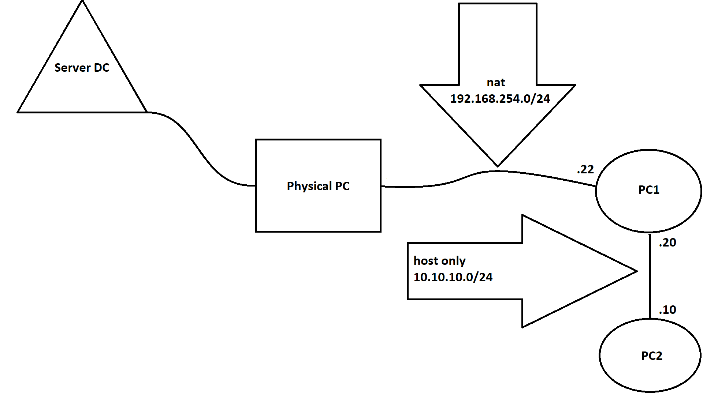

## Lab IPtables

####Sơ đồ



#### Yêu cầu

- Máy PC 2 chỉ có thể liên hệ tới PC 1 trên cổng 22

- Máy PC 1 có thể ping tới Server DC

- Server DC có thể liên hệ tới PC 1 trên cổng 22 thông qua địa chỉ IP Public của Server nội bộ

- PC 2 ra ngoài mạng

#### Chuẩn bị 

- 04 máy ảo chạy HĐH CentOS 7 (1 CPU, 1 GB ram, 10 GB disk)

- Sử dụng IPtables

- Có thể linh động địa chỉ IP và Network để phù hợp với môi trường lab

#### Thực hiện

- Trên PC1

	- Tắt firewalld trên tất cả các máy
	
	```
	systemctl stop firewalld
	systemctl mask firewalld
	```
	
	- Cài iptables service
	
	`yum install -y iptables-services`
	
	- Cho phép iptables khởi động cùng hệ thống
	
	`systemctl enable iptables`
	
	- Bật iptables
	
	`systemctl start iptables`
	
	- Enable IP Forwarding
	
	```
	vi /etc/sysctl.conf
	net.ipv4.ip_forward = 1
	```
	
	lưu lại
	
	- Kích hoạt các thay đổi được thực hiện trong sysctl.conf
	
	`sysctl -p /etc/sysctl.conf`
	
	- Xoá hết các rule mặc định
	
	`iptables -F`
	
	- Thiết lập rule chỉ cho phép PC2 liên hệ tới bằng cổng 22
	
	`iptables -A INPUT -s 10.10.10.10 -p tcp --dport 22 -j ACCEPT`
	
	- Chặn hết các kết nối khác từ PC2
	
	`iptables -A INPUT -s 10.10.10.10 -j REJECT`
	
	- Cho phép PC2 ra ngoài mạng
	
	`iptables -t nat -A POSTROUTING -s 10.10.10.10 -j MASQUERADE`
	
	- Lưu cấu hình iptables
	
	`service iptables save`