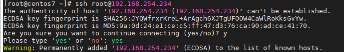
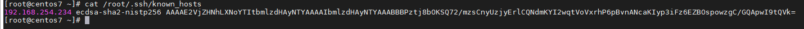
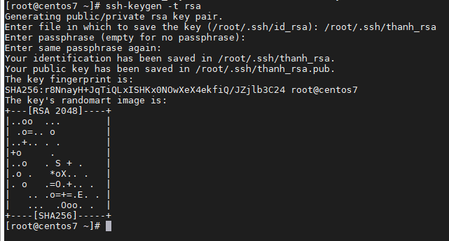
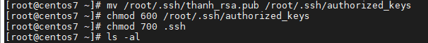
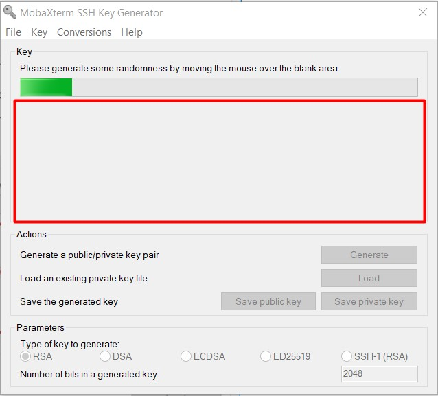

## SSH

- Giới thiệu

	- SSH - còn được gọi là Secure Shell, là 1 giao thức mạng bảo mật cung cấp cho người dùng 1 cách an toàn để truy cập vào 1 máy tính từ xa. SSH cung cấp 1 kênh bảo mật trên 1 mạng không bảo mật trong kiến trúc client - server, kết nối ứng dụng client SSH với server SSH, thiết lập kết nối được bảo mật giữa 2 bên, xác thực từng bên và truyền lệnh cũng như đầu ra qua lại. Các ứng dụng điển hình bao gồm dòng lệnh từ xa, đăng nhập và thực thi lệnh từ xa, ...

	- SSH được thiết kế thay cho Telnet và cho các giao thức không bảo mật khác như Berkeley rlogin, rsh, rexec. Các giao thức đó gửi thông tin, đặc biệt là mật khẩu dưới dạng bản rõ, khiến chúng dễ bị chặn và tiết lộ bằng cách phân tích gói tin. Các mã hóa được sử dụng bởi SSH được thiết kế đẻ cung cấp bảo mật và tính toàn vẹn của dữ liệu qua 1 mạng không an toàn, chẳng hạn như Internet.

- Các phương pháp xác thực trên SSH

	- Xác thực dựa trên mật khẩu: là phương pháp được sử dụng phổ biến trong ssh. Nó chính xác giống như bạn đăng nhập vào người dùng cục bộ bằng mật khẩu chính xác. Máy chủ từ xa nhận mật khẩu, đăng nhập người dùng, dựa trên cơ chế xác thực mật khẩu riêng của máy chủ. Mật khẩu được client truyền đến server được mã hóa thông qua khóa đối xứng phiên (chỉ có client và server biết)
	
	- Xác thực khóa công khai: đây là phương pháp xác thực sử dụng cặp khóa công khai được tạo thủ công, cho phép người dùng đăng nhập mà không phải sử dụng mật khẩu. Để xác thực, trước tiên người dùng cần tạo khóa công khai và khóa riêng RSA. Điều này có thể thực hiện bằng 1 lệnh gọi là "ssh-keygen". Việc ác thực dựa trên khóa riêng nhưng chính khóa đó không bao giờ được truyền đi qua mạng trong khi xác thực. Trong các phiên bản SSH, điều quan trọng là phải xác minh các khóa công khai không xác định

- Lịch sử và các phiên bản

	- Phiên bản 1.x: Năm 1995, Tatu Ylönen, một nhà nghiên cứu tại Đại học Công nghệ Helsinki, Phần Lan đã thiết kế phiên bản đầu tiên của giao thức (bây giờ gọi là SSH-1) trước 1 cuộc tấn công dò tìm mật khẩu tại mạng lưới trường đại học của ông. Mục tiên của ssh là thay thế các giao thức rlogin, telnet, ftp và rsh trước đó, vốn không cung cấp ác thực mạnh cũng như đảm bảo tính bảo mật. Ông đã phát hành phần mềm cảu mình dưới mạng miễn phí vào tháng 7 cùng năm và công cụ này nhanh chóng trở nên phổ biến. Đến cuối năm 1995, cơ sở người dùng ssh đã tăng lên 20000 người dùng ở 50 quốc gia. Tháng 12 năm 1995, Ylönen thành lập SSH Communications Security để giới thiệu và phát triern ssh. Ước tính đến năm 2000, số người dùng đã tăng lên 2 triệu.
	
	- Phiên bản 2.x: "Secsh" là tên chính thức của nhóm làm việc cho IETF chịu trách nhiệm phát triển phiên bản 2 của giao thức ssh. Năm 2006, 1 phiên bản sửa đổi của giao thức, SSH-2 đã được sử dụng làm tiêu chuẩn. Phiên bản này không tương thích với SSH-1 nhưng có cải tiến cả về bảo mật và tính năng so với SSH-1. Bảo mật tốt hơn, ví dụ thông qua trao đổi khóa Diffie-Hellman và kiểm tra tính toàn vẹn mạnh mẽ thông qua mã xác thực thông báo. Các tính năng mới của SSH-2 bao gồm khả năng chạy bất kỳ số phiên shell nào qua 1 kết nối ssh. Do tính ưu việt và phổ biến của SSH-2 so với SSH-1 nên 1 số triển khai như libssh (v0.8.0+), Lsh và Dropbear chỉ hỗ trợ giao thức SSH-2.
	
- Cách thức hoạt động của ssh

Khi bạn kết nối thông qua ssh, bạn sẽ được đưa vào 1 phiên shell, đây là giao diện dựa trên văn bản nơi bạn có thể tương tác với máy chủ từ xa của mình. Trong suốt thời gian của phiên ssh, bất kỳ lệnh nào bạn nhập vào terminal tại máy tính của mình sẽ được chuyển qua 1 đường hầm ssh được mã hóa và được thực thi trên server.

Kết nối ssh được triển khai trên mô hình client - server. Điều này có nghĩa là để thiết lập kết nối ssh, máy từ xa phải chạy 1 phần mềm được gọi là ssh deamon. Phần mềm này lắng nghe các kết nối trên 1 cổng mạng cụ thể (thường là cổng 22 dựa trên giao thức TCP), xác thực các yêu cầu kết nôi và sinh ra môi trường thích hợp nếu người dùng cung cấp thông tin xác thực chính xác.

Máy tính của người dùng phải có client ssh. Đây là 1 phần mềm giao tiếp bằng giao thức ssh và có thể cung cấp thông tin về server từ xa để kết nôi, tên người dùng sẽ sử dụng và thông tin đăng nhập cần được xác thực. Client cũng có thể chỉ định một số chi tiết nhất định về loại kết nối nếu muốn được thiết lập.

Nếu bạn sử dụng Windows, 1 số ssh client phổ biến như Putty, MobaXtern, ...

Đối với người dùng MAC và Linux, hãy mở terminal và gõ câu lệnh theo cú pháp

`ssh <user>@<host>`

trong đó <user> đại diện cho tài khoản người dùng bạn muốn dùng để đăng nhập. <host> đại diện cho máy tính bạn muốn dùng để truy cập. Nó có thể là 1 địa chỉ ip (ví dụ 244.235.23.19) hoặc 1 tên miền (ví dụ www.domain.com)

Kết nối ssh giữa client và server xảy ra theo 3 giai đoạn:

1. Xác minh server bởi client

2. Tạo khóa phiên để mã hóa các giao tiếp

3. Xác thực client

	- Xác minh server bởi client: Client khởi tạo kết nối ssh với server. Server lắng nghe cổng mặc định 22 (cổng này có thể thay đổi) cho các kết nối ssh. Tại thời điểm này, danh tính máy chủ được xác minh, có 2 trường hợp:
		
		- Nếu client truy cập server lần đầu tiên, client được yêu cầu xác thực máy chủ theo cách thủ công bằng xác minh khóa công khai của máy chủ. Khóa công khai của máy chủ có thể được tìm thấy bằng lệnh `ssh-keyscan`. Khi được xác minh, server được thêm vào tệp known_hosts trong thư mục ~/.ssh. Tập tin này chứa thông tin về tất cả server được xác minh bởi client
		
		
		
		- Nếu không phải lần đầu tiên client truy cập server, danh tính của máy chủ được khớp với thông tin ghi lại trước đó trong tệp know_hosts để xác minh.
		
		
		
	- Tạo khóa phiên: Sau khi server được xác minh, cả 2 bên sẽ thương lượng khóa phiên bằng cách sử dụng thuật toán Diffie-Hellman.
	
	- Xác thực client: Giai đoạn cuối cùng liên qua đến việc xác minh client. Client thường xác thực bằng cách sử dụng mật khẩu hoặc cặp khóa ssh. Đăng nhập mật khẩu được mã hóa và dễ dàng cho những người dùng mới. Tuy nhiên những kẻ tấn công sẽ cố gắng xác thực các tài khoản cho phép đăng nhập dựa trên mật khẩu, điều nay có thể dẫn đến thỏa hiệp bảo mật. Xác thực được thực hiện bằng cặp khóa ssh không có gì ngoài 1 cặp gồm 2 khóa để phục vụ 2 mục đích khác nhau. 1 là khóa công khai được sử dụng để mã hóa dữ liệu và có thể được chia sẻ tự do. 1 cái khác là khóa riêng được sử dụng để giải mã dữ liệu và phải được giữ bí mật. Để xác thực bằng các khóa ssh, người dùng phải có cặp khóa ssh trên máy tính của họ. Còn trên phía server, khóa chung phải được sao chép vào 1 tệp tại thư mục của chính người dùng tại ~/.ssh/authorized_keys. Tệp này chứa danh sách các khóa công khai. Việc xác thực bằng cặp khóa ssh diễn ra như sau:
	
		- Client kết nối với server, muốn sử dụng xác thực khóa ssh, nó sẽ thông báo cho server về điều này cùng với ID phiên kết nối và sẽ cho server biết khóa công khai nào sẽ sử dụng.
		
		- Server kiểm tra tệp authorized_keys để tìm khóa chung của client. Nếu khớp nó sẽ tạo 1 chuỗi ngẫu nhiên và sử dụng khóa chung để mã hóa, sau đó gửi cho client. Thông điệp được mã hóa này chỉ có thể được giải mã bằng khóa riêng được liên kết. Server gửi thông điệp này cho client để kiểm tra xem nó có thực sự có khóa riêng được liên kết hay không
		
		- Khi nhận được thông điệp từ phía server, client sẽ giải mã nó bằng khóa riêng. Nếu khóa riêng chính xác, client sẽ giải mã được thông điệp và thu được chuỗi ngẫu nhiên. Sau đó nó kết hợp ID phiên đã đàm phán từ trước và tạo ra hàm băm MD5 cho chuỗi mới này và gửi lại cho server
		
		- Máy chủ đã có thông báo gốc và ID phiên, do đó nó có thể so sánh hàm băm MD5 được tạo bởi các giá trị đó và xác định client có khóa riêng hay không

- Tạo và làm việc với các khóa ssh

	- Trên phía server
	
	Sử dụng câu lệnh `ssh-keygen -t rsa` để tạo khóa
	
	Tiếp theo bạn sẽ nhận được yêu cầu vị trí lưu file khóa, nếu không nhập gì thì sẽ dung mặc định là ~/.ssh/id_rsa
	
	Khóa chung sẽ được lưu cùng thư mục với khóa riêng, cùng tên tệp nhưng có phần mở rộng .pub
	
	Cuối cùng bạn sẽ phải nhập passphrase.
	
	Toàn bộ quá trình tạo cặp khóa sẽ trông như sau:
	
	
	
	Sau đó cần tiến hành phân quyền để sử dụng khóa. Nếu không chỉnh sửa cấu hình ssh thì phải chuyển public key tới thư mục mặc định là ~/.ssh/authorized_keys
	
	
	
	Nếu chỉnh sửa trong file cấu hình /etc/ssh/sshd_config thì ta còn có thể cho phép login bằng user root hay không, số lượng session tối đa, số lần xác thực, ...
	
	- Tại phía client
	
	Máy client ở đây mình dùng là windows. Bạn có thể dùng client ssh là PuTTY hoặc MobaXtern. Ở đây mình dùng MobaXtern
	
		- Load file key từ server:
		
		Bấm Tools -> MobaKeyGen (SSH key generator)
		
		Chọn Load và chọn đường dẫn đến file khóa private của server
		
		Nhập passphrase được yêu cầu để load file khóa
		
		Lưu khóa với phần mở rộng .ppk
		
		Để ssh vào server chỉ cần import file khóa vừa lưu tại mục Advanced SSH Settings của MobaXtern, tick vào mục Use private key và chọn đường dẫn tới file khóa có đuôi mở rộng .ppk
		
		Sau đó nhập passphrase (nếu có) để xác thực là có thể login bằng khóa ssh
	
		- Tạo khóa ở phía client
		
		Thay vì bấm Load thì ta bấm Generate, có 1 số thuật toán như rsa, dsa, ecdsa, ...
		
		Di chuột trong khoảng trống như hướng dẫn để quá trình tạo khóa bắt đầu
		
		
		
		Sau khi quá trình tạo khóa hoàn tất, đặt passphrase, bấm Save public key với tên authorized_keys rồi gửi lên server tại thư mục ~/.ssh/; cuối cùng lưu private key bằng cách bấm Save private key với phần mở rộng .ppk
		
		Để dăng nhập, mở 1 session mới, nhập đại chỉ ip cảu server, chọn Advanced SSH Settings, tick chọn mục Use private key rồi chọn private key vừa lưu.

- Cấu hình chỉ sử dụng SSH key để xác thực

Tại file /etc/ssh/sshd_config, tìm đến dòng "PasswordAuthentication yes" và sửa thành "no" rồi lưu file lại