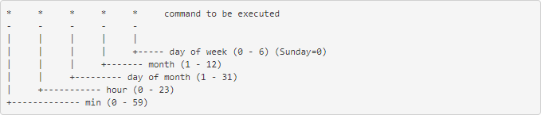

## Crontab

Tương tự như trên Windows, Linux cũng có cách để tạo và chạy các lệnh theo 1 chu kỳ xác định. Ở Windows nó gọi là "Task Schedule", còn với Linux là cron.

Cron là một tiện ích cho phép thực hiện các tác vụ một cách tự động theo định kỳ, ở chế độ nền của hệ thống. Cronjob là các lệnh thực thi hành động đặt trước vào thời điểm nhất định. Crontab (CRON TABle) là một file chứa đựng bảng biểu (schedule) của các entries được chạy.

Cron làm việc thế nào?

Một cron schedule đơn giản là một text file. Mỗi người dùng có một cron schedule riêng, file này thường nằm ở /var/spool/cron hoặc /var/spool/cron/crontabs. Crontab files không cho phép bạn tạo hoặc chỉnh sửa trực tiếp với bất kỳ trình text editor nào, trừ phi bạn dùng lệnh crontab.

Một số lệnh thường dùng:

`crontab -e`: tạo hoặc chỉnh sửa file crontab

`crontab -l`: hiển thị file crontab

`crontab -r`: xóa file crontab

Hầu hết là crontab được cài đặt sẵn trên Linux, tuy nhiên vẫn có trường hợp không có. Nếu bạn sử dụng lệnh `crontab -l` mà thấy output trả lại: "-bash: crontab: command not found" thì cần cài crontab thủ công

- Cài đặt crontab

Trên RedHat/Fedora/CentOS: `yum install cronie`

Trên Ubuntu/Debian: `apt install cron`

Start crontab và tự động chạy mỗi khi khởi động

```
systemctl start crond
systemctl enable crond
```

- Cấu trúc của crontab

Một crontab file có 5 trường để xác định thời gian, cuối cùng là lệnh sẽ được chạy định kỳ, cấu trúc như sau:



Nếu 1 cột được gán ký tự `*` có nghĩa là tác vụ sẽ được chạy ở mọi giá trị cho cột đó

Ví dụ:

Chạy 30 phút 1 lần:

`0,30 * * * * command`

Chạy vào 2 giờ sáng mỗi ngày:

`0 2 * * * command`