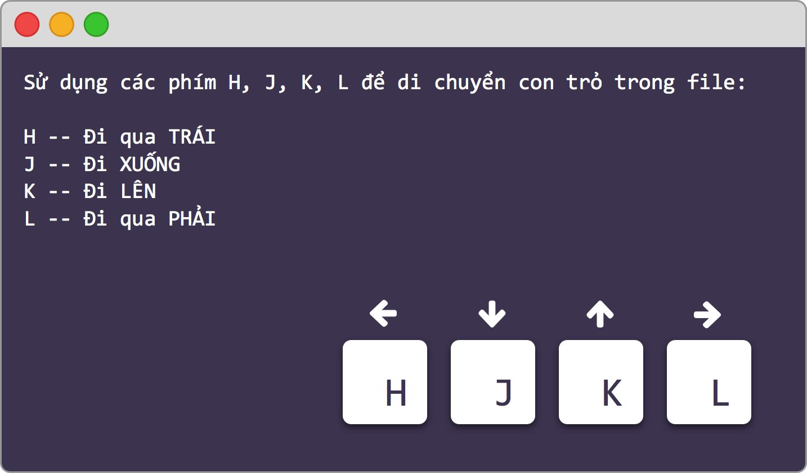
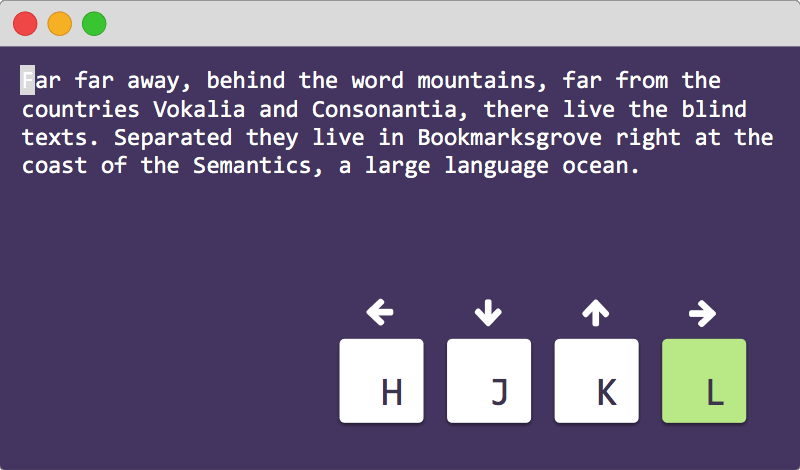
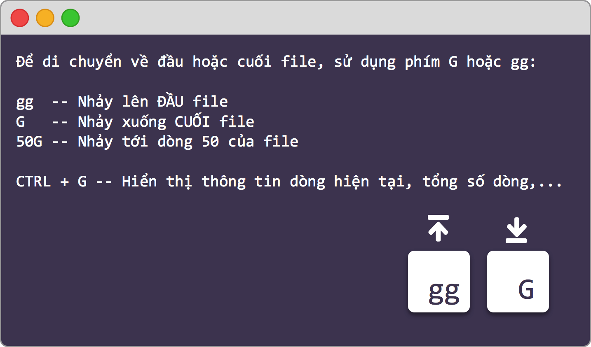
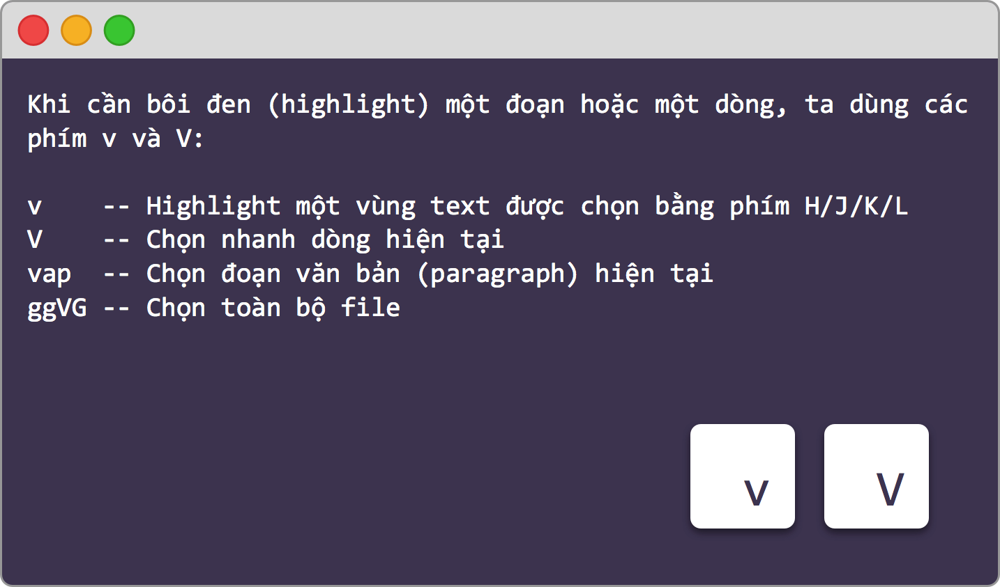
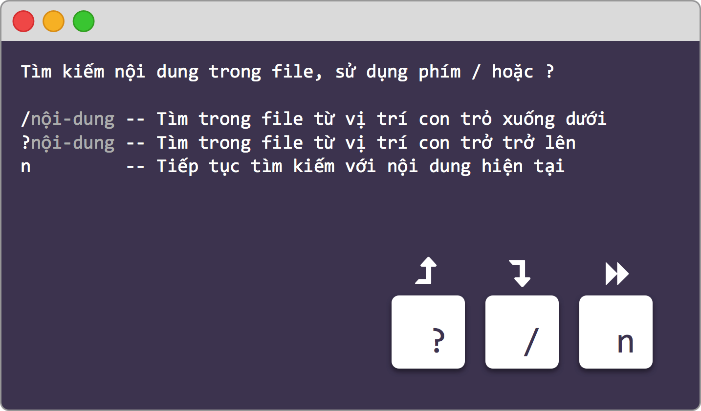
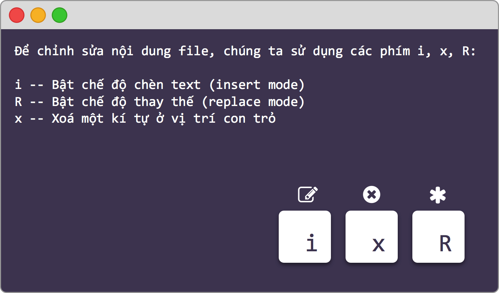
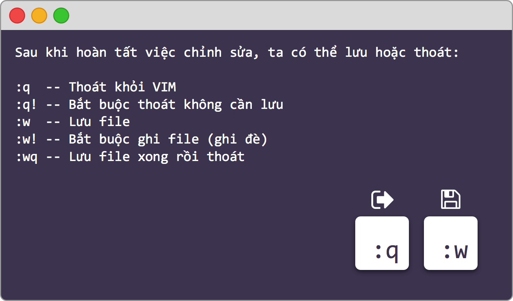

## vim editor

- Giới thiệu về vim
	
	- Vim (viết tắt của **vi** i**m**proved) là 1 bản sao, với một số bổ sung của trình soạn thảo vi. Nó được viết bởi Bram Moolenaar và được phát hành lần đầu vào năm 1991.
	
	- Là 1 trong những trình biên soạn dòng lệnh mạnh và phổ biến nhất. Cõ sẵn trên Linux và Unix nhưng sau đó nó cũng xuất hiện cả trên Windows
	
	- Được thiết kế cho cả trong giao diện dòng lệnh và như 1 ứng dụng độc lập trong giao diện đồ họa
	
	- Ưu điểm của vim là mọi thao tác đều có thể thực hiện thông qua các phím tắt, vì vậy ta không cần phải dùng tới chuột khi dùng vim nữa
	
	- Website: https://www.vim.org/

- Cài đặt vim

Đối với RedHat/Fedora/Centos: `yum install vim`

Đối với Ubuntu/Debian: `apt install vim`

- Khởi động vim

Để sử dụng vim, các bạn chỉ cần mở terminal ra và gõ "vim"

Hoặc nếu muốn mở 1 file bằng vim

`vim <file_name>`

- Các chế độ trong vim

VIM cung cấp nhiều chế độ hơn vi (chỉ cung cấp các chế độ "nomarl", "insert" và "command-line"). Các chế độ bổ sung này làm cho VIM mạnh hơn và dễ sử dụng hơn; vì điều này, người dùng vim ít nhất nên biết rằng chúng tồn tại. (LƯU Ý: Nếu bạn từng vào một chế độ mà bạn không quen thuộc, bạn thường có thể nhấn ESC để quay lại chế độ bình thường)

Dưới đây là tổng quan ngắn về từng chế độ có sẵn trong vim:

| Tên | Miêu tả | Trợ giúp |
| --- | --- | --- |
| nomarl | để điều hướng và thao tác văn bản. Đây là chế độ mà vim thường sẽ bắt đầu, bạn có thể quay lại chế độ này bằng cách bấm Esc | :help Normal-mode |
| insert | để chèn văn bản mới. Sự khác biệt chính so với vi là nhiều lệnh "nomarl" quan trọng cũng có trong chế độ này, miễn là bạn có bàn phím có đủ các phím meta (như Ctrl, Alt, Windows-key, ...) | :help Insert-mode |
| visual | để điều hướng và thao tác lựa chọn văn bản, chế độ này cho phép bạn thực hiện hầu hết các lệnh thông thường và một vài lệnh bổ sung trên văn bản đã chọn | :help Visual-mode |
| select | tương tự như chế độ visual, nhưng giống với MS Windows hơn | :help Select-mode |
| command-line | để nhập các lệnh biên tập -  như là các lệnh trong cột thứ 3 | :help Command-line-mode |
| Ex-mode | tương tự như command-line mode nhưng được tối ưu hóa để xử lý hàng loạt | :help Ex-mode |

- Một số phím tắt khi sử dụng vim

Di chuyển con trỏ trong file

Highlight

Tìm kiếm

Chỉnh sửa nội dung

Các lệnh lưu và thoát vim

