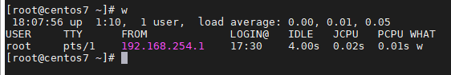
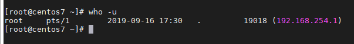

## Check active session

Một điều rất thú vị trên linux là chuyển đổi phiên nhanh. Một lần bấm phím đơn giản (Ctrl + Alt + Fx) và bạn có thể bỏ phiên hiện tại của mình để chuyển sang phiên khác.

Đầu tiên, chúng ta cần xác định một phiên. Khi người dùng đăng xuất khỏi hệ thống, kernel cần chấm dứt tất cả các quy trình mà người dùng đã chạy (nếu không, người dùng sẽ để lại một loạt các tiến trình cũ ngồi chờ đợi đầu vào mà không bao giờ có thể đến). Để đơn giản hóa nhiệm vụ này, các tiến trình được tổ chức thành phiên. Phiên là một nhóm các tiến trình chạy dưới sự kiểm soát của một người dùng. Chỉ một phiên duy nhất được kích hoạt trên một hệ thống (chính xác hơn là seats) và người dùng chỉ có thể tương tác với phiên active (hoặc foreground). Một phiên có thể bắt đầu và dừng các tiến trình, nhưng tiến trình không thể thoát khỏi phiên. Nói cách khác, tất cả các tiến trình đã bắt đầu sẽ luôn thuộc về phiên mà chúng được bắt đầu. Chỉ các trình nền hệ thống (không được đính kèm với phiên) mới có thể sinh ra các phiên mới.

Mỗi phiên được gắn với một thiết bị đầu cuối mà từ đó các tiến trình trong phiên có được đầu vào của chúng và chúng gửi đầu ra của chúng. Thiết bị đầu cuối đó có thể là local console của máy, thiết bị đầu cuối được kết nối qua serial line hoặc pseudo terminal ánh xạ tới X Window hoặc qua mạng. Thiết bị đầu cuối mà phiên có liên quan được gọi là thiết bị đầu cuối kiểm soát (hoặc kiểm soát tty) của phiên. Một thiết bị đầu cuối có thể là thiết bị đầu cuối kiểm soát chỉ một phiên tại một thời điểm. Mặc dù thiết bị đầu cuối kiểm soát cho một phiên có thể được thay đổi, nhưng điều này thường chỉ được thực hiện bởi các quy trình quản lý đăng nhập ban đầu của người dùng vào hệ thống.

Lệnh "w" sẽ hiển thị những người đã đăng nhập và những gì họ đang làm

Để "giết" một phiên cụ thể, bạn có thể sử dụng `who -u`(hoặc `who -a`) để in số quy trình và sau đó `sudo kill -9 <session-process-number>`:

