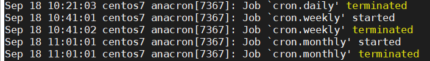
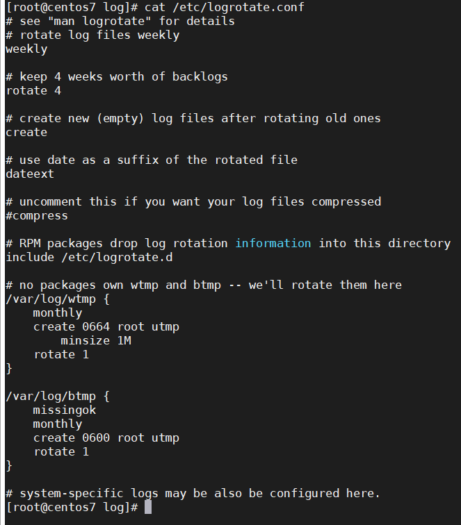

## System log avtivity

Các tệp tin log trong Linux là tập các bản ghi được HĐH duy trì, cung cấp dòng thơi gian của các sự kiện cho HDH, ứng dụng và hệ thống Linux. Chúng chứa các thông báo về máy chủ, bao gồm kernel, dịch vụ, ứng dụng, hoạt động của người dùng, ... đã và đang chạy trên nó. Đồng thời nó ũng là 1 công cụ khắc phục sự cố có giá trị hệ hệ thống gặp lỗi. Về cơ bản, phân tích các tệp ghi nhật ký là điều đầu tiên mà quản trị viên cầm làm khi phát hiện ra sự cố.

Các tệp tin log thường được lưu trữ như 1 tệp văn bản thuần túy và có thể được tìm thấy trong thư mục /var/log và các thư mục con. Có nhật ký linux cho mọi thứ: hệ thống, kernel, quá trình khởi động, trình quản lý gói, điều khiển thiết bị, Xorg, Apache, MySQL, ...

Nhiều phiên bản của Unix cung cấp 1 phương tiện ghi nhật ký đa năng gọi là syslog (hoặc rsyslog). Nó là 1 cở sở ghi nhật ký hệ thống thống nhất có thể cấu hình máy chủ. Hệ thống sử dụng quy trình ghi nhật ký tập trung chạy chương trình /etc/syslogd hoặc /etc/syslog. Các chương trình gửi các mục nhật ký tới syslogd và nó được tham chiếu tới tệp cấu hình /etc/syslogd.conf hoặc /etc/syslog và khi tìm thấy kết quả khớp, ghi thông điệp log vào tệp nhật ký tương thích.

Hầu hết các thư mục có thể được nhóm thành 1 trong 4 loại:

- Nhật ký ứng dụng

- Nhật ký sự kiên

- Nhật ký dịch vụ

- Nhật ký hệ thống

Theo dõi và phân tích các tệp nhật ký là 1 nhiệm vụ đầy thách thức. Khối lượng nhật ký đôi khi rất khổng lồ và việc phân tích là rất khó khăn. Mặc dù vậy, có một số tệp nhật ký Linux quan trọng mà bạn cần phải theo dõi

- /var/log/syslog hoặc /var/log/message: thông báo chung cũng như thông tin liên qua đến hệ thống. Về cơ bản, nhật ký này lưu trữ tất cả dữ liệu hoạt động trên toàn hệ thống. Lưu ý rằng hoạt động cho các hệ thống dựa trên Redhat như CentOS hoặc Rhel được lưu trữ trong tệp message; trong khi Ubuntu và các hệ thống dựa trên Debian khác được lưu trữ trong syslog

- /var/log/auth.log hoặc /var/log/secure: lưu trữ nhật ký xác thực, bao gồm cả đăng nhập thành công, thất bại và phương thức xác thực. Với Debian/Ubuntu được lưu trữ trong /var/log/auth.log; trong khi Redhat/CentOS được lưu trữ trong /var/log/secure

- /var/log/boot.log: lưu trữ thông tin liên quan đến khởi động và mọi thông báo được ghi lại trong quá trình khởi động

- /var/log/maillog hoặc /var/log/mail.log: lưu trữ tất cả các nhật ký liên quan đến máy chủ thư, hữu ích khi bạn cần thông tin về postfix, smtpd hoặc bất cứ dịch vụ nào liên quan đến emial đang chạy trên máy chủ của bạn

- /var/log/kern.log: lưu trữ nhật ký kernel và dữ liệu cảnh báo. Nhật ký này cũng có các giá trụ để các kernel tùy chỉnh

- /var/log/dmesg: thông báo liên quan đến trình điều khiển thiết bị. Lệnh "dmesg" có thể được sử dụng để xem các thông báo trong tệp này

- /var/log/faillog: chứa thông tin tất cả các lần đăng nhập thất bại, rất hữu ích để có thể biết được thông tin về các vi phạm bảo mật, chẳng hạn như nỗ lực hack thông tin đăng nhập

- /var/log/cron: lưu trữ các thông báo liên quan đến cron job, chẳng hạn như khi crom deamon khởi tạo 1 công việc hoặc các thông báo lỗi liên quan

- /var/log/yum.log: nếu cài đặt các gói bằng lệnh "yum", nhật ký này lưu trữ tất cả thông tin liên quan, có thể hữu ích trong việc xác định xem 1 gói và các thành phần đã được cài đật đúng chưa. Với Debian/Ubuntu và các phiên bản dùng hệ thống quản lý gói dpkg là dpkg.log

- /var/log/httpd: 1 thư mục chứa các tệp error_log và access_log của deamon apache httpd. Các error_log chứa tất cả các lỗi gặp phải httpd. Những lỗi này bao gồm các vấn đề về bộ nhớ và các lỗi liên quan đến hệ thống khác. access_log chứa 1 bản ghi của tất cả các yêu cầu nhận được qua HTTP

- /var/log/mysqld.log hoặc /var/log/mysql.log: tệp nhật ký MySQL ghi nhật ký tất cả thông báo debug, thất bại, thành công. Chứa thông tin về việc bắt đầu, dừng và khởi động lại MySQL deamon mysqld. Redhat/CentOS/Fedora và các hệ thống dựa trên Redhat khác sử dụng /var/log/mysqld.log; trong khi Debian/Ubuntu sử dụng thư mục /var/log/mysql.log

- /var/log/btmp : ghi chú tất cả các lần đăng nhập thất bại.

- /var/log/wtmp : bản ghi của mỗi lần đăng nhập / đăng xuất.

- /var/log/lastlog: thông tin về lần đăng nhập cuối cùng cho tất cả người dùng. Tập tin nhị phân này có thể được đọc bằng lệnh "lastlog"

#### Đọc tệp nhật ký:

Bên dưới là mẫu của 1 tệp nhật ký:

Cú pháp chung là:

- Ngày

- Thời gian chính xác

- Tên máy chủ (tên máy tính)

- Tên dịch vụ / tiến trình

- Thông báo

Với các tệp nhật ký dưới dạng văn bản, ta có thể thực hiện đọc với bất kỳ trình soạn thảo văn bản cơ bản nào.

Ví dụ:

`head cron`: đọc 10 dòng đầu của tệp nhật ký cron job

`tail cron`: đọc 10 dòng cuối

`cat cron`: đọc tệp cron

`less cron`: đây là tiện ích tiên tiến nhất, bạn có thể cuộn lên , xuống tập tin, tìm kiếm từ khóa, ...

Hoặc nếu bạn cần sử dụng phần mềm với giạo diện GUI, bạn có thể sử dụng "glogg". Đây là 1 chương trình tuyệt vời hiển thị hiệu quả các bản ghi. Theo trang web, nó là sự kết hợp GUI vủa các lệnh "less" và "grep"

Bạn có thể cài đặt nó bằng cách sử dụng dòng lệnh

Debian/Ubuntu: `sudo apt-get install glogg`

Redhat/CentOS/Fedora: `sudo yum install glogg`

#### Log rotation

Các tệp nhật ký hệ thống được đổi mới theo định kỳ. Bạn có thể dễ dàng nhận ra chỉ bằng việc nhing vào tên tập tin gốc. Ví dụ dpkg.log.1 là phiên bản cũ hơn của dpkg.log. Thông tin về việc đổi mới của tệp nhật ký được cấu hình trong tệp /etc/logrotate.conf và trong thư mục /etc/logrotate.d. Bạn có thể truy cập vào các tập tin này và chỉnh sửa chúng nếu muốn.

