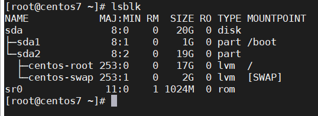

## du, df, lsblk, egrep, grep, sed, awk command

- du

Lệnh "du" (disk usage) là 1 lệnh tiêu chuẩn, được sử dụng để kiểm tra thông tin sử dụng đĩa của các tệp và thư mục trên máy.

Theo mặc định, nếu chỉ chạy lệnh "du", nó sẽ liệt kê đệ quy không gian mỗi thư mục trong thư mục làm việc hiện tại và chính thư mục hiện tại đó. Mặc dù bản thân đầu ra này thường không hữu ích cho lắm, ta có thể sử dụng các tùy chọn bổ sung để làm đầu ra hữu ích hơn nhiều

"-a": liệt kê tất cả các file và thư mục

"--apparent-size": in ra kích thước thật của tập tin thay cho kích thước trên đĩa

"-B": kích thước tính bằng size (Ví dụ: "-BM" in kích thước theo đơn vị 1.048.576 byte)

"-b": hiển thị các số theo byte thay vì các giá trị kb mặc định với tùy chọn "-b", có thể hữu ích hơn cho việc theo dõi các tập lệnh cần các giá trị cụ thể.

"-c": hiển thị tổng kích thước sử dụng

"-h": hiển thị đầu ra dưới dạng dễ hiểu với người dùng, điều này sẽ hiển thị đầu ra tính bằng Kb, MB hoặc GB. Quan sát các chữ cái 'G' và 'M' đại diện cho Gigabyte và Megabyte, giúp người dùng dễ dàng đọc các số liệu kích thước này.

"-L": hiển thị các tệp và symbolic links

"-s": hiển thị tổng kích thước thư mục mẹ mà không cần chi tiết các thư mục và tệp trong đó

"--time": hiển thị thời gian sửa đổi cuối cùng của bất kỳ tệp nào trong thư mục hoặc bất kỳ thư mục con nào của nó

- df

Lệnh "df" là viết tắt của "disk filesystem", được sử dụng để có được một bản tóm tắt đầy đủ về việc sử dụng không gian đĩa có sẵn và được sử dụng của hệ thống tệp trên hệ thống Linux.

Giống như hầu hết các lệnh Linux, bạn có thể bắt đầu sử dụng df bằng cách gọi nó từ dòng lệnh.

Lệnh "df" không có bất kỳ tùy chọn nào sẽ hiển thị tổng số khối, không gian đã sử dụng, dung lượng đĩa trống và các điểm gắn kết nằm trên hệ thống tệp.

Trong đầu ra, bạn sẽ thấy một số thông tin về các hệ thống tệp hoạt động. Đầu tiên, bạn sẽ thấy vị trí của hệ thống tập tin. Cột khối 1K đề cập đến khối đĩa nơi hệ thống tệp bắt đầu. Tiếp theo, bạn sẽ thấy việc sử dụng không gian đĩa trên hệ thống tệp đó trong KB, cũng như không gian có sẵn và tỷ lệ phần trăm được sử dụng. Cuối cùng, vị trí gắn kết của hệ thống tập tin, còn được biết đến tại điểm gắn kết.

Một số tùy chọn của lệnh "df"

"-a": hiển thị tất cả bao gồm các hệ thống tập tin giả, trùng lặp, không thể truy cập

"-B": kích thước tính bằng size (Ví dụ: "-BM" in kích thước theo đơn vị 1.048.576 byte)

"-h": hiển thị ở dạng con người có thể đọc hiểu, điều này sẽ hiển thị đầu ra tính bằng Kb, MB hoặc GB. Quan sát các chữ cái 'G' và 'M' đại diện cho Gigabyte và Megabyte, giúp người dùng dễ dàng đọc các số liệu kích thước này.

"-t": tùy chọn -t (type) cho phép lệnh "df" chỉ hiển thị thông tin cho các loại hệ thống tệp cụ thể. Ví dụ: nếu chỉ muốn liệt kê thông tin cho các hệ thống tệp xfs, có thể sử dụng -t theo sau là xfs.

"-T": hiển thị loại hệ thống tập tin, điều này thêm một cột cho mỗi hàng hiển thị loại hệ thống tập tin

"--total": hiển thị kích thước tổng cộng tất cả các hệ thống tập tin. Đôi khi tôi sử dụng cái này nếu tôi có một đĩa vật lý duy nhất có nhiều hệ thống tập tin và muốn biết còn lại bao nhiêu dung lượng

"-x": loại trừ các loại hệ thống tập tin cụ thể, tùy chọn -x (exclude-type) loại trừ các loại hệ thống tệp cụ thể khỏi danh sách. Ví dụ: `df -x  tmpfs`

- lsblk

Lệnh lsblk (list block device)  liệt kê thông tin về tất cả các thiết bị khối có sẵn hoặc được chỉ định. Lệnh lsblk đọc hệ thống tập tin sysfs để thu thập thông tin. Nó hiển thị tất cả các thiết bị khối (trừ đĩa RAM) theo định dạng giống như cây theo mặc định. Ví dụ về các thiết bị khối là đĩa cứng, ổ đĩa flash, CD-ROM, ...

Sử dụng cơ bản là khá đơn giản - chỉ cần thực hiện 'lsblk' bất kỳ tùy chọn.

Cột đầu tiên liệt kê tên thiết bị

theo sau là số thiết bị chính và phụ tương ứng

có thể tháo rời hay không (1 = có)

kích thước thiết bị

chỉ đọc (read-only)

loại thiết bị (đĩa, phân vùng, ...)

điểm gắn của thiết bị (nếu có)

Một số tùy chọn của lệnh "lsblk"

"-a": liệt kê cả các thiết bị trống, mặc định thì chúng được bỏ qua

"-D": in thông tin về khả năng loại bỏ (TRIM, UNMAP) cho từng thiết bị

"-e": loại trừ các thiết bị theo số chính (mặc định: đĩa RAM), được ngăn cách nhau bởi dấu ","

"-I": chỉ hiển thị các thiết bị có số chính được chỉ định

"-f": thông tin đầu ra về hệ thống tập tin

"-m": thông tin đầu ra về quyền

- grep, egrep

Lệnh "grep" là viết tắt của "global regular expression print" xử lý văn bản theo dòng và in bất kỳ dòng nào khớp với mẫu đã chỉ định. Lệnh "grep" được sử dụng để tìm kiếm văn bản hoặc tìm kiếm tệp đã cho cho các dòng chứa khớp với các chuỗi hoặc từ đã cho. Theo mặc định, grep hiển thị các dòng phù hợp. Grep được coi là một trong những lệnh hữu ích nhất trên các hệ điều hành giống Linux và Unix. Ngoài ra, ba chương trình biến thể egrep, fgrep và rgrep cũng có sẵn. egrep giống như grep -E. fgrep giống như grep -F. rgrep giống như grep -r.

Tùy chọn:

"-a": xử lý một tệp nhị phân như thể nó là văn bản; cái này tương đương với tùy chọn --binary-files=text

"-c": điều này chỉ in ra dòng khớp với mẫu

"-h": hiển thị các dòng trùng khớp, nhưng không hiển thị tên tệp.

"-i": tìm kiếm không phân biệt chữ hoa, chữ thường

"-l": chỉ hiển thị danh sách tên tệp.

"-n": hiển thị các dòng khớp và số dòng của chúng.

"-v": điều này in ra tất cả các dòng không khớp với mẫu

"-w": tìm kiếm và in ra những dòng có chính xác nội dung giống như đầu vào

"-r": tìm kiếm đệ quy trong tất cả thư mục con trong thư mục hiện tại

"-e" exp: chỉ định biểu thức với tùy chọn này. Có thể sử dụng nhiều lần.

"-o": tìm và in ra kết quả chính xác khớp với đầu vào, mỗi kết quả trên 1 dòng

"-E": Xử lý mẫu như một biểu thức chính quy mở rộng (ERE)

- sed

Lệnh "sed" là viết tắt của "stream editor" và nó có thể thực hiện rất nhiều chức năng trên tệp như tìm kiếm, tìm và thay thế, chèn hoặc xóa. Mặc dù việc sử dụng phổ biến nhất của lệnh SED trong UNIX là để thay thế hoặc để tìm và thay thế. Bằng cách sử dụng SED, bạn có thể chỉnh sửa các tệp ngay cả khi không mở nó, đây là cách nhanh hơn để tìm và thay thế một cái gì đó trong tệp, so với khi mở tệp đó trong VI Editor và sau đó thay đổi nó.

Thông thường, sed hoạt động trên một luồng dữ liệu được đọc từ đầu vào chuẩn hoặc một file văn bản. Mặc định, sed sẽ hiển thị kết quả ra màn hình, trừ khi có sự chuyển hướng kết quả này, ví dụ như in kết quả ra một file.

Cú pháp cơ bản của lệnh sed:

"sed <option> commands <file-to-edit>"

