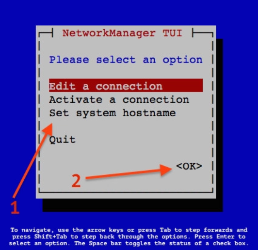
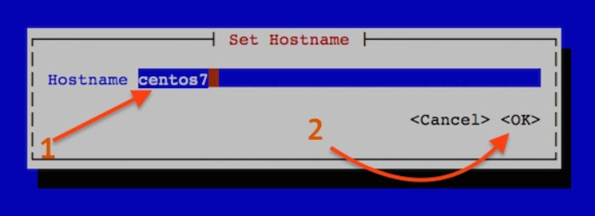
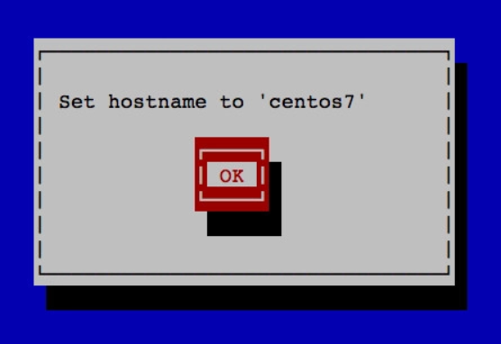

## Set hostname linux

Để thực hiện thay đổi hostname trên linux, ta có 1 số cách như sau:

1. Sửa trong file cấu hình

- kiểm tra hostname hiện tại với lệnh

`hostname`

- đổi sang hostname mới là "abc-desktop"

`hostname "centos7"`

- chỉnh sửa tệp /etc/sysconfig/network (với Redhat/CentOS) hoặc tệp /etc/hostname (với Debian/Ubuntu)

```
127.0.0.1 centos7
::1       centos7
```
Thêm vào cuối IP máy và hostname tương ứng: xxx.xxx.xxx.xxx centos7 centos7

- khởi động lại server

`reboot`

2. thực hiển đổi hostname với câu lệnh "hostnamectl"

Lưu ý: Đối với 1 số bản phân phối Linux như Ubuntu phiên bản 14.04 hoawch CentOS 7 trở lên, bạn chỉ cần thay đổi hostname bằng 1 câu lệnh duy nhất:

`hostnamectl set-hostname centos7`

3. sử dụng nmtui

- gõ câu lệnh

`nmtui`

- làm theo hướng dẫn







- Cuối cùng, khởi động lại dịch vụ tên máy chủ bằng cách gõ lệnh sau

`systemctl restart systemd-hostnamed`

4. sử dụnglệnh "nmcli"

- Cú pháp là:

`nmcli general centos7`

- Sau đó khởi động lại systemd-hostnamed service

`systemctl restart systemd-hostnamed`

- Nếu muốn thay đổi tên máy chủ từ xa

Sửu dụng 1 trong các câu lệnh sau:

`ssh root@server-ip hostnamectl set-hostname centos7`

hoặc đặt centos7 làm tên máy chủ trên máy chủ từ xa có ip 192.168.1.42 bằng ssh

`hostnamectl set-hostname centos7 -H root@192.168.1.42`