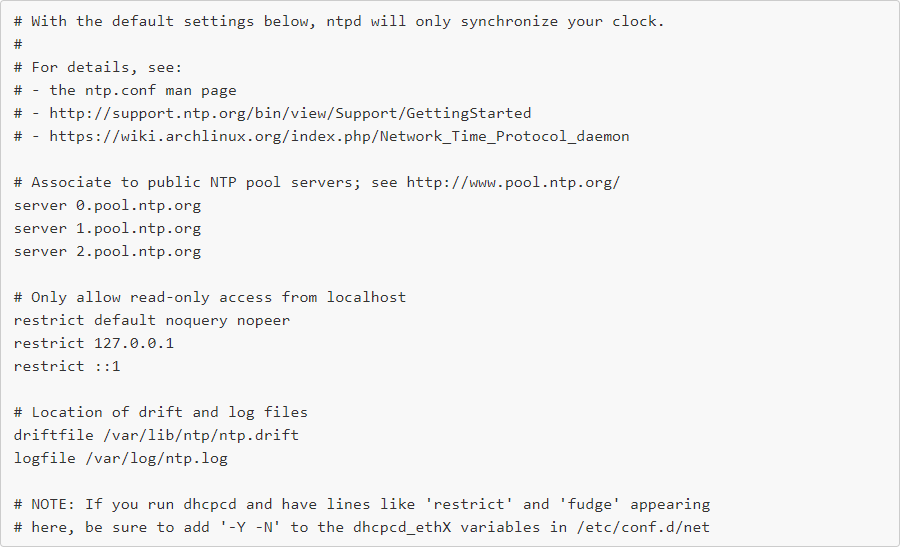
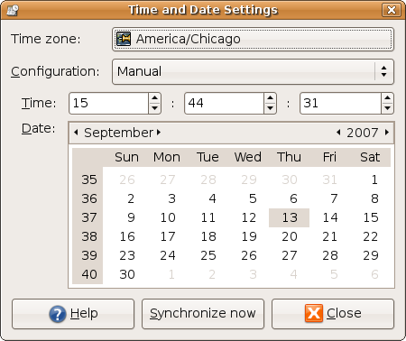

## Set date, time

Để cài đặt thời gian trong Linux, ta có một số cách sau

- Đặt thời gian từ dòng lệnh

Đặt ngày

`date +%Y%m%d -s "20190919"`

trong đó:

"%Y": năm

"%m": tháng

"%d": ngày

hoặc tóm gọn lại "%F"

Đặt giờ

`date %T -s "14:14:14"

"%T" tương đương với "%H%M%S"

Đặt thời gian và ngày

`date -s "19 SEP 2019 14:14:14"`

hoặc `timedatectl set-time YYYY-MM-DD HH:MM:SS`

- Đặt múi giờ

Để đặt múi giờ cho đồng hồ, hãy làm như sau

`cp /usr/share/zoneinfo/xxx /etc/localtime`

trong đó xxx tương ứng với múi giờ

hoặc dùng lệnh

`timedatectl set-timezone xxx`

- Tự động điều chỉnh đồng hồ trên máy tính

Để hệ thống tự động điều chỉnh thời gian, bạn cần cài đặt "ntp". NTP là viết tắt của Network Time Protocol và nó là một giao thức Internet được sử dụng để đồng bộ hóa đồng hồ của máy tính với một số tham chiếu thời gian. NTP là một giao thức chuẩn Internet ban đầu được phát triển bởi Giáo sư David L. Mills tại Đại học Delwar.

`sudo yum install  ntpdate` với CentOS/Redhat

hoặc `sudo apt install ntpdate` với Ubuntu/Debian

Tệp cấu hình ntp tại /etc/ntpd.conf  sẽ trong như thế này



Bạn sẽ tìm thấy rất nhiều dòng trong đó, nhưng những dòng quan trọng là các dòng máy chủ. Bạn có thể nhận danh sách các địa chỉ máy chủ tại www.pool.ntp.org , tìm địa chỉ ưa thích cho khu vực của bạn và sau đó thêm chúng vào tệp.

Ví dụ:

```
server 0.asia.pool.ntp.org
server 1.asia.pool.ntp.org
server 2.asia.pool.ntp.org
server 3.asia.pool.ntp.org
```

Sau đó hãy khởi động ntp và cho phép nó chạy cùng với hệ thống

```
systemctl start ntpd
systemctl enable ntpd
systemctl status ntpd
```

Bạn có thể đồng bộ hóa đồng hồ hệ thống với máy chủ NTP ngay lập tức bằng lệnh sau:

`ntpdate pool.ntp.org`

bạn có thể đổi máy chủ tại khu vực cảu mình thay cho pool.ntp.org

- Đặt thời gian và ngày trên Gnome

Nếu bạn đang sử dụng Gnome, nhấp chuột phải vào đồng hồ và chọn điều chỉnh hoặc truy cập ystem > Administration > Time and Date (Bạn có thể được yêu cầu nhập mật khẩu gốc)

Bạn sẽ thấy một cửa sổ tương tự như cửa sổ này:

