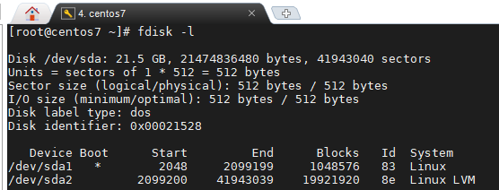
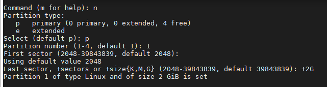
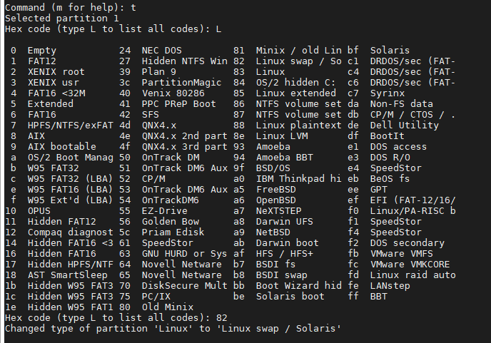
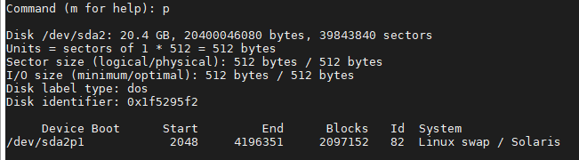
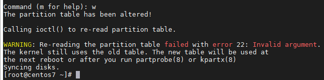
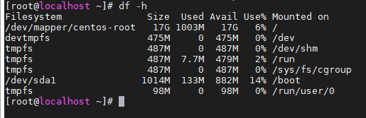
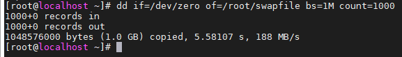
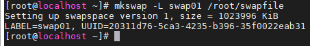
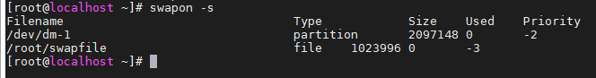

## - Create swap partion

Bên cạnh RAM còn có 1 thứ được gọi là swap (hay còn gọi là ram ảo), trong đó nội dung RAM (pages) có thể được hoán đổi trong trường hợp không còn đủ RAM nữa. Phân vùng swap này nằm trên đĩa cứng và vì đĩa đọc / ghi chậm hơn RAM nên việc truy cập các trang bộ nhớ sẽ dẫn đến độ trễ.

- Thêm không gian swap vào môi trường đĩa không phải LVM

Do thay đổi yêu cầu đối với không gian hoán đổi trên các máy chủ đã cài đặt Linux, nên có thể cần phải sửa đổi lượng không gian hoán đổi được xác định cho hệ thống. Quy trình này có thể được sử dụng cho bất kỳ trường hợp chung nào khi cần tăng lượng không gian hoán đổi. Nó giả định đủ không gian đĩa có sẵn. Quy trình này cũng giả định rằng các đĩa được phân vùng trong vùng EXT4 và phân vùng trao đổi và không sử dụng LVM.

Các bước cơ bản cần thực hiện:

1. Tắt không gian trao đổi hiện có

2. Tạo 1 phân vùng swap mới có kích thước mong muốn

3. Thay đổi lại bảng phân vùng

4. Cấu hình phân vùng như swap space

5. Thêm phân vùng mới vào /etc/fstab

6. Bật lại không gian trao đổi

Tắt phân vùng trao đổi với lệnh `swapoff -a`. Điều này sẽ tắt tất cả không gian trao đổi hiện có

Hiển thị các phân vùng hiện có trên ổ cứng với câu lệnh `fdisk -l`



Chọn phân vùng `fdisk /dev/<device_name>`, ví dụ: `fdisk /dev/sda2`

Nhập "n" để tạo phân vùng mới, tùy chọn "p" để xác nhận phân vùng chính, chọn "1" cho số phân vùng

Sau đó fdisk sẽ hởi bạn sector bắt đầu của phân vùng, gõ "enter" mà không nhập gì để mặc định

Tiếp theo nhập vào kích thước phân vùng, ở đây tôi tạo 1 swap space có kích thước 2G bằng cách nhập "+2G"



Xác định loại phân vùng vừa tạo với tùy chọn "t". Vì ta tạo 1 phân vùng swap nên câng nhập "82" vào dấu nhắc lệnh. Để xem chi tiết bấm "L"



Nhấn "p" để xác minh phân vùng đã tạo như bạn chỉ định



Sau đó dùng tùy chọn "w" để ghi bản phân vùng mới vào đĩa. fddiissk sẽ thoát ra và đưa bạn trở lại dấu nhắc lệnh sau khi hoàn tất ghi bẳng phân vùng sửa đổi



Tại thời điểm này bạn sử dụng lệnh `partprobe` để buộc kernel đọc lại bảng phân vùng để không cần thiết phải reboot hệ thống

Bây giờ sử dụng lệnh `fdisk -l` để liệt kê các phân vùng và phân vùng swap mới phải nằm trong số các phân vùng được liệt kê

Sửa đổi file /etc/fstab để trỏ đến phân vùng swap mới bằng cách thêm vào dòng cso định dạng như dưới, tùy thuộc vào vị trí của phân vùng swap mới của bạn

`tên_phân_vùng swap                    swap    defaults        0 0`

Sử dụng lệnh "mkswap" để xác định phân vùng là phân vùng swap

`mkswap tên_phân_vùng`

Bước cuối cùng là bật lại swap bằng lệnh `swapon -a`

- Thêm swap vào môi trường đĩa LVM

Nếu thiết lập đĩa của bạn sử dụng LVM, việc thay đổi không gian swap sẽ khá dễ dàng. Dưới đây là các bước cần thiết để tăng kích thước không gian swap trong môi trường LVM:

1. Tắt tất cả các phân vùng swap

2. Tăng kích thước phân vùng swap

3. Cấu hình thay đổi kích thước không gian swap

4. Bật lại phân vùng swap

Trước tiên hãy xác minh rằng phân vùng swap tồn tại cà là 1 khối hợp lý bằng cách sử dụng lệnh `lvs` (list logical volume)


Như bạn thấy rằng kích thước phân vùng swap hiện tại đang là 2G, bây giờ tôi muốn thêm 1G nữa vào.

Ngừng phân vùng swap hiện tại bằng câu lệnh `swapoff -a`

Tăng kích thước phân vùng swap với câu lệnh

`lvextend -L +1G /dev/mapper/centos-swap`

Chạy lệnh "mkswap" để biến toàn bọ phân vùng 3G này thành không gian swap

`mkswap /dev/mapper/centos-swap`

Bật lại phân vùng trao đổi

`swapon -a`

Bây giờ xác minh không gian swap mới với câu lệnh "list block devices"

`lsblk`

Bạn cũng có thể dùng `swapon -s` hoặc `top`. `free` để thay thế

- Cách tạo không gian swap từ tập tin

Để tạo một phân vùng swap mới, không gian đĩa không được phân vùng là bắt buộc. Nếu chúng ta không có không gian đĩa không được phân vùng, chúng ta không thể tạo phân vùng swap mới. Trong trường hợp đó, chúng ta có thể tăng không gian swap từ tập tin.

Để tạo không gian swap từ tệp trước tiên chúng ta cần tạo tệp swap. Sử dụng lệnh `df -h` để tìm ra phân vùng có đủ dung lượng trống để lưu trữ tệp tin swap



Sử dụng lệnh "dd" để tạo một tệp có kích thước theo yêu cầu

`dd if=/dev/zero of=/root/swapfile bs=1M count=1000`

trong đó:

dd:  Lệnh "dd" (sao chép đĩa) được sử dụng để sao chép hoặc sao lưu dữ liệu mức thấp

if=/dev/zero: Đây là tùy chọn đầu tiên. Tùy chọn này chấp nhận vị trí nguồn làm đối số. Trong ví dụ này tôi đã sao chép từ tập tin đĩa /dev/zero. /dev/zero là một tập tin đặc biệt trong hệ thống Linux mà cung cấp các ký tự null

of=root/swapfile: Đây là tùy chọn thứ 2. Tùy chọn này chấp nhận vị trí đích làm đối số. swapfile là tên cảu tệp, bạn có thể dung bất cứ tên gì bạn muốn

bs =1: Đây là tùy chọn thứ 3, được sử dụng để xác định kích thước các khối. 1M là 1 megabyte

count=1000: Đây là tùy chọn cuối, được sử dụng để xác định số lượng khối

Về cơ bản lệnh này tạo ra 1 tệp có dung lượng 1G từ các ký tựi null (byte không)



Tôi đã tạo tệp hoán đổi trong thư mục /root để đảm bảo an toàn hơn vì người dùng bình thường không thể vào thư mục đó. Để đảm bảo an toàn hơn, áp dụng các quyền thích hợp cho tệp

`chmod 600 /root/swapfile`

Chạy lệnh "mkswap" để chuyển đổi tập tin thành tệp swap

`mkswap -L swap01 /root/swapfile`



Sửa đổi tệp /etc/fstab để thêm swap mới và cho phép hệ thống nhận ra nó khi khởi động và lưu lại

```
vi /etc/fstab
/root/swapfile        swap                    swap    defaults        0 0
```

Chạy lệnh `swapon -a` để kích hoạt tất cả các không gian swap được liêt kê trong tệp /etc/fstab

Xem các không gian swap với lệnh `swapon -s`

