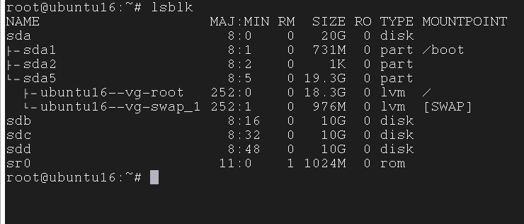

## Logical Volume Manager (LVM)

Logical Volume Manager (LVM): là phương pháp cho phép ấn định không gian đĩa cứng thành những logical volume khiến cho việc thay đổi kích thước trở nên dễ dàng hơn (so với partition). Với kỹ thuật Logical Volume Manager (LVM) bạn có thể thay đổi kích thước mà không cần phải sửa lại table của OS. Điều này thật hữu ich với những trường hợp bạn đã sử dụng hết phần bộ nhớ còn trống của partition và muốn mở rộng dung lượng của nó

#### Vai trò

LVM là kỹ thuật quản lý việc thay đổi kích thước lưu trữ của ổ cứng

- Không để hệ thống bị gián đoạn hoạt động

- Có thể kết hợp Hot Swapping (thao tác thay thế nóng các thành phần bên trong máy tính)

- LVM có thể gom nhiều ổ đĩa cứng thành một ổ ảo, giúp tăng kích thước lưu trữ.

#### Các thành phần trong LVM

Ta có mô hình các thành phần trong LVM


- Hard Drives: thiết bị lưu trữ dữ liệu hay các ổ cứng, ví dụ như trong linux nó là /dev/sda, /dev/sdb, ...

- Partition: là các phâ vùng của hard driver, mỗi hard driver có 4 partition, trong đó partition bao gồm 2 loại là primary và extend partition

	- Primary partition: phân vùng chính, có thể khởi động. Mối đĩa cứng có tối đa 4 phân vùng này
	
	- Extended partition: phân vùng mở rộng, có thể tạo 
	
- Physical Volume: là 1 cách gọi khác của partition trong kỹ thuật LVM, là thành phần cơ bản được sử dụng bởi LVM. 1 physical volume không thể mở rộng ra ngoài phạm vi 1 ổ đĩa. Có thể kết hợp nhiều physical volume thành volume groups

- Volume Group: nhiều physical volume trên những ổ khác nhau được kết hợp lại thành 1 volume group. Volume Group được sử dụng để tạo ra các Logical Volume, trong đó người dùng có thể tạo, thay đổi kích thước, lưu trữ, gỡ bỏ và sử dụng. Với LVM Volume Group được xem như một ổ đĩa ảo.


> Một điểm cần lưu ý là boot loader không thể đọc /boot khi nó nằm trên Volume Group. Do đó không thể sử dụng kỹ thuật LVM với /boot mount point

- Logical Volume: Volume Group được chia nhỏ thành nhiều Logical Volume, mỗi Logical Volume có ý nghĩa tương tự như partition. Nó được dùng cho các mount point và được format với những định dạng khác nhau như ext2, ext3, ext4,… Khi dung lượng của Logical Volume được sử dụng hết ta có thể đưa thêm ổ đĩa mới bổ sung cho Volume Group và do đó tăng được dung lượng của Logical Volume. Ví dụ bạn có 4 ổ đĩa mỗi ổ 5GB khi bạn kết hợp nó lại thành 1 volume group 20GB, và bạn có thể tạo ra 2 logical volume mỗi disk 10GB


- File Systems: tổ chức và kiểm soát các tập tin. Được lưu trữ trên ổ đĩa cho phép truy cập nhanh chóng và an toàn. Sắp xếp dữ liệu trên đĩa cứng máy tính. Quản lý vị trí vật lý của mọi thành phần dữ liệu

#### Cơ chế hoạt động

1 hard driver có thể có tối đa 4 partition. Với LVM physical volume có thể coi như là các partition trên disk, từ các physical volume này, bạn có thể gôm lại thành một hay nhiều các volume group, mỗi volume group có thể chia ra làm một hay nhiều logical volume

LVM giúp bạn phân bổ không gian đĩa hợp lý hơn. Khi có phân vùng nào không được sử dụng đến thì có thể nhóm nó vào phân vùng đang cần mở rộng. Bạn có thể thay đổi kích thước bất cứ khi nào cần

Đối với LVM, 1 ổ cứng, một tập các ổ cứng hay các partition khác nhau có thể được phân bổ cho 1 hay nhiều physical volume. Physical volume có thể được đặt trên các block device khác nhau. Các physical volume này sẽ được kết hợp thành volume group sau đó sẽ được chia thành các logical volume ngoại trừ partition /boot

Phân vùng /boot không thể nằm trong volume group bởi vì boot loader không thể đọc nó. Nếu partition / nằm trên logical volume thì hãy tạo 1 partition riêng cho /boot mà không phải là 1 phần của volume group

Volume group có thể chia làm các logical volume để làm các mount point như /, /home và cái loại file system như ext2, ext3, ... Khi các partition đầy dung lượng lưu trữ, không gian trống trong volume có thể được thêm cho logical volume để tăng dung lượng cho partition. Khi có ổ cứng mới được lắp đặt, nó có thể được thêm vào volume group để gia tăng kích thước cho logical volume

#### Ưu, nhược điểm của LVM

- Ưu điểm: lvm cho phép bạn linh hoạt hơn so với việc chỉ sử dụng các phân vùng ổ cứng thông thường

	- có thể hộp nhiều đĩa cứng vật lý lại thanhg 1 đĩa ảo có dung lượng
	
	- có thể tạo ra các vùng có dung lượng theo ý muốn
	
	- có thể thay đổi các vùng dung lượng dễ dàng, linh hoạt mà không cần format lại ổ đĩa
	
	- có thể được sử dụng để thiết lập jbod mà không cần raid
	
	- cho phép thiết lập volume snapshot
	
- Nhược điểm:

	- các bước thiết lập phức tạp, kho khăn hơn
	
	- càng gắn nhiều đĩa cứng và thiết lập càng nhiều lvm thì hệ thống khởi động càng đâu
	
	- khả năng mất dữ liệu khi một hoặc một số đĩa cứng hỏng
	
	- windows không thể nhận ra phân vùng dữ liệu lvm, vì vậy nếu dual-boot window sẽ không thể truy cập dwux liệu trong phân vùng lvm	

#### Các phiên bản của LVM

Đối với bản phát hành Red Hat Enterprise Linux 4 của hệ điều hành Linux, trình quản LVM1 ban đầu đã được thay thế bằng LVM2, có khung nhân chung chung hơn LVM1. LVM2 cung cấp các cải tiến sau so với LVM1:

- khả năng lưu trữ linh hoạt
 
- lưu trữ siêu dữ liệu hiệu quả hơn

- định dạng phục hồi tốt hơn

- định dạng siêu dữ liệu ASCII mới

- thay đổi atomic thành siêu dữ liệu

- bản sao siêu dữ liệu dư thừa

LVM2 tương thích ngược với LVM1, ngoại trừ snapshot và cluster. Bạn có thể chuyển đổi 1 volume group từ định dạng LVM1 sang định dạng LVM2 bằng lệnh `vgconvert`. Để biết thông tin về chuyển đổi định dạng siêu dữ liệu LVM, xem trang man vgconvert(8)
	
#### Sử dụng LVM

Đầu tiên ta add thêm một số ổ cứng vào máy

Chạy lệnh `lsblk` sẽ thấy có 3 ổ mới được add thêm, mỗi ổ 10GB



Trong đó sdb, sdc, sdd là các Hard Drives mà mình mới thêm vào

- Tạo Logical Volume trên LVM

Tạo Partition:

Từ các hard drivers trên hệ thống, ta tạo các partition. Ở đây với ổ sdb tôi sử dụng lệnh `fdisk /dev/sdb`


trong đó:

n: thêm partition mới

p: primary partition

1: đánh số partition (từ 1-4)

First sector: để mặc định

Last sector: +1G để partition vùa tạo có dung lượng 1G

t: thay đổi loại partition

8e: hex code của LVM

w: lưu lại

Tương tự, tạo thêm các partition từ sdb và sdc

Tạo Physical Volume:

Tạo các physical volume lần lượt là /dev/sdb1 và /dev/sdc1

```
pvcreate /dev/sdb1
pvcreate /dev/sdc1
```

Bạn có thể kiểm tra các physical volume bằng câu lệnh `pvs` hoặc `pvdisplay`


Tạo Volume Group:

Tiếp theo ta sẽ nhóm các physical volume thành 1 volume group

`vgcreate vg-demo1 /dev/sdb1 /dev/sdc1`

"demo1" là tên của volume group

Có thể sử dụng câu lệnh sau để kiểm tra lại các Volume Group đã tạo

`vgs` hoặc `vgdisplay`


Tạo Logical Volume:

Từ một Volume Group, chúng ta có thể tạo ra các Logical Volume bằng cách sử dụng lệnh sau

`lvcreate -L 1G -n lv-demo1 vg-demo1`

trong đó:

"-L": Chỉ ra dung lượng của logical volume

"-n": Chỉ ra tên của logical volume

lv-demo1 là tên Logical Volume, vg-demo1 là Volume Group mà tôi tạo ở bước trước

> Lưu ý là chúng ta có thể tạo nhiều Logical Volume từ 1 Volume Group

Có thể sử dụng câu lệnh sau để kiểm tra lại các Logical Volume đã tạo

`lvs` hoặc `lvdisplay`


Mount và sử dụng:

Tôi sẽ tạo ra một thư mục để mount Logical Volume đã tạo vào thư mục đó

`mkdir demo1`

Format các Logic Volume thành các định dạng như ext2, ext3, ext4

`mkfs -t ext4 /dev/vg-demo1/lv-demo1`


Tiến hành mount logical volume lv-demo1 vào thư mục demo1 như sau

`mount /dev/vg-demo1/lv-demo1 demo1`

Kiểm tra lại dung lượng của thư mục đã được mount

`df -h`


> Lưu ý đây là kiểu mount mềm, sẽ bị mất nếu máy khởi động lại. Để có thể sử dụng ngay cả khi reboot máy cần phải mount cứng.

- Thay đổi dung lượng Logical Volume trên LVM:

Trước khi thay đổi dung lượng, ta phải kiểm tra các thông tin hiện có

```
vgs
lvs
pvs
```


Giả sử như logical volume lv-demo1 đã đầy dung lượng và ta cần tăng thếm kích thước cho nó

Logical volume lv-demo1 thuộc volume group vg-demo1, thế nên đầu tiên ta cần kiểm tra xem vg-demo1 có còn dung lượng để cấp phát hay không

`vgdisplay`


Volume group vg-demo1 ở đây vẫn còn dung lượng để cấp phát, ta có thể nhận thấy điều này qua 2 trường thông tin là VG Status resizable và Free PE / Size 254 / 1016MB

Để tăng kích thước logical volume ta sử dụng câu lệnh sau

`lvextend -L +500M /dev/vg-demo1/lv-demo1`


Sau đó ta phải xác nhận sự thay đổi này

`resize2fs /dev/vg-demo1/lv-demo1`

Để giảm kích thước của logical volume, trước hết cần unmount logical volume đó

`umount /dev/vg-demo1/lv-demo1`

Sau đó tiến hành giảm kích thước của logical volume

`lvreduce -L 500M /dev/vg-demo1/lv-demo1`

Format lại logical volume

`mkfs.ext4 /dev/vg-demo1/lv-demo1`

Mount lại logical volume

`mount /dev/vg-demo1/lv-demo1 demo1`

- Thay đổi dung lượng volume group trên LVM

Việc thay đổi kích thước của volume group chính là việc nhóm thêm hay thu hồi physical volume ra khỏi volume group

Trước tiên cần kiểm tra các partition và các volume group

```
lsblk
vgs
```


Tiếp theo nhóm thêm 1 partition vào volume group như sau

`vgextend /dev/vg-demo1 /dev/sdb3`


Ở đây muốn nhóm vào volume group phải là physical volume nên hệ thống đã tự tạo physical volume và nhóm vào volume group

Nếu muốn gỡ bỏ 1 physical volume ra khỏi volume group, ta làm như sau

`vgreduce /dev/vg-demo1 /dev/sdb3`


- Xóa logical volume, volume group, physical volume

Xóa logical volume

Unmount logical volume

`umount /dev/vg-demo1/lv-demo1`

Xóa logical volume với câu lệnh

`lvremove /dev/vg-demo1/lv-demo1`


Xóa volume group bằng cách dùng câu lệnh sau nhưng trước đó ta cần xóa các logical volume mà nó quản lý trước

`vgremove /dev/vg-demo1`

Xóa physical volume

Cuối cùng là xóa physical volume

`pvremove /dev/sdb3`

Dùng lệnh `lvmdiskscan` sẽ cho biết partition nào đang là LVM physical volume.

- Đổi tên

Đổi tên 1 volume group với câu lệnh

`vgrename vg-demo1 vg-demo-rename`

tương tự đổi tên logical volume `lvrename`

- Tách 1 volume group

Để phân chia physical volume của 1 volume group và tạo 1 volume group mới, hãy sử dụng lệnh `vgsplit`

Logical volume không thể được phân chia giữa các volume group. Mỗi logical volume hiện có phải nằm hoàn toàn trên các physical volume hình thành volume group cũ hoặc mới. Tuy nhiên, nếu cần, bạn có thể sử dụng lệnh `pvmove` để buộc phân tách.

Ví dụ sau tách volume group mới "smallvg" khỏi volume group gốc "bigvg"


- Kết hợp các volume group

Để kết hợp 2 volume group thành 1 volume group duy nhất, sử dụng lệnh `vgmerge`. Bạn có thể hợp nhất volume "nguồn" không hoạt động với volume "đích" đang hoạt động hoặc không hoạt động nếu kích thước phạm vi vật lý của volume bằng nhau và các tóm tắt physical và logical volume của cả 2 volume group phù hợp với giới hạn của volume group đích.

Lệnh sau đây hợp nhất volume group "my_vg" vào volume group "databases"


- Các kiểu ghi dữ liệu của lvm


Linear: là hình thức ghi đĩa mặc định trên lvm, đọc ghi lần lượt từng ổ đĩa logical volume một, khi ổ này đày dung lượng thì chuyển sang ổ kế tiếp

Ưu điểm: do lưu dữ liệu lần lượt trên từng ổ đĩa nên các ổ chưa sử dụng sẽ có tuổi thọ sử dụng cao hơn, năng lượng dành cho việc ghi đãi cũng sẽ thấp hơn

Nhược điểm: ghi dữ liệu vào từng ổ nên tốc đọ đọc ghi sẽ bị giới hạn tại maxspeed của đĩa

Để tạo logical volume kiểu linear

`lvcreate -L <kích thước> -n <tên logical volume> <tên volume group>`

Kiểm tra kiểu ghi dữ liệu linear

Đầu tiên ta tạo 1 volume group tên vg-linear và tạo logical volume tên lv-linear với 2 partition sdb2 và sdc2

```
vgcreate vg-linear /dev/sdb2 /dev/sdc2
lvcreate -l 100%FREE -n lv-linear vg-linear
```

tùy chọn 100%FREE sẽ tạo logical volume với toàn bộ dung lượng của không gian trống còn lại trong volume group vg-linear

Kiểm tra

`lvdisplay vg-linear/lv-linear -m`


kết quả trả về sẽ cho ta thấy cách dữ liệu được ghi: dữ liệu sẽ được ghi vào physical volume sdb2 đầu tiên, đến khi nào sdb2 hết dung lượng thì chuyển sang sdc2

Striped: dữ liệu sẽ được đoc/ghi lên tất cả các ổ cùng lúc

Ưu điểm: tốc độ đọc/ghi cao hơn nhiều lần so với linear

Nhược điểm: nếu muốn add thêm ổ cứng thì phải add thêm số lượng bằng với số lượng đang có thì mới mở rộng dung lượng của logical volume được. Vì tất cả các ổ sẽ đều đoc/ghi dữ liệu cùng lúc nên tổi thọ cũng thấp hơn so với linear, tiêu tốn năng lượng hơn

Tạo logical volume kiểu striped

`lvcreate -L <kích thước> --type striped -i <số lượng ổ đĩa> -n <tên logical volume> <tên volume group>`

Kiểm tra kiểu ghi dữ liệu striped

Đầu tiên tạo 1 volume group có tên vg-striped và logical volume có tên lv-striped với 2 partition sdb4 và sdc4

```
vgcreate vg-striped /dev/sdb4 /dev/sdc4
lvcreate -l 100%FREE --type striped -i 2 -n lv-striped vg-striped
```

Kiểm tra

`lvdisplay vg-striped/lv-striped -m`


dữ liệu sẽ được ghi lên cả 2 physical volume sdb4 và sdc4

- Di chuyển 1 volume group sang hệ thông khác

Bạn có thể di chuyển toàn bộ volume group LVM sang hệ thống khác bằng cách sử dụng các lệnh `vgexport` và `vgimport`

Các lệnh `vgexport` làm cho một volume group hoạt động không thể tiếp cận với hệ thống, cho phép bạn tách physical volume của nó. Các lệnh `vgimport` làm cho một volume group truy cập đến một máy một lần nữa sau khi lệnh `vgexport` đã làm cho nó không hoạt động.

Để di chuyển 1 volume group từ hệ thống này sang hệ thống khác, hãy thực hiện các bước sau:

Đảm bảo rằng không có người dùng nào đang truy cập các tệp trên các ổ đĩa hoạt động trong volume group, sau đó ngắt kết nối các ổ đĩa logic.

Sử dụng đối số `-a n` của lệnh `vgchange` để đánh dấu volume group là không hoạt động, điều này ngăn bất kỳ hoạt động nào khác trên volume group.

Sử dụng lệnh `vgexport` để ngăn không cho nó truy cập bởi hệ thống mà bạn đang gỡ bỏ nó.

Sau khi bạn export volume group, physical volume sẽ hiển thị trong export volume group khi bạn thực hiện lệnh `pvscan`, như trong ví dụ sau


Tắt hệ thống, rút các ổ đĩa tạo nên volume group và bạn có thể kết nối chúng với hệ thống mới

Khi các đĩa được gắn vào hệ thống mới, hãy sử dụng lệnh `vgimport` để import volume group, làm cho nó có thể truy cập được vào hệ thống mới

Kích hoạt volume group với đối số `-a y` của lệnh `vgchange`

Mount file system để làm cho nó có thể sử dụng được