## LVM advanced

Các tính năng nâng cao của LVM

#### Tính năng snapshot

Tính năng snapshot lvm cung cấp khả năng tạo 1 bản sao lưu ở thời điểm hiện tại mà không gây gián đoạn dịch vụ. Khi thay đổi được thực hiện cho dữ liệu gốc sau khi snapshot, tính năng snapshot sẽ tạo 1 bản sao của vùng dữ liệu đã thay đổi như trước khi nguồn thay đổi để có thể trở về trạng thái cũ

Sử dụng đối số "-s" của lệnh `lvcreate` để tạo 1 snapshot volume.

- Chuẩn bị

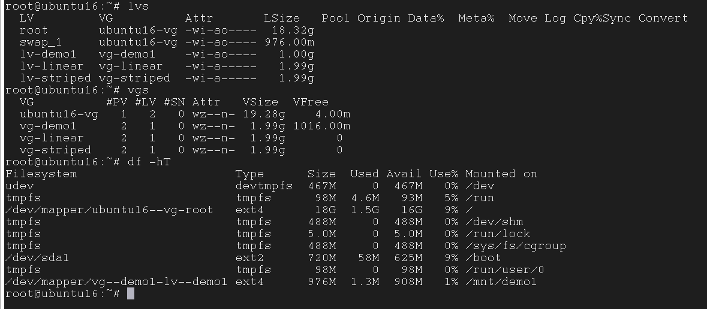

trên hình ta đã có 1 logical volume lv-demo1 được mount tới /mnt/demo1 và volume group vg-demo1

- Tạo snapshot

lv-demo1 thuộc vg-demo1 nên ta check xem vg-demo1 cso còn thừa dung lượng để tạo snapshot

Tạo snapshot với câu lệnh

`lvcreate -L 500M -s -n lv-demo1-snap /dev/vg-demo1/lv-demo1`

kiểm tra lại với câu lệnh `lvs`

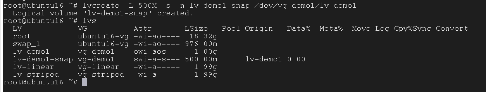

> Chú ý: Dung lượng snapshot tăng lên đúng bằng dung lượng tạo mới trên logical volume. Không thể tạo Snapshot mới ghi đè lên snapshot cũ. Trường hợp bạn có 2 snapshot cho cùng 1 ổ logical volume thì dữ liệu mới cũng được ghi cả vào 2 ổ snapshot.

Vì snapshot LVM cũng là một logical volume nên có thể xoá, tăng giảm kích thước như logical volume bình thường. Ví dụ nếu muốn xoá snapshot

`lvremove /dev/vg-demo1/lv-demo1-snap`

Mở rộng snapshot

`lvextend -L +100M /dev/vg-demo1/lv-demo1-snap`

Nếu muốn mở rộng tự động thì cần chỉnh sửa /etc/lvm/lvm.conf và đặt "snapshot_autoextend_threshold" thành một số khác 100 (100 là giá trị mặc định và cũng vô hiệu hóa tiện ích mở rộng tự động). Ngoài ra, bạn cũng chỉnh sửa "snapshot_autoextend_percent". Giá trị này sẽ là số % bạn muốn mở rộng cho snapshot.

```
snapshot_autoextend_threshold = 70
snapshot_autoextend_percent = 20
```

Các giá trị này chỉ ra rằng một khi dung lượng snapshot đã đầy 70% thì hãy mở rộng kích thước của nó thêm 20%. Sau đó dịch vụ "lvm2-monitor" cần được khởi động lại (điều này thay đổi theo nền tảng).

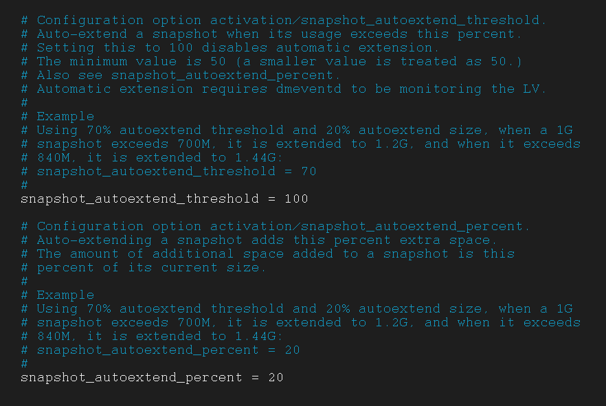

- Restoring Snapshot or Merging

Để restore Snapshot chúng ta phải un-mount file system

`umount /mnt/demo1`

Restore snapshot

`lvconvert --merge /dev/vg-demo1/lv-demo1-snap`

Sau khi quá trình kết thúc thì snapshot volume sẽ được xóa, mount lại volume vào thư mục /mnt/demo1.

#### Tính năng Thin Provisioning Volumes

Là 1 tính năng cho phép tạo ra các ổ đĩa ảo từ storage pool, giúp tận dụng tối đa tài nguyên ổ đĩa

Hãy thử giả định rằng, ta đang có một storage pool với dung lượng 15Gb. Ta đang sử dụng nó để cung cấp không gian lưu trữ cho 3 người, với mỗi người có dung lượng lưu trữ tối đa là 5Gb cho mỗi storage pool của mỗi người. Và thực tế, 3 người họ chỉ sử dụng hết 6Gb trong tổng số 15Gb. Như vậy. ta đang còn trống 9Gb dung lượng từ storage pool ban đầu. Nếu có thêm 1 user nữa thì sẽ không thể cấp phát mặc dù còn rất nhiều dung lượng trống (Thick Volume).

Khi ta sử dụng tính năng Thin Provisioning để cung cấp dung lượng lưu trữ cho 3 người kia 1 storage pool, mỗi pool lúc này sẽ được xem là 1 thin pool. Tất cả những gì về dữ liệu của bạn sẽ vẫn được lưu trữ và không gian lưu trữ sẽ vẫn hiển thị với không gian là 5Gb. Nhưng thực tế, hiện tại, bạn sẽ không được cung cấp đầy đủ dung lượng lưu trữ là 5Gb. Chính vì điều này, khi chúng ta giả định rằng, 3 người kia được cung cấp không gian lưu trữ là 5Gb và họ chỉ sử dụng hết 6Gb trong tổng số 15Gb ban đầu của chúng ta thì chúng ta vẫn có thể cung cấp một không gian lưu trữ khác cũng với 5Gb dung lượng cho một người nữa. Như vậy, ta có thể cung cấp được dung lượng bộ nhớ lưu trữ cho người nữa người với không gian nhớ là 5Gb. Đây chính là tính năng mà Thin Provisioning hướng đến để giải quyết.

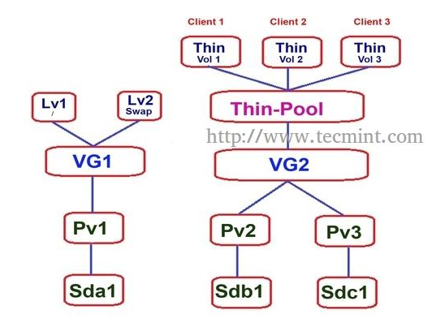

- Đầu tiên cần cài đặt gói:

`apt-get -y install thin-provisioning-tools`

- Tạo 1 volume group

`vgcreate vg-thin-demo /dev/sdd1`

- Tạo 1 thin pool với kích thước 6G

`lvcreate -L 6G --thinpool thin-demo vg-thin-demo`

- Tạo các thin volume từ thin pool

```
lvcreate -V 2G --thin -n thin-demo-client1 vg-thin-demo/thin-demo
lvcreate -V 2G --thin -n thin-demo-client2 vg-thin-demo/thin-demo
lvcreate -V 2G --thin -n thin-demo-client3 vg-thin-demo/thin-demo
lvcreate -V 2G --thin -n thin-demo-client4 vg-thin-demo/thin-demo
```

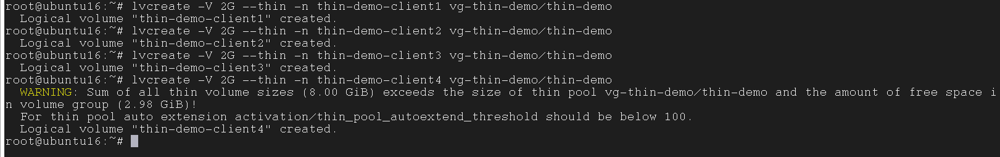

- Tạo thư mục, format và mount để sử dụng

```
mkdir /mnt/client{1..4}
mkfs.ext4 /dev/vg-thin-demo/thin-demo-client1
mkfs.ext4 /dev/vg-thin-demo/thin-demo-client2
mkfs.ext4 /dev/vg-thin-demo/thin-demo-client3
mkfs.ext4 /dev/vg-thin-demo/thin-demo-client4
mount /dev/vg-thin-demo/thin-client1 /mnt/client1
mount /dev/vg-thin-demo/thin-client2 /mnt/client2
mount /dev/vg-thin-demo/thin-client3 /mnt/client3
mount /dev/vg-thin-demo/thin-client4 /mnt/client4
```

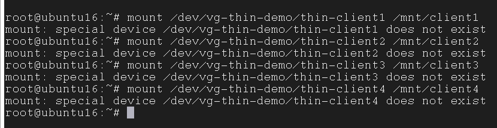

#### LVM Migrating

LVM Migrating là một tính năng tuyệt vời. Với tính năng này, ta có thể tạo ra một bản sao dữ liệu từ một logical volume này đến một ổ đĩa mới mà không làm mất dữ liệu cũng như xảy ra tình trạng downtime. Có thể áp dụng với disk SATA, SSD, SAN storage iSCSI hoặc FC

Mục đích của tính năng này đó là di chuyển dữ liệu của chúng ta từ một đĩa cứng cũ đến một đĩa cứng mới. Điều này được thực hiện khi mà trên đĩa hiện đang lưu dữ liệu phát sinh ra một số lỗi.

- Tạo 1 volume group vl-test từ 2 partition sdb3 và sdc3

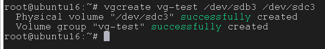

- Tạo một mirror volume với câu lệnh

`lvcreate -L 500M -m 1 -n lv-mirror vg-test`

ở đây đối số "-m 1" để khai báo số bản sao lưu của dữ liệu. Ở đây là 1 (nhưng sẽ tạo ra 2)

Chạy lệnh `lvdisplay -v` để kiểm tra kết quả

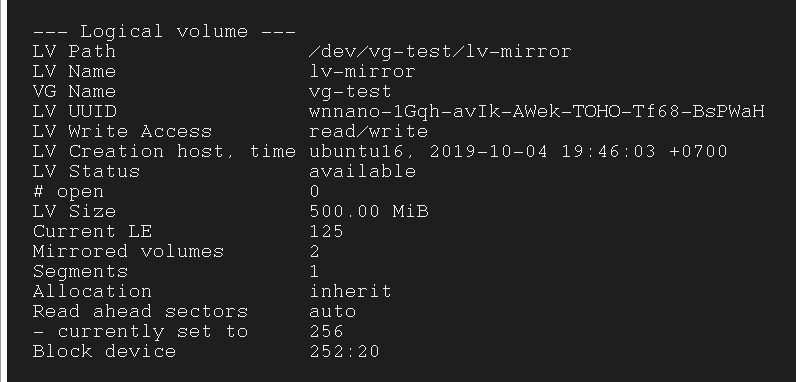

- Tạo 1 file system cho mirror volume vừa tạo và mount nó vào thư mục /mnt/mirror

```
mkfs.ext4 /dev/vg-test/lv-mirror
mkdir /mnt/mirror
mount /dev/vg-test/lv-mirror /mnt/mirror
```

- Tạo 1 file mới trong thư mục vừa tạo

`echo "Test tinh nang lvm migrating" > /mnt/mirror/test.txt`

- Tiếp theo, ta sử dụng câu lệnh `lvs -a -o +devices` để kiểm tra thông tin về logical volume

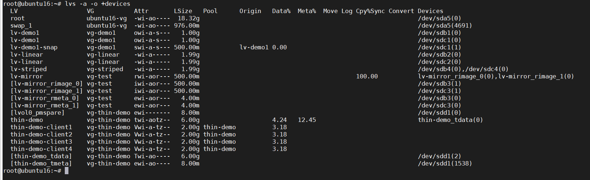

Ta thấy được lv-mirror đang gắn với lv-mirror_rimage_0(0) và lv-mirror_rimage_1(0), mà lv-mirror_rimage_0(0) đang gắn với /dev/sdb3, lv-mirror_rimage_1(0) đang gắn với /dev/sdc3. Như vậy ta có thể thấy dữ liệu lưu trên Mirror Volume được lưu ở 2 chỗ. Như vậy, ta có thể tùy ý xóa đi một bản sao của Volume mà không lo đến mất dữ liệu.

- Để thực hiện xóa đi một mirrored volume, ta sử dụng câu lệnh

`lvconvert -m 0 /dev/vg-test/lv-mirror /dev/sdc3`

trong đó "-m 0": Khai báo chuyển đổi từ mirror volume sang linear volume (xóa đi)

Kiểm tra lại với lệnh `lvs -a -o +devices`

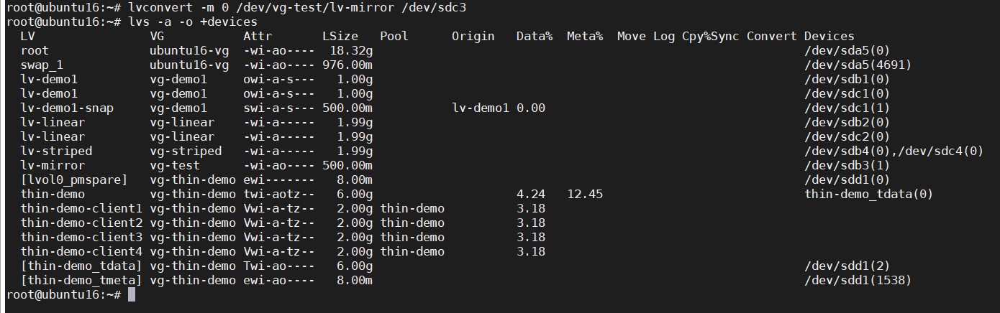

như trên ta thấy, lv-mirror đang sử dụng mỗi /dev/sdb3 để lưu trữ dữ liệu

- Kiểm tra nội dung của file test.txt lúc đầu

`cat /mnt/mirror/test.txt`

kết quả

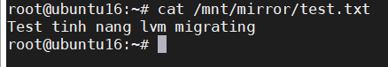

nội dung thông tin của file test.txt vẫn còn nguyên vẹn