## Linux stream

#### Standrad input output (stdio)

Trong Linux và lập trình máy tính nói chung, các luồng tiêu chuẩn là các kênh giao tiếp đầu vào và đầu ra (I/O) giữa 1 chương trình và môi trường của nó. Đầu vào thường đến từ bàn phím và dầu ra đi đến màn hình.

Luồng Linux là dữ liệu di chuyển trong Linux shell từ tiến trình này sang tiến trình khác thông qua 1 đường ống (|) hoặc qua file dưới dạng chuyển hướng

Các shell Linux sử dụng 3 luồng tiêu chuẩn:

- standard input (stdin) - thường là đầu vào từ bàn phím hoặc output của các lệnh trước đó, ví dụ như các lệnh được thực thi bằng cách gõ chúng

- standard output (stdout) - thường là đầu ra từ các lệnh hoặc chương trình, thường được xuất ra màn hình, cũng có thể được chuyển hướng

- standard error (stderr) - hiển thị đầu ra lỗi từ lệnh hoặc chương trình, có thể xuất ra màn hình nhưng thường được chuyển hướng đến các file log

Dưới đây là biểu diễn đồ họa của các luồng này:

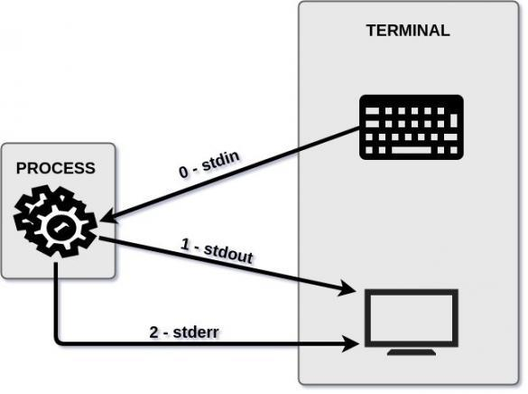

File Descriptors quy định:

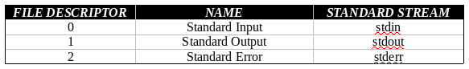

#### Toán tử chuyển hướng

Toán tử chuyển hướng là 1 tập hợp con của toán tử điều khiển. Chúng cho phép bạn chỉ đạo đầu vào hoặc đầu ra (luồng) của lệnh

- Toán tử đầu vào

Toán tử đầu vào cung cấp đầu vào cho 1 lệnh hoặc 1 tiến trình. Ký tự "<" đại diện cho toán tử này

- Toán tử đầu vào (rw)

Toán tử đầu vào (rw) thực hiện giống như toán tử đầu vào, nó chỉ mở tệp ở chế độ đọc/ghi. "<>" đại diện cho toán tử này. Nếu tập tin không tồn tại, nó sẽ được tạo. Vì hầu hết đầu vào là từ bàn phím hoặc đọc từ tệp nên điều này hiếm khi được sử dụng

- Toán tử pipe

Toán tử pipe hay đường ống được sử dụng để chuyển đầu ra của 1 lệnh làm đầu vào cho 1 lệnh khác. Ký tự "|" đại diện cho toán tử này

- Toán tử đầu ra

Thường được sử dụng để ghi đầu ra của lệnh vào 1 tệp. Nếu tệp bạn đang chuyển hướng đến không tồn tại, nó sẽ được tạo. Nếu nó tồn tại, ">" sẽ ghi đè lên tệp đã có, còn ">>" sẽ nối tiếp thêm vào tệp đó thay vì ghi đè

#### Đầu vào tiêu chuẩn

Là 1 luồn dữ liệu đi vào 1 chương trình. Đây thường là nhập văn bản từ bàn phím, nhưng cũng có thể được truyền dữ liệu hoặc chuyển hướng đến 1 chương trình

- Đầu vào tiêu chuẩn từ bàn phím

Là những gì mà bạn nhập vào từ bàn phím. Bạn có thể nhập bất cứ thứ gì trên bàn phím của mình và nó sẽ hiển thị trên màn hình, ví dụ gõ 1 lệnh

- Đầu vào tiêu chuẩn từ 1 tệp đầu vào

Đầu vào tiêu chuẩn cũng có thể đến từ 1 tệp tin đầu vào. Ví dụ bạn gõ lệnh "cat" và cung cấp cho nó 1 tệp làm đối số, nó sẽ lấy dữ liệu trong tệp đó làm đầu vào

Để kiểm tra điều này, hãy nhập lệnh sau trên terminal và nhấn enter

`cat ~/.bashrc`

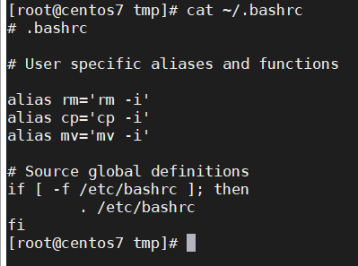

Lệnh trên lấy đối số "~/.bashrc" làm đầu vào tiêu chuẩn và xuất nội dung tệp ra ngoài màn hình

- Đầu vào tiêu chuẩn từ chuyển hướng

Đầu vào tiêu chuẩn cũng có thể đến từ toán tử chuyển hướng đầu vào được biểu thị bằng dấu "<". Ví dụ bạn có thể sử dụng chuyển hướng đầu vào để đạt được kết quả tương tự như trên

`cat < ~/.bashrc`

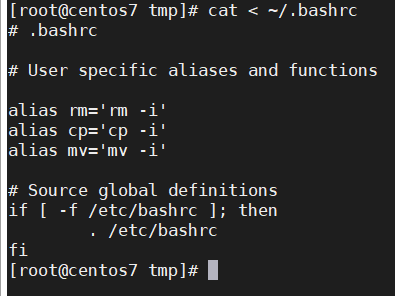

- Đầu vào tiêu chuẩn từ 1 đường ống

Ngoài việc cung cấp đầu vào tiêu chuẩn từ bàn phím hoặc từ 1 tệp bằng đối số hoặc chuyển hướng, bạn cũng có thể cung cấp từ toán tử "|" để truyền đầu vào từ đầu ra của 1 lệnh khác

Ví dụ:

`cat ~/.bashrc | grep alias`

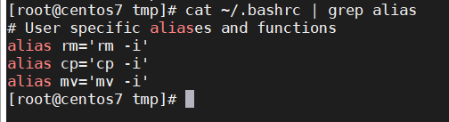

Chương trình đọc nội dung tệp ~/.bashrc sau đó lọc nhũng dòng có ký tự "alias" rồi xuất ra màn hình

#### Đầu ra tiêu chuẩn

Đầu ra tiêu chuẩn là 1 luồng được tiêu chuẩn hóa được gửi đến màn hình hiển thị theo mặc định

- Đầu ra tiêu chuẩn để hiển thị

Bạn có thể sử dụng đầu ra của hầu hết mọi lệnh để làm ví dụ về đầu ra tiêu chuẩn. Ở đây tôi sẽ sử dụng lệnh "stat" để lấy thông tin trạng thái về 1 tệp và hiển thị nó trên màn hình

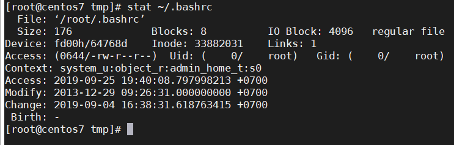

Như bạn có thể thấy lệnh stat lấy tên tệp làm đối số, thực hiện một số xử lý và sau đó hiển thị số liệu thống kê của tệp đó cho màn hình (stdout).

- Đầu ra tiêu chuẩn được chuyển hướng đến 1 tập tin

Bạn có thể chuyển hướng đầu ra tiêu chuẩn (thiết bị xuất chuẩn) sang một tệp. Điều này hữu ích nếu bạn muốn lưu kết quả đầu ra để sử dụng sau này hoặc dưới dạng nhật ký của tập lệnh.

Bạn có thể chuyển hướng đầu ra tiêu chuẩn đến một tệp bằng cách sử dụng toán tử chuyển hướng đầu ra được biểu thị bằng dấu lớn hơn ">". Ví dụ: bạn có thể lưu đầu ra của lệnh "stat" vào một tệp có tên output.txt như sau

`stat ~/.bashrc > output.txt`

Điều này tạo ra một tệp có tên output.txt và đặt đầu ra tiêu chuẩn (stdout) của lệnh stat vào nó. Chúng ta có thể xác minh điều này bằng cách đọc tập tin.

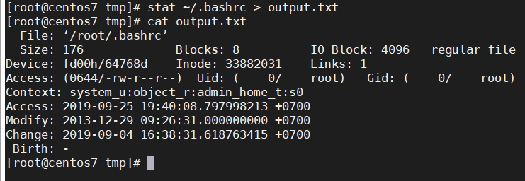

Sử dụng chuyển hướng đầu ra này sẽ ghi đè lên bất kỳ dữ liệu nào có thể tồn tại trong tệp. Sử dụng toán tử ">>" nếu bạn muốn ghi tiếp vào file thay vì ghi đè lên dữ liệu cũ.

- Đầu ra tiêu chuẩn thông qua đường ống

Đường ống gửi đầu ra từ lệnh này sang lệnh khác. Ở đây chúng ta sẽ chuyển đầu ra của lệnh "stat" thành đầu vào của "grep" để lọc thời gian sửa đổi lần cuối của tệp.

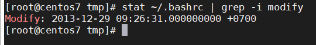

#### Lỗi tiêu chuẩn

Lỗi tiêu chuẩn là các thông báo lỗi từ 1 câu lệnh hoặc tiến trình.

- Lỗi tiêu chuẩn để hiển thị

Sai lầm chắc chắn sẽ dẫn đến 1 lỗi hiển thị trên màn hình nếu bạn sử dụng dòng lệnh thường xuyên. Đây là 1 ví dụ về lỗi tiêu chuẩn. Ở đây ta sẽ cung cấp cho lệnh "ls" 1 đối số không tồn tại

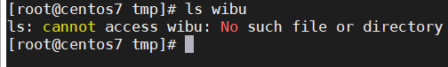

1 lỗi được hiển thị trên màn hình

- Lỗi tiêu chuẩn được chuyển hướng đến 1 tệp

Cũng giống như các luồng khác, bạn có thể chuyển hướng stderr đến một tệp. Thường được sử dụng trong các script, nhưng cũng rất dễ dàng để sử dụng cho bất cứ ai sử dụng dòng lệnh. Để chuyển hướng stderr, bạn có thể sử dụng toán tử chuyển hướng đầu ra ">" giống như những gì bạn làm với đầu ra tiêu chuẩn. Nhưng lần này, ta phải xác định rằng ta muốn chuyển hướng stderr bằng cách sử dụng bộ mô tả tệp. Như được hiển thị trong bảng và sơ đồ ở trên, bộ mô tả tệp cho stderr là 2. Vì vậy, ta sẽ chuyển hướng nó như sau

`ls wibu 2> errors.txt`

Tệp errors.txt hiện chứa các lỗi từ đầu ra của lệnh trên.

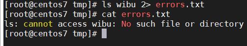

Như đã đề cập ở trên, sử dụng ">" sẽ dẫn đến ghi đè bất kỳ dữ liệu nào hiện có trong tệp. Để ghi thêm thay vì ghi đè, bạn phải sử dụng ">>"

- Lỗi tiêu chuẩn thông qua đường ống

Bạn không thể trực tiếp chuyển stderr sang lệnh khác. Đây là theo thiết kế để cho phép báo cáo lỗi hoàn toàn. Dưới đây là một ví dụ về việc thử (và không thành công) để chuyển stderr sang grep

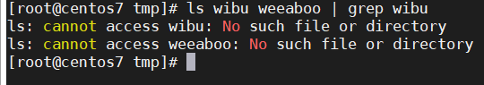

Lệnh "ls" in lỗi ra màn hình và lệnh "grep" hoạt động như thể nó không nhận được đầu vào.

Tuy nhiên, như với hầu hết mọi thứ trong Linux, có nhiều cách để hoàn thành cùng một nhiệm vụ. Bạn có thể chuyển hướng stderr sang đầu ra tiêu chuẩn bằng cách sử dụng bộ mô tả tệp của nó, sau đó chuyển nó qua grep.

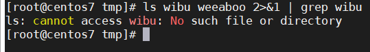

#### Chuyển hướng cả stdout và stderr

- Chuyển hướng sang các tệp khác nhau

Bạn có thể chuyển hướng stdout và stderr sang cấc tệp khác nhau, đây là 1 ví dụ

`ls wibu weeaboo thanh 1> output1.txt 2> errors1.txt`

Lệnh trên sẽ gửi stdout (1) tới output1.txt và stderr (2) tới errors1.txt. Ta có thể xác minh bằng cách đọc những tập tin đó.

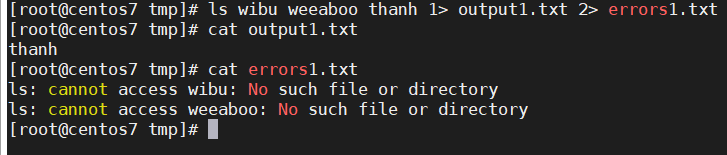

- Chuyển hướng sang cùng 1 tệp

Bạn có thể chuyển hướng cả stderr và stdout sang một tệp duy nhất nếu bạn muốn. Để làm điều này, chúng ta có thể chuyển hướng stderr sang stdout, sau đó stdout đến một tệp như sau

`ls wibu weeaboo thanh >alloutput.txt 2>&1`

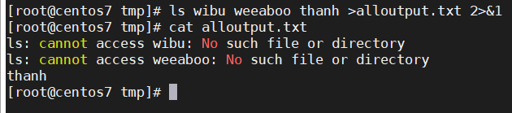

trong đó:

>alloutput.txt: Chuyển hướng luồng stdout đến tệp alloutput.txt. > là tốc ký cho 1>

2>&1: Điều này sử dụng hướng dẫn &> chuyển hướng. Hướng dẫn này cho phép bạn nói với shell để tạo một luồng đến cùng đích với luồng khác. Trong trường hợp này, ta đang nói luồng chuyển hướng stderr (2), đến cùng đích với luồng stdout (1), đang được chuyển hướng đến

- Sử dụng chuyển hướng vĩnh viễn trong script

Nếu bạn đang viết một tập lệnh và muốn chuyển hướng các luồng dữ liệu mà không nối thêm toán tử chuyển hướng hoặc mỗi dòng, bạn có thể sử dụng lệnh exec như thế này

```
#!/bin/bash
# Redirect all stdout to output.txt
exec 1> output.txt
# Redirect all stderr to errors.txt
exec 2> errors.txt
...
```