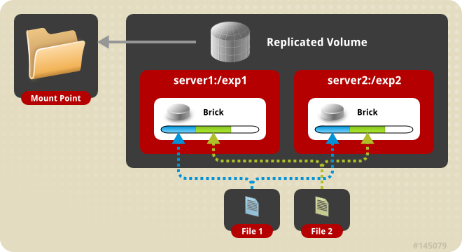
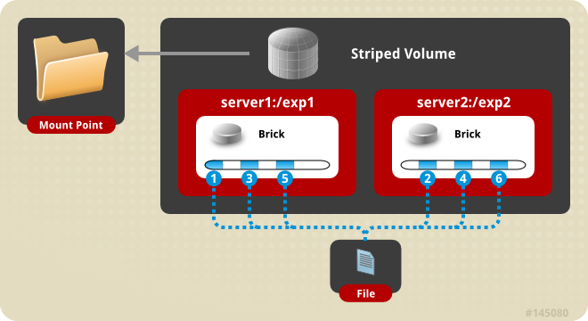

## Tìm hiểu về GlusterFS

Gluster là một hệ thống tập tin quy mô phân tán, cho phép cung cấp nhanh chóng dung lượng lưu trữ bổ sung dựa trên nhu cầu tiêu thụ lưu trữ của bạn. Đây là phần mềm dựa trên hệ thống tập tin. GlusterFS bao gồm hai phần; một là thành phần máy chủ và một là máy khách.

GlusterFS phần mềm mã nguồn mở cho phép mở rộng hệ thống lưu trữ file lên tới mức peta-byte và xử lý cùng lúc cho hàng ngàn client, nó có khả năng tập hợp các server lưu trữ khác nhau qua mạng Ethernet hoặc RDMA (Remote Direct Memory Access) kết nối thành một hệ thống lưu trữ tập tin lớn và song song. Trong nhiều trường hợp, GlusterFS được lựa chọn như một giải pháp phần mềm chi phí thấp thay thế cho SAN.

Phần cứng của Gluster yêu cầu khá thông dụng, từ máy chủ x86_64 của Dell, HP, IBM, SuperMicro hay kể cả Server lắp ráp, mỗi server phải có hệ thống DAS (các ổ cứng) tích hợp sẵn

GlusterFS được phát triển ban đầu bởi Gluster Inc, và sau đó bởi Redhat, là kết quả của việc mua lại.

#### Kiến trúc của GlusterFS

Dụa trên 4 yếu tố chính:

- Node: các máy chủ lưu trữ được cài đặt glusterfs

- Brick: là 1 folder/mount point/file system trên 1 node để chia sẻ với các node tin cậy khác trong hệ thống (trusted storage pool). Trên 1 node có thể có nhiều brick. Brick được dùng để gán (assign) các vùng dữ liệu (volume). Các brick trong 1 volume nên có dung lượng lưu trữ (size) bằng nhau


- Volume: là 1 khối logic chứa nhiều brick. Gluster đóng vai trò như 1 LVM (logical volume manager) bằng cách quản lý các brick phân tán trên các máy chủ như là 1 điểm kết nối lưu trữ duy nhất trên mạng


- Client: là các máy tính kết nối với hệ thống lưu trữ của gluster. Đó có thể là các Windows client chuẩn (thông qua CIFS), NFS client, hay sử dụng gluster client cải tiến hơn so với NFS, đặc biệt là tính sẵn sàng cao

#### Ưu điểm của GlusterFS

- Khả năng mở rộng: GlusterFS có khả năng tương thích linh hoạt với mức độ tăng trưởng của dữ liệu, có khả năng lưu trữ đến hàng nghìn Petabyte và lớn hơn.

- Tính linh hoạt: GlusterFS có thể sử dụng nhiều định dạng lưu trữ hệ thống như ext4, xfs…

- Đơn giản: Việc quản lý GlusterFS rất dễ dàng, được tách biệt khỏi kernel space và thực thi trên user space.

- Chi phí: GlusterFS có thể triển khai trên các hệ thống phần cứng thông thường mà không yêu cầu bất kỳ một thiết bị chuyên biệt nào.

- Nguồn mở: Hiện nay mã nguồn của GlusterFS vẫn được công khai và điều hành bởi Red Hat Inc.

#### Các Concept Volume cấu hình trong GlusterFS

Mỗi một concept volume đều có tính năng riêng, chúng có thể được kết hợp với nhau để tạo ra một concept mới. Tùy vào mục đích riêng của từng hệ thống mà người quản trị tạo các volume. Mỗi loại volume đều có ưu và nhược điểm riêng, vậy nên hãy tìm hiểu thật kĩ nhu cầu hệ thống của mình để xây dựng volume tối ưu và tránh các rủi ro dữ liệu.

- Distributed Glusterfs Volume

Với concept này, các files (data) sẽ được phân tán, lưu trữ rời rạc (distributed) trong các bricks khác nhau . Ví dụ, bạn có 100 files: file1, file2, file3…, file100. Thì file1, file2 lưu ở brick1, file3,4lưu ở brick2, etc. Việc phân bố các files trên brick dựa vào thuật toán hash, kiểu concept này tương tự JBOD


Ưu điểm: Mở rộng được dung lượng lưu trữ nhanh chóng và dễ dàng, tổng dung lượng lưu trữ của volume bằng tổng dung lượng của các brick.

Nhược điểm: Khi một trong các brick bị ngắt kết nối, hoặc bị lỗi thì dữ liệu sẽ bị mất hoặc không truy vấn được.

- Replicated Glusterfs Volume

Với concept này, dữ liệu sẽ được copy sang các bricks trong cùng một volume. Nhìn vào concept này chúng ta thấy rõ ưu điểm đó là dữ liệu sẽ có tính sẵn sàng cao và luôn trong trạng thái dự phòng tương tự Raid 1



Tổng dung lượng của volume sẽ chỉ bằng một dung lượng của một brick trong volume.

- Striped Glusterfs Volume

Với concept này, dữ liệu được chia nhỏ thành những phần khác nhau và lưu trữ ở những brick khác nhau trong volume. Loại concept này tương tự RAID 0.



Ưu điểm: Phù hợp với việc lưu trữ mà dữ liệu cần truy xuất với hiệu năng cao, đặc biệt là truy cập vào những tệp tin lớn.

Nhược điểm: Khi một trong những brick trong volume bị lỗi, thì volume đó không thể hoạt động được

- Distributed Replicated Glusterfs Volume

Concept này là sự kết hợp giữa Concept 1 (Distributed Glusterfs Volume) và Concept 2 (Replicated Glusterfs Volume).


Khi tạo thì tương tự với 1, nhưng chú ý với tùy chọn là (option) 2 replica. Tùy chọn này sẽ định nghĩa số lượng brick trong volume này sẽ là bội số của replica . Như ở ví dụ này, số lượng replica là 2, thì số lượng bricks sẽ là 4, 6, 8, …. Nếu số bricks = 2 thì nó sẽ trở thành Concept 2.

Ưu điểm là dữ liệu có tính sẵn sàng cao tuy nhiên nhược điểm là khi 1 volume có lỗi thì dữ liệu sẽ bị ảnh hưởng.

- Distributed Striped Glusterfs Volume

Kết hợp Concept 1 (Distributed Glusterfs Volume) và Concept 3 (Striped Glusterfs Volume). Số lượng bricks phải là bội của số striped count ở trong concept này.

Các file được phân tán trên các Brick nằm ở các Volume khác nhau. ỹ thuật này không có tính sẵn sàng của dữ liệu mà chỉ có tác dụng phân tán dữ liệu với tốc độ truy xuất nhanh.


Ở đây, stripe 4, tức lượng brick phải là 8, 12. Nếu lượng brick = strip = 4 thì Concept này sẽ trở thành Concept 3 (Striped Glusterfs Volume)

#### Cài đặt GlusterFS

- Chuẩn bị

Ta cần chuẩn bị 02 server cài đặt glusterfs để làm storage server và 01 client để kết nối vào và đặt tên như sau:

| Host Name | IP | OS | Mục đích |
| --- | --- | --- | --- |
| server1.example.com | 192.168.254.234 | CentOS 7 | Storage Node 1 |
| server2.example.com | 192.168.254.222 | CentOS 7 | Storage Node 2 |
| client.example.com | 192.168.254.202 | CentOS 7 | Client Machine |

- Định cấu hình DNS

Các thành phần GlusterFS sử dụng DNS cho độ phân giải tên, do đó, định cấu hình DNS hoặc thiết lập mục nhập máy chủ. Nếu bạn không có DNS trên môi trường của mình, hãy sửa đổi tệp /etc/hosts và cập nhật nó cho phù hợp.

```
sudo vi /etc/hosts

192.168.254.234 server1.example.com server1 
192.168.254.222 server2.example.com server2 
192.168.254.123 client.example.com client
```

- Thiết lập máy chủ GlusterFS

GlusterFS có sẵn trong kho lưu trữ của nhóm lợi ích đặc biệt lưu trữ CentOS. Cài đặt kho lưu trữ với lệnh này:

`yum -y install centos-release-gluster`

Sau đó cài đặt máy chủ GlusterFS như sau:

`yum -y install glusterfs-server`

Tạo các liên kết khởi động hệ thống cho trình nền Gluster và khởi động nó:

```
systemctl enable glusterd.service
systemctl start glusterd.service
```

Sau đó định cấu hình firewall:

```
firewall-cmd --permanent --zone=public --add-service=glusterfs
firewall-cmd --reload
```

Tiếp theo, chúng ta phải thêm server2.example.com vào nhóm lưu trữ đáng tin cậy (xin lưu ý rằng tôi đang chạy tất cả các lệnh cấu hình GlusterFS từ server1.example.com, nhưng bạn cũng có thể chạy chúng trên server2.example.com vì cấu hình được thay thế giữa các nút GlusterFS - chỉ cần đảm bảo bạn sử dụng đúng tên máy chủ hoặc địa chỉ IP):

Trên server1.example.com, hãy chạy:

`gluster peer probe server2.example.com`

kết quả:


Kiểm tra trạng thái của nhóm lưu trữ đáng tin cậy:

`gluster peer status`


Tiếp theo, chúng tôi tạo chia sẻ có tên "testvol" với hai bản sao (xin lưu ý rằng số lượng bản sao bằng với số lượng máy chủ trong trường hợp này vì chúng tôi muốn thiết lập phản chiếu) trên server1.example.com và server2.example.com trong thư mục /data (cái này sẽ được tạo nếu nó không tồn tại):

`gluster volume create testvol replica 2 transport tcp server1.example.com:/data server2.example.com:/data force`


Start volume:

`gluster volume start testvol`


Kiểm tra trạng thái của volume bằng lệnh:

`gluster volume info`


Theo mặc định, tất cả các máy khách có thể kết nối với volume. Nếu bạn chỉ muốn cấp quyền truy cập cho client.example.com (ip 192.168.254.123), hãy chạy:

`gluster volume set testvol auth.allow 192.168.254.123`


> Xin lưu ý rằng có thể sử dụng ký tự đại diện cho các địa chỉ IP (như 192.168.* ) Và bạn có thể chỉ định nhiều địa chỉ IP được phân tách bằng dấu phẩy (ví dụ: 192.168.1.10,192.168.1.11).

Tắt chức năng *ctime* của volume:

`gluster volume set testvol ctime off`

- Thiết lập máy khách GlusterFS

Trên máy khách, ta có thể cài đặt ứng dụng GlusterFS như sau:

`yum -y install glusterfs-client`

Sau đó, tạo thư mục sau:

`mkdir /mnt/glusterfs`

Bây giờ chúng ta có thể gắn hệ thống tập tin GlusterFS vào /mnt/glusterfs bằng lệnh sau:

`mount.glusterfs server1.example.com:/testvol /mnt/glusterfs`

Kiểm tra với lệnh `df -h`


- Thiết lập tự động mount trên máy khách

Thêm dòng sau vào tệp /etc/fstab

`vi /etc/fstab`

`server1.example.com:/testvol /mnt/glusterfs glusterfs defaults,_netdev 0 0`

Hoặc :

Thêm lệnh mount vào tập tin /etc/rc.local

Mở /etc/rc.local và nối dòng sau:

```
/usr/sbin/mount.glusterfs server1.example.com:/testvol /mnt/glusterfs
```

