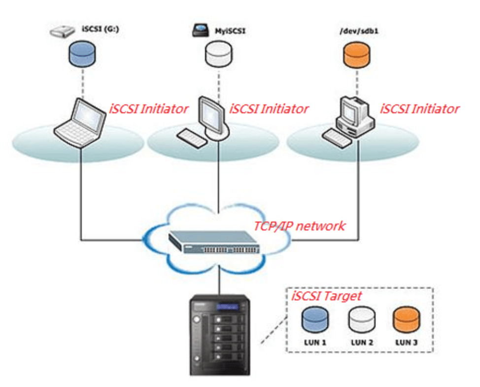

## Tìm hiểu về iSCSI

iSCSI là từ viết tắt của Internet Small Computer Systems Interface. Nó là một giao thức lớp vận chuyển hoạt động trên giao thức TCP (Transport Control Protocol). Nó cho phép truyền dữ liệu SCSI ở block-level giữa iSCSI initiator và storage target trên các mạng TCP/IP. iSCSI hỗ trợ mã hóa các gói mạng và giải mã khi đến đích.

Giao thức này sử dụng các initiator để gửi các lệnh SCSI đến thiết bị lưu trữ đích (storage target) trên các máy chủ từ xa. Storage target có thể là SAN, NAS, bộ lưu trữ tape, máy chủ đa năng – cả SSD và HDD – LUN hoặc các loại khác. Giao thức này cho phép các quản trị viên khai thác tốt hơn các loại hình lưu trữ được chia sẻ bằng cách cho phép máy chủ lưu trữ dữ liệu vào bộ lưu trữ được kết nối qua mạng từ xa và ảo hóa thành phần lưu trữ từ xa cho các ứng dụng yêu cầu lưu trữ trực tiếp.

iSCSI sử dụng không gian lưu trữ ảo như VHD’s trong Windows Server Storage hay LUN trên Linux , giảm chi phí khi tận dụng hạ tầng LAN sẵn có (các thiết bị mạng, Swich ,… trên nền IP). iSCSI chủ yếu cạnh tranh với Fibre Channel, nhưng khác với Fibre Channel truyền thống, thường đòi hỏi cáp chuyên dụng, iSCSI có thể chạy trên các khoảng cách xa bằng cách sử dụng hạ tầng mạng hiện có.

#### Các thành phần của iSCSI



Một giao tiếp kết nối iSCSI sẽ bao gồm 2 thành phần chính sau:

- iSCSI initator (iSCSI Initiator Node): là thiết bị client trong kiến trúc hệ thống lưu trữ qua mạng. iSCSI Initiator sẽ kết nối đến máy chủ iSCSI Target và truyền tải các lệnh SCSI thông qua đường truyền mạng TCP/IP. iSCSI Initiator có thể được khởi chạy từ chương trình phần mềm trên OS hoặc phần cứng thiết bị hỗ trợ iSCSI.

- iSCSI Target: thường sẽ là một máy chủ lưu trữ (storage) có thể là hệ thống NAS chẳng hạn. Từ máy chủ iSCSI Target sẽ tiếp nhận các request gửi từ iSCSI Initiator gửi đến và gửi trả dữ liệu trở về. Trên iSCSI Target sẽ quản lý các ổ đĩa iSCSI với các tên gọi LUN (Logical Unit Number) được dùng để chia sẻ ổ đĩa lưu trữ iSCSI với phía iSCSI Client.

> Kết luận: Máy tính nào chia sẻ vùng lưu trữ (storage) thì được gọi là iSCSI Target. Máy tính nào yêu cầu sử dụng vùng lưu trữ sẽ được gọi là iSCSI Initiator.

#### Hoạt động của iSCSI


- Máy tính client sẽ khởi tạo request yêu cầu truy xuất dữ liệu trong hệ thống lưu trữ (storage) ở máy chủ iSCSI Target

- Lúc này hệ thống iSCSI Initiator sẽ tạo ra một số lệnh SCSI tương ứng với yêu càu của client

- Các lệnh SCSI và thông tin liên quan sẽ được đóng gói trong gói tin iSCSI Protocol Data Unit (iSCSI PDU). Thông tin PDU được sử dụng cho kết nối giữa Initiator và Target với các thông tin nhắm xác định node, kết nối, thiết lập session, truyền tải lệnh iSCSI và truyền dữ liệu


- Sau đó PDU được đóng gói trong mô hình TCP/IP và truyền tải qua mạng network đến máy chủ iSCSI Target


- Máy chủ iSCSI Target nhận được gói tin và tiến hành mở gói tin để kiểm tra phần PDU nhằm trích xuất các thông tin lệnh SCSI cùng các nội dung liên quan

- Sau đó lệnh SCSI sẽ được đưa vào SCSI Controller để thực thi và xử lý theo yêu cầu. Đến cuối cùng iSCSI Target sẽ gửi trả thông tin iSCSI response. Từ đó cho phép block data lưu trữ được truyền tải giữa Initiator và Target

#### Ưu điểm của iSCSI

- Chi phí rẻ hơn so với việc đầu tư hệ thống lưu trữ Fibre Channel

- Tạo và quản lý được nhiều ổ cứng cho nhiều máy tính nội-ngoại mạng(VPN)

- Gián tiếp mở rộng dung lượng lưu trữ cho các máy tính nội-ngoại mạng(VPN)

- Là một giao thức dựa trên IP, iSCSI tận dụng lợi ích của TCP/IP và Ethernet

- Đặc biệt hiệu quả khi sử dụng với card mạng Ethernet 10G phổ biến

- Hiển thị y hệt ổ cứng trong máy, thân thiện với người dùng phổ thông

- Kết nối rất nhanh, không cần qua nhiều bước

- Thích hợp cho doanh nghiệp quản lý dữ liệu của máy nhân viên

#### Hạn chế của iSCSI

- Việc triển khai iSCSI không phải quá khó, đặc biệt là với các giao thức được xác định bằng phần mềm. Nhưng việc cấu hình initiator và iSCSI target cần thêm các bước, và kết nối 10 GbE là điều cần thiết để đạt hiệu suất cao. Kinh nghiệm để đạt lưu lượng truyền dẫn cao là chạy iSCSI traffic trên một mạng vật lý riêng hoặc mạng LAN ảo riêng biệt.

- Bảo mật là một mối quan tâm khác, vì iSCSI dễ bị “sniffing” các packet. Packet sniffing là loại cyberattack trong đó phần mềm độc hại hoặc thiết bị của bên tấn công nắm bắt các gói di chuyển trên một mạng dễ bị tấn công. Quản trị viên có thể thực hiện các biện pháp bảo mật để ngăn chặn điều này, nhưng nhiều quản trị viên trong các công ty nhỏ bỏ qua các biện pháp bảo mật cần thiết để đơn giản hóa việc quản lý iSCSI. Các biện pháp phòng vệ chính chống lại kiểu tấn công này là Challenge-Handshake Authentication Protocol (CHAP) và Internet Protocol Security (IPsec), cả hai đều dành riêng cho iSCSI. Các biện pháp bảo mật iSCSI bổ sung bao gồm sử dụng danh sách kiểm soát truy cập (ACL) để kiểm soát truy cập dữ liệu người dùng và bảng điều khiển quản lý an toàn.

#### Hiệu suất iSCSI

Hiệu suất của iSCSI phụ thuộc nhiều vào các công nghệ cơ bản như 10 Gigabit Ethernet (10 GbE) và công nghệ bridging trong trung tâm dữ liệu.

- 10 GbE. Tốc độ kết nối mạng Ethernet có tác động lớn nhất đến hiệu suất của iSCSI. Mặc dù các mạng nhỏ hơn như 1 GbE vẫn có thể chạy các giao thức iSCSI, nhưng tốc độ chậm hơn, và chúng không đủ cho các trung tâm dữ liệu cỡ vừa hoặc của doanh nghiệp. Quản trị viên có thể tăng một số hiệu suất trên mạng phụ 10 GbE bằng cách thêm nhiều NIC, nhưng một thiết bị switch duy nhất sẽ không tăng tốc độ cho nhiều cổng iSCSI. 10 GbE là tốc độ được đề nghị cho môi trường lưu trữ doanh nghiệp. Thay vào đó, việc thêm các adapter chuẩn máy chủ sẽ tăng tốc các gói iSCSI đi qua mạng 10 GbE.

- Bridging Data Center. Bridging là một bộ các phần mở rộng Ethernet bảo vệ lưu lượng SCSI chống mất dữ liệu. Điều này cho phép iSCSI cạnh tranh với Fibre Channel, chuẩn có độ tin cậy cao, đã chạy qua các kết nối không mất dữ liệu trong nhiều năm.

- Multipathing. Multipathing  I/O tăng tốc các gói mạng iSCSI và hầu hết các hệ điều hành đều hỗ trợ công nghệ này. Các tính năng đa luồng iSCSI điển hình gán nhiều địa chỉ cho một phiên iSCSI duy nhất, giúp tăng tốc vận chuyển dữ liệu.

- Jumbo frames. Các frame có kích thước 9000 byte này làm giảm tắc nghẽn trên các mạng Ethernet chậm không sử dụng 10 GbE, giúp tăng hiệu suất khoảng 10-20%. Jumbo frames sẽ không tăng nhiều hiệu suất trong 10 GbE.

#### Cài đặt iSCSI

- Chuẩn bị


Target: server1.example.com

Địa chỉ IP: 192.168.254.234

OS: CentOS Linux release 7.7.1908 (Core)

Initiator: client.example.com

Địa chỉ IP: 192.168.254.123

OS: CentOS Linux release 7.7.1908 (Core)

- Trên máy Target

Add thêm ổ đĩa SCSI 10GB

Tạo Partiton mới bằng công cụ fdisk và chọn kiểu phân vùng LVM:

`fdisk -l | grep -i sd`


Từ đầu ra ở trên, bạn có thể thấy rằng hệ thống của tôi có 10GB đĩa (/dev/sdb). Tôi sẽ tạo một phân vùng 5GB trên đĩa trên và sẽ sử dụng nó cho LVM:

```
fdisk /dev/sdb
...
Command (m for help): n ----> Phân vùng mới
...
Partition number (1-4, default 1): 1 ----> Số phân vùng
First sector (2048-20971519, default 2048): Enter
...
Last sector, +sectors or +size{K,M,G} (2048-20971519, default 20971519): +5G ----> Tạo phân vùng 5GB
...
Command (m for help): t ----> Thay đổi label
...
Hex code (type L to list all codes): 8e ---> Thay đổi thành LVM label
...
Command (m for help): w ---> Lưu lại
...
```

Tạo một phân vùng với LVM  /dev/sdb1 (thay thế /dev/sdb1 bằng tên đĩa của bạn):

```
pvcreate /dev/sdb1
vgcreate vg_iscsi /dev/sdb1
lvcreate -l 100%FREE -n lv_iscsi vg_iscsi
```


Cập nhật bảng phân vùng:

`partprobe`

Xác thực phân vùng mới:

`ls -l / dev / sd *`


- Cấu hình iSCSI Target

Ở đây, tôi sẽ cấu hình iSCSI mà không cần xác thực CHAP. Cài đặt gói targetcli trên máy chủ:

`yum install targetcli -y`

Khi bạn đã cài đặt xong, hãy nhập lệnh dưới đây để CLI iSCSI cho một dấu nhắc tương tác:

`targetcli`

Bây giờ sử dụng một volume logic hiện có (/dev/vg_iscsi/lv_iscsi ) làm kho lưu trữ kiểu khối cho đối tượng lưu trữ scsi_disk1_server:

```
cd backstores/block
create scsi_disk1_server /dev/vg_iscsi/lv_iscsi
```


Tạo target:

```
cd /iscsi
create iqn.2019-10.com.example.server1:disk1
```


Tạo ACL cho máy khách (Đó là IQN mà Initiator sử dụng để kết nối):

```
cd /iscsi/iqn.2019-10.com.example.server1:disk1/tpg1/acls
create iqn.2019-10.com.example.server1:initiator1initiator2
```


Tạo LUN dưới target. LUN nên sử dụng đối tượng lưu trữ sao lưu được đề cập trước đây có tên "scsi_disk1_server":

```
cd /iscsi/iqn.2019-10.com.example.server1:disk1/tpg1/luns
create /backstores/block/scsi_disk1_server
```


Xác nhận cấu hình máy chủ target:

```
cd /
ls
```


Lưu lại và thoát:

```
saveconfig
exit
```

Kích hoạt và khởi động lại target service:

```
systemctl enable target.service
systemctl restart target.service
```

Cấu hình tường lửa để cho phép lưu lượng iSCSI đi qua:

```
firewall-cmd --add-port=3260/tcp --permanent
firewall-cmd --reload
```

- Cấu hình Initiator:

Bây giờ, đã đến lúc cấu hình node để sử dụng target đã tạo làm bộ nhớ. Cài đặt gói dưới đây trên máy Initiator (node1):

`yum install iscsi-initiator-utils -y`

Chỉnh sửa tập tin initiatorname.iscsi:

```
vi /etc/iscsi/initiatorname.iscsi
InitiatorName=iqn.2019-10.com.example.server1:initiator1initiator2
```

Sử dụng lệnh để target:

`iscsiadm -m discovery -t st -p 192.168.254.234`


Khởi động lại initiator service:

```
systemctl restart iscsid.service
systemctl enable iscsid.service
```

Đăng nhập đến Target:

`iscsiadm -m node -T iqn.2019-10.com.example.server1:disk1 -p 192.168.254.234 -l`


- Tạo hệ thống tập tin trên đĩa iSCSI:

Liệt kê các đĩa đính kèm:

`cat /proc/partitions`


Định dạng đĩa mới (ở đây tôi đã định dạng toàn bộ đĩa thay vì tạo phân vùng):

`mkfs.xfs /dev/sdb`


Mount đĩa:

`mount /dev/sdb /mnt`

Xác nhận đĩa được gắn kết bằng lệnh dưới đây:

`df -hT`


- Automount iSCSI storage:

Để tự động mount bộ nhớ iSCSI mỗi lần khởi động lại, bạn cần tạo một mục trong tệp /etc/fstab:

Trước khi cập nhật tệp /etc/fstab, hãy lấy UUID của đĩa iSCSI bằng lệnh sau. Thay thế /dev/sdb bằng tên đĩa iSCSI của bạn:

`blkid /dev/sdb`


Bây giờ, chỉnh sửa tập tin /etc/fstab:

`vi /etc/fstab`

Thêm một mục như dưới đây:

`UUID=9a0c8c18-007f-40d7-875a-c9e9b98e580b /mnt		xfs		_netdev		0 0`

- Remove iSCSI storage:

Trong trường hợp bạn muốn hủy gắn đĩa đã thêm, hãy ngắt gắn kết và đăng xuất:

```
umount /mnt/
iscsiadm -m node -T iqn.2019-19.com.example.server1:disk1 -p 192.168.254.234 -u
```