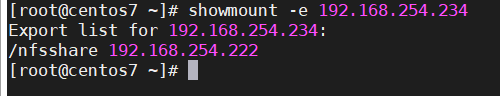
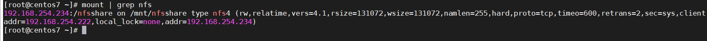
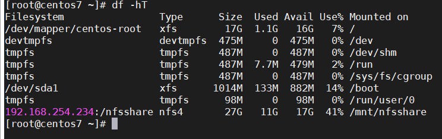

## Tìm hiểu về nfs

NFS (Network file system) là 1 giao thức cho phép lưu trữ và truy xuất dữ liệu từ nhiều đĩa và thư mục trên 1 mạng chia sẻ.

NFS cho phép người dùng hoặc quản trị viên hệ thống gắn kết (chỉ định là có thể truy cập) tất cả hoặc 1 phần của hệ thống tệp trên máy chủ. Các phần của hệ thống tệp được gắn kết có thể được truy cập bởi các máy client với bất kỳ đặc quyền nào được gán cho mỗi tệp (chỉ đọc hoặc đọc-ghi). NFS sử dụng Remote Procedure Calls (RPCs) để định tuyến các yêu cầu giữa client và server.

NFS có nguồn gốc từ cơ chế hệ thống tệp phân tán. Nó thường được thực hiện trong các môi trường điện toán trong đó việc quản lý tập trung dữ liệu và tài nguyên là rất quan trọng.

NFS được triển khai theo mô hình điện toán client - server, trong đó một máy chủ NFS quản lý xác thực, ủy quyền và quản lý máy khách, cũng như tất cả dữ liệu được chia sẻ trong một hệ thống tệp cụ thể. Khi được ủy quyền, client có thể xem và truy cập dữ liệu thông qua các hệ thống cục bộ giống như họ truy cập dữ liệu từ ổ đĩa bên trong máy.

NFS ban đầu được phát triển bởi Sun microsystems vào những năm 1980 và hiện được quản lý bởi IETF.

Hiện tại NFS có 4 phiên bản. NFSv4 là phiên bản đang được sử dụng nhiều nhất và hỗ trợ phát huy tối đa của giao thức NFS.

#### Ưu điểm của NFS

Chi phí thấp, dễ cài đặt vì nó sử dụng cơ sở hạn tầng IP hiện có.

NFS cho phép quản lý tập trung, giảm nhu cầu thêm phần mềm và dưng lượng đĩa trên các hệ thống người dùng cá nhân.

Thân thiện với người dùng, cho phép người dùng truy cập các tệp trên máy chủ từ xa giống như cách họ truy cập các tệp cục bộ

#### Nhược điểm của NFS

NFS dựa trên các RPC vốn không an toàn và chỉ nên được sử dụng trên 1 mạng đáng tin cậy đằng sau tường lửa.

Một số đánh giá về NFSv4 và NFSv4.1 cho thấy các phiên bản này có băng thông và khả năng mở rộng hạn chế (được cải thiện với NFSv4.2) và NFS bị chậm trong khi lưu lượng mạng lớn

Dữ liệu phân tán có thể bị phá vỡ nếu có nhiều phiên sử dụng đồng thời

#### Các file cấu hình quan trọng của NFS

/etc/exports : Đây là file config chính của NFS, chứa thông tin danh sách các file và thư mục chia sẻ trên NFS Server.

/etc/fstab : Để tự động mount một thư mục NFS trên hệ thống của bạn khi reboot.

/etc/sysconfig/nfs : File config của NFS để quản lý port đang lắng nghe của rpc và các service khác.

#### Cài đặt trên CentOS 7

Requirements:

- Server:

```
CentOS 7
ip: 192.168.254.234
```

- Client:

```
CentOS 7
ip: 192.168.254.222
```

Cài đặt:

- Định cấu hình firewall

Mở các cổng SSH và NFS để đảm bảo rằng bạn có thể kết nối với máy chủ bằng ssh cho mục đích quản trị và bằng nfs từ client nfs

```
firewall-cmd --permanent --zone=public --add-service=ssh
firewall-cmd --permanent --zone=public --add-service=nfs
firewall-cmd --reload
```

- Cài đặt nfs

Trên server:

`yum install -y nfs-utils`

Sau đó kích hoạt và bắt đầu dịch vụ máy chủ nfs.

```
systemctl start nfs-server.service
systemctl enable nfs-server.service
```

Trên phía client:

`yum install -y nfs-utils`

- Tạo thư mục chia sẻ trên server

Bây giờ, hãy tạo một thư mục để chia sẻ với máy khách NFS. Ở đây tôi sẽ tạo một thư mục mới có tên nfsshare trong phân vùng /

`mkdir /nfsshare`

Cho phép máy khách NFS đọc và ghi vào thư mục đã tạo

`chmod 777 /nfsshare/`

Sử dụng exports để khai báo phân vùng sử dụng NFS share

`vi /etc/exports`

Sau đó thêm vào

```
/nfsshare 192.168.254.222(rw,sync,no_root_squash,no_subtree_check)
```

trong đó:

rw: Tùy chọn này cho phép client truy cập cả đọc và ghi vào đĩa (volume)

sync: Tùy chọn này bắt buộc NFS phải ghi các thay đổi vào đĩa trước khi phản hồi. Điều này dẫn đến một môi trường ổn định và phù hợp hơn khi phản ánh tình trạng thực tế của đĩa (volume) từ xa. Tuy nhiên, nó cũng làm giảm tốc độ của hoạt động tập tin.

no_subtree_check: tùy chọn này bỏ qua việc kiểm tra cây con, đó là một quá trình mà host phải kiểm tra xem các tập tin thực sự vẫn có sẵn trong cây xuất cho mỗi yêu cầu

no_root_squash: Theo mặc định, NFS chuyển yêu cầu từ người dùng root từ xa vào một người dùng không có đặc quyền trên máy chủ. Điều này như là tính năng bảo mật để ngăn chặn một tài khoản root trên máy khách (client) sử dụng hệ thống tập tin của máy chủ như là root.

Bất cứ khi nào chúng ta chỉnh sửa /etc/exports, hãy chạy lệnh sau:

`exportfs -a`

Thêm các rule sau vào firewall trên máy chủ nfs để cho phép máy khách truy cập vào chia sẻ nfs

```
firewall-cmd --permanent --add-service mountd
firewall-cmd --permanent --add-service rpc-bind
firewall-cmd --reload
```

- Mount NFS share trên client

Trước khi mount, hãy kiểm tra các chia sẻ NFS có sẵn trên máy chủ NFS bằng cách chạy lệnh sau trên máy khách NFS:

`showmount -e 192.168.254.234`

> Thay thế địa chỉ IP bằng địa chỉ IP máy chủ NFS hoặc tên máy chủ của bạn

kết quả:



Bây giờ, tạo một thư mục trên máy khách NFS để gắn kết NFS share /nfsshare mà chúng ta đã tạo trong máy chủ NFS

`mkdir /mnt/nfsshare`

Sử dụng lệnh bên dưới để gắn kết NFS share /nfsshare từ máy chủ NFS 192.168.254.234 trong /mnt/nfsshare trên máy khách NFS

`mount 192.168.254.234:/nfsshare /mnt/nfsshare`

Xác nhận chia sẻ được gắn trên máy khách NFS bằng lệnh mount

`mount | grep nfs`



Ngoài ra, bạn có thể sử dụng lệnh `df -hT` để kiểm tra chia sẻ NFS được gắn kết



Tạo một tệp trên thư mục được gắn để xác minh quyền truy cập đọc và ghi trên chia sẻ NFS

`touch /mnt/nfsshare/test`

Nếu lệnh trên trả về không có lỗi, bạn đã thiết lập thành công NFS.

- Automount NFS share

Để tự động mount nfs mỗi lần khởi động lại, bạn sẽ cần sửa đổi tệp /etc/fstab trên máy khách NFS

`vi /etc/fstab`

Thêm vào dòng sau:

```
192.168.254.234:/nfsshare /mnt/nfsshare    nfs     nosuid,rw,sync,hard,intr  0  0
```

Lưu và đóng tập tin

Khởi động lại máy khách nfs

> Nếu bạn muốn ngắt kết nối thư mục được chia sẻ đó khỏi máy khách NFS của bạn sau khi bạn hoàn thành việc chia sẻ tệp, bạn có thể ngắt kết nối thư mục cụ thể đó bằng lệnh `umount`