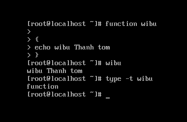
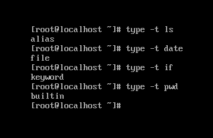
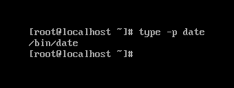
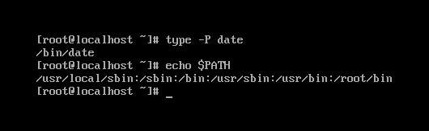
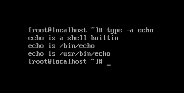
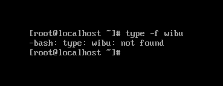
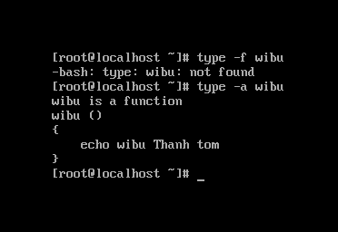

## Câu lệnh type để phân biệt các command trên Linux

Lệnh `type`  trên Linux được dùng để hiển thị thông tin về các lệnh khác được nhập. Nó được hiển thị nếu lệnh được nhập là 1 trong các loại sau:

```
alias
keyword
function
builtin
file
```

Để tìm ra loại lệnh được nhập vào, ta có thể dùng cú pháp sau `type -t [lệnh]`

Ví dụ lệnh `-t`:

| Command  | Output | Ý nghĩa |
| --- | --- | --- |
| `type -t ls` | alias | Lệnh `ls` là alias, có thể được xác minh bằng cách nhập chính nó tại dấu nhắc shell: `alias` |
| `type -t date` | file | lệnh `date` là một tệp đĩa (lệnh bên ngoài), có thể được xác minh bằng cách gõ `which date` tại dấu nhắc shell |
| `type -t if` | keyword | if là 1 từ dành riêng dùng để kiểm soát dòng chảy |
| `type -t pwd` | builtin | pwd là 1 lệnh shell dựng sẵn |
| `type -t wibu` | function | wibu là 1 hàm do người dùng định nghĩa, có thể dùng cú pháp sau: `function name { COMMANDS ; }` |





Tùy chọn `-p`:

Lệnh của tệp đĩa sẽ được thực thi. Nói cách khác, đường dẫn tuyệt đối của lệnh.

Ví dụ:



Tùy chọn `-P`: 

Buộc tìm kiếm PATH cho mỗi lệnh / NAME, ngay cả khi đó là alias, function hoặc builtin và trả về tên của tệp đĩa sẽ được thực thi. (Chúng ta có thể nhận giá trị môi trường PATH bằng cách sử dụng lệnh `echo $PATH`)

**LƯU Ý**: Trong ví dụ dưới đây, lệnh `date` đã được tìm kiếm trong tất cả các thư mục được liệt kê trong PATH (Bộ môi trường). Và tìm thấy lệnh date trong /bin



Tùy chọn `-a`: 

Nó hiển thị tất cả các vị trí có lệnh hoặc NAME. Nó bao gồm các alias, builtin và function (chỉ trong trường hợp nếu tùy chọn `-p` không được sử dụng)



Tùy chọn `-f`

Tùy chọn `-f` chặn chức năng tra cứu hàm shell.

Ví dụ:



**Lưu ý**: lệnh `wibu` là một hàm do người dùng xác định. Khi chúng ta sử dụng `type -a wibu`, đầu ra sẽ hiển thị các hàm được xác định. Trong ví dụ trên, tùy chọn `-f` sẽ triệt tiêu hàm.

