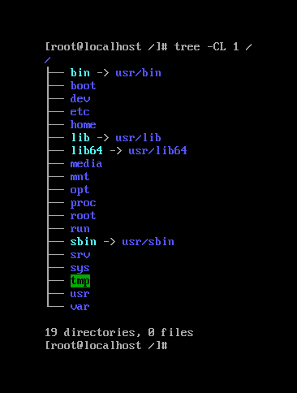

## File system trong Linux. Cấu trúc thư mục phân cấp trong Linux.

#### Nói đơn giản FileSystem là thứ xác định các cách thức tổ chức, quản lý dữ liệu hay có thể nói là cách thức quản lý cách dữ liệu được đọc và lưu trên thiết bị. File system cho phép người dùng truy cập nhanh chóng và an toàn khi vào các tệp tin thư mục khi cần thiết.

#### Những loại FileSystem được Linux hỗ trợ:

- FileSystem cơ bản: ext2, ext3, ext4, XFS, Btrfs, JFS, NTFS v.v.
- FileSystem dành cho dạng lưu trữ Flash (Thẻ nhớ các thứ..): ubifs, JFFS2, YAFFS v.v.
- FileSystem dành cho cơ sở dữ liệu.
- Filesystem mục đích đặc biệt: procfs, sysfs, tmpfs, squashfs, debugfs,…

Một phân vùng là một vùng chứa trong đó có một filesystem được lưu trữ , trong một số trường hợp thì filesystem có thể mở rộng hơn một phân vùng nếu filesystem sử dụng các liên kết.

#### So sánh giữa hệ thống file (FileSystem) giữa Window và Linux

| | Window | Linux |
| --- | --- | --- |
| Phân vùng | Disk1 | /dev/sda1 |
| Loại Filesystem | NTFS/VFAT | EXT2/EXT3/EXT4/XFS/BTRFS… |
| Mounting Parameters | Drive Letter | Mount Point |
| Thư mục gốc | C:\ | / |

#### So sánh một số file system trong Linux

- ext2: hệ thống tập tin mở rộng thứ 2. Hệ thống tệp mở rộng, ext, được triển khai trong Linux vào năm 1992 là hệ thống tệp đầu tiên được thiết kế dành riêng cho Linux. Hệ thống tập tin ext2 là hệ thống tập tin mở rộng thứ hai. Nó là hệ thống tập tin mặc định trong nhiều bản phân phối Linux trong nhiều năm. Các tính năng của ext2 là:

	- Được phát triển bởi Rémy Card
	- Được giới thiệu vào tháng 1 năm 1993
	- Được phát triển để khắc phục, thay thế cho hệ thống tệp mở rộng ext
	- Ext2 không có tính năng ghi nhật ký
	- Trên các ổ đĩa flash, ổ đĩa USB , ext2 được khuyến nghị, vì nó không cần phải làm quá trình ghi nhật ký
	- Kích thước tệp tối đa: 16GiB - 2TiB, tùy thuộc vào kích thước khối (1K, 2K, 4K hoặc 8K) (1TiB = 1024 GiB)
	- Kích thước hệ thống tệp tối đa: 2TiB - 32TiB
	- Độ dài tên tệp tối đa: 255 byte (255 ký tự)
	- Số lượng tệp tối đa: 10 ^ 18
	- Tên tệp: Tất cả các ký tự ngoại trừ NULL ('\ 0') và '/' được cho phép trong một tên tệp
	- Phạm vi ngày: 14 tháng 12 năm 1901 - 18 tháng 1 năm 2038

- ext3: Với ext3, khái niệm viết nhật ký đã được giới thiệu. Với hệ thống tập tin ext2, khi hệ thống gặp sự cố hoặc xảy ra sự cố mất điện, toàn bộ hệ thống tập tin cần phải được kiểm tra về tính nhất quán và các khối xấu. Với ghi nhật ký, hệ thống tệp theo dõi các thay đổi được thực hiện trong hệ thống tệp trước khi commit chúng với hệ thống tệp. Những thay đổi này được lưu trữ tại một vị trí được chỉ định trong một khu vực dành riêng của hệ thống tập tin. Vì vậy, trong trường hợp mất điện hoặc sự cố hệ thống, các hệ thống tập tin có thể được đưa trở lại nhanh chóng. Hệ thống tập tin ext3 hoàn toàn tương thích với phiên bản trước đó, tức là hệ thống tập tin ext2. Các tính năng khác là:

	- Được phát triển bởi Stephen Tweedie 
	- Được giới thiệu vào tháng 11 năm 2001 (với Linux 2.4.15) 
	- Hệ thống tập tin được ghi nhật ký. 
	- Một hệ thống tập tin ext2 có thể được chuyển đổi thành ext3 mà không cần sao lưu. 
	- Kích thước tệp tối đa: 16GiB - 2TiB 
	- Kích thước hệ thống tệp tối đa: 4TiB - 32TiB 
	- Độ dài tên tệp tối đa: 255 byte (255 ký tự) 
	- Số lượng tệp tối đa: Variable
	- Tên tệp: Tất cả các ký tự trừ NULL ('\ 0') và '/' được phép 
	- Phạm vi ngày: 14 tháng 12 năm 1901 - 18 tháng 1 năm 2038

- Hệ thống tệp ext4, được phát triển như một phần mở rộng cho ext3 là hệ thống tệp mới nhất trong chuỗi các hệ thống tệp mở rộng (ext). Nó có nhiều cải tiến hiệu suất so với ext3. Trong hầu hết các distro hiện đại, hệ thống tập tin mặc định là ext4. Các tính năng là:

	- Nhà phát triển: Mingming Cao, Andreas Dilger, Alex Zhuravlev (Tomas), Dave Kleikamp, ​​Theodore Ts'o, Eric Sandeen, Sam Naghreezeh và những người khác (từ wikipedia.org) 
	- Được giới thiệu vào tháng 10 năm 2008 (ổn định) 
	- Hệ thống tập tin được ghi lại 
	- Cải tiến hiệu suất hơn người tiền nhiệm của nó (ext3) 
	- Kích thước tệp tối đa: 16GiB - 16TiB 
	- Kích thước tối đa hệ thống tập tin: 1EiB (exbibyte) (1Eib = 1024PiB, 1PiB = 1024TiB, 1TiB = 1024GiB) 
	- chiều dài tối đa filename: 255 byte (255 ký tự) 
	- số lượng tối đa của các tệp: 4 tỷ 
	- Tên tệp: Tất cả các ký tự ngoại trừ NULL ('\ 0') và '/' đều được phép 
	- Phạm vi ngày: 14 tháng 12 năm 1901 - 10 tháng 5 năm 2446

Bảng tóm tắt:

| Tham số | Ext2 | Ext3 | Ext4 |
| --- | --- | --- | --- |
| Năm giới thiệu | 1993 | 2001 | 2008 |
| Được phát triển bởi | Rémy Card | Stephen Tweedie | Nhóm các nhà phát triển |
| Nhật ký | Không có sẵn | Có | Có |
| Kích thước tệp cá nhân | 16GiB - 2TiB | 16GiB - 2TiB | 16GiB -16TiB |
| Kích thước filesystem tối đa | 2TiB - 32TiB | 4TiB - 32TiB | 1EiB |
| Nâng cấp | Có thể nâng cấp lên các phiên bản cao hơn như ext3, ext4 | Có thể nâng cấp lên phiên bản cao hơn như ext4 | N/A |

#### Filesystem Hierarchy Standard

Filesystem của hệ điều hành Linux được tổ chức theo tiêu chuẩn cấp bậc của hệ thống tập tin Filesystem Hierarchy Standard (FHS). Tiêu chuẩn này định nghĩa mục đích của mỗi thư mục.

Hình bên dưới là cấu trúc cây thư mục trong Linux:

| Thư mục | Chức năng |
| --- | --- |
| / | Thư mục gốc, mọi file trong linux đều bắt nguồn từ đây |
| /bin | các tập tin thực thi của người dùng |
| /boot | boot loader file - chứa các tập tin khởi động và cả nhân linux |
| /dev | các file thiết bị - nơi lưu trữ các phân vùng ổ cứng, thiết bị ngoại vi như usb, ổ đĩa cắm ngoài hay bất cứ thiết bị nào được gán vào hệ thống. Các hard drive thường được mount tại thư mục /dev/sda , usb mount trong /dev/sde ; các phân vùng trên ổ địa được phân ra /dev/sda1, /dev/sda2... |
| /etc | chứa file cấu hình cho các chương trình hoạt động, thường là các tập tin text. Các cấu hình trong /etc thường ảnh hưởng đến tất cả người dùng trong hệ thống. Trong /etc còn có các shell scripts dùng để khởi động hoặc tắt các chương trình khác như /etc/resolve.conf, sysctl.conf ... |
| /home | chứa các file cá nhân của từng user |
| /lib | chứa các file library hỗ trợ cho các file thực thi binary. Đây là các thư viện cơ bản mà Linux cần để làm việc |
| /media | chứa thư mục dùng để mount cho các thiết bị như CDROM, floppy disk, ... |
| /mnt | chứa các thư mục mà system admin dùng để thực hiện quá trình mount. HĐH Linux coi tất cả là các file cà lưu trữ trên 1 cây chung. Đây là nơi tạo ra các thư mục để "gắn" các phân vung ổ cứng cũng như các thiết bị khác vào. Sau khi được mount vào đây, các thiết bị hay ổ cứng được truy cập từ đây như là 1 thư mục |
| /opt | tên thư mục này nghĩa là option (tùy chọn), chứa các ứng dụng thêm vào từ các nahf cung cấp độc lập khác. Các ứng dụng này có thể được cài ở /opt hoặc 1 thư mục con của /opt |
| /proc | chứa đựng thông tin về quá trình xử lý của hệ thống |
| /root | thư mục home của người dùng root |
| /sbin | chứa đựng các file thực thi dạng nhị phân của các chương trình cơ bản giúp hệ thống hoạt động. Các chương trình trong /sbin thường được sử dụng cho mục đích là duy trì và quản trị hệ thống => dành cho người dùng admin quản trị hệ thống - người dùng root hoặc superuser |
| /srv | dữ liệu được sử dụng bởi các máy chủ lưu trữ trên hệ thống, dữ liệu liên quan đến các dịch vụ máy chủ như /srv/svs |
| /tmp | thư mục lưu trữ các file tạm của hệ thống và các user. Các file lưu tại đây sẽ bị xóa khi hệ thống khởi động lại |
| /usr | chứa các file binary, library, tài liệu, source-code cho các chương trình. /usr/bin chứa file binary cho các chương trình của user. Nếu như một user trong quá trình thực thi một lệnh ban đầu sẽ tìm kiếm trong /bin, nếu như không có thì sẽ tiếp tục nhìn vào /usr/bin. Ví dụ một số lệnh như at. awk, cc.../usr/sbin chứa các file binary cho system administrator. Nếu như ta không tìm thấy các file system binary bên dưới /sbin thì ta có thể tìm ở trong /usr/sbin. Ví dụ một số lệnh như cron, sshd, useradd, userdel. /usr/lib chứa các file libraries cho /usr/bin và /usr/sbin. /usr/local dùng để chứa chương trình của các user, các chương trình này được cài đặt từ source. Ví dụ khi ta install apache từ source thì nó sẽ nằm ở vị trí là /usr/local/apache2 |
| /var | chứa đựng các file có sự thay đổi trong quá trình hoạt động của hệ điều hành cũng như các ứng dụng. Ví dụ: Nhật ký của hệ thống; /var/logdatabase file /var/lib; email /var/mail; Các hàng đợi in ấn: /var/spool; lock file: /var/lock; Các file tạm thời cần cho quá trình reboot: /var/tmp; Dữ liệu cho trang web: /var/www |

Hệ điều hành Linux thì tên các filesystem đều phân biệt chữ hoa chữ thường.

Sơ đồ tree của "/":

