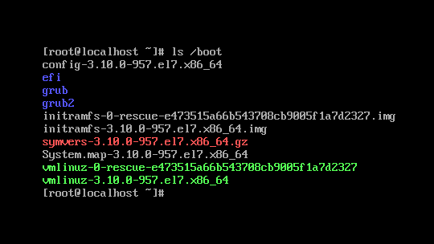
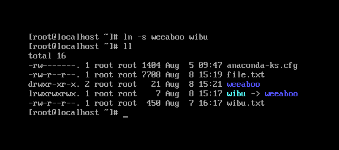

## Câu lệnh làm việc với file system trong Linux

- `mkdir`: lệnh tạo thư mục

cú pháp `mkdir tên_thư_mục`

bạn cũng có thể tạo nhiều thư mục `mkdir tên_thư_mục_1 tên_thư_mục_2`

cũng có thể tạo 1 thư mục và thư mục con của nó bằng cách thêm tùy chọn `-p`: `mkdir -p tên_thư_mục_1/tên_thư_mục_2`

- `cd`: change directory, bạn có thể di chuyển qua lại giữ các thư mục bằng lệnh `cd`. Bạn có thể chỉ định tên thư mục hoặc 1 đường dẫn.

cú pháp `cd tên_thư_mục` hoặc `cd đường_dẫn`

- `pwd`: Print Working Directory, nó sẽ in đường dẫn thư mục hiện tại mà bạn đang truy cập

- `rmdir`: trái với lệnh `mkdir` để tạo thư mục, lệnh `rmdir` dùng để xóa 1 thư mục khỏi hệ thống của bạn.

cú pháp `rmdir tên_thư_mục_muốn_xóa`

bạn cũng có thể xóa nhiều thư mục cùng một lúc `rmdir tên_thư_mục_muốn _xóa_1 tên_thư_mục_muốn_xóa_2`

**Lưu ý**: thư mục muốn xóa phải trống

Để xóa thư mục chứa các tệp trong đó, bạn có thể sử dụng lệnh `rm` và các tùy chọn như `-rf`: `rm -rf tên_thư_mục_muốn_xóa`

**Hãy cẩn thận khi dùng vì lệnh này không yêu cầu xác nhận và nó ngay lập tức xóa bất cứ thứ gì bạn yêu cầu xóa**

- `ls`: list, bạn có thể liệt kê tất cả các tệp mà thư mục chứa.

Nếu bạn thêm tên thư mục hoặc đường dẫn, nó sẽ in ra các tệp trong thư mục đó

- `touch`: với lệnh này, bạn cso thể tạo 1 tệp trống

cú pháp `touch tên_tệp_muốn_tạo`

- `mv`: dùng để di chuyển hoặc dôi tên 1 tệp

cú pháp `mv tên_tệp tên_mới` để đổi tên tệp

nếu bạn muốn di chuyển tệp ban đầu đến thư mục mới `mv tên_tệp đường dẫn`

hoặc có thể kết hợp cả 2 lệnh để vừa di chuyển, vừa đổi tên `mv tên_tệp đường_dẫn/tên_mới`

- `cp`: copy

Bạn có thể sao chép 1 tệp tin bằng câu lệnh `cp tên_tệp_muốn_sao_chép tên_tệp_mới`

Để sao chép 1 thư mục, bạn cần thêm tùy chọn `-r` để sao chép đệ quy toàn bộ nội dung thư mục `cp -r tên_thư_mục_muốn_sao_chép tên_thư_mục_mới`

- `ln`: link

Bây giờ chúng ta hãy nói về khái niệm liên kết trong Linux. Một liên kết là 1 tệp tin trỏ đến 1 tệp tin khác.

Chúng ta có thể tạo 2 loại liên kết: hard links và symbolic (soft) links. Ta không thể tạo 1 hard link đến 1 thư mục, nhưng ta có thể tạo 1 soft link. Vì lý do này, các soft links phổ biến hơn nhiều.

cú pháp `ln -s tên_thư_mục_1 tên_thư_mục_2`

như vậy là thư mục 2 sẽ được trỏ đến thư mục 1

- `df`: thông báo dung lượng file system đã dùng trên disk

- `du`: ước tinh không gian sử dụng tệp tinh

#### Dưới đây là một số lệnh hữu ích nhất để thiết lập đĩa:

**Lưu ý**: Bạn sẽ cần quyền root để thực hiện hầu hết các tác vụ này

- `fdisk`: phân vùng ổ đĩa

gõ `fdisk -l` để liệt kê các phân vùng

- `sfdisk`: liệt kê kích thước của phân vùng, phân vùng trên thiết bị, kiểm tra phân vùng trên thiết bị và phân vùng lại thiết bị

- `fsck`: Kiểm tra và tùy ý sửa chữa một hoặc nhiều file system Linux

- `mkfs`: tạo 1 file system

- `mkswap`: tạo vùng swap trên thiết bị hoặc trong tệp

- `mount`: gắn kết 1 file system (unmount để tháo)

- `parted`: phân vùng đĩa và chương trình thay đổi kích thước phân vùng. Cho phép người dùng tạo, hủy, thay đổi kích thước, di chuyển và sao chép các phân vùng ext, ext3, Linux-exchange, FAT và FAT32