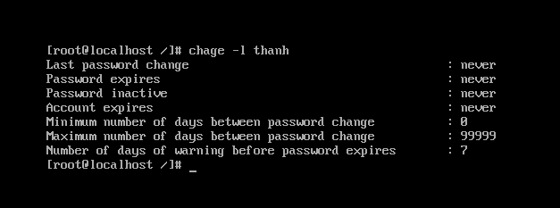

## User trong Linux

Khái niệm User dùng để định danh cho một người dùng trong hệ thống. User là người có thể truy cập đến hệ thống.

User thì có username và password. Mỗi tài khoản người dùng chứa 2 định danh duy nhất: username và UID. Khi tài khoản người dùng được tạo, username của nó được ánh xạ tới một UID duy nhất. Tên người dùng rất linh hoạt nhưng nó phải là duy nhất trong hệ thống. 2 người dùng không thể sử dụng cùng một tên người dùng.

UID là cố định và không thể thay đổi. Sau khi được chỉ định, nó luôn giữ nguyên cho người dùng đó.

Username được sử dụng để truy cập vào tài khoản người dùng, UID được sử dụng để xác thực, theo dỗi và giám sát hoạt động của tài khoản người dùng. Username được sử dụng bởi người dùng còn UID được sử dụng bởi hệ thống.

Có ba loại user: root user, regular user và service user. Mỗi loại user khác nhau có quyền trong hệ thống khác nhau phụ thuộc vào hệ thống đã thiết lập cho họ những quyền gì. Với tài khoản root user - có thể làm bất cứ điều gì muốn trên hệ thống.

- Tài khoản root:

Đây là tài khoản có đặc quyền cao nhất trong hệ thống. Nó được tự động tạo ra trong quá trình cài đặt. Nó có thể làm bất cứ công việc cũng như truy cập bất cứ dịch vụ nào. Tài khoản này dành cho quản trị viên hệ thống và chỉ nên được sử dụng cho mục đích này. Tài khoản root không thể bị xóa, nhưng nếu cần nó có thể bị vô hiệu hóa.
Tài khoản root có UID bằng 0.

- Tài khoản người dùng thông thường:

Đây là tài khoản của người dùng bình thường. Trong quá trình cài đặt, 1 tài khoản người dùng thông thường sẽ được tạo. Sau khi cài đặt, bạn có thể tạo thêm cái tài khoản thông thường. Tài khoản này có đặc quyền vừa phải, nó chỉ có thể thực hiện các tác vụ được phép và chỉ có thể truy cập các tệp và dịch vụ được trao quyền truy cập. Nó có thể bị vô hiệu hóa hoặc bị xóa khỏi hệ thống.
Định danh của người dùng bình thường sử dụng giá trị bắt đầu từ 1000.

- Tài khoản dịch vụ:

Tài khoản dịch vụ được tạo bởi các gói cài đặt khi chúng được cài đặt. Các tài khoản này được sử dụng bởi các dịch vụ để chạy các chương trình và thực thi các chức năng.

Để tạo một người dùng mới, thay đổi thuộc tính của một người dùng cũng như xóa bỏ một người dùng chỉ khi có quyền của root.

- Tạo user:

cú pháp: `useradd [option] username`

các option:
-c “Thông tin người dùng”
-d <Thư mục cá nhân>
-m : Tạo thư mục cá nhân nếu chưa tồn tại
-g <nhóm của người dùng>

- Đặt mật khẩu cho user:

cú pháp: `passwd username` sau đó nhập mật khẩu

Cũng giống như Microsoft Windows bạn vẫn có thể đặt những ràng buộc về mật khẩu cho user. Ví dụ như:
	
	- Bắt buộc sử dụng mật khẩu có độ khó cao.
	- Bắt buộc thay đổi mật khẩu sau một khoảng thời gian.
	- Số lần cho phép nhập sai mật khẩu.
	- Quy định độ dài tối thiểu và độ dài tối đa của mật khẩu.

Bằng cách chỉnh sửa các thông số trong file /etc/login.defs.

Để xem các quy tắc đã được thiết lập cho một user ta sử dụng lệnh `chage`:

- Thay đổi thông tin cá nhân của user:

cú pháp: `usermod [option] username`

Các tùy chọn của lệnh:

`-c` comment : thay đổi thông tin cá nhân của tài khoản người dùng
`-d` home_dir : thay đổi thư mục cá nhân của tài khoản người dùng
`-e` expire_date : thay đổi thời điểm hết hạn của tài khoản người dùng (YYYYMM-DD)
`-f` inactive_days : thiết đặt số ngày hết hiệu lực của mật khẩu trước khi tài khoản người dùng hết hạn sử dụng
`-g` initial_group : tùy chọn này thay đổi tên hoặc số khởi tạo đăng nhập nhóm người dùng
`-G` group : thay đổi danh sách các nhóm phụ mà người dùng cũng là thành viên thuộc các nhóm đó. Mỗi nhóm sẽ được ngăn cách với nhóm khác bởi dấu "," mặc định người dùng sẽ thuộc vào nhóm khởi tạo
`-l` login_name : thay đổi tên đăng nhập của người dùng. Trong một số trường hợp, tên thư mục riêng của người dùng có thể sẽ thay đổi để tham chiếu đến tên đăng nhập mới
`-p` passwd : thay đổi mật khẩu đăng nhập của tài khoản người dùng
`-s` shell : thay đổi shell đăng nhập
`-u` uid : thay đổi uid người dùng

- Xóa user:

cú pháp: `userdel username`