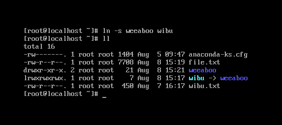

#### Phân quyền trong linux

#### Phân quyền



Như ảnh trên, chuỗi ký tự như `drwxr-xr-x` xác định các quyền của tệp hoặc thư mục

Ký tự đầu tiên cho biết loại tệp:

- `-` có nghĩa là nó là 1 tập tin bình thường
- `d` có nghĩa là nó là 1 thư mục
- `l` có nghĩa là nó là 1 liên kết

Sau đó, bạn có 3 bộ giá trị, mỗi bộ gồm 3 ký tự:

- Bộ đầu tiên thể hiện quyền của **chủ sở hữu** tệp
- Bộ thứ 2 thể hiện quyền của **nhóm**
- Bộ thứ 3 thể hiện quyền của **những người dùng khác**

Những bộ được cấu thành bởi 3 ký tự, `r`: quyền đọc, `w`: quyền ghi, `x`: quyền thực thi.

Bạn có thể thay đổi các quyền bằng cách sử dụng lệnh `chmod`

`chmod` có thể được sử dụng theo 2 cách, đầu tiên là sử dụng các đối số tượng trưng, thứ 2 là sử dụng các đối số là các số. Trước tiên hãy bắt đầu với các đối số tượng trưng, trực quan hơn.

Đầu tiên ta có:

- `a` là viết tắt của tất cả
- `u` là viết tắt của người dùng
- `g` là viết tắt của nhóm
- `o` là viết tắt của những người khác

tiếp theo ta có: 

- `r` là quyền đọc - có nghĩa là xem nội dung file
- `w` là quyền ghi - có nghĩa là chỉnh sửa, thay đổi, xóa file
- `x` là quyền thực thi - có nghĩa là chạy file như 1 chương trình

Sau đó, ta thêm `+` hoặc `-` để thêm hoặc bớt quyền, tiếp theo bạn nhập một hoặc nhiều các quyền ( `r`, `w`, `x`). Cuối cùng là tên tập tin hoặc thư mục.

Ví dụ:

```
chmod a+r filename #mọi người có quyền read
chmod a+rw filename #mọi người có quyền read và write
chmod o-rwx filename #những người dùng khác (không phải chủ sở hữu file, không nằm trong group) không có quyền read, write hoặc execute file
```

Bạn có thể áp dụng cùng một quyền cho nhiều đối tượng bằng cách thêm nhiều chữ cái trước dấu +/ -:

`chmod og-r filename #other và group bị bỏ mất quyền read`

Cách thứ 2 là sử dụng đối số là các số. Giá trị số này có thể tối đa là 7 và được tính theo cách này:

- 1 nếu có sự cho phép quyền thực thi
- 2 nếu có sự cho phép quyền ghi
- 4 nếu có sự cho phép quyền đọc

Điều này cho chúng ta các sự kết hợp:

- 0 không có quyền
- 1 có quyền thực thi
- 2 có quyền ghi
- 3 có quyền ghi, thực thi
- 4 có quyền đọc
- 5 có quyền đọc, thực thi
- 6 có quyền đọc, ghi
- 7 có quyền đọc, ghi và thực thi

Sử dụng chúng theo cặp 3, để đặt quyền của cả 3 nhóm hoàn toàn:

Ví dụ:

```
chmod 777 filename
chmod 755 filename
chmod 644 filename
```

#### Chủ sở hữu và nhóm

Bạn có thể thay đổi chủ sở hữu của một tệp bằng lệnh `chown`:

`chown username filename`

Bạn có thể thay đổi nhóm của tệp bằng lệnh `chgrp`:

`chgrp group filename`