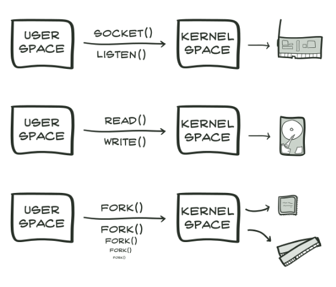
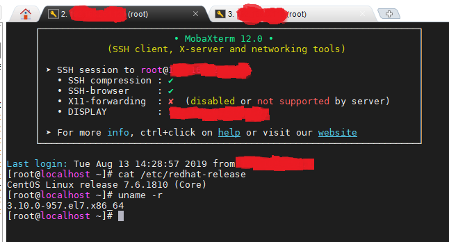
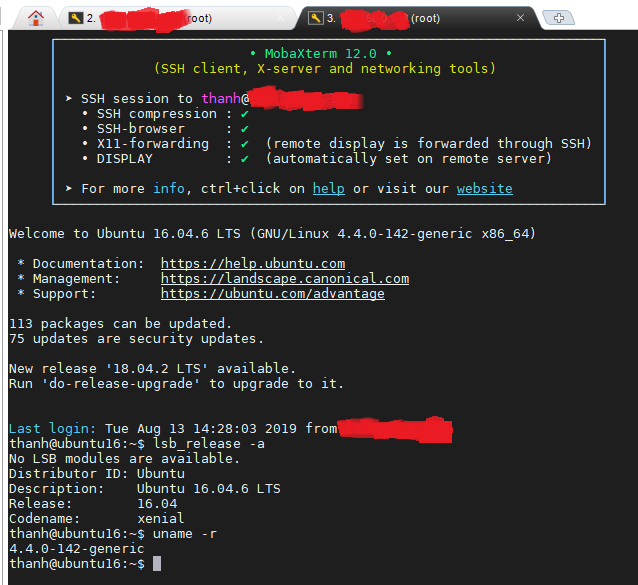
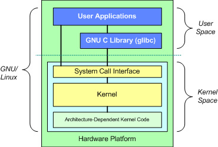
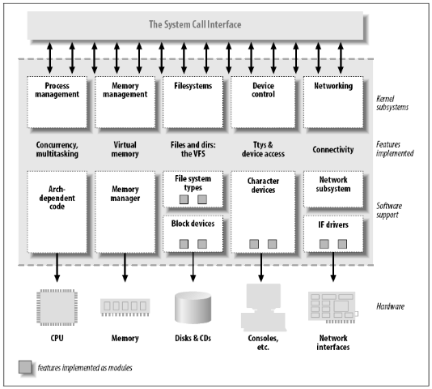

## Kiến trúc hạt nhân Linux

### Kernel là thành phần cốt lõi của 1 HĐH. Kernel trong Linux là những đoạn mã được viết bởi ngôn ngữ C và kiến trúc hệ thống tệp. Kernel tương tác trực tiếp với phần cứng và nó nằm ở cấp độ trung gian giữa phần cứng và phần mềm, cung cấp dịch vụ cấp thấp cho các thành phần của chế dộ người dùng. Ngoài ra nó có các khối khác nhau để quản lý các hoạt động khác nhau. Kernel chạy một số quy trình đồng thời và quản lý các tài nguyên khác nhau. Nó được xem như một trình quản lý tài nguyên khi một số chương trình chạy đồng thời trên một hệ thống. Trong trường hợp này kernel là một thể hiện chia sẻ các tài nguyên có sẵn như việc sử dụng CPU, dung lượng ổ đĩa, kết nối mạng, ...

- Các loại kernel:

Về bản chất, có nhiều cách để xây dựng và biên dịch 1 bộ kernel nhất định từ đầu. Nhìn chung, với hầu hết các kernel hiện nay, chúng ta có thể chia ra làm 3 loại:

	- microkernl: có đầy đủ các tính năng cần thiết để quản lý CPU, bộ nhớ và interprocess communication (ipc). Microkernel có tính linh hoạt khá cao, tương thích với nhiều loại thiết bị, vì vậy bạn không cần phải lo lắng khi thay đổi 1 thiets bị nào đó. Nó cũng có tính bảo mật khá cao khi chỉ định rõ những tiến trình nào hoạt động trong chế độ user mode mà không được cấp quyền như trong chế độ supervisor mode.
	
	- monolithic kernel: có chức năng bao quát rộng hơn so với microkernl. Nó không chỉ tham gia quản lý CPU, memory, IRC mà còn can thiệp vào trình điều khiển driver, điều phối file hệ thống, các giao tiếp qua lại giữa server. Monolithic tốt hơn khi truy cập tới phần cứng và đa tác vụ, vì nếu 1 chương trình muốn thu thập thông tin từ bộ nhớ và các tiến trình khác, chúng cần có quyền truy cập trực tiếp và không cần phải chờ các tác vụ khác kết thúc. Nhưng đồng thời chúng cũnng khiến có nhiều chương trình chạy trong chế độ supervisor mode hơn và điều này có thể gây ra sự bất ổn trong hệ thống. Linux sử dụng nhân này.
	
	- hybrid kernel: khác với 2 loại trên, hybrid có khả năng chọn lựa và quyết định những ứng dụng nào được phép chạy trong chế dộ user hoặc supervisor. Thông thường, những thứ như driver và file hệ thống I/O sẽ hoạt động trong chế độ user mode trong khi ipc và các tín hiệu từ server hoạt động trong chế độ supervisor. Tính năng này thực sự rất hữu ích vì chúng đảm bảo tính hiệu quả của hệ thống, phân phối và điều chỉnh công việc phù hợp, dễ quản lý. 2 HĐH nổi tiếng khác là OS X và Microsoft Windows 7 sử dụng nhân này.
	
Để kiểm tra phiên bản kernel Linux đang được sử dụng, bạn có thể sử dụng câu lệnh `uname -r`

Như ở đây tôi có 2 máy ảo CentOS và Ubuntu:

- CentOS 7:

- Ubuntu 16.04:

### Kiến trúc cơ bản của Linux

Kiến trúc của hạt nhân được chia thành 2 phần chính:

1. Không gian người dùng
2. Không gian hạn nhân

#### Không gian người dùng

Tất cả các chuwong trình và ứng dụng người dùng được thực thi trong không gian người dùng. Không gian người dùng không thể truy cập trực tiếp vào bộ nhớ và phần cứng. Nó truy cập đến phần cứng thông qua không gian kernel. Các tiến trình hoặc chương trình đang chạy trong không gian người dùng chỉ truy cập 1 phần bộ nhớ qua System Call Interface. Do có cơ chế bảo vệ, các sự cố trong chế độ người dùng có thể phục hồi. Thư viện GNU C cung cấp cơ chế chuyển ứng dụng không gian người dùng sang không gian kernel.

#### Không gian hạt nhân

Tất cả các chương trình kernel được thực thi trong không gian kernel. Không gian hạt nhân truy cập toàn bộ phần bộ nhớ và tương tác trực tiếp với phần cứng như RAM, hard disk, ... Nó được chia thành các khối và module khác nhau để quản lý tất cả các hoạt động (như quản lý tệp, quản lý bộ nhớ, quản lý tiến trình, ...) trong không gian hạt nhân và các ứng dụng đang chạy trong không gian người dùng. Không gian hạt nhân bao gồm System Call Interface, kernel (thành phần cốt lõi của Linux) và module thiết bị.

System Call Interface là lớp trung gian giữa không gian người dùng và không gian hạt nhân. Mỗi ứng dụng chạy trong không gian người dùng có thể giao tiếp với kernel thông qua System Call Interface. Ví dụ chức năng system call trên file operation là open(), read(), write(), ...

Kernel độc lập với phần cứng và phổ biến với tất cả cá bộ xvi xử lý phần cứng được hỗ trợ bởi Linux. Bạn có thể chạy kernel trên bất kỳ bộ vi xử lý nào như Intel, ARM, Atmel, ... Nó hoạt động như 1 trình quản lý tài nguyên trong không gian kernel và thực hiện quản lý tiến trình, quản lý tệp, quản lý bộ nhớ, trình xử lý ngắt, lập lịch xử lý, ... Đây là một cấu trúc mạnh mẽ, xử lý tất cả các hoạt động.

#### Kiến trúc kernel

Kiến trúc đầy đủ của kernel

Kiến trúc hạt nhân theo cách tiếp cận module. Mỗi khối trong kernel là các đoạn mã được viết bằng ngôn ngữ C. Mỗi khối bao gồm cấu trúc mạnh mẽ để xử lý các hoạt động khác nhau.

- Process management: xử lý việc quản lý các tiến trình khác nhau được chạy cùng lúc. Tiến trình là 1 ví dụ của "chương trình đang thực thi" như mở tệp, truy cập ổ đĩa, truy cập tài nguyên bên ngoài (máy in, ...) và có thể được tạo hoặc hủy. Quản lý tiến trình cung cấp thông tin về những gì xảy ra với các tiến trình và quản lý các ưu tiên của nó, chẳng hạn như địa chỉ nào sẽ được chỉ định để xử lý, tệp được phân bổ cho tiến trình, trạng thái của tiến trình (như chạy, chờ, dừng), ...

- Memory management: là phần quan trọng nhất của kernel, xử lý việc gán không gian địa chỉ cho các tiến trình và ứng dụng. Về cơ bản quản lý bộ nhớ chỉ định bộ nhớ ảo thay vì bộ nhớ vật lý, theo đó là không gian địa chỉ thực tế trong RAM. Việc gán địa chỉ ảo khắc phục giới hạn gán bộ nhớ vật lý. Chuyển đổi từ địa chỉ vật lý sang địa chỉ ảo được thực hiện bởi MMU (đơn vị quản lý bộ nhớ cung cấp bảo về nhiễu bộ nhớ, chia sẻ bộ nhớ và cấp phát bộ nhớ ảo). Không gian địa chỉ vật lý được chia thành các khối bộ nhớ gọi là khung chứa các trang.

- Filesystems: filesystems là 1 cây có cấu trúc dữ liệu phân cấp tổ chức hệ thống tập tin. Tệp là cấu trúc dữ liệu đơn giản (dưới dạng một số bytes bộ nhớ) có thể lưu trữ bất kỳ loại dữ liệu nào như văn bản, hình ảnh, video, âm thanh và bất cứ thứ gì bạn muốn trong máy tính. Filesystem trong Linux được tổ chức dưới dạng 1 thư mục ở dạng cây. Thư mục là 1 bộ sưu tập hoặc nhóm các tập tin. Hai loại thư mục có sẵn trong hệ thống Linux: 1 - thư mục gốc (/)  và 2 - thư mục con. "/" là thư mục chính và không thể truy cập nếu không có sự cho phép của người dùng root. Thư mục con nằm dưới thư mục gốc có thể được tạo hoặc đổi tên bởi người dùng. Linux hỗ trợ 1 số loại tệp như ext2, ext3, ext4, device file, ... mỗi filesystem được lưu trữ trong một phân vùng đĩa khác nhau.

- Device control: điều khiển hoạt động của các thiết bị. Hầu như mọi hoạt động của hệ thống cuối cùng sẽ ánh xạ tới một thiết bị vật lý. Ngoại trừ bộ nhớ và rất ít thực thể khác, mọi hoạt động điều khiển thiết bị đều được thực hiện bằng mã dành riêng cho thiết bị được xử lý. Mã đó được gọi là trình điều khiển thiết bị hay còn gọi là driver. Nhân tương tác với các thiết bị I/O bằng trình điều khiển thiết bị. Trình điều khiển thiết bị được bao gồm trong kernel và có chức năng điều khiển một hoặc nhiều thiết bị, chẳng hạn như đĩa cứng, bàn phím, chuột, màn hình, giao diện mạng và thiết bị được kết nối với bus SCSI. Mỗi trình điều khiển tương tác với phần còn lại của kernel (ngay cả với các trình điều khiển khác) thông qua một interface cụ thể.

- Networking: chịu trách nhiệm điều khiển kết nối mạng.