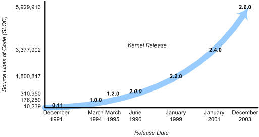
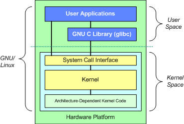
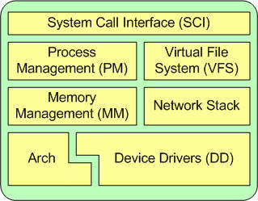
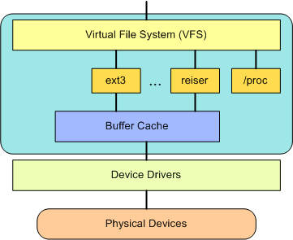

Cũng trong chuyên mục tìm hiểu về Linux, tôi có tìm được 1 bài viết khá hay và hữu ích về nhân Linux - được ví như trái tim của HĐH. Các bạn có thể truy cập theo [đường dẫn này](https://vi.lmgtfy.com/?q=linux+kernel+structure&p=1&iie=1) để tìm kiếm bài viết.

## Cấu tạo của nhân Linux

(**M.Jones**) - 06/06/2007

---

Mục tiêu của bài viết này là giới thiệu cho bạn về nhân Linux và khám phá kiến trúc cũng như các thành phần chính của nó, hãy bắt đầu bằng việc tìm hiểu về lịch sử nhân Linux, sau đó đến kiến trúc và các sub-system của nó. Nhân Linux có hơn sáu triệu dòng mã (tại thời điểm viết bài), vì vậy phần giới thiệu này sẽ không đầy đủ.

### Lịch sử Linux

Trong khi Linux được cho là HĐH mã nguồn mở phổ biến nhất, lịch sử của nó thực sự khá ngắn khi đem so với dòng thời gian của các HĐH khác. Trong những ngày đầu của ngành công nghiệp máy tính, các lập trình viên đã phát triển các chương trình trên bare hardware (dùng để chỉ máy tính thực hiện các hướng dẫn trực tiếp trên phần cứng logic mà không cần hệ điều hành can thiệp) bằng ngôn ngữ của phần cứng. Việc thiếu 1 HĐH có nghĩa là chỉ 1 ứng dụng (và 1 người dùng) có thể sử dụng các thiết bị lớn và đắt tiền tại một thời điểm. Các HĐH ban đầu được phát triển vào những năm 1950 để cung cấp trải nghiệm phát triển đơn giản hơn. Các ví dụ bao gồm HĐH General Motors (GMOS) được phát triển cho IBM 701 và Hệ thống giám sát FORTRAN (FMS) do North American Aviation phát triển cho IBM 709.

Vào những năm 1960, Viện Công nghệ Massachusetts (MIT) và một loạt các công ty đã phát triển 1 HĐH thử nghiệm có tên Multics (hay Dịch vụ điện toán và thông tin đa kênh) cho GE-645. Một trong những nhà phát triển của HĐH này, AT&T, đã rời khỏi Multics và phát triển HĐH của riêng họ vào năm 1970 được gọi là Unics. Cùng với HĐH này là ngôn ngữ C, trong đó C được phát triển và sau đó viết lại để phát triển HĐH di động.

20 năm sau, Andrew Tanenbaum đã tạo ra 1 phiên bản vi nhân của UNIX®, được gọi là MINIX (cho UNIX tối thiểu), chạy trên các máy tính cá nhân nhỏ. HĐH nguồn mở này đã truyền cảm hứng cho sự phát triển ban đầu của Linus Torvalds vào đầu những năm 1990 (xem Hình 1).

**Hình 1. Lịch sử ngắn của các bản phát hành nhân Linux chính**

Linux nhanh chóng phát triển từ 1 dự án 1 người thành 1 dự án phát triển toàn cầu có sự tham gia của hàng ngàn nhà phát triển. Một trong những quyết định quan trọng nhất đối với Linux là việc áp dụng Giấy phép công cộng GNU (GPL). Theo GPL, hạt nhân Linux đã được bảo vệ khỏi khai thác thương mại và nó cũng được hưởng lợi từ sự phát triển không gian người dùng của dự án GNU (của Richard Stallman). Điều này cho phép các ứng dụng hữu ích như Bộ sưu tập trình biên dịch GNU (GCC) và các hỗ trợ shell khác nhau.

> Linux hay GNU/Linux?
Có lẽ bạn đã nhận thấy rằng Linux với tư cách là 1 HĐH được gọi trong một số trường hợp là Linux và một số khác là GNU/Linux. Lý do đằng sau điều này là Linux là hạt nhân của HĐH. Một loạt các ứng dụng làm cho HĐH trở nên hữu ích là phần mềm GNU. Ví dụ, hệ thống cửa sổ, trình biên dịch, các shell, công cụ phát triển, trình soạn thảo, tiện ích và các ứng dụng khác tồn tại bên ngoài kernel, nhiều phần mềm trong số chúng là phần mềm GNU. Vì lý do này, nhiều người coi HĐH GNU/Linux là cái tên thích hợp hơn, trong khi đó, Linux phù hợp hơn khi chỉ nói đến kernel.

### Giới thiệu về nhân Linux

Bây giờ chúng ta hãy nhìn vào kiến trúc HĐH GNU/Linux. Bạn có thể nghĩ về 1 HĐH với 2 cấp độ, như trong Hình 2.

**Hình 2. Kiến trúc cơ bản của HĐH GNU/Linux**

Trên cùng là người dùng, hoặc ứng dụng. Đây là nơi các ứng dụng người dùng được thực thi. Bên dưới không gian người dùng là không gian kernel. Nhân Linux ở đây.

Ngoài ra còn có Thư viện GNU C (glibc). Điều này cung cấp system call interface kết nối với kernel và cung cấp cơ chế chuyển đổi ứng dụng giữa không gian người dùng và kernel. Điều này rất quan trọng vì kernel và ứng dụng người dùng chiếm các không gian địa chỉ được bảo vệ khác nhau. Và trong khi mỗi quá trình không gian người dùng chiếm không gian địa chỉ ảo của riêng nó, thì kernel chiếm một không gian địa chỉ duy nhất.

Nhân Linux có thể được chia thành 3 cấp tổng. Trên cùng là system call interface, thực hiên các chức năng cơ bản như read và write. Bên dưới là mã hạt nhân, có thể được định nghĩa chính xác hơn là mã hạt nhân độc lập với kiến trúc. Mã này là chung cho tất cả các kiến trúc bộ xử lý được Linux hỗ trợ. Bên dưới đấy là mã phụ thuộc vào kiến trúc, tạo thành BSP (Board Support Package). Mã này đóng vai trò là bộ xử lý và mã nền tảng cụ thể cho kiến trúc nhất định.

> Phương thức cho system call interface (SCI)
Trong thực tế, kiến trúc có thể không rõ ràng như Hình 2. Ví dụ, cơ chế xử lý các lệnh gọi từ hệ thống (chuyển từ không gian người dùng sang không gian kernel) có thể khác nhau theo kiến trúc. Các bộ xử lý trung tâm x86 (CPU) mới hơn cung cấp hỗ trợ cho các hướng dẫn ảo hóa có hiệu quả hơn trong quy trình này so với các bộ xử lý x86 cũ hơn sử dụng phương pháp int 80h truyền thống.

### Thuộc tính của nhân Linux

Khi thảo luận về kiến ​​trúc của một hệ thống lớn và phức tạp, bạn có thể xem hệ thống từ nhiều góc độ. Một mục tiêu của việc phân tích kiến ​​trúc là cung cấp một cách để hiểu rõ hơn về nguồn và đó là những gì chúng ta sẽ làm ở đây.

Nhân Linux thực hiện một số thuộc tính kiến ​​trúc quan trọng. Ở cấp độ cao và ở cấp độ thấp hơn, hạt nhân được phân lớp thành một số hệ thống con riêng biệt. Linux cũng có thể được coi là nguyên khối vì nó gộp tất cả các dịch vụ cơ bản vào kernel. Điều này khác với kiến ​​trúc microkernel nơi kernel cung cấp các dịch vụ cơ bản như giao tiếp, I / O, và quản lý bộ nhớ và quy trình, và các dịch vụ cụ thể hơn được cắm vào lớp microkernel. Mỗi thứ có một lợi thế riêng, nhưng tôi sẽ không đề cập đến chúng ở đây.

Theo thời gian, nhân Linux đã trở nên hiệu quả về cả bộ nhớ và mức sử dụng CPU, cũng như cực kỳ ổn định. Nhưng khía cạnh thú vị nhất của Linux, với quy mô và độ phức tạp của nó, là tính di động. Linux có thể được biên dịch để chạy trên một số lượng lớn bộ xử lý và nền tảng với các ràng buộc và nhu cầu kiến ​​trúc khác nhau. Một ví dụ là khả năng Linux chạy trên một quy trình với đơn vị quản lý bộ nhớ (MMU), cũng như các đơn vị không cung cấp MMU. Cổng uClinux của nhân Linux cung cấp hỗ trợ không phải MMU.

### Các hệ thống con chính của nhân Linux

**Hình 3. Một khía cạnh kiến trúc của nhân Linux**

> Hạt nhân là gì?
Như trong Hình 3 , một kernel thực sự không có gì hơn một trình quản lý tài nguyên. Cho dù tài nguyên đang được quản lý là một quá trình, bộ nhớ hoặc thiết bị phần cứng, kernel sẽ quản lý và phân quyền truy cập vào tài nguyên giữa nhiều người dùng cạnh tranh (cả trong kernel và trong không gian người dùng).

#### System call interface

SCI là một lớp mỏng cung cấp các phương tiện để thực hiện các cuộc gọi chức năng từ không gian người dùng vào kernel. Như đã thảo luận trước đây, giao diện này có thể phụ thuộc vào kiến ​​trúc, ngay cả trong cùng một họ bộ xử lý. SCI thực sự là một dịch vụ ghép kênh và phân tách cuộc gọi chức năng thú vị. Bạn có thể tìm thấy triển khai SCI trong ./linux/kernel, cũng như các phần phụ thuộc vào kiến ​​trúc trong ./linux/arch.

#### Process management

Process management được tập trung vào việc thực hiện các tiến trình. Trong kernel, chúng được gọi là các luồng và thể hiện một ảo hóa riêng lẻ của bộ xử lý (mã luồng, dữ liệu, ngăn xếp và các thanh ghi CPU). Trong không gian người dùng, thuật ngữ tiến trình thường được sử dụng, mặc dù việc triển khai Linux không tách rời hai khái niệm (tiến trình và luồng). Hạt nhân cung cấp giao diện chương trình ứng dụng (API) thông qua SCI để tạo một tiến trình mới (các chức năng fork, exec hoặc Portable Operating System Interface [POSIX]), dừng một quá trình (kill, exit), giao tiếp và đồng bộ hóa giữa chúng ( tín hiệu, hoặc cơ chế POSIX).

Ngoài ra trong Process management còn có việc chia sẻ CPU giữa các luồng hoạt động. Nhân thực hiện một thuật toán lập lịch mới, hoạt động trong thời gian không đổi, bất kể số lượng luồng xử lý cho CPU. Đây được gọi là bộ lập lịch O(1). Bộ lập lịch O(1) cũng hỗ trợ nhiều bộ xử lý (được gọi là Symmetric MultiProcessing, hoặc SMP). Bạn có thể tìm thấy các nguồn quản lý tiến trình trong ./linux/kernel và các nguồn phụ thuộc vào kiến ​​trúc trong ./linux/arch.

#### Memory management

Một tài nguyên quan trọng khác được quản lý bởi kernel là bộ nhớ. Để đạt hiệu quả, theo cách mà phần cứng quản lý bộ nhớ ảo, bộ nhớ được quản lý theo những gì được gọi là các trang (kích thước 4KB cho hầu hết các kiến ​​trúc). Linux bao gồm các phương tiện để quản lý bộ nhớ khả dụng, cũng như các cơ chế phần cứng cho ánh xạ vật lý và ảo.

Nhưng quản lý bộ nhớ phức tạp hơn quản lý bộ đệm 4KB. Linux cung cấp các bản tóm tắt trên bộ đệm 4KB, chẳng hạn như bộ cấp phát thanh. Sơ đồ quản lý bộ nhớ này sử dụng bộ đệm 4KB làm cơ sở, nhưng sau đó phân bổ các cấu trúc từ bên trong, theo dõi trang nào đầy, sử dụng một phần và trống. Điều này cho phép chương trình phát triển và thu hẹp một cách linh hoạt dựa trên nhu cầu của hệ thống lớn hơn.

Hỗ trợ nhiều người dùng bộ nhớ, có những lúc bộ nhớ khả dụng có thể cạn kiệt. Vì lý do này, các trang có thể được chuyển ra khỏi bộ nhớ và vào đĩa. Quá trình này được gọi là hoán đổi vì các trang được hoán đổi từ bộ nhớ vào đĩa cứng. Bạn có thể tìm thấy các nguồn quản lý bộ nhớ trong ./linux/mm.

#### Virtual file system

Virtual file system (VFS) là một khía cạnh thú vị của nhân Linux vì nó cung cấp một sự trừu tượng hóa giao diện chung cho các hệ thống tệp. VFS cung cấp lớp chuyển đổi giữa SCI và các hệ thống tệp được hỗ trợ bởi kernel (xem Hình 4).

Ở đầu VFS là một bản tóm tắt API phổ biến của các chức năng như open, close, read và write. Ở dưới cùng của VFS là các tóm tắt hệ thống tệp xác định cách thức thực hiện các chức năng của lớp trên. Đây là các trình cắm cho hệ thống tệp đã cho (trong đó có hơn 50 tệp). Bạn có thể tìm thấy các nguồn hệ thống tệp trong ./linux/fs.

Bên dưới lớp hệ thống tệp là bộ đệm bộ đệm, cung cấp một bộ chức năng chung cho lớp hệ thống tệp (độc lập với bất kỳ hệ thống tệp cụ thể nào). Lớp bộ nhớ đệm này tối ưu hóa quyền truy cập vào các thiết bị vật lý bằng cách giữ dữ liệu trong một thời gian ngắn (hoặc đọc trước một cách suy đoán để dữ liệu có sẵn khi cần). Bên dưới bộ đệm là các trình điều khiển thiết bị, thực hiện giao diện cho thiết bị vật lý cụ thể.

#### Network stack

Network stack, theo thiết kế, theo một kiến ​​trúc phân lớp được mô phỏng theo chính các giao thức. Hãy nhớ rằng Giao thức Internet (IP) là giao thức lớp mạng lõi nằm dưới giao thức truyền tải (phổ biến nhất là Giao thức điều khiển truyền hoặc TCP). Trên TCP là lớp socket, được gọi thông qua SCI.

Lớp socket là API tiêu chuẩn cho hệ thống mạng con và cung cấp giao diện người dùng cho nhiều giao thức mạng. Từ truy cập khung thô đến các đơn vị dữ liệu giao thức IP (PDU), đến TCP và Giao thức gói dữ liệu người dùng (UDP), lớp socket cung cấp một cách chuẩn hóa để quản lý các kết nối và di chuyển dữ liệu giữa các điểm cuối. Bạn có thể tìm thấy các nguồn mạng trong kernel tại ./linux/net.

#### Device drivers

Phần lớn mã nguồn trong nhân Linux tồn tại trong trình điều khiển thiết bị giúp cho một thiết bị phần cứng cụ thể có thể sử dụng được. Cây nguồn Linux cung cấp thư mục con trình điều khiển được chia thêm cho các thiết bị khác nhau được hỗ trợ, chẳng hạn như Bluetooth, I2C, serial, v.v. Bạn có thể tìm thấy các nguồn trình điều khiển thiết bị trong ./linux/drivers.

#### Mã phụ thuộc kiến ​​trúc

Mặc dù phần lớn Linux độc lập với kiến ​​trúc mà nó chạy, có những yếu tố phải xem xét kiến ​​trúc để hoạt động bình thường và cho hiệu quả. Thư mục con ./linux/arch xác định phần phụ thuộc kiến ​​trúc của nguồn hạt nhân chứa trong một số thư mục con dành riêng cho kiến ​​trúc (tạo thành tổng thể BSP). Đối với một máy tính để bàn thông thường, thư mục i386 được sử dụng. Mỗi thư mục con trong này lại chứa một số thư mục con khác tập trung vào một khía cạnh cụ thể của kernel, chẳng hạn như boot, kernel, quản lý bộ nhớ và các thư mục khác. Bạn có thể tìm thấy mã phụ thuộc vào kiến ​​trúc trong ./linux/arch.

#### Các tính năng thú vị của nhân Linux

Nếu tính di động và hiệu quả của nhân Linux không đủ, nó cung cấp một số tính năng khác không thể phân loại trong phân tách trước đó.

Linux, là một hệ điều hành sản xuất và nguồn mở, là một thử nghiệm tuyệt vời cho các giao thức và tiến bộ mới của các giao thức đó. Linux hỗ trợ một số lượng lớn các giao thức mạng, bao gồm TCP/IP điển hình và cả phần mở rộng cho mạng tốc độ cao (lớn hơn 1 Gigabit Ethernet [GbE] và 10 GbE). Linux cũng hỗ trợ các giao thức như Giao thức truyền điều khiển luồng (SCTP), cung cấp nhiều tính năng nâng cao trên TCP (như một giao thức cấp vận chuyển thay thế).

Linux cũng là một hạt nhân động, hỗ trợ bổ sung và loại bỏ các thành phần phần mềm một cách nhanh chóng. Chúng được gọi là các mô-đun hạt nhân có thể tải động và chúng có thể được chèn khi khởi động khi chúng cần thiết (khi tìm thấy một thiết bị cụ thể yêu cầu mô-đun) hoặc bất cứ lúc nào bởi người dùng.

Một tiến bộ gần đây của Linux là việc sử dụng nó như một hệ điều hành cho các hệ điều hành khác (được gọi là hypanneror). Gần đây, một sửa đổi cho kernel đã được thực hiện gọi là Kernel-based Virtual Machine (KVM). Việc sửa đổi này đã cho phép một giao diện mới tới không gian người dùng cho phép các hệ điều hành khác chạy trên kernel hỗ trợ KVM. Ngoài việc chạy một phiên bản khác của Linux, Microsoft® Windows® cũng có thể được ảo hóa. Hạn chế duy nhất là bộ xử lý cơ bản phải hỗ trợ các hướng dẫn ảo hóa mới.

#### Đi xa hơn

Bài viết này chỉ thảo luận qua bề mặt của kiến ​​trúc nhân Linux, các tính năng và khả năng của nó. Bạn có thể kiểm tra thư mục Tài liệu được cung cấp trong mọi bản phân phối Linux để biết thông tin chi tiết về nội dung của kernel.