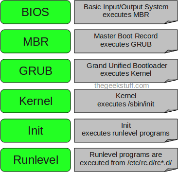
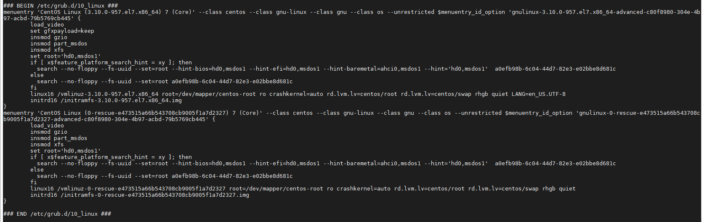

## Quá trình khởi động trong Linux và các init level

Khi bạn nhấn nút nguồn trên hệ thống của bạn và sau một vài phút bạn sẽ thấy lời nhắc đăng nhập vào Linux.

Bạn có bao giờ tự hỏi rằng điều gì đã xảy ra bên trong hệ thống kể từ khi bạn nhấn nút nguồn cho đến khi có lời nhắc đăng nhập Linux xuất hiện không?

Sau đây là 6 giai đoạn chính của 1 quá trình khởi động Linux điển hình:

1. BIOS

- BIOS là viết tắt của Basic Input/Output System (Hệ thống đầu vào/đầu ra cơ bản)
- Thực hiện một số kiểm tra tính toàn vẹn hệ thống
- Tìm kiếm, load và khởi chạy boot loader
- Nó tìm boot loader trong đĩa mềm, CD/ROM, đĩa cứng, ... Bạn có thể thay đổi trình tự load boot loader trong quá trình khởi động BIOS
- Khi tìm được boot loader và được load vào bộ nhớ, BIOS sẽ chuyển quyền điều khiển cho nó
- Nói đơn giản là BIOS thực hiện load và chạy boot loader MBR

2. MBR

- MBR là viết tắt của Master Boot Record
- Nó nằm ở sector đầu tiên của đĩa khởi động. Điển hình là /dev/hda hoặc /dev/sda
- MBR có kích thước 512 byte, gồm 3 thành phần: thông tin boot loader chính trong 446 byte, thông tin bảng phân vùng trong 64 byte tiếp theo, kiểm tra xác thực mbr trong 2 byte cuối
- Nó chứa thông tin về GRUB (hoặc LILO trong các hệ thống cũ)
- Nói đơn giản là MBR load và khởi chạy GRUB boot loader

3. GRUB

- GRUB là viết tắt của Grand Unified Bootloader
- Nếu bạn có nhiều tệp ảnh đĩa của nhiều kernel được cài đặt trên hệ thống, bạn có thể chọn cái nào sẽ được chạy
- GRUB sễ hiện trên màn hình trong vài giây, nếu bạn không chọn bất cứ thứ gì, nó sẽ load tệp ảnh kernel mặc định được chỉ định trong tệp cấu hình grub
- Tệp cấu hình grub trên linux nằm ở /boot/grub/grub/conf (/boot/grub2/grub.cfg với grub phiên bản 2). Bạn cũng có thể truy cập /etc và sẽ tìm thấy 1 liên kết tại đây
- Sau đây là 1 đoạn trong file grub.cfg của CentOS 7.6

- Như bạn thấy trong ảnh trên, nó chứa thông tin về kernel và tệp ảnh initrd
- Nói đơn giản là GRUB thực hiện load và khởi chạy tệp ảnh kernel và initrd

4. Kernel

- Kernel là cốt lõi của HĐH, cung cấp quyền truy cập vào các dịch vụ và phần cứng
- 1 tệp hình ảnh chứa hệ thống tệp gốc cơ bản với tất cả các module hạt nhân được load vào bộ nhớ. Tệp này được gọi là initramfs và nằm ở /boot.
- initramfs được kernel sử dụng làm hệ thống tập tin gốc tạm thời cho đến khi kernel được khởi động và hệ thống tập tin gốc thực sự được gắn kết. Nó cũng chứa các trình điều khiển cần thiết được biên dịch bên trong, giúp nó truy cập vào các phân vùng ổ cứng và phần cứng khác.
- Sau khi kernel xác định được các thành phần phần cứng trên hệ thống, hệ thống tập tin gốc trên đĩa cứng sẽ lấy quyền điều khiển từ initramfs trên bộ nhớ
- Quá trình khởi động tiếp theo là khởi chạy chương trình init bên trong /sbin/init.

5. init

- Khi init đầu tiên được khỏi chạy bởi kernel, nó có process id (PID) là 1, và đây là "init cha" của mọi init khác trong hệ thống. Bạn có thể kiểm tra qua câu lệnh `ps -ef` hoặc sử dụng lệnh `top`
- Điều đầu tiên init làm là đọc tệp khởi tạo ở /etc/inittab (những phiên bản mới hơn của Linux sử dụng systemd).
- Tại đây hệ thống sẽ chọn được mức runlevel và bắt đầu dịch vụ bằng cách tìm trong thư mục rc thích hợp với mức runlevel đó
- Có tổng cộng 7 mức runlevel từ 0 đến 6:
	- 0: shutdown system
	- 1: single user mode
	- 2: multi user mode
	- 3: multi user mode và có thêm chế độ kết nối mạng
	- 4: không được sử dụng/định nghĩa
	- 5: giông với runlevel 3 nhưng có thêm GUI
	- 6: reboot
- Thông thường hệ thống của bạn sẽ chạy ở mức mặc định là 3 hoặc 5

6. Runlevel

- Khi hệ thống Linux khởi động, bạn có thể thấy các dịch vụ khác nhau bắt đầu, đó là các chương trình runlevel, được thực thi từ thư mục runlevel theo như mức runlevel của bạn
- Tùy thuộc vào cài đặt mức init mặc định của bạn, hệ thống sẽ thực thi các chương trình từ 1 trong các thư mục sau:
	- runlevel 0 - /etc/rc.d/rc0.d/
	- runlevel 1 - /etc/rc.d/rc1.d/
	- runlevel 2 - /etc/rc.d/rc2.d/
	- runlevel 3 - /etc/rc.d/rc3.d/
	- runlevel 4 - /etc/rc.d/rc4.d/
	- runlevel 5 - /etc/rc.d/rc5.d/
	- runlevel 6 - /etc/rc.d/rc6.d/
- Trong các thư mục trên bạn sẽ thấy các chương trình bắt đầu bằng S và K
- Các chương trình bắt đầu bằng S được sử dụng trong quá trình khởi động. S = startup
- Các chương trinh bắt đầu bằng K được sử dụng khi tắt máy. K = kill
- Các con số ngay bên cạnh S hoặc K trong tên chương trình là các số thứ tự

Toàn bộ quá trình khởi động của hệ thống Linux được minh họa như hình sau:

