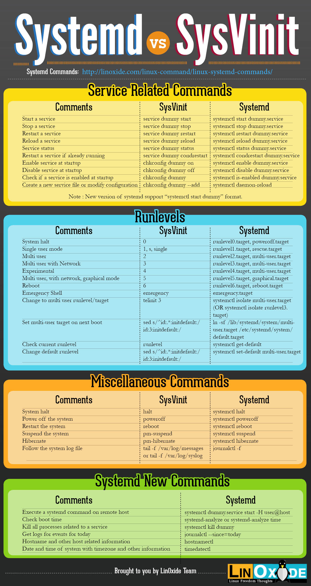

## init vs systemd

### Init process là gì?

Init process là một tiến trình được khởi động lên đầu tiên trong hệ thống Linux. Tức là sau khi bạn chọn hệ điều hành trong menu của Boot Loader. Hệ điều hành bắt đầu được khởi động và tiến trình đầu tiên khởi động lên là init. Nhiệm vụ của init là start và stop các process, services… cần thiết khác.

Vì init là tiến trình được khởi động đầu tiên của hệ thống Linux nên:

- Init process luôn có PID (Process ID) là 1.
- Tiến trình init là tiến trình cha (hoặc ông nội =)) ) của các tiến trình khác.

Có ba kiểu triển khai init system chính trong hệ thống Linux là:

- System V (đọc là System Five – V là số 5 la mã): là phiên bản truyền thống của init system trên nhiều hệ thống Linux.
- Upstart: Được phát triển bởi Canonical vào khoảng năm 2009 và sử dụng trong các phiên bản Ubuntu cũ hơn bản 15.04.
- Systemd: Là một init system được phát triển khoảng năm 2010 và được nhiều Linux distributions sử dụng để thay thế các init system cũ. Ubuntu từ phiên bản 15.04 và Centos từ phiên bản 7 đã sử dụng systemd làm init system mặc định.

### Tìm hiểu về systemd.

#### Định nghĩa của systemd
Theo Lennart Poettering, người phát triển systemd: "systemd là trình quản lý phiên và hệ thống cho Linux, tương thích với các tập lệnh init SysV và LSB. systemd cung cấp khả năng song song hóa mạnh mẽ , sử dụng socket và kích hoạt D-Bus cho các thiết bị khởi động."

Trong "Ngôn ngữ đơn giản: "systemd là một phương pháp hiệu quả hơn để kiểm soát các quá trình. Nó có tính linh hoạt để bắt đầu các dịch vụ song song và để chúng giao tiếp với nhau, ngay cả khi chúng được khởi động lại. Điều này đặc biệt hữu ích cho các quản trị viên hệ thống để tạm thời phục vụ hoặc cập nhật dịch vụ mà không ảnh hưởng đến các dịch vụ phụ thuộc khác.

Systemd là một init system mới và đang dần thay thế các init system cũ vì nhiều lý do. Hiện nay Centos 7 và Ubuntu 16.04 đã sử dụng systemd làm init system mặc định của hệ thống.

Systemd không chỉ dừng lại ở việc start hoặc stop các services nó còn có thể mount filesystems, quản lý network sockets… Và để thực hiện được những công việc đó nó phân chia ra các đơn vị units:

- Service units (.service) – để start và stop các service.
- Mount units (.mount) – Để quản lý các mount point.
- Target units (.target) – Để điều khiển các "runlevels" (khái niệm runlevels chỉ sử dụng trong SysV init).

#### Làm sao biết được hệ thống của bạn đang dùng systemd?

Để kiểm tra xem hệ thống của bạn có đang sử dụng systemd hay không thì:

- Hãy kiểm tra xem bạn có thư mục /usr/lib/systemd không.
- Gõ lệnh `pstree -Ap` bạn sẽ nhìn thấy systemd có process ID là 1 và nó là "cha" của các process khác.


#### Tại sao Chuyển sang systemd?

Quá trình init có thể buộc các dịch vụ nhất định được khởi chạy theo một trình tự cụ thể. Ví dụ, quy trình Bluetooth không thể khởi chạy cho đến khi quy trình avahi khởi chạy. Mặt khác, quy trình avahi không thể khởi chạy cho đến khi quy trình D-BUS khởi chạy, maf D-BUS laij không thể khởi động cho đến khi quy trình nhật ký hệ thống được khởi chạy.

```
| syslog
V
| D-Bus
V
| Avahi
V
| BlueTooth
V
```

Phương pháp truyền thống (sử dụng init) có thể mất thời gian và gây ra sự cố nếu quá trình phụ thuộc khởi động lại.

Mặt khác, systemd khởi chạy tất cả quá trình song song (cùng một lúc), nhưng cho phép chúng giao tiếp với nhau (thông qua socket) để liên lạc "theo yêu cầu". Điều này giúp cải thiện hiệu quả khi chạy các dịch vụ và giúp quản trị viên hệ thống dễ dàng cập nhật dịch vụ hơn mà không có "tác dụng phụ" với các dịch vụ phụ thuộc khác.

```
| syslog  | D-Bus  | Avahi  | BlueTooth
V         V        V        V
```

#### "Runlevels" trong systemd.

Trong SysV init system (nếu bạn đã biết Linux từ trước) có các runlevels:

0: halt
1: single-user
2: multi-user
3: multi-user và có kết nối mạng
4: undefined (người dụng định nghĩa)
5: multi-user với tùy chọn display manager (GUI)
6: reboot

Trong systemd khái niệm "runlevels" được thay thế bằng các targets để boot vào như:

poweroff.target – shutdown system
rescue.target – single user mode
multi-user.target – multiuser và có kết nối mạng
graphical.target – multiuser có kết nối mạng và GUI
reboot.target – restart

#### Bảng so sánh SysV init và Systemd.

Dưới đây là bảng tóm tắt so sánh các lệnh quản lý dịch vụ do [linoxide.com](https://linoxide.com/) thực hiện. Mình cảm thấy rất có ích cho những bạn nào đã sử dụng các phiên bản trước đó.

[Link gốc](http://images.linoxide.com/systemd-vs-sysVinit-cheatsheet.jpg)

