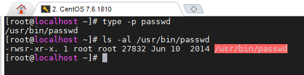
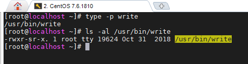
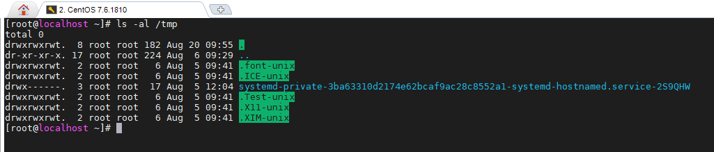
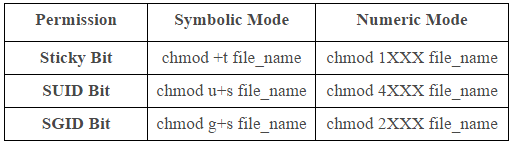
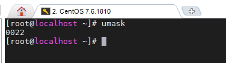
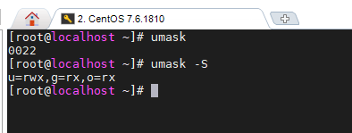

## Phân quyền nâng cao: SUID, SGID, Sticky Bit và chỉ số umask

Ngoài phân quyền cơ bản với `chmod`, trong Linux còn có phân quyền nâng cao. Ở bài viết này, mình sẽ trình bày về một số khái niệm permission nâng cao hơn. Có hai loại permissions mở rộng cho file và folder đó là: Sticky Bit, SUID/SGID. Nó cũng rất quan trọng và bạn cần phải nắm được.

#### SUID

- SUID (hay Set user ID) là một quyền đặc biệt được gán cho trên các file thực thi (executable files). Quyền này cho phép tệp được thực thi với các đặc quyền của chủ sở hữu. Ví dụ: nếu một tệp được sở hữu bởi người dùng root và có setuid được bật, bất kể ai đã thực thi tệp, nó sẽ luôn chạy với quyền người dùng root.

Một ví dụ điển hình nhất là khi chúng ta cần đổi mật khẩu. Khi sử dụng lệnh `passwd` để đổi mật khẩu nó cần phải viết lại thông tin vào file password mà chúng ta thì không có quyền. Bằng việc gán SETUID cho nó chúng ta có thể thực thi nó như là user root vậy (tất nhiên chỉ có thể thay đổi mật khẩu của chính user thực hiện passwd).

Khi chúng ta sử dụng lệnh `ls -al` để xem thông tin phân quyền của file passwd. Chúng ta sẽ thấy chỗ quyền thực thi của user thay vì là x thì sẽ là s.

- Có 2 cách để thêm SUID:

`chmod u+s file`

hoặc

`chmod 4xxx file`

Trong chuỗi 4 số đó thì số đầu tiên để gán SETUID /SETGID (với SETUID có giá trị là 4 / SETGID có giá trị là 2) còn 3 số đằng sau là phân quyền cho user, group và other user.

> Chú ý : Nếu file chưa có quyền thực thi , SUID sẽ là chữ S . Để kí tự S thành s phải cấp quyền execute cho nó.
`chmod u+x file`

- Xóa SUID:

`chmod u-s file`

#### SGID

- SGID (hay Set group ID), cũng tương tự như SUID, được sử dụng trên các file thực thi (excutable files) tức là khi bất kỳ người dùng nào thực thi một tệp có bit SGID được đặt trên đó, nó sẽ luôn được thực thi với quyền sở hữu nhóm của tệp đó, bất kể ai đang chạy tệp đó.

Ngoài ra , ban còn có thể đặt SGID trên thư mục. Khi đó, tất cả các tệp được tạo trong thư mục đã nói sẽ kế thừa quyền sở hữu nhóm của thư mục đó.

- Tương tự với SUID, ta cũng có 2 cách để thêm SGID:

`chmod g+s file`

hoặc

`chmod 2xxx file`

- Xóa SGID:

`chmod g-s file`

#### Sticky bit

- Sticky bit là một permission được gán cho folder. Khi một folder được gán sticky bit thì những file trong folder đó chỉ có thể được xóa hoặc thay đổi bởi chủ sở hữu nó hoặc user root mà thôi dù cho những người khác có full permission.
- Chủ yếu được sử dụng trên các thư mục được chia sẻ.
- Khi file đó được set stick bit thì sẽ hiển thị kí tự t tại quyền thực thi thay cho x. Nếu file đó chỉ có quyền set stick bit mà không có quyền execute thì sẽ là T.

Ví dụ với thư mục /tmp:

- Ta cũng có 2 cách để thêm sticky bit:

`chmod o+t file`

hoặc

`chmod 1xxx file`

- Xóa sticky bit:

`chmod o-t file`

**Dưới đây, chúng ta có bảng tổng kết cách chmod SUID, SGID, Sticky Bit (Cả thư mục và file)**

#### Chỉ số umask

- Umask là viết tắt của user file-creation mode mask hay user-mask.

- Trong Linux, khi một file hay một thư mục được tạo ra thì các quyền hạn truy cập đối với chúng (read, write, execute) cho các chủ thể (owner, group, other) sẽ được xác định dựa trên hai giá trị là quyền truy nhập cơ sở (base permission) và mặt nạ (mask).

- Base Permission là giá trị được thiết lập sẵn từ trước, và ta không thể thay đổi được
	- đối với file thông thường giá trị base perm là 666 (rw-rw-rw-), (giá trị tối thiểu là 000)
	- đối với thư mục (file đặc biệt) giá trị base perm là 777 (rwxrwxrwx), (giá trị tối thiểu là 000)

- Ở đây, lý do giữ giá trị tối đa 666 cho các tệp là vì các tệp script và tệp nhị phân trong Linux chỉ nên có quyền thực thi. Các thư mục trong Linux chỉ nên có quyền đọc và ghi.

- Mask là giá trị đựợc thiết lập bởi người dùng bằng lệnh umask. Giá trị mask sẽ "che đi" một số bit trong base permission để tạo ra quyền truy cập chính thức cho file.

- Nếu bạn chạy lệnh `umask` mà không có bất kỳ đối số nào, nó sẽ hiển thị giá trị umask hiện tại

Còn nếu thêm `-S` vào sau lệnh thì nó sẽ hiển thị các quyền với các chủ thể user, group, other.

