## Reset password root

Khi sử dụng Linux và có lúc bạn quên mất mật khẩu của tài khoản root, chúng ta có thể khôi phục mật khẩu bị mất của một superuser (root). Tuy nhiên, phương pháp khôi phục mật khẩu bị mất này cho phép bất kỳ người dùng nào có quyền truy cập vào máy chủ Linux của bạn họ có thể chuyển quyền sở hữu hoàn toàn.

> **Lưu ý: Các cách bên dưới chỉ hướng dẫn ở trường hợp Grub không có đặt password.**

#### CentOS

1. Khởi động lại hệ thống. Trong menu grub khởi động, chọn tùy chọn để chỉnh sửa và bấm `e` để bắt đầu chỉnh sửa

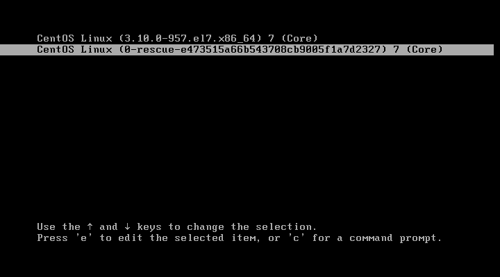

2. Chuyển đến dòng `linux16 ...` và thay đổi `ro` thành `rw init=/sysroot/bin/sh`

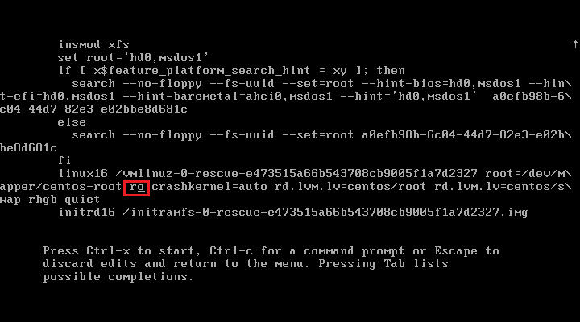

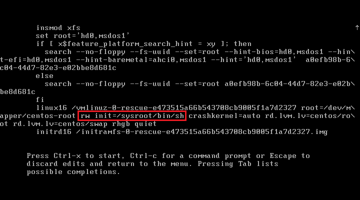

3. Bấm `Ctrl + x` để vào chế độ người dùng

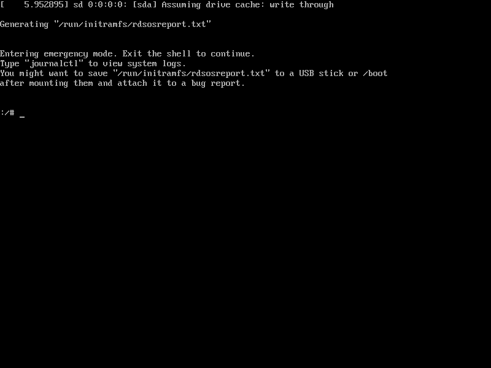

4. Truy cập vào hệ thống với câu lệnh `chroot /sysroot`

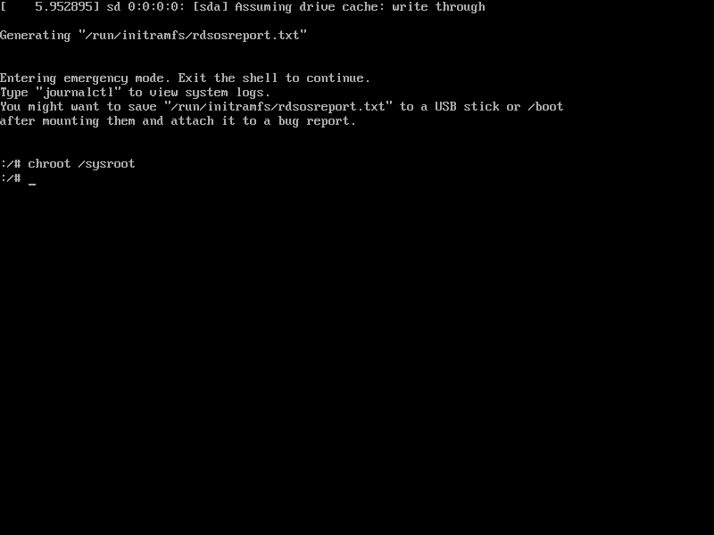

5. Tiếp theo ta đặt lại mật khẩu cho tài khoản root với câu lệnh `passwd root`

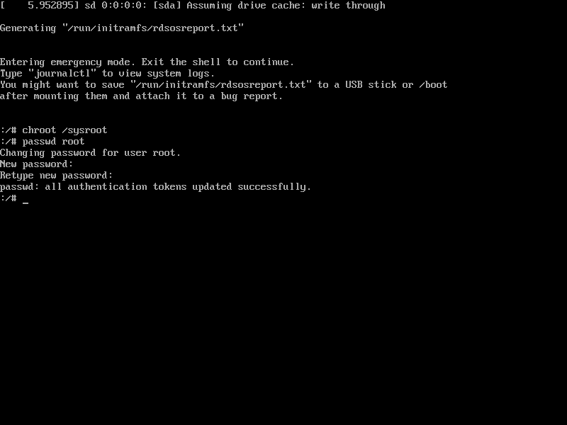

6. Update selinux information với câu lệnh `touch /.autorelabel` (ở bước này thì tùy vào hệ thống có enable selinux hay không, nếu disable thì không cần thiết phải làm)

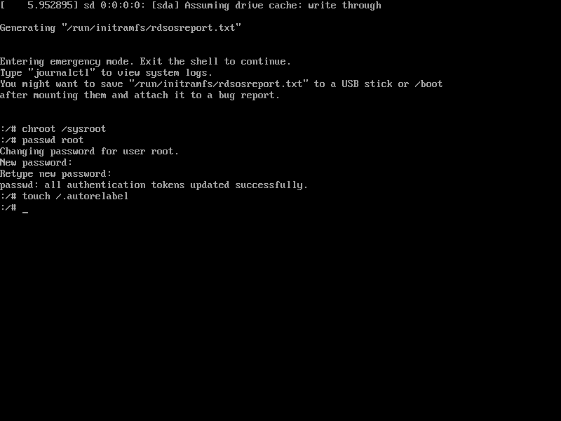

7. Exit chroot `exit`

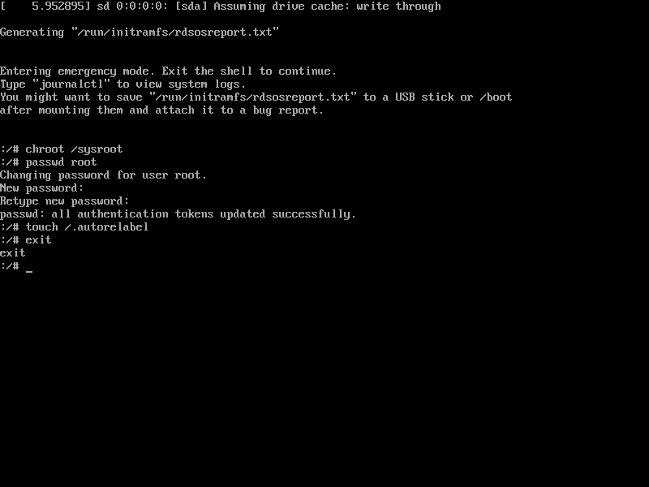

8. Reboot system `reboot`

#### Ubuntu

1. Khởi động lại hệ thống vào ‘GRUB2′ boot loader menu.

Bấm nút ESC để màn hình dừng lại, sau đó ấn nút `e` ở dòng entry `Ubuntu` để
thực hiện chỉnh sửa boot loader.

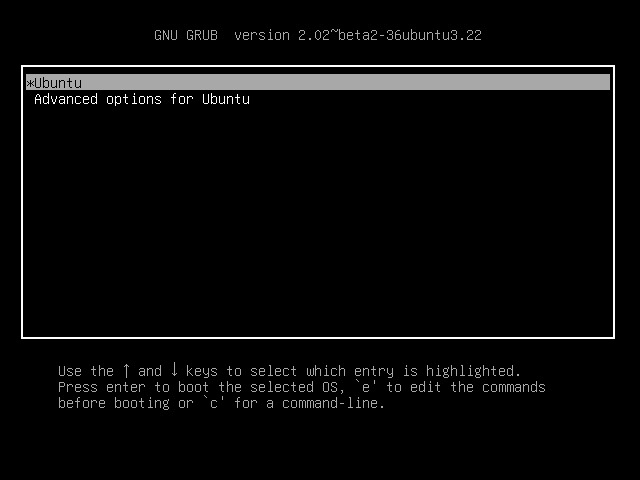

2. Chỉnh thông số entry GRUB2.

Tìm đến dòng entry cấu hình bắt đầu bằng `linux…` sau đó thêm cấu hình kích hoạt chế độ read-write mode rw và init=/bin/bash vào cuối dòng cấu hình. Lưu ý xoá nội dung cấu hình `quiet splash` và `$vt_handoff` nếu có trước khi
reset root password.

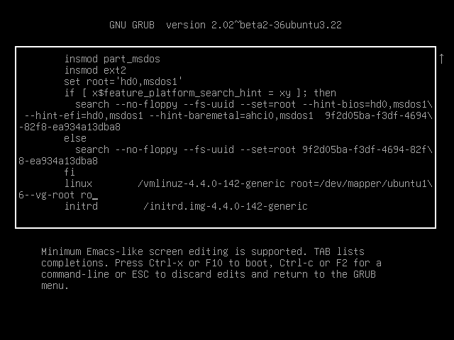

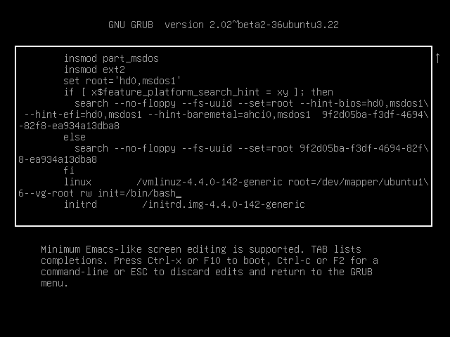

Sau đó bấm `Ctrl + x` hoặc `F10` để boot

3. Đặt lại mật khẩu của root.

Nếu mọi việc suôn sẻ, bây giờ bạn sẽ thấy dòng lệnh shell và phân vùng gốc của bạn sẽ được gắn với cờ đọc / ghi. Để xác nhận chạy, ta dùng câu lệnh:

`mount | grep -w /`

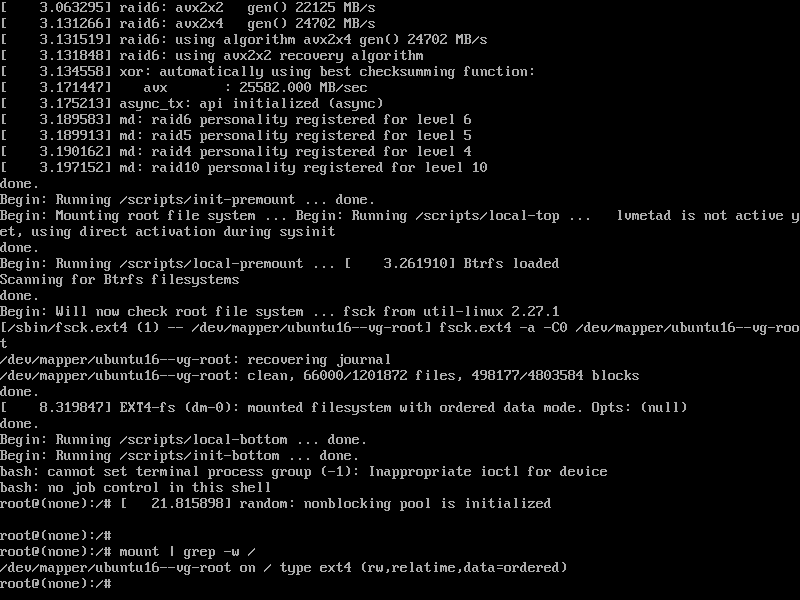

Bây giờ chúng ta đã sẵn sàng để thiết lập lại mật khẩu của root. Để làm như vậy, chỉ cần chạy `passwd` không có đối số đi kèm

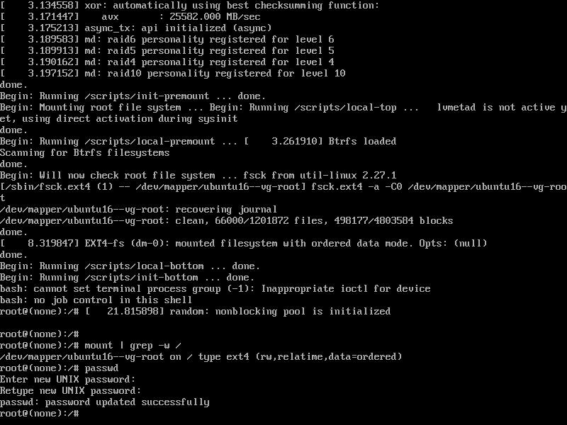

Như vậy là ta đã đặt lại mật khẩu cho root.

4. Reboot System

Khởi động lại hệ thống của bạn bằng lệnh sau:

`exec /sbin/init`

Sau đó bạn có thể đăng nhập root với mật khẩu vừa được đặt lại.
