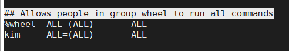
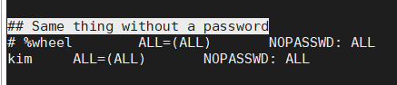

## Group wheel and /etc/sudoer

- Các hệ thống Unix hiện đại thường sử dụng các nhóm người dùng làm giao thức bảo mật để kiểm soát các đặc quyền truy cập. Wheel group là nhóm người dùng đặc biệt được sử dụng trên một số hệ thống Unix, để kiểm soát quyền truy cập vào lệnh `su` hoặc `sudo`, cho phép người dùng chạy các command dưới quyền người dùng khác (thường là root). Ubuntu tạo ra một nhóm được gọi sudo với mục đích tương tự như nhóm wheel.

- Để thêm 1 user vào wheel group, ta có thể làm như sau:

Ví dụ: trên Ubuntu 16.04, nhóm `sudo` có các đặc quyền quản trị viên đầy đủ. Ta có thể cấp cho người dùng những đặc quyền tương tự bằng cách thêm chúng vào nhóm như thế này:

`usermod -aG sudo username`

cũng có thể sử dụng lệnh `gpasswd` để làm điều tương tự

`gpasswd -a username sudo`

Trên CentOS, đây sẽ là nhóm `wheel` thay vì `sudo`:

`usermod -aG wheel username`

hoặc sử dụng `gpasswd`:

`gpasswd -a username wheel`

Trên CentOS, nếu việc thêm người dùng vào nhóm không hoạt động ngay lập tức, bạn có thể phải chỉnh sửa tệp `/etc/sudoer` để bỏ comment tên nhóm:

`visudo`

> **Lưu ý: Vì cú pháp không đúng trong tệp `/etc/sudoers` có thể khiến hệ thống không thể có được các đặc quyền nâng cao, điều quan trọng là sử dụng `visudo` để chỉnh sửa tệp. Lệnh `visudo` mở một trình soạn thảo văn bản như bình thường, nhưng nó xác nhận các cú pháp của tập tin sau khi lưu. Điều này ngăn các lỗi cấu hình chặn các lệnh `sudo` hoạt động, đây có thể là cách duy nhất để bạn có được các đặc quyền `root`. Bình thường, `visudo` mở tệp `/etc/sudoers` bằng trình soạn thảo văn bản `vi`. Ubuntu, tuy nhiên, đã cấu hình `visudo` để sử dụng trình soạn thảo văn bản `nano` thay thế.

```
. . .
%wheel	ALL=(ALL)	ALL
. . .
```

Cũng có 1 cách khác để thêm người dùng vào nhóm `wheel`, đó là chỉnh sửa file `/etc/group`

`vi /etc/group`

sau đó thêm người dùng vào nhóm `wheel` và lưu lại. Các người dùng sẽ được ngăn cách nhau bởi dấu phẩy `,`.

- Để xóa 1 người dùng khỏi nhóm wheel, ta làm như sau:

`usermod -G "" username`

hoặc có thể sử dụng lệnh `gpasswd`:

`gpasswd -d username wheel`

Tương tự như bên trên thì ta cũng có thể chỉnh sửa để xóa người dùng khỏi nhóm bằng cách chỉnh sửa trong tệp `/etc/group`

- Cũng có 1 cách khác để cho các user có quyền truy cập vào các lệnh `su` hoặc `sudo` đó là chỉnh sửa ngay trong tệp `/etc/sudoer`. Tìm đến dòng `## Allows people in group wheel to run all commands` và thêm user muốn có đặc quyền theo cú pháp

`username	ALL=(ALL)	ALL`



sau đó lưu file lại

- Sau khi đã cho các người dùng có quyền để truy cập vào các lệnh `su` hoặc `sudo`, họ có thể dùng nó với các command khác để chạy như là root. Nhưng sau đó hệ thống vẫn yêu cầu nhập mật khẩu của người dùng, nếu thực thi các câu lệnh mà không cần phải nhập mật khẩu, ta cần chỉnh sửa trong file `/etc/sudoer`

Tìm đến dòng `## Same thing without a password` và thêm user vào

`ussername	ALL=(ALL)	NOPASSWD: ALL`

