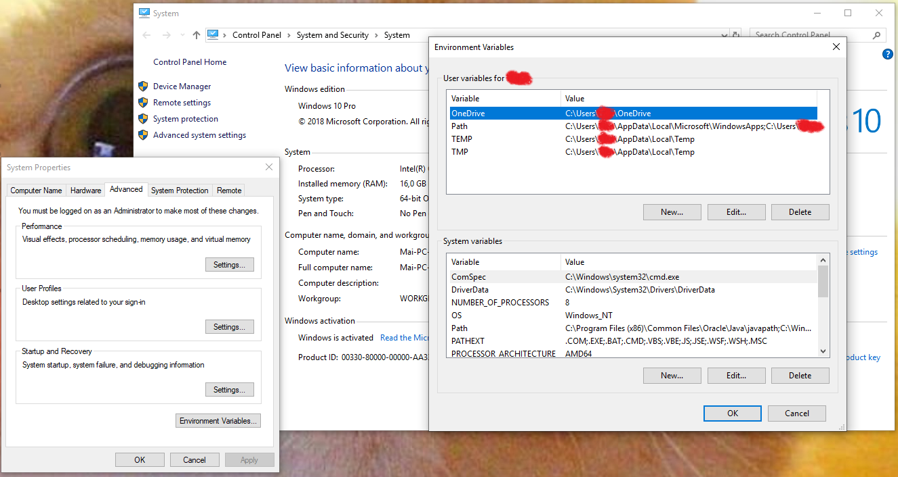
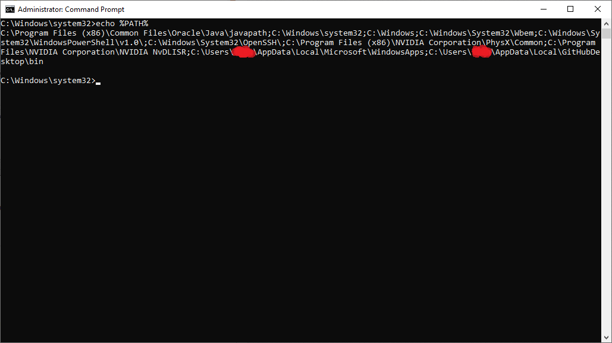
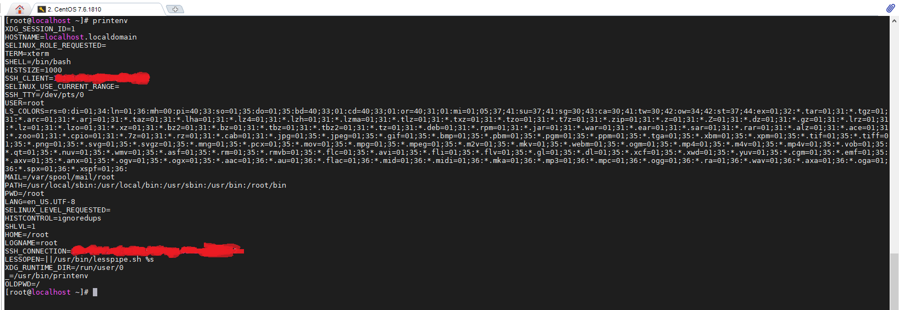
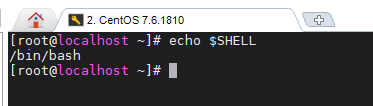
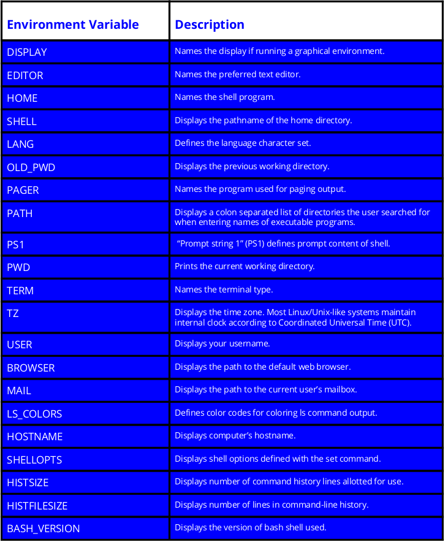

## Biến môi trường trong linux

Khi làm việc trên máy tính chúng ta cần những thông tin như tên phiên bản hệ điều hành (HĐH) đang chạy, tên thư mục home, tên thư mục chứa lệnh chương trình, ... 

Một khái niệm quan trọng trên linux đó là môi trường (environment) được định nghĩa qua các biến môi trường. Biến môi trường là một đối tượng được đặt tên có chứa dữ liệu được sử dụng bởi một hoặc nhiều ứng dụng. Nói một cách đơn giản, nó là một biến có tên và giá trị. Một số biến được đặt bởi hệ thống, số khác do bạn đặt, hoặc được set bởi các shell hay một chương trình nào đó được load.

Chúng được giới thiệu ở dạng hiện đại vào năm 1979 với Phiên bản 7 Unix , do đó, chúng được bao gồm trong tất cả các phiên bản và biến thể của hệ điều hành Unix từ thời điểm đó trở đi bao gồm cả Linux và macOS

Trên Windows cũng có khái niệm biến môi trường. Ban chuột phải vào Compuer (This PC) -> Properties -> Advanced System Settings -> Environment Variables. Có system và user variables

Nếu sử dụng command prompt thì bạn bật CMD và gõ câu lệnh `echo %PATH%`

Trên Linux bạn có thể dùng câu lệnh `printenv` hoặc `set`

Các lệnh cho biến môi trường

`env`  - Lệnh liệt kê tất cả các biến môi trường trong shell.

`printenv`  - Lệnh in tất cả (nếu không có biến môi trường được chỉ định) các biến môi trường và định nghĩa của môi trường hiện tại.

`set`  - Lệnh gán hoặc định nghĩa một biến môi trường.

`unset` - Lệnh xóa biến môi trường.

`export` - Lệnh xuất giá trị của biến môi trường mới được gán.

#### Một số biến môi trường trong linux

- Biến PATH

PATH là một biến môi trường chứa danh sách các thư mục mà chương trình Shell sẽ tìm kiếm cho file thực thi tương ứng với tên lệnh được đưa ra bởi người dùng, các mục cách nhau dấu bởi dấu hai chấm `:` ví dụ /usr/local/sbin:/usr/local/bin...

- Biến HOME

HOME là một biến môi trường đại diện cho thư mục home của người dùng. Lệnh `cd` không có đối số sẽ thay đổi thư mục làm việc hiện tại thành giá trị của HOME.

> Chú ý: Ký tự dấu ngã `~`  thường được sử dụng làm chữ tắt cho $HOME. Nên lệnh `cd $HOME` và `cd ~` hoàn toàn giống nhau.

- Biến $SHELL

Biến môi trường SHELL trỏ đến shell mặc định của người dùng (chương trình đang xử lý bất cứ điều gì bạn đang gõ trong cửa sổ lệnh, thường là bash) và chứa tên đường dẫn đầy đủ đến shell

- Biến PWD

Biến này trỏ đến thư mục hiện tại. Tương đương với đầu ra của lệnh `pwd` khi được gọi mà không có đối số.

Bạn có thể tham khảo thêm các biến môi trường trong ảnh dưới

