## Cấu hình mạng trên CentOS 7

Sau khi cài đặt một máy tính chạy hệ điều hành Linux (Centos), việc cấu hình card mạng rất cần thiết. Mặc dù mặc định giao thức DHCP(Dynamic Host Configuration Protocol) có thể tự cấu hình nhưng thiết lập IP tĩnh sẽ giúp bạn quản lý dễ dàng hơn.

#### Sử dụng file cấu hình

- Kiểm tra các network interface trên máy bằng câu lệnh

`ip a`

hoặc `ifconfig -a`

Nếu dùng câu lệnh `ifconfig -a` thì máy của bạn phải được cài đặt `net-tools`.

Để cài dặt `net-tools`, dùng câu lệnh sau `yum install net-tools`

Danh sách các network interface được liệt kê

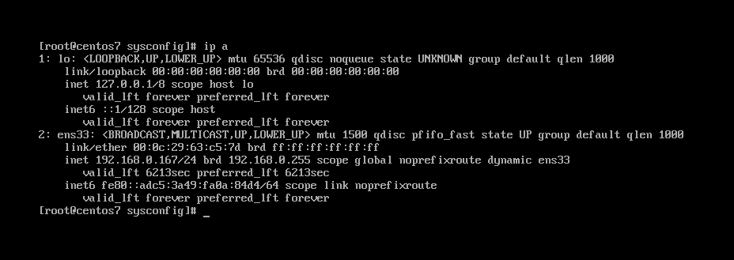

- Ta sẽ cấu hình ip tĩnh cho card mạng `ens33`

Centos lưu cấu hình mỗi một card mạng riêng trong một file, vì vậy ta cần truy cập theo đường dẫn `/etc/sysconfig/network-scripts/ifcfg-ens33` để cấu hình cho card mạng `ens33`

`vi /etc/sysconfig/network-scripts/ifcfg-ens33`

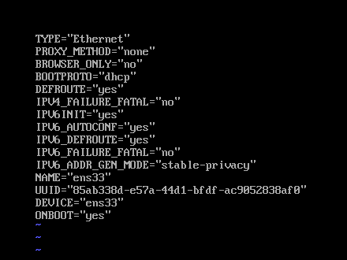

Ở đây ta thấy dòng `BOOTPROTO="dhcp"` có nghĩa là máy tính đang nhận địa chỉ ip từ dhcp server (ở đây là router), ta sẽ sửa thành "none" (tùy chọn none mặc định là tĩnh) và cấu hình ip tĩnh cho máy tính

Ta sẽ cấu hình các thông số mạng phổ biến đó là:

	- Địa chỉ IP
	- Mặt nạ mạng
	- Gateway
	- DNS Server

Ta thêm các dòng sau vào file cấu hình

```
IPADDR=địa chỉ ip tĩnh
NETMASK=subnet mask của mạng
GATEWAY=địa chỉ gateway của mạng
DNS1=địa chỉ dns server
```

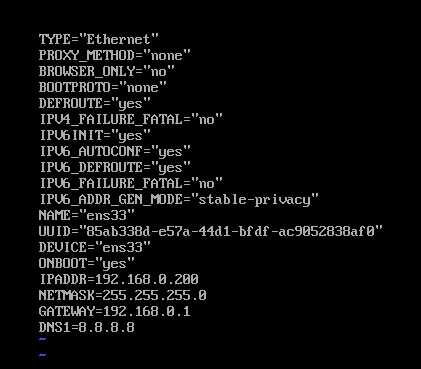

Nhấn Esc :wq và ấn phím Enter để lưu file.

- Sau khi cấu hình xong, bạn khởi động lại dịch vụ network bằng lệnh

`systemctl restart network`

- Xem lại cấu hình với câu lệnh `ifconfig`

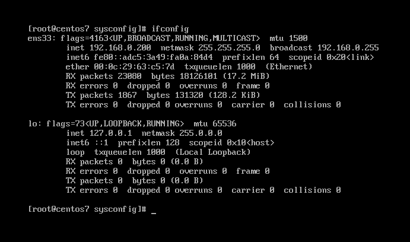

Như vậy là ta đã dặt ip tĩnh cho máy

- Ping thử 1 địa chỉ hoặc 1 trang web

`ping google.com`

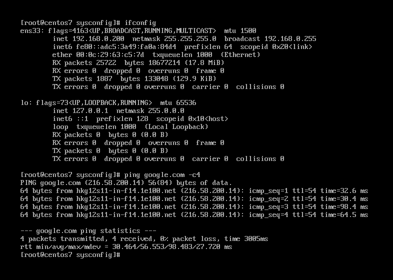

#### Sử dụng GUI mode

Ngoài việc sử dụng file cấu hình với môi trường dòng lệnh, ta còn có thể sử dụng chế độ GUI để cấu hình. Chế độ GUI được khuyến nghị sử dụng mới những người mới bắt đầu

- Gõ câu lệnh `nmtui` (Network Manager Text User Interface)

- Nếu muốn sử dụng công cụ `nmtui`, máy tính phải được cài đặt công cụ này, để kiểm tra ta dùng câu lệnh `which nmtui`. Nếu chưa được cài đặt, ta cài đặt công cụ này với câu lệnh `yum install NetworkManager-tui`

- Chọn `Edit a connection`

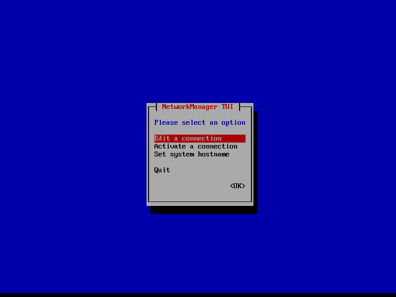

- Tại đây ta sẽ thấy card ens33, chọn `Edit...` (sử dụng TAB hoặc các phím mũi tên để di chuyển)

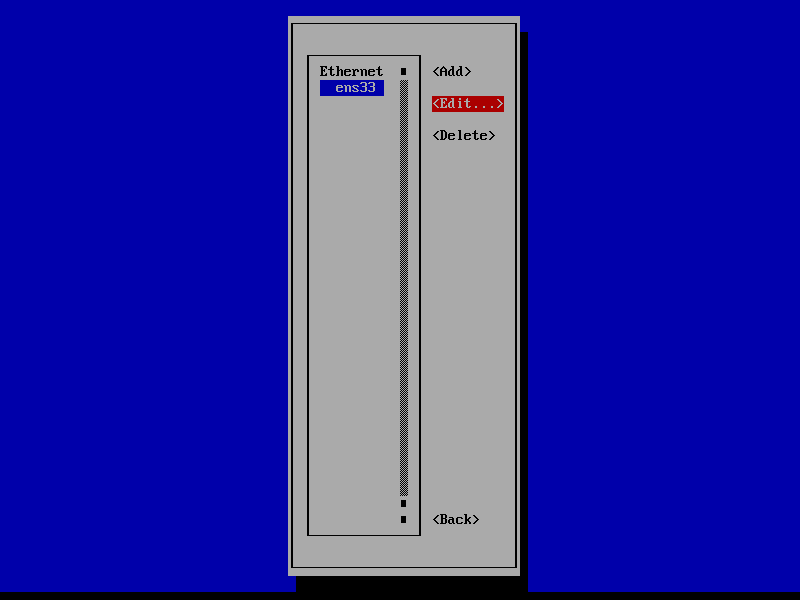

- Tại mục `IPv4 CONFIGURATION` chọn `Manual`

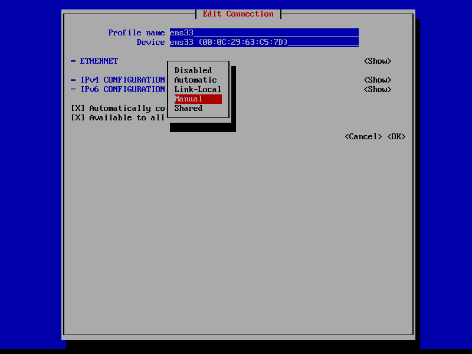

- Điền các thông số cấu hình vào các mục `Addresses`, `Gateway`, `DNS Servers`

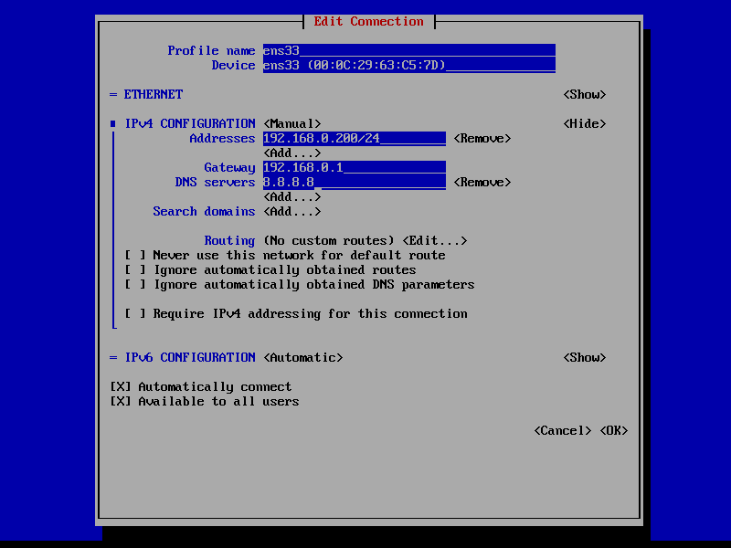

- Sau khi đã cài đặt những thông tin cần thiết, chọn OK. Và khởi động lại máy tính

- Kiểm tra lại cấu hình `ifconfig`

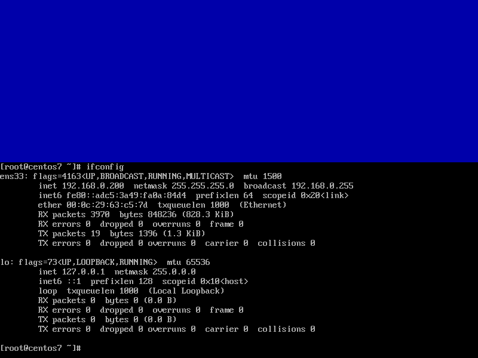

- Ping thử đến 1 địa chỉ hoặc 1 trang web

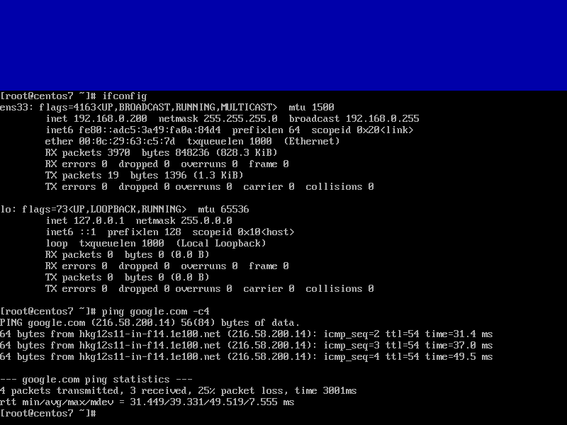