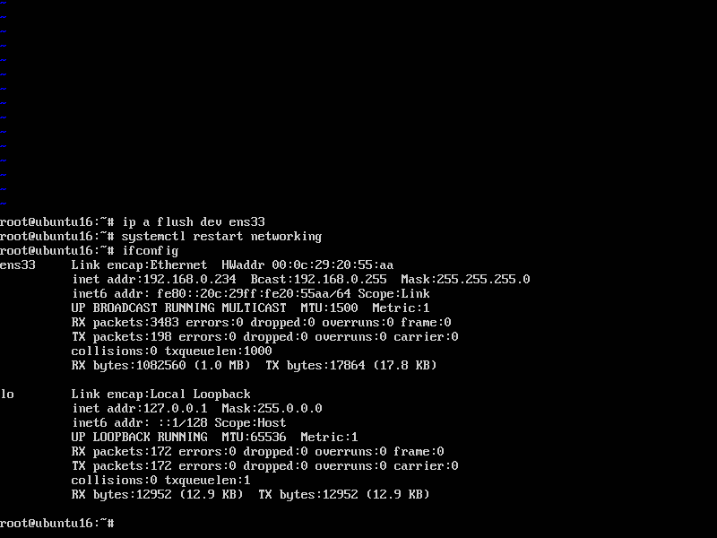
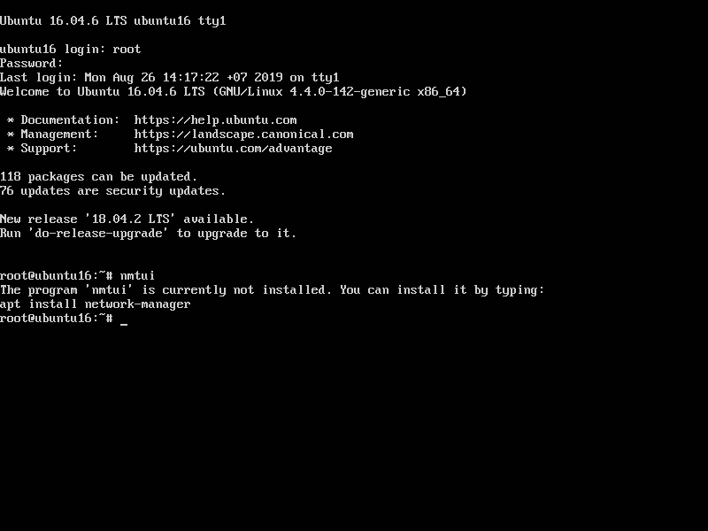

## Cấu hình mạng trên Ubuntu 16

#### Sử dụng file cấu hình

- Liêt kê các network interface trên máy

`ifconfig -a`


- Ta sẽ tiến hành cấu hình ip tĩnh cho card mạng `ens33`

- Mở file /etc/network/interfaces và tiến hành cấu hình ip tĩnh

`vi /etc/network/interfaces`


- Ta thấy card mạng `ens33` đang nhận ip từ dhcp server, ta đổi thành `static` và cấu hình các thông số cơ bản như

```
address địa chỉ ip tĩnh
netmask subnet mask của mạng
gateway địa chỉ gateway
dns-nameservers địa chỉ dns server
```


- Nhấn Esc :wq và ấn phím Enter để lưu file.

- Xóa các địa chỉ ip cũ trên card mạng ens33 với câu lệnh

`ip a flush dev ens33`

- Khởi động lại dịch vụ mạng để card mạng nhận địa chỉ ip mới

`systemctl restart networking`

- Kiểm tra lại cấu hình

`ifconfig`



- Ping thử đến 1 địa chỉ hoặc 1 trang web


#### Sử dụng chế độ GUI

- Gõ câu lệnh `nmtui`, nếu công cụ này chưa được cài đặt, hệ thống sẽ thông báo bạn cài đặt với câu lệnh `apt install network-manager`



- Mở file /etc/NetworkManager/NetworkManager.conf và sửa mục `managed=false` thành `true` và lưu lại


- Xóa dòng `iface ens33 inet dhcp` trong file `/etc/network/interfaces` để cho phép cấu hình và quản lý card mạng ens33 bằng công cụ `nmtui`

- Khởi động lại máy tính

`reboot`

- Gõ `nmtui` và chọn `Edit a connection`


- Ở đây ta thấy có 1 kết nối (đó là card mạng ens33), chọn `Edit...`


- Mục `Ipv4 CONFIGURATION` chuyển thành `Manual` và tiến hành cấu hình các thông số


- Bấm chọn OK -> Quit.

- Xóa các địa chỉ ip cũ

`ip a flush dev ens33`

- Khởi động lại dịch vụ mạng

`systemctl restart networking`

- Kiểm tra lại cấu hình `ifconfig`


- Ping thử 1 địa chỉ hoặc 1 trang web

