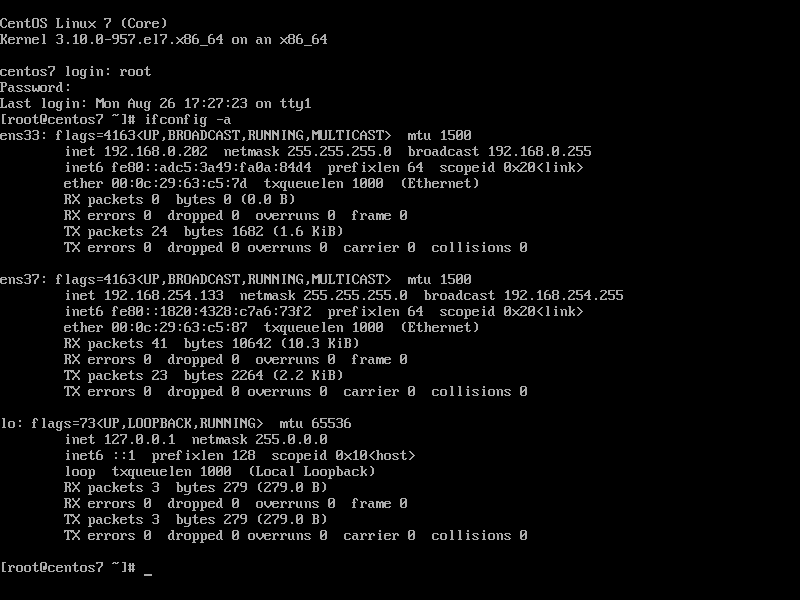
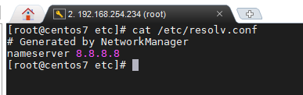

## Thêm card mạng vào CentOS 7 và tìm hiểu file cấu hình

- Trên VMware, để thêm 1 card mạng cho máy ảo chạy CentOS 7, ta làm như sau

	- Chuột phải vào tên máy ảo, chọn `Settings...`
	- Trong hộp thoại `Virtual Machine Settings`, chọn mục `Add...`
	- Chọn `Network Adapter` rồi `Finish`
	- Card mạng đầu tiên ở chế độ `Bridged` nên card mạng thứ 2 ta sẽ để ở chế độ `NAT`

- Bật máy ảo, đăng nhập và sử dụng câu lệnh `ifconfig -a` để liệt kê các network interfaces có trên máy



- Ở đây ta thấy có 1 card mạng tên là `ens37` vừa được thêm vào

- Tiến hành cấu hình địa chỉ ip cho card mạng này

- Truy cập theo đường dẫn /etc/sysconfig/network-scripts bằng câu lệnh `cd /etc/sysconfig/network-scripts`

- Liệt kê các file cũng như thư mục đang có ở đây `ls -al`


- Ở đây ta chưa thấy có file cấu hình tương ứng với card mạng `ens37`, vì vậy ta tiến hành tạo file cấu hình cho card mạng này

`touch ifcfg-ens37`

- Chỉnh sửa file cấu hình này

`vi ifcfg-ens37`

- Dưới đây là các option nên lưu ý khi cấu hình, còn lại để mặc định cũng được

	- DEVICE: tên logic của card mạng cần cấu hình, nên điền chính xác tên thì hệ thống mới biết được card nào cần cấu hình cho nó
	- NAME: đặt tên cho card mạng
	- ONBOOT: khởi động card mạng khi máy khởi dộng hay không, các tùy chọn là yes/no
	- BOOTPROTO: boot protocol cho card mạng, các tùy chọn là static, dhcp, bootp, none.
	- IPV6INIT: chức năng sử dụng ipv6 trên card mạng, nếu không muốn sử dụng thì có thể để "no"
	- IPADDR: địa chỉ ip khi cấu hình ip tĩnh
	- NETMASK: subnet mask
	- GATEWAY: địa chỉ gateway
	- DNS1: thông tin DNS server

> Lưu ý: Các dòng cấu hình không phân biệt hay ưu tiên thứ tự, chỉ cần có nội dung cấu hình cần thiết là được

- Với tùy chọn UUID (Universal Unique Identifier), ta có thể tạo uuid cho card mạng bằng lệnh sau

`uuidgen DEVICE`

Sau đó bạn có thể thêm nó vào tệp cấu hình

- Sau khi cấu hình cho card mạng, ấn Esc :wq để lưu file

- Tiếp theo sử dụng câu lệnh `ifdown ens37` để tắt card mạng, sau đó `ifup ens37` để card mạng nhận ip mới từ file cấu hình

- Bây giờ máy đã nhận 2 card mạng, ta thử ping đến 1 địa chỉ ip để xem card nào được sử dụng

`ping google.com -c5`

câu lệnh trên sẽ ping đến google.com với 5 gói tin

- Sau đó sử dụng tcpdump để bắt gói tin icmp

- Để biết máy đã được cài đặt tcpdump hay chưa, hãy gõ `which tcpdump`. Nếu chưa được cài, hãy dùng câu lệnh `yum instal tcpdump` để cài đặt

- Sau khi cài đặt tcpdump, ta sẽ bắt các gói tin trên cả 2 card `ens33` và `ens37`

`tcpdump -n -i ens33 icmp`

và

`tcpdump -n -i ens37 icmp`

- Kết quả:


Ở đây ta thấy như trong ảnh, có gói tin request được gửi đi từ địa chỉ ip 192.168.254.234 vaf nó nhận được reply từ địa chỉ 216.58.199.14

#### File cấu hình trong CentOS 7

Centos lưu cấu hình mỗi một card mạng riêng trong một file, mặc định sẽ nằm trong thư mục /etc/sysconfig/network-scripts. Ngoài những tùy chọn cấu hình cơ bản đã nêu ở trên, ta còn cso thể cấu hình thêm nhiều thứ cho card mạng với file cấu hình

Một số các tùy chọn tiêu biểu như

- TYPE: loại kết nối, thường là Ethernet
- HWADDR: địa chỉ mac của card mạng, ví dụ: 00:16:76:02:BA:DB
- BROADCAST: địa chỉ quảng bá cho mạng, ví dụ 192.168.0.255
- NETWORK: id mạng cho mạng con, chẳng hạn như lớp C 192.168.0.0
- PREFIX: độ dài tiền tố mạng, PREFIX=24 tương đương với NETMASK=255.255.255.0
- SEARCH: tên miền dns để tìm kiếm khi thực hiện tra cứu tên máy chủ không đủ tiêu chuẩn, chẳng hạn như example.com
- ETHTOOL_OPTS: tùy chọn này được sử dụng để đặt các mục cấu hình giao diện cụ thể cho giao diện mạng, chẳng hạn như tốc độ, trạng thái song công hay trạng thái tự động. Tùy chọn này có một số giá trị độc lập nên các giá trị phải được đặt trong tập hợp dấu ngoặc kép, ví dụ "autoneg off speed 100 duplex full"
- PEERDNS: tùy chọn yes chỉ ra rằng /etc/resolv.conf sẽ được sửa đổi bằng cách chèn các mục nhập máy chủ dns được chỉ định bởi các tùy chọn DNS1 và DNS2 trong tệp này. "no" có nghĩa là không thay đổi tệp resolv.conf
- USERCTL: chỉ định xem non-privileged user có thể bắt đầu và dừng giao diện mạng này hay không. Các tùy chọn là yes/no
- DEFROUTE | IPV6_DEFROUTE: chỉ định xem giao diện mạng này được đặt làm tuyến mặc định cho lưu lượng ipv4 | ipv6. Các tùy chọn yes/no
- IPV4_FAILURE_FATAL |IPV6_FAILURE_FATAL: các tùy chọn yes/no. "yes" : giao diện mạng này bị vô hiệu hóa nếu cấu hình ipv4 hoặc ipv6 không thành công, "no" : giao diện mạng này không bị tắt nếu cấu hình không thành công

#### Tệp tin cấu hình mạng bổ sung

Ngoài các tệp cấu hình giao diện mạng riêng lẻ trong thư mục /etc/sysconfig/network-scripts, còn có một số tệp cấu hình mạng khác, chúng là

- /etc/hosts
- /etc/resolv.conf
- /etc/sysconfig/network

1. /etc/hosts

Tệp tin này liên kết tên máy chủ với địa chỉ ip. Nó giải quyết hoặc tra cứu 1 địa chỉ ip khi biết tên máy chủ. Các mạng lớn hơn sẽ sử dụng Domain Name Server (DNS) để thực hiện việc phân giải tên miền này. Ngay cả khi sử dụng DNS, trong file này vẫn có 1 dòng chỉ định địa chỉ ip loopback (127.0.0.1) là localhost.localdomain. Một tệp tin mẫu /etc/hosts như sau: cột đầu tiên chứa đại chỉ ip, cột thứ 2 là tên miền đầy đủ của máy chủ, các cột bổ sung chứa bí danh tên máy chủ


2. /etc/resolv.conf

Tệp cấu hình phân giải để cấu hình máy chủ dns. Nó chứa các thông tin được đọc bởi các trình phân giải trong lần đầu tiên chúng được gọi bởi một tiến trình. Tệp tin có cấu trúc để người quản trị có thể hiểu và cấu hình được, nó chứa danh sách các từ khóa với các giá trị cung cấp nhiều loại thông tin phân giải khác nhau. Nếu tệp này không tồn tại, chỉ có máy chủ trên máy cục bộ sẽ được truy vấn, tên miền sẽ được xác định từ tên máy chủ và đường dẫn tìm kiếm tên miền được xây dựng từ tên miền



3. /etc/sysconfig/network

Tập tin /etc/sysconfig/network ghi rõ thông tin bổ sung có giá trị cho tất cả các giao diện mạng trên hệ thống.

Ví dụ: Các mục sau đây từ /etc/sysconfig/network xác định rằng mạng IPv4 được bật, mạng IPv6 không được bật, tên máy chủ của hệ thống và địa chỉ IP của cổng mạng mặc định:

```
NETWORKING=yes
NETWORKING_IPV6=no
HOSTNAME=host20.mydomain.com
GATEWAY=192.168.1.1
```

Để biết thêm thông tin, hãy xem thêm bên trong tệp tin /usr/share/doc/initscripts^/sysconfig.txt (^ là 1 dãy số, như ở đây trên máy tôi là 9.49.46)


