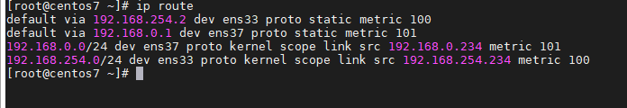
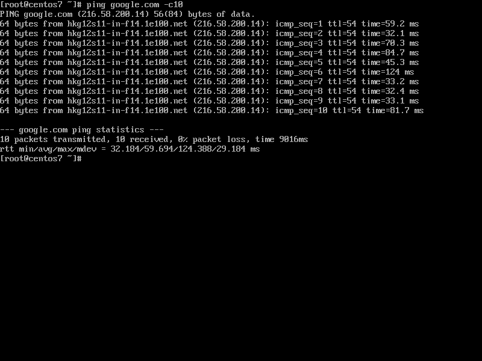
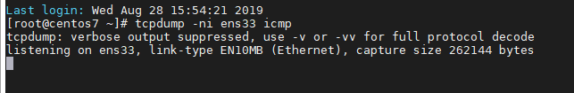
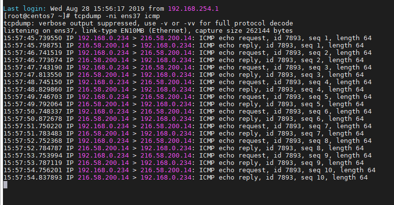

## Chuyển đổi card mạng để kết nối mạng trong Linux

Khi mà bạn có nhiều kết nối và muốn đổi từ 1 kết nối này sang 1 kết nối khác (ví dụ đổi từ kết nối không dây sang có dây), ta có thể làm như sau:

- Đầu tiên ta chạy lệnh `ip route` để hiển thị bảng định tuyến ip. Ví dụ:

- Như ta thấy trong ảnh trên có 2 đường kết nối với 2 default gateway lần lượt là `192.168.254.2` và `192.168.0.1`

- Ở đây ta còn thấy 1 chỉ số gọi là chỉ số `metric`. Đây là số liệu được sử dụng bởi bộ định tuyến để đưa ra quyết định định tuyến. Một chỉ số metric thường là một trong nhiều trường trong bảng định tuyến. Chỉ số metric giúp bộ định tuyến chọn tuyến tốt nhất trong số nhiều tuyến khả thi đến đích. Tuyến đường sẽ đi theo hướng của cổng với chỉ số thấp nhất.

- Vì vậy, khi chỉnh sửa chỉ số metric là ta đã chỉnh sửa độ ưu tiên của card mạng để kết nối

1. Chỉnh sửa với câu lệnh

Dùng câu lệnh `ip route add default via dev proto metric`, ví dụ:

`ip route add default via 192.168.254.2 dev ens33 proto static metric 200`

để định tuyến tĩnh card mạng ens33 qua địa chỉ gateway 192.168.254.2 với chỉ số metric 200

Sau đó, ta xóa cấu hình cũ đi `ip route del default via dev proto metric`

Ping thử đến 1 địa chỉ bên ngoài và dùng `tcpdump` để bắt các gói tin và xem card mạng nào được sử dụng

card `ens33`

card `ens37`

2. Chỉnh sửa trong file cấu hình

Khi cấu hình cho card mạng với file cấu hình, có 1 tùy chọn là `DEFROUTE` với 2 giá trị là `yes/no`. Tùy chọn này có nghĩa là sẽ sử dụng giao diện mạng nào làm mặc định để kết nối, nếu muốn card `ens37` làm mặc định thì vào file cấu hình và thêm dòng

`DEFROUTE=yes`

còn card `ens33` thì thêm

`DEFROUTE=no`

thoát và lưu file.