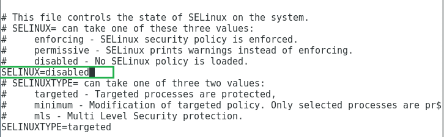

## Khởi tạo local repository trên CentOS 7

Kho lưu trữ phần mềm (viết tắt là repo) là 1 vị trí lưu trữ tệp trung tâm để giữ và duy trì các gói phần mềm, từ đó người dùng có thể truy xuất các gói và cài đặt trên máy tính của họ.

Các kho lưu trữ thường được lưu trữ trên các máy chủ trên mạng, ví dụ như internet để cho nhiều người dùng có thể truy cập. Tuy nhiên, bạn có thể tạo và cấu hình kho lưu trữ cục bộ trên máy tính cảu mình và truy cập dưới dạng 1 người dùng hoặc cho phép các máy tính khác trên mạng LAN truy cập vào.

Một lợi thế của việc thiết lập kho lưu trữ cục bộ là bạn không cần kết nối internet để cài đặt các gói phần mềm.

1. Cài đặt wrb server

Chúng ta biết là các repository hỗ trợ download cài đặt các gói phần mềm thông qua giao thức phổ biến là http, vì vậy ta sẽ cài đặt 1 web server (ở đây ta có thể dùng apache hoặc nginx web server)

-  Cài đặt nginx web server trên máy

`yum install nginx`

- Khi đã cài đặt máy chủ web nginx, bạn hãy chạy nó và cho phép no tự khởi động cùng với hệ thống

```
systemctl start nginx
systemctl enable nginx
```

- Tiếp theo, bạn cần mở cổng 0 và 443 để cho phép lưu lượng truy cập web vào dịch vụ nginx, cập nhật các quy tắc tường lửa hệ thống

```
firewall-cmd --zone=public --permanent --add-service=http
firewall-cmd --zone=public --permanent --add-service=https
```
- Reload lại tường lửa để các quy tắc có hiệu lực

`firewall-cmd --reload`

- Xác nhận rằng máy chủ web nginx đang hoạt động, sử dụng ip hoặc domain của server để truy cập


- Tiếp theo, disable SELinux bằng cách chỉnh trong file /etc/sysconfig/selinux

chỉnh sửa tham số `SELINUX=enforcing` thành `disabled`




- Cuối cùng reboot lại hệ thống để cấu hình có hiệu lực

2. Tạo kho lưu trữ cục bộ yum

- Trong bước này, bạn cần cài đặt các gói cần thiết để tạo, định cấu hình và quản lý kho lưu trữ cục bộ

`yum install createrepo`

Một công cụ hữu ích là gói phần mềm commeepo. Phần mềm này kết hợp một số tệp .rpm lại với nhau thành kho lưu trữ repomd

- Tiếp theo, cài đặt yum-utils để cung cấp cho hệ thống của bạn một hộp công cụ tốt hơn để quản lý kho lưu trữ

`yum install yum-utils`

- Tiếp theo, tạo các thư mục cần thiết (kho yum) để lưu trữ các gói cũng như các thông tin liên quan

`mkdir mkdir -p /var/www/html/repos/{base,centosplus,extras,updates}`

- Sau đó, sử dụng công cụ reposync để đồng bộ hóa kho lưu trữ CentOS yum với các thư mục cục bộ như được hiển thị

```
reposync -g -l -d -m --repoid=base --newest-only --download-metadata --download_path=/var/www/html/repos/
reposync -g -l -d -m --repoid=centosplus --newest-only --download-metadata --download_path=/var/www/html/repos/
reposync -g -l -d -m --repoid=extras --newest-only --download-metadata --download_path=/var/www/html/repos/
reposync -g -l -d -m --repoid=updates --newest-only --download-metadata --download_path=/var/www/html/repos/
```

trong đó:

`-g`: loại bỏ các gói không kiểm tra chữ ký GPG sau khi tải xuống
`-l`: cho phép hỗ trợ plug-in yum
`-d`: xóa các gói cục bộ không còn trong kho lưu trữ
`-m`: tải xuống các tệp comp.xml
`--repoid`: chỉ định id kho lưu trữ
`--newest-only`: chỉ tải xuống phiên bản mới nhất của mỗi gói
`--download-metadata`: tải xuống các sieu dữ liệu không mặc định
`--download_path`: đường dẫn tải xuống các gói

- Tiếp theo, kiểm tra nội dung các thư mục để đảm bảo rằng tất cả các gói đã được đồng bộ hóa cục bộ

```
ls -al /var/www/html/repos/base/
ls -al /var/www/html/repos/base/Packages/
ls -al /var/www/html/repos/centosplus/
ls -al /var/www/html/repos/centosplus/Packages/
ls -al /var/www/html/repos/extras/
ls -al /var/www/html/repos/extras/Packages/
ls -al /var/www/html/repos/updates/
ls -al /var/www/html/repos/updates/Packages/
```

- Sau đó, tạo 1 repo data mới cho các kho lưu trữ cục bộ, trong đó tham số `-g` được sử dụng để cập nhật thông tin nhóm các gói bằng cách sử dụng các tập tin .xml được chỉ định sẵn

```
createrepo -g comps.xml /var/www/html/repos/base/  
createrepo -g comps.xml /var/www/html/repos/centosplus/	
createrepo -g comps.xml /var/www/html/repos/extras/  
createrepo -g comps.xml /var/www/html/repos/updates/
```

- Để cho phép xem các kho lưu trữ và các gói bên trong chúng thông qua trình duyệt web, hãy tạo 1 đường dẫn trỏ đến thư mục gốc kho lưu trữ của bạn từ máy chủ nginx

`vi /etc/nginx/conf.d/repos.conf`

- Chỉnh sửa tệp repos.conf bằng cách thêm vào các dòng sau

```
server {
        listen   80;
        server_name  192.168.254.234;	#change 192.168.254.234 to your real domain 
        root   /var/www/html/repos;
        location / {
                index  index.php index.html index.htm;
                autoindex on;	#enable listing of directory index
        }
}
```
- Sau đó khởi đọng lại dịch vụ nginx và xem các kh lưu trữ từ trình duyệt web


3. Thiết lập kho lưu trữ yum cục bộ trên máy client

- Trên máy client, thêm các repo cục bộ của bạn vào file cấu hình

`vi /etc/yum.repose.d/local-repose.repo`

```
[local-base]
name=CentOS Base
baseurl=http://192.168.254.234/base/
gpgcheck=0
enabled=1

[local-centosplus]
name=CentOS CentOSPlus
baseurl=http://192.168.254.234/centosplus/
gpgcheck=0
enabled=1

[local-extras]
name=CentOS Extras
baseurl=http://192.168.254.234/extras/
gpgcheck=0
enabled=1

[local-updates]
name=CentOS Updates
baseurl=http://192.168.254.234/updates/
gpgcheck=0
enabled=1
```

- Lưu lại file cấu hình

- Chạy lệnh sau để xem các repo cục bộ

`yum repolist`

