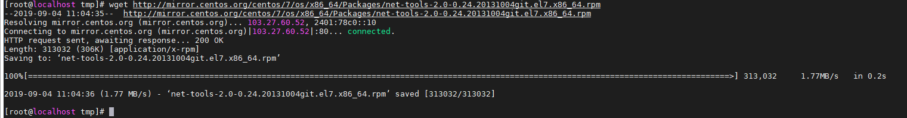
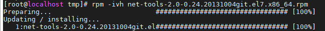
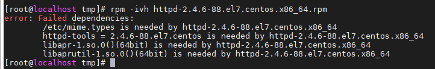
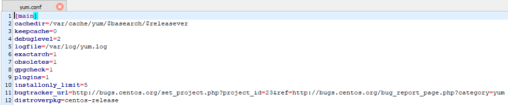
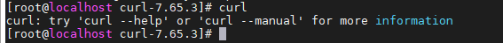

## Các cách cài dặt 1 package trên Linux

Nếu ai đã từng cài đặt phần mềm trên window, chắc hẳn khi lần đầu tiên cài đặt phần mềm trên Linux sẽ gặp it nhiều khó khăn. Vì đơn giản việc cài đặt phần mềm trên Linux không như trên window cứ click chuột sau đó next, next, ... cuối cùng finish là xong. Trên hệ thống Linux, nếu bạn nào đã từng cài đặt phần mềm thì sẽ thấy Linux có 3 cách cài đặt phổ biến là rpm (dpkg), yum (apt) và biên dịch phần mềm.

Ở đây mình sẽ hướng dẫn cài đặt 1 package trên HĐH CentOS 7

1. RPM (RPM Package Manager, ban đầu là Red Hat Package Manager)

1 tiện ích được phát triển trong dòng họ Linux Redhat từ khi mới ra đời. Tiện ích này có chức năng tương đương với dpkg trên hệ thông Ubuntu

Nó cung cấp cho người dùng các tính năng duy trì hệ thống của mình. Họ có thể cài đặt, xóa bỏ hay nâng cấp các package trực tiếp bằng lệnh. RPM có 1 cơ sở dữ liệu chứa các thông tin của các package đã cài đặt và các tập tin của chúng, nhờ vậy RPM cho phép bạn truy vấn các thông tin, cũng như xác thực các package trong hệ thống. Nhược điểm của RPM là không cài đặt các gói phụ thuộc.

Gói phụ thuộc là gì? Trên Linux 1 gói phần mềm muốn hoạt động được cần 1 cho đến nhiều thư viện khác để có thể chạy được. Để cho dẽ hiểu thì phần mềm A muốn chạy được thì cần phải có thư viện của phần mềm B và C, tương tự B và C lại cần các thư viện của các phần mềm D, E, F, ... cứ như vậy tùy thuộc vào người phát triển phần mềm. Do đó khi dùng RPM bạn phải thực hiện cài đặt tuần tự các gói phụ thuộc trước thì mới có thể cài được phần mềm mà bạn muốn cài lúc ban đầu.

Cấu trúc của 1 gói RPM như sau:


- Cài đặt 1 package:

	- Tải 1 tập tin trên mạng ta dùng lệnh `wget`:
	
	```
	cd /tmp
	wget http://mirror.centos.org/centos/7/os/x86_64/Packages/net-tools-2.0-0.24.20131004git.el7.x86_64.rpm
	```
	
	
	
	- Cài đặt gói vừa tải xuống với câu lệnh `rpm -ivh net-tools-2.0-0.24.20131004git.el7.x86_64.rpm`
	
	

	- Ở đây ta cài đặt thành công vì đã cài đặt các gói phụ thuộc từ trước, còn nếu không sẽ báo lỗi như sau:
	
	
	
	- Nếu muốn cài đặt 1 package với rpm thì ta cần cài đặt các gói phụ thuộc trước rồi mới cài được package đó. Đây cũng là nhược điểm của rpm
	
- Giải thích các tùy chọn đã dùng:
	
	- `–i`: (install) cài đặt một package

	- `–v`: (verbose) hiện thị tóm tắt kết quả sau khi cài đặt package

	- `–h`: (hash) hiện thị dấu `#` thông báo quá trình cài đặt đang tiếp diễn

- Gỡ bỏ 1 package:

	- Dùng câu lệnh `rpm -e tên_package` để gỡ bỏ
	
	- Nếu gỡ bỏ 1 package mà package đó còn phụ thuộc vào các package khác thì khi gỡ bỏ ta dùng thêm tùy chọn `-nodeps`

2. YUM (Yellowdog Updater Modified)

1 tiện ích khác được cộng đồng Redhat phát triển riêng, nó cũng tương tự như rpm nhwung với mục đích giúp người dùng cài đặt các phần mềm dễ dàng hơn. Ở yum có sự khác biệt với rpm là nó tự động xác định và cài đặt các gói phụ thuộc trước khi cài gói chính.

- Cài đặt 1 package:

`yum install tên_package`: câu lệnh này sẽ cài đặt gói chính cùng với bất kỳ gói phụ thuộc nào mà nó yêu cầu

- Gỡ bỏ 1 package:

`yum remove tên_package`: gỡ bỏ 1 gói cụ thể khỏi hệ thống

- Thư mục cấu hình của yum sẽ được lưu ở /etc/yum.conf

Tại đây bạn sẽ thấy các tùy chọn cấu hình cho yum


 
Một số các tùy chọn phổ biến:

cachedir=/var/cache/yum/$basearch/$releasever - thư mục sẽ lưu các package khi được tải về bởi yum, trong đó các giá trị `$basearch` và `$releasever` là kiến trúc vi xử lý và phiên bản phát hành của HĐH
keepcache=0 - tùy chọn giữ lại các package sau khi cài đặt, 0 là tắt, 1 là bật
logfile=/var/log/yum.log - vị trí file log
gpgcheck=1 - kiểm tra khóa gpg khi tải package

- Ngoài ra, theo mặc định, yum cài đặt phiên bản mới nhất của gói trong số tất cả các phiên bản có sẵn trong kho lưu trữ được kích hoạt.

Thường thì không bắt buộc phải cài đặt phiên bản mới nhất, mà là một số phiên bản cụ thể hoặc hạ cấp gói đã cài đặt thành phiên bản cũ hơn.

Để cài đặt phiên bản cụ thể của gói, hãy chạy:

`yum install <package_name>-<version_info>`

Buộc Yum phải hạ cấp gói

Nếu bạn đã cài đặt phiên bản mới nhất của gói, nhưng bạn cần hạ cấp xuống phiên bản cụ thể cũ hơn, hãy thực hiện:

`yum downgrade <package_name>-<version_info>`

3. Biên dịch phần mềm

Phương pháp này khác hơn so với rpm và yum, nó không phụ thuộc vào việc bạn đang dùng distro nào miễn là dùng Linux thì đều có thể dùng phương pháp này. Bước đầu tiên khi muốn thực hiện phương pháp này là bạn phải có file source của nó (có định dạng thường là file nén tar.gz, tar.bz2 ...). Sau khi down file source về bạn tiến hành giải nén nó ra, sau đó vào thư mục giải nén thực hiện quá trình đầu tiên là check thư viên và các file config. Lỗi thường xảy ra nhiều nhất ở bước này cũng như chiếm nhiều thời gian nhất trong 3 bước cài đặt, qua được bước này thì 2 bước kia coi như là hoàn tất.

Nhìn chung biên dịch phần mềm có phần giống với tiện ích rpm là không thể tự động tìm các gói phụ thuộc để cài đặt trước như tiện ích yum, và 1 đặc điểm chung nữa là cả yum và rpm đều cài đặt những gói nhị phân. Cài đặt gói nhị phân như rpm hay yum thì bạn sẽ không thể tự mình điều khiển được những gì muốn cài vào hệ thống mà gần như mặc định là cài tất cả. Với phương pháp biên dịch phần mềm thì bạn có thể tùy chỉnh cài đặt những thành phần nào vào hệ thống ở bước đầu tiên. Bên cạnh đó, việc sử dụng phương pháp biên dịch sẽ giúp tối ưu hóa tài nguyên hệ thống. Tuy nhiên hoạt động biên dịch (compile) thường phức tạp hơn nên bạn cần kiên nhẫn chịu khó

- Biên dịch phần mềm [curl](https://curl.haxx.se/)

	- Điều đầu tiên chúng ta cần là tải về mã nguồn curl. Có rất nhiều cách khác nhau để tải xuống nguồn, nhưng trong ví dụ này, chúng tôi sẽ sử dụng tarball có sẵn từ trang web curl. Bạn có thể thay thế url trong lệnh tiếp theo bằng phiên bản curl hiện tại nếu bạn muốn.

	`wget https://curl.haxx.se/download/curl-7.65.3.tar.gz`
	
	Điều này sẽ tải xuống và lưu file mã nguồn trong thư mục hiện tại của bạn.
	
	- Tiếp theo chúng ta sẽ cần giải nén tarball. Để thực hiện việc này:
	
	`tar -xvzf curl.tar.gz`
	
	- Vào thư mục vừa giải nén để chuẩn bị biên dịch
	
	`cd curl-7.65.3`
	
	Các bạn đọc file README hoặc INSTALL để biết hướng dẫn cài đặt
	
	- Cấu hình cho gói phần mềm (bước này xảy ra lỗi nhiều nhất)
	
	Trong thư mục bạn sẽ nhận thấy rất nhiều tập tin khác nhau. Nhưng bạn chỉ cần tập trung vào tệp có tên "configure". "configure" là một tập lệnh được thiết kế để hỗ trợ chương trình được chạy trên nhiều máy tính khác nhau. Tiếp theo chạy lệnh:
	
	`./configure`
	
	Nếu bạn muốn cài đặt curl vào thư mục khác với thư mục mặc định /usr/local, hãy thêm tham số `--prefix=` khi chạy configure:
	
	trong đó:
	
	`--prefix` là nơi sẽ cài phần mềm giống như việc chọn đường dẫn để cài phần mềm trong windows
	
	Điều này sẽ tự động sử dụng các biến hệ thống của bạn để định cấu hình. Về cơ bản, nó phù hợp với các thư viện theo yêu cầu của chương trình, với các thư viện được cài đặt trên hệ thống của bạn. Bằng cách này, trình biên dịch sẽ biết nơi tìm các thư viện theo yêu cầu của nguồn hoặc trong trường hợp này là curl. Bên cạnh đó, nó cũng sẽ tìm ra nơi để cài đặt gói sau đó. Khi hoàn thành, nó sẽ tạo một tệp có tên Makefile với tất cả thông tin trong đó. Bây giờ bạn đã sẵn sàng để biên dịch mã nguồn.
	
	- Để biên dịch nó chạy lệnh:
	
	`make`
	
	Điều này sẽ biên dịch mã nguồn rất nhiều đầu ra ở màn hình của bạn. Chỉ cần chờ đợi và để cho nó kết thúc. Nó sẽ mất khoảng một phút hoặc lâu hơn. Khi hoàn thành, bạn đã sẵn sàng để cài đặt nó.
	
	Bạn cũng có thể chạy thêm lệnh `make test` để đảm bảo việc biên dịch mã nguồn diễn ra suôn sẻ
	
	- Để cài đặt, hãy chạy câu lệnh sau với quyền root:
	
	`make install`
	
	Bây giờ `make` sẽ làm theo các hướng dẫn trong Makefile để cài đặt gói đã biên dịch.
	
	Nếu curl đã được cài đặt đúng cách, bạn gõ `curl` và sẽ thấy đầu ra như sau:
	
	
	
	Như vậy là bạn đã hoàn tất việc cài đặt curl bằng biên dịch mã nguồn