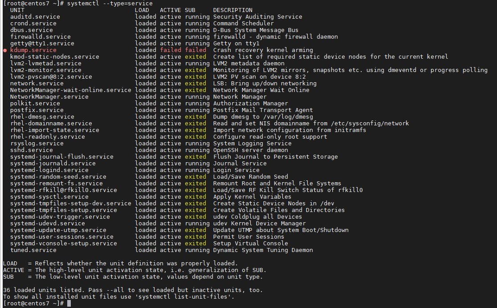
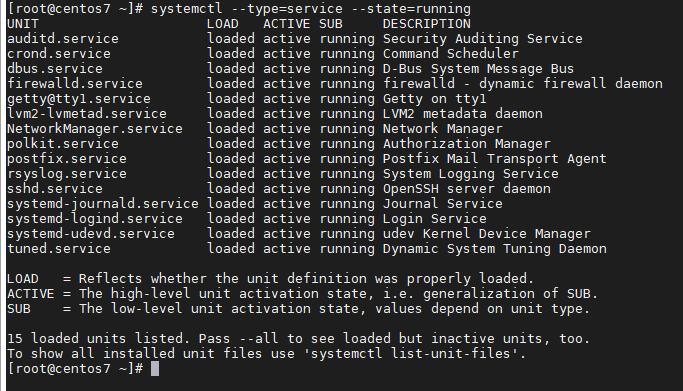

## Các tác vụ làm việc với 1 service

Là quản trị viên, điều cần thiết là bạn phải quản lý chính xác các dịch vụ và tiến trình đang chạy trên máy chủ của mình, không chỉ duy trì tính toàn vẹn của máy chủ để phần mềm không gặp sự cố mà còn quản lý bảo mật đúng cách

Dịch vụ trong Linux là 1 ứng dụng (hoặc bộ ứng dụng) được chạy trong nền (running background) đang chờ để sử dụng hoặc thực hiện các tác vụ thiết yếu. Chúng cơ bản được gọi trong giao tiếp giữa các tiến trình. Ví dụ: htppd

Để liệt kê các service được load trên hệ thống (cho dù là active, running, exited hoăc failed) hãy dùng lệnh sau:

`systemctl list-units --type=service`

hoặc dùng lệnh `systemctl --type=service`

Trong trường hợp chỉ muốn biết các dịch vụ đang chạy (tức là tất cả các dịch vụ được tải và đang hoạt động), chỉ cần thêm tham số "--state=running":

`systemctl list-units --type=service --state=running`

hoặc `systemctl --type=service --state=running`

Quản lý service trên Linux

Các service thường sẽ được cấu hình trong các file riêng biệt và được quản lý thông qua câu lệnh "systemctl". Bộ ba tùy chọn quen thuộc của systemctl sẽ dùng khi muốn bật/tắt một service:

- start: bật service

- stop: tắt service

- restart: tắt service rồi bật lại (ngoài ra còn có reload để tải lại file cấu hình tuy nhiên chỉ có 1 số chương trình hỗ trợ như apache/nginx ...)

3 tùy chọn trên được sử dụng khi hệ thống đang hoạt động. Tuy nhiên, "systemctl" cũng cung cấp 2 tùy chọn khác để điều khiển việc hoạt động của 1 service từ lúc khởi động hệ thống:

- enable: service sẽ được khởi động cùng với hệ thống

- disable: service sẽ không được khởi động cùng hệ thống

Để xem trạng thái của 1 service, dùng câu lệnh sau:

`systemctl status tên_service`

> Lưu ý: Các lệnh trên chỉ áp dụng cho hệ thống Linux sử dụng systemd. Systemd là một trình quản lý hệ thống và dịch vụ cho Linux; một sự thay thế cho quá trình init, tương thích với các tập lệnh init SysV và LSB và lệnh systemctl là công cụ chính để quản lý systemd.