## Process trong Linux, các loại process

Process hay còn gọi là tiến trình là một thể hiện đặc biệt của 1 chương trình/lệnh khi được thực thi. Nó được tạo thành từ các hướng dẫn chương trình, dữ liệu đọc từ các tệp, các chương trình khác hoặc đầu vào từ người dùng hệ thống.

Bất cứ khi nào một lệnh được thực hiện trong unix/linux, nó sẽ tạo/bắt đầu một tiến trình mới. Ví dụ: lệnh "pwd" khi được sử dụng để liệt kê vị trí thư mục hiện tại mà người dùng đang ở, một tiến trình bắt đầu.

Trong Linux khi bạn bắt đầu một tiến trình, nó được cung cấp một số duy nhất được gọi là PID hoặc process-id. Hệ điều hành sẽ theo dõi các tiến trình thông qua các pid này. Mỗi tiến trình có duy nhất 1 pid.

Tại bất kỳ thời điểm nào, không có 2 tiến trình có cùng pid tồn tại trong hệ thống.

PID 1 luôn được gán cho tiến trình init, đây là tiến trình đầu tiên được bắt đầu khi khởi động.

- Các loại tiến trình:

	- Tiến trình cha và tiến trình con: khi gõ lệnh `ps -f`, ta sẽ thấy 2 cột thứ 2 và thứ 3 sẽ hiển thị PID và PPID của tiến trình. Đối với mỗi tiến trình người dùng thì có 1 tiến trình cha tương ứng trong hệ thống, với hầu hết các lệnh thì bash shell là cha của chúng. Tiến trình "init" là 1 tiến trình đặc biệt trong Linux, đó là tiến trình đầu tiên mà kernel khởi chạy khi hệ thống khởi động với PID = 1, vì vậy về nguyên tắc nó không có tiến trình cha. Các tiến trình khác sẽ là tiến trình con của "init" trực tiếp hoặc gián tiếp. "init" có đặc quyền đặc biệt là nó không thể bị "giết", nó chỉ chấm dứt hoạt động khi hệ thống Linux ngừng hoạt động
	
	- Tiến trình zombie và tiến trình mồ côi: giả sử có 2 tiến trình là tiến trình cha và tiến trình con đang chạy trên hệ thống, khi đó có thể có 2 kịch bản xảy ra:
	
		- Tiến trình cha kết thúc hoặc bị "giết" trước tiến trình con: với kịch bản này, tiến trình con sẽ trở thành tiến trình mồ côi vì nó đã không còn tiến trình cha. Lúc này "init" sẽ trở thành tiến trình cha mới cho chúng.
		
		- Tiến trình con kết thúc và tiến trình cha không nhận được "wait()" tức khắc: khi tiến trình con kết thúc, tình trạng của nó sẽ được chuyển đến tiến trình cha qua "wait() call". Vì vậy kernel sẽ đợi tiến trình cha lấy trạng thái kết thúc của tiến trình con trước khi no xóa sạch hoàn toàn tiến trình con. Nhưng trong trường hợp tiến trình cha không thể thực hiện "wait()" (để lấy trạng thái kết thúc), tiến trình con bị chấm dứt và trở thành tiến trình zombie. 1 tiến trình zombie là 1 tiến trình đang chờ tiến trình cha của nó lấy trạn thái kết thúc của nó. Mặc dù kernel giải phóng tất cả các tài nguyển mà tiến trình zombie sử dụng trước khi nó bị "giết", một số thông tin như trạng thái kết thúc của nó, ID tiến trình của nó, ... vẫn được lưu trữ bởi kernel nên nó vẫn còn trên bảng tiến trình
	
	- Tiến trình Deamon: chúng là các tiến trình chạy nền liên quan đến hệ thống và không yêu cầu tương tác người dùng. Các tiến trình deamon chủ yếu để đáp ứng các yêu cầu dịch cụ từ các máy tính khác trên amngj, nhưng nó cũng để đáp ứng các chương trình khác và hoạt động phần cứng. Theo truyền thống, tên của tiến trình deamon kết thức bằng "d" để chỉ ra tiến trình này là 1 deamon và để phân biệt 1 deamon và 1 chương trình bình thường khác, ví dụ: syslogd là trình nền thực hiện ghi nhật ký hệ thống và sshd là trình nền phục vụ các kết nối SSH đến

- Các trạng thái của 1 tiến trình trong Linux

Trong quá trình thực thi, 1 tiến trình thay đổi từ trạng thái này sang trạng thái khác tùy thuộc vào môi trường / hoàn cảnh của nó. Trong Linux, 1 tiến trình có thể có các trạng thái sau:

	- Running: 1 tiến trình đang chạy (đó là tiến trình hiện tại trong hệ thống) (R)
	
	- Sleeping: ở trạng thái này, 1 tiến trình đang chờ 1 sự kiện xảy ra hoặc cho 1 tài nguyên hệ thống. Ngoài ra, kernel cũng phân biệt giữa 2 loại là interruptible sleep mode - có thể bị gián đoạn bởi các tín hiệu (S) và uninterruptible sleep mode - đang chờ để chạy và không thể bị gián đoạn bởi bất kỳ sự kiện/tín hiệu nào (D)
	
	- Stopped: ở trạng thái này, 1 tiến trình dã bị dừng, thường là bằng cách nhận tín hiệu (T) hoặc bởi quá trình gỡ lỗi (t)
	
	- Zombie:: ở đây, 1 tiến trình đã chết. Tiến trình đã bị chấm dứt nhưng không được giải phóng bởi tiến trình cha nên nó vẫn còn trong bảng tiến trình (Z)

- Bắt đầu một tiến trình

Khi bắt đầu một tiến trình (đơn giản là chạy 1 lệnh), có 2 cách để chạy nó:

Foreground Process (còn được gọi là các tiến trình tương tác): Mọi quy trình khi bắt đầu chạy ở foreground theo mặc định, nhận đầu vào từ bàn phím và gửi đầu ra tới màn hình. Khi 1 lệnh/tiến trình đang chạy ở foreground thì sẽ không có tiến trình nào khác có thể được chạy hoặc bắt đầu vì lời nhắc sẽ không có sẵn cho đến khi chương trình kết thúc xử lý và xuất hiện dấu nhắc

Background Process (còn được gọi là các tiến trình không tương tác/tự động): Nó chạy trong nền mà không cần nhập bàn phím. Do đó, các tiến trình khác có thể được thực hiện song song với tiến trình đang chạy trong nền vì chúng không phải đợi tiến trình trước đó được hoàn thành.

Để bắt đầu 1 tiến trình chạy nền thì ta chỉ cần thêm dấu "&" vào cuối câu lệnh, ví dụ "pwd &"

Bạn cũng có thể gửi 1 tiến tình tới background bằng cách tạm dừng nó bằng cách sử dụng "Ctrl + Z", điều này sẽ gửi tín hiệu "SIGSTOP" đến tiến trình, dừng hoạt động của nó. Để tiếp tục chạy 1 tiến trình đang bị treo trong nền, sử dụng lệnh "bg" 

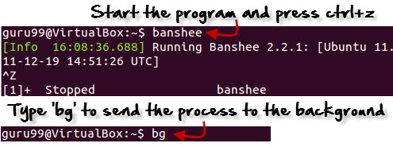

Để gửi 1 tiến trình nền tới foreground, ta sử dụng lệnh "fg", cú pháp đơn giản cho việc này là:

`fg tên_tiến trinh` hoặc `fg %job_id`

Ví dụ:

1. Khởi chạy trình phát nhạc "banshee"
2. Dừng nó với lệnh "Ctrl + Z"
3. Tiếp tục với câu lệnh "fg"

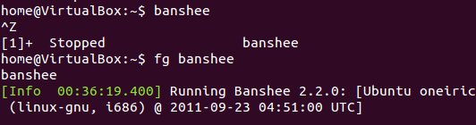

- Theo dõi các tiến trình hoạt động trong Linux

Có 1 số công cụ trong Linux để xem / liệt kê các tiến trình đang chạy trên hệ thống, trong đó 2 công cụ truyền thống và nổi tiếng là các lệnh "ps" và "top"

1. Lệnh "ps" - hiển thị trạng thái của tiến trình ở thời điểm hiện tại

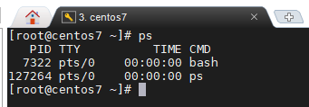

Để biết thêm các thông tin, ta có thể thêm tùy chọn "-f"

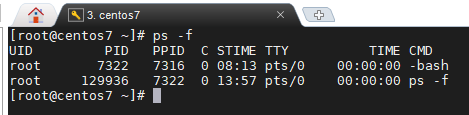

Các trường được mô tả trong lệnh "ps"

| Thông số | Miêu tả |
| --- | --- |
| UID | ID người dùng khởi chạy tiến trình |
| PID | Process ID |
| PPID | ID tiến trình cha (ID của tiến trình đã khởi dộng nó) |
| C | CPU sử dụng bởi tiến trình |
| STIME | Thời gian bắt đầu tiến trình |
| TTY | Kiểu terminal liên kết với tiến trình |
| TIME | Thời gian CPU sử dụng bởi tiến trình |
| CMD | Lệnh bắt đầu tiến trình |

Ngoài ra còn có một số các tùy chọn khác có thể được sử dụng cùng với lệnh "ps"

"-A": Hiển thị tất cả các tiến trình
"-u": Hiển thị tiến trình có tên người dùng hoặc ID hiệu quả nằm trong danh sách người dùng
"-C <command>": Hiển thị tiến trình dựa trên câu lệnh
"r": Chỉ hiển thị các tiến trình đang chạy
"ps aux --sort=-pcpu,+pmem": Hiển thị process đang dùng nhiều tài nguyên như CPU, memorry
"ps -e -o pid,comm,etime": Hiển thị các process và thời gian chạy của chúng

2. "top" - công cụ giám sát hệ thống

top là 1 công cụ mạnh mẽ cung cấp cho người dùng chế độ xem thời gian thực của 1 hệ thống đang chạy như ảnh chụp bên dưới

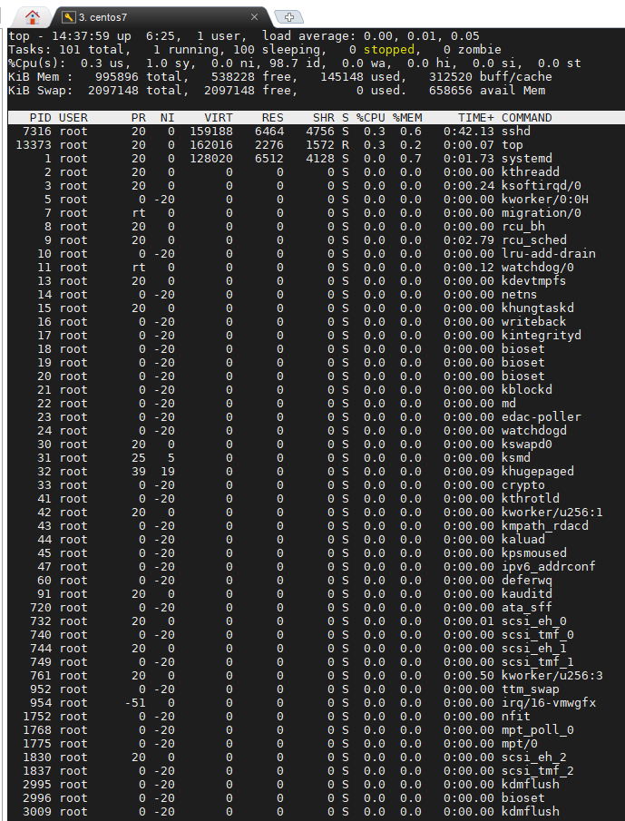

Lệnh "top" hiển thị các thông tin có thể giám sát như các thông số CPU, RAM, ... các tiến trình đang hoạt động trên hệ thống

Dòng đầu tiên miêu tả các thông tin về: thòi gian hiện tại, thời gian hệ thống đã hoạt động, số user login vào hệ thống, thời gian CPU load trung bình trong khoảng 1/5/15 phút

Dòng thứ 2 có các thông tin về các tiến trình: tổng số tiến trình, số tiến trình hiện đang chạy, số tiến trình ở chế độ sleep, số tiến trình đã bị dừng, số tiến trình zombie

Dòng thứ 3 là các thông số liên quan đến CPU:

	- "us - user": thời gian CPU dành quá trình thực hiện trong không gian người dùng
	
	- "sy - system": thời gian CPU dành cho việc chạy các quy trình không gian hạt nhân
	
	- "ni - nice": Linux sử dụng 1 gia trị gọi là "nice" để xác định mức độ ưu tiên của 1 tiến trình. Thông số này ở đây chỉ thời gian CPU dành cho việc thực hiện các tiến trình ưu tiên của người dùng
	
	- "id -idle": thời gian CPU không hoạt động. Hầu hết các HĐH đặt CPU ở chế độ nghỉ để tiết kiệm năng lượng khi không hoạt động
	
	- "wa - I/O wait": thời gian CPU dành để chờ I/O hoàn thành
	
	- "hi - hardware interrupts" và "si - software interrupts": Ngắt là tín hiệu cho bộ xử lý về một sự kiện đòi hỏi sự chú ý ngay lập tức. Các ngắt phần cứng thường được sử dụng bởi các thiết bị ngoại vi để báo cho hệ thống về các sự kiện, chẳng hạn như nhấn phím trên bàn phím. Mặt khác, các ngắt phần mềm được tạo ra do các hướng dẫn cụ thể được thực hiện trên bộ xử lý. Trong cả hai trường hợp, hệ điều hành xử lý chúng, và thời gian dành cho việc xử lý ngắt phần cứng và phần mềm được đưa ra bởi 2 thông số "hi" và "si" tương ứng
	
	- "st": Trong môi trường ảo hóa, một phần tài nguyên CPU được cung cấp cho mỗi máy ảo (VM). HĐH phát hiện khi nào có việc phải làm, nhưng nó không thể thực hiện chúng vì CPU đang bận trên một số VM khác. Lượng thời gian bị mất theo cách này được hiển thị là "st"

2 dòng tiếp theo mô tả thông số memory được sử dụng:

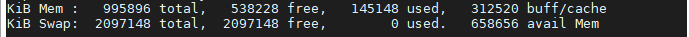

Dòng đầu tiên trong 2 dòng này là các thông tin về RAM:

	- "total": tổng dung lượng RAM
	
	- "free": dung lượng RAM còn trống
	
	- "used": dung lượng RAM được sử dụng
	
	- "buff/cache": dung lượng bộ đệm / cache

Dòng thứ 2 là các thông số về swap memory:

	- "avail Mem": dung lượng bộ nhớ swap có thể phân bổ cho các tiến trình

Nói một cách đơn giản, một không gian swap là một phần của đĩa cứng được sử dụng như RAM. Khi mức sử dụng RAM gần đầy, các vùng RAM được sử dụng không thường xuyên sẽ được ghi vào không gian swap, sẵn sàng để lấy lại sau khi cần. Tuy nhiên, vì việc truy cập đĩa chậm, việc phụ thuộc quá nhiều vào việc hoán đổi có thể gây hại cho hiệu năng hệ thống.

Kể từ dòng thứ 6 là 1 danh sách các tiến trình. Trong phần này có các cột khác nhau và các thông số khác nhau được hiển thị với đầu ra mặc định

| Thông số | Miêu tả |
| --- | --- |
| PID | ID của tiến trình, là 1 số nguyên dương duy nhất xác định 1 tiến trình |
| USER | tên người dùng "hiệu quả" (được ánh  xạ tới ID người dùng) của người dùng đã bắt đầu tiến trình |
| PR | trường PR hiển thị giá trị mức độ ưu tiên lập lịch theo kernel |
| NI | giá trị NI ảnh hưởng đến sự ưu tiên của 1 tiến trình |
| VIRT | dung lượng ram ảo được sử dụng bởi tiến trình |
| RES | dung lượng ram thực được sử dụng bởi tiến trình |
| SHR | dung lượng ram share cho tiến trình |
| S | trạng thái của tiến trình |
| %CPU | %CPU được sử dụng bởi tiến trình |
| %MEM | % memory được sử dụng bởi tiến trình |
| TIME+ | tổng thời gian CPU được sử dụng bởi tiến trình kể từ khi nó bắt đầu |
| COMMAND | hiển thị tên tiến trình |

Lệnh "top" khi được chạy sẽ hiển thị 1 layout chứa danh sách các process đang chạy trên hệ thống và liên tục được cập nhật. Layout này có thể tương tác với bàn phím, ví dụ:

	- "h" hoặc "?": hiện cửa sổ help với các câu lệnh hữ dụng

	- "space": nhấn space trên bàn phim sẽ cập nhật bảng process ngay lập tức thay vì phải chờ

	- "f": thêm trường mới để hiển thị layout hoặc xóa những trường nhất định

	- "q": quit

	- "l": bật / tắt load average và thời gian uptime
	
	- "m": bật / tắt thông tin bộ nhớ
	
	- "Shift + P": sắp xếp process bằng CPU usage
	
	- "Shift + M": sắp xếp theo mức độ sử dụng bộ nhớ
	
	- "Shift + T": sắp xếp theo thời gian chạy
	
	- "Shift + N": sắp xếp theo pid
	
	- "Shif + V": sắp xếp theo tiến trình cha - contop
	
	- "s": đổi độ trễ giữa các lần refresh
	
	- "k": kill process 
	
	- "Shift + W": lưu cấu hình của top vào /root/.toprc

Với command "top", bạn có thể thêm các tùy chọn sau, ví dụ:

	- "-d": delay - xác định độ trễ
	
	- "-n number": refresh bao nhiêu lần rồi thoát
	
	- "-p <pid>": chỉ hiển thị và theo dõi process với đúng pid được chọn
	
	- "-u <user>": hiển thị và theo dõi process với user được chọn

- Dừng 1 tiến trình trong Linux

Với các tiến trình chạy trong chế độ foreground, nhấn "Ctrl + C" (ký tự ngắt) sẽ thoát lệnh

Đối với các tiến trình đang chạy trong chế độ background, sử dụng lệnh "kill" để kết thúc tiến trình nếu biết đươc PID của nó

Lệnh "kill" sẽ gửi tín hiệu được chỉ định đến 1 tiến trình hoặc nhóm tiến trình. Nếu không có tín hiệu nào được chỉ định, tín hiệu "TERM" sẽ được gửi đi như mặc định.

Ví dụ: `kill <pid>`

Nếu 1 tiến trình bỏ qua lệnh kill thông thường, bạn có thể sử dụng kill -9 theo sau là pid tiến trình

`kill -9 <pid>`

Tùy chọn "-9" sẽ gửi tín hiệu "SIGKILL" bắt vuộc dừng tiến trình ngay lập tức, chương trình không thể bỏ qua tín hiệu này

Một số tùy chọn của lệnh "kill"

	- "-1": "giết" tất cả tiến trình mà người dùng có quyền kill, ngoại trừ tiến trình có pid = 1 và chính tiến trình kill
	
	- "-l <SIGNAL>": hiển thị các tín hiệu có sẵn hoặc chuyển đổi tín hiệu được cung cấp làm đối sô thành tên hoặc từ tên thành số, chúng có thể được tìm thấy tại /usr/include/linux/signal.h
	
	- "-s <SIGNAL>": chỉ định tín hiệu để gửi, tín hiệu có thể được cung cấp dưới dạng tên hoặc số tín hiệu

- Lệnh "htop"

Cũng giống như "top", "htop" là 1 ứng dụng hoạt động trên Linux / Unix cho phép theo dõi các process theo dạng tương tác thời gian thực

	- Tính năng nổi bật:

		- Hiển thị tổng quan các tài nguyên hệ thống như CPU, lượng RAM, swap sử dụng
		
		- htop cho phép cuộn dọc để xem toàn bộ danh sách các process và cuộn ngang để xem toàn bộ các commnad
		
		- htop có khả năng khởi động rất nhanh so với top, do đó không cần lấy dữ liệu trong quá trình khởi động
		
		- htop cho chép kill nhiều hơn 1 process mà không cần chèn các pid
		
		- Với htop không cần nhập pid hoặc giá trị ưu tiên để thiết lập mức độ ưu tiên cho process (renice process)
		
		- htop cho phép sử dụng chuột để chọn các item
	
	- Cài đặt:
	
	htop cài đặt rất dễ dàng, bạn chỉ cần mở terminal lên và chạy dòng lệnh sau
	
		- Đối với Ubuntu / Debian: `sudo apt install htop`
		
		- Đối với CentOS / Fedora / RedHat: `sudo yum install htop`
	
	Sau khi cài đặt xong các bạn vào terminal gõ "htop"
	
	- Tổng quan
	
	Mặc định htop hiển thị mức độ sử dụng CPU và RAM ở khung trên cùng bên trái. Số lượng thanh tiến trình CPU tương ứng với số lượng CPU/Core của máy
	
	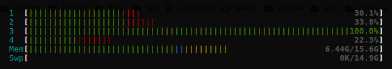
	
	Bạn sẽ thấy có nhiều màu, mỗi màu có ý nghĩa riêng:
	
	Đối với mức dùng CPU:
	
		- Xanh lam: các tiến trình độ ưu tiên thấp
		
		- Xanh lục: các tiến trình người dùng
		
		- Đỏ: các tiến trình hạt nhân
		
		- Vàng: thời gian IRQ (tín hiệu ngắt)
		
		- Đỏ tươi: thời gian soft IRQ
		
		- Xám: thời gian chờ I/O
	
	Mức dùng bộ nhớ RAM:
	
		- Xanh lục: bộ nhớ đã dùng
		
		- Xanh dương: bộ nhớ đệm cache
		
		- Vàng: bộ nhớ cache
		
	Mức tải trung bình: được bố trí phía trên bên phải. Systemload hay còn gọi là load, thể hiện số công việc hiện tại hệ thống đang thực thi. Load average cho ta thấy được trung bình khối lượng công việc hệ thống phải xử lý trong mỗi khoảng thời gian 1p, 5p, 15p
	
	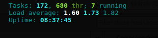
	
	Phía dưới là chi tiết mức sử dụng của từng process
	
	Phần dưới cùng, hiển thị phím tắt cho một số lựa chọn khác như Help, Setup, Filter, Tree, Kill, Nice, Quit,..Nếu bạn muốn thay đổi thứ tự hay cách hiển thị thì bạn ấn phím F2 rồi lựa chọn thiết lập mong muốn.
	
	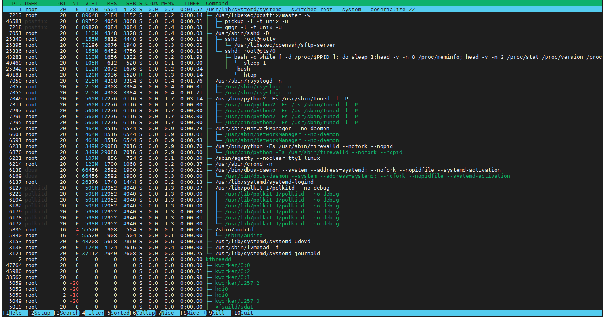
	
	- Sử dụng
	
		-Khi cần kill 1 process đơn giản chỉ cần sử dụng phím điều hướng lên xuống, di chuyển đến đúng process rồi ấn F9.
	
		- Bạn cũng có thể điều chỉnh độ ưu tiên cho process bằng 2 phím F7, F8. Một số process bạn cần chạy "htop" với quyền root mới có thể kill hoặc chỉnh độ ưu tiên
	
		- Có những process chạy độc lập nhưng có những process có các threads chạy bên trong, để xem các process dưới dạng tree bạn cần ấn phím F5.
	
		- Htop cho phép tìm kiếm 1 process theo highlight. Ấn F3 rồi gõ tên process cần tìm kiếm, nếu tìm thấy process khớp, htop sẽ highlight process đó lên. Bạn có thể tiếp tục tìm kiếm bằng cách ấn F3.
		
		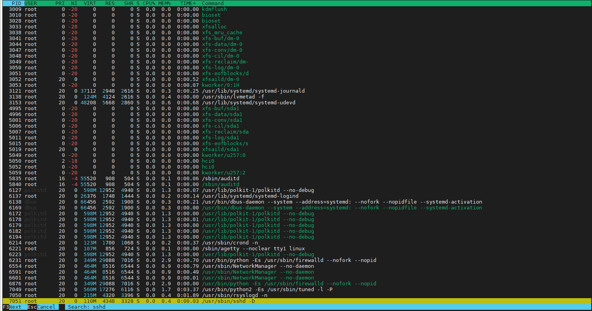
		
		- Filter là một trong những tính năng hữu ích giúp bạn theo dõi process mong muốn. Ví dụ bạn muốn theo dõi process "mysql", ấn phím F4 rồi gõ "mysql" thì danh sách bạn nhìn thấy chỉ còn lại toàn bộ các process mà tên có chứa "mysql".
	
		- Bạn có thể sắp xếp các process theo các trường khác nhau như PID, USER, PRIORITY... Ấn F6 rồi lựa chọn trong danh sách bên phía trái trường bạn muốn htop sắp xếp theo.
	
		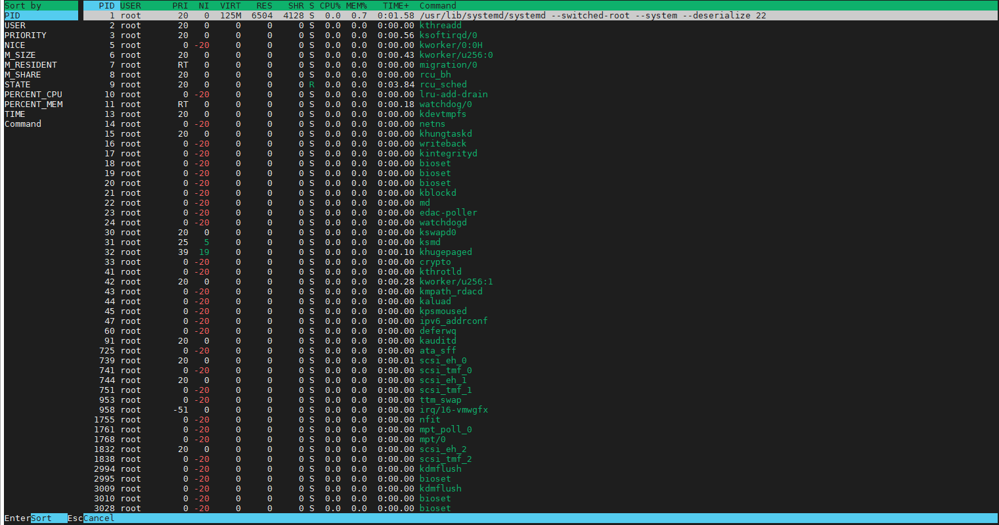
		
		- Và cuối cùng khi muốn thoát ra bạn ấn F10 để kết thúc.
	
Htop là một công cụ giám sát thời gian thực rất hiệu quả, cho phép người quản trị có cái nhìn trực quan nhất về hệ thống. Bạn có thể tham khảo thêm hướng dẫn sử dụng qua man page: `man htop`

- Lệnh "lsof"

"lsof" hay còn gọi là "list open files" - là 1 chương trình lệnh dùng để liệt kê thông tin về các file trên hệ thống đang hoặc đã mở (tiến trình còn hoạt động) bởi các tiến trình. Mà ta biết là trên hệ thống Unix/Linux thì mọi thứ đều là file (socket, directory, device, ...)

Output của lệnh "lsof" có 1 dòng header từng cột thể hiện  các nội dung tương ứng. Dưới đây là vài cái thông tin thường gặp ở các cột này

Chú thích output của chương trình lệnh
	– COMMAND : 9 kí tự đầu tiên của tên chương trình lệnh tương ứng với tiến trình.

	– PID : thông tin PID của tiến trình.
	
	– USER : user thực thi tiến trình đó. Có thể là UID hoặc username.
	
	– FD : File Descriptor của file được liệt kê, hoặc các thông tin khác hay mode (w,u,r)
của file.
		
		+ cwd : là thư mục đang hoạt động của tiến trình
		
		+ txt : program text (code và data)
		
		+ mmap : memory-mapped file
		
		+ rtd : root directory
		
		+ DEL : Linux map file đã bị xoá.
	
		+ w : đang truy cập ghi xuống dữ liệu
		
		+ u : đang truy cập ghi và đọc dữ liệu
		
		+ r : đang truy cập đọc dữ liệu
	
	– TYPE :
		
		+ REG : file bình thường
		
		+ sock : socket.
	
		+ ipv4/ipv6 : socket ipv4/v6
		
		+ DIR : thư mục

	– DEVICE : số đại diện của thiết bị như partition mà file nằm trên partition đó
	
	– SIZE/OFF : dung lượng của file.
	
	– NODE : số node của file.
	
	– NAME : tên file.

Bạn có thể liệt kê các tiến trình nào đang mở 1 file cụ thể bằng cách đưa đường dẫn file thành tham số sau lệnh, ví dụ:

`lsof /var/log/web/website.log`

Để liệt kê các file đã được mở bởi 1 tiến trình có thông tin PID cụ thể thì ta thêm option "-p" và chỉ định rõ thông tin PID của tiến trình đó.

`lsof -p 1`

Để liệt kê các file đã được mở bởi 1 user cụ thể, ta chỉ cần chỉ định thêm option "-u" và tên user có tồn tại trên hệ thống

`lsof -u root`

Liệt kê các file đã được mở trong 1 directory:

	- Với option "+D" thì lsof sẽ tìm cả các thông tin opened-files ở các sub-directory, thư mục con luôn.
	
	– Còn nếu không muốn tìm cả sub-dir thì chỉ cần "+d".
	
	`lsof +D /var/log`

Liệt kê các file đã mở theo tên tiến trình, ta dùng option "-c" và chỉ định tên tiến trình

`lsof -c ssh`

Kill tất cả hoạt động của 1 user cụ thể:

Đôi khi bạn muốn tắt hết tiến trình liên quan đến 1 user. Thì câu lệnh sau sẽ giúp bạn làm điều đó. Option "-t" sẽ liệt kê các thông tin PID và không có các output trả về khác.

kill -9 `lsof -t -u thanh`