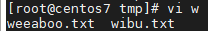
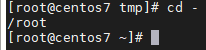
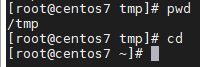
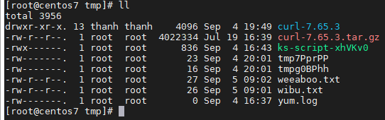
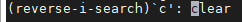
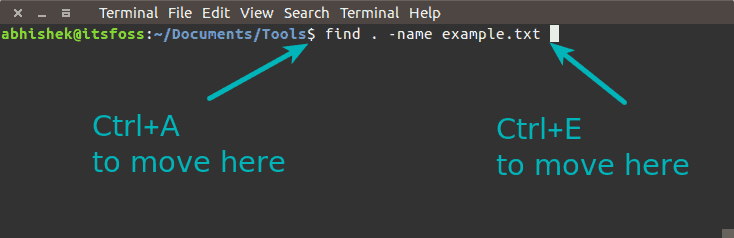
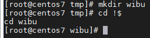
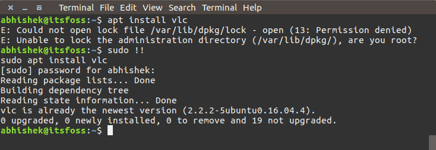

## 21 mẹo và thủ thuật lệnh Linux sẽ giúp bạn tiết kiệm rất nhiều thời gian

> Dưới đây là một số lệnh Linux nhỏ nhưng hữu ích, thủ thuật hữu ích trên môi trường terminal và lối tắt sẽ giúp bạn tiết kiệm rất nhiều thời gian khi làm việc với dòng lệnh Linux.

1. Sử dụng tab để tự động hoàn thành câu lệnh

Khi bạn gõ 1 câu lệnh trên terminal, bạn có thể nhấn phím tab và nó sẽ gợi ý tất cả các tùy chọn có thể bắt đầu bằng chuỗi bạn đã nhập

Ví dụ: khi bạn muốn chỉnh sửa 1 tệp có tên "wibu.txt", bạn chỉ cần nhập `vi w` và ấn tab để xem các tùy chọn có thể

2. Quay trở lại thư mục làm việc trước

Giả sử bạn kết thúc công việc tại một thư mục và sau đó bạn chuyển sang thư mục khác với 1 đường dẫn hoàn toàn khác. Và sau đó bạn nhận ra rằng bạn phải quay lại thư mục trước đó. Trong trường hợp này, tất cả những gì bạn cần làm là gõ lệnh này:

`cd -`

Điều này sẽ đưa bạn trở lại thư mục làm việc trước đó. Bạn không cần phải nhập đường dẫn thư mục dài hoặc phải sao chép dán nó nữa

3. Quay trở lại thư mục home của người dùng

Bạn có thể sử dụng lệnh dưới đây để di chuyển đến thư mục home của bạn từ bất kỳ đâu trong dòng lệnh Linux:

`cd ~`

Tuy nhiên, bạn cũng có thể chỉ cần nhập "cd" để quy lại thư mục home của mình:

`cd`

Hầu hết các bản phân phối Linux hiện đại đều có shell được cấu hình sẵn cho lệnh này

4. Liệt kê nội dung của thư mục

Hầu hết mọi người đề biết và sử dụng "ls -l" cho mục đích này, trong khi điều tương tự có thể được thực hiện với lệnh sau

`ll`

Một lần nữa, điều này phụ thuộc vào các bản phân phối Linux và cấu hình shell, nhưng bạn có thể sử dụng nó trên hầu hết các bản phân phối Linux

5. Chạy nhiều lệnh trong 1 dòng lệnh

Giả sử bạn phải chạy nhiều lệnh lần lượt. Bạn có đợi lệnh đàu tiên chạy xong rồi thực hiện lệnh tiếp theo không?

Bạn có thể dùng ";" cho mục đích này. Bằng cách này, bạn có thể chạy một số lệnh trong cùng 1 dòng lệnh, không cần phải đợi các lệnh trước kết thúc

`command1; command2; command3`

6. Chỉ chạy nhiều lệnh trong 1 dòng lệnh nếu lệnh trước đó được thực hiên

Ở bên trên, bạn đã thấy cách chạy một số lệnh trong cùng 1 dòng lệnh để tiết kiệm thời gian. Nhưng nếu bạn phải đảm bảo rằng các lệnh không thất bại thì sao?

Hãy tưởng tượng một tình huống mà bạn muốn xây dựng mã nguồn và sau đó quá trình build diễn ra thành công và bạn chạy lệnh "make"

Bạn có thể sử dụng "&&" cho trường hợp này. "&&" đảm bảo rằng lệnh tiếp theo sẽ chỉ chạy khi lệnh trước đó thành công

`command1 && command2`

Một ví dụ điển hình của lệnh này là khi bạn sử dụng `sudo apt update && sudo apt upgrade` để nâng cấp hệ thống

Trái ngược với "&&" là "||". "||" sẽ chạy lệnh sau nếu như lệnh trước không thành công

7. Dễ dàng tìm kiếm và sử dụng các lệnh mà bạn đã sử dụng trong quá khứ

Hãy tưởng tượng một tình huống mà bạn đã sử dụng một lệnh từ trước đó và giờ bạn phải sử dụng lại nó. Vấn đề là bạn không thể nhớ lệnh chính xác nữa

Tìm kiếm ngược là vị cứu tinh của bạn ở đây. Bạn có thể tìm kiếm lệnh trong lịch sử bằng thuật ngữ tìm kiếm. Chỉ cần sử dụng các phím "Ctrl + r" để bắt đầu tìm kiếm ngược và nhập một phần của lệnh. Nó sẽ tra cứu lịch sử và sẽ cho bạn thấy các lệnh phù hợp với thuật ngữ tìm kiếm

`Ctrl+r search_term`

Theo mặc định nó sẽ chỉ hiển thị 1 kết quả. Để em thêm kết quả phù hợp với cumk từ tìm kiếm của bạn, bạn sẽ phải sử dụng "Ctrl + r" nhiều lần. Để thoát khỏi tìm kiếm ngược, chỉ cần sử dụng "Ctrl + c"

8. Giải phóng Linux terminal nếu tình cờ bấm Ctrl + S

Bạn có thể có thói quen sử dụng "Ctrl + S" để lưu. Nhưng nếu bạn sử dụng nó trong môi trường terminal trên Linux, môi trường dòng lệnh của bạn sẽ không thể sử dụng. Đừng lo lắng, chỉ cần gõ "Ctrl + Q" và bạn lại có thể sử dụng terminal để làm việc trên Linux

9. Di chuyển đến đầu dòng hoặc cuối dòng

Giả sử bạn đang gõ 1 lệnh dài và giữa chừng bạn nhận ra rằng bạn phải thay đổi một số thứ ở đầu. Bạn sẽ dùng phím mũi tên trái để di chuyển đến đầu dòng. và tương tự phím mũi tên phải cho việc đi đến cuối dòng

Bạn có thể sử dụng tổ hợp phím "Ctrl + A" để đi đến đầu dòng và "Ctrl + E" để đi đến cuối dòng. Tất nhiên bạn cũng có thể sử dụng các phím "Home" và "End" ở đây

10. Đọc tệp nhật ký trong thời gian thực

Trong trường hợp bạn cần phân tích nhật ký trong khi ứng dụng đang chạy, bạn có thẻ sử dụng lệnh "tail" với tùy chọn "-f"

`tail -f đường_dẫn_file_log`

Bạn cũng có thể sử dụng các tùy chọn grep thông thường để chỉ hiển thị những dòng có ý nghĩa với bạn

`tail -f đường_dẫn_file_log | grep search_term`

Bạn cũng có thể sử dụng tùy chọn "F" ở đây. Điều này sẽ giữ cho lệnh "tail" chạy ngay cả khi tệp nhật ký bị xóa. Vì vậy, nếu tệp nhật ký được tạo lại, "tail" sẽ tiếp tục đọc

11. Đọc nhật ký nén mà không giải nén

Nhật ký máy chủ thường được nén gzip để tiết kiệm dung lượng đĩa. Nó tạo ra 1 vấn đề cho các nhà phát triển hoặc quản trị viên hệ thống phân tích các bản ghi. Bạn có thể phải sao chép nó 1 cách an toàn và sau đó giải nén nó để truy cập các tệp và đôi khi bạn không có đủ quyền để trích xuất nhật ký

Rất may, các lệnh "z" giúp bạn trong các tình huống như vậy. Các lệnh "z" cung cấp các lựa chọn thay thế cho các lệnh thông thường mà bạn sử dụng để xử lý các tệp nhật ký như "less", "cat", "grep", ...

Như vậy, bạn sẽ có "zless", "zcat", "zgrep" và bạn không phải trích xuất rõ rang các tập nén

12. Sử dụng "less" để đọc các tập tin

Để xem nội dung của một tệp, "cat" không phải là lựa chọn tốt nhất, đặc biệt nếu đó là 1 tệp lớn. Lệnh "cat" sẽ hiển thị toàn bộ tập tin trên màn hình của bạn. Bạn có thể sử dụng vi, vim hoặc các trình soạn thảo van bản khác nhưng nếu bạn chỉ muốn đọc 1 tệp, lệnh "less" là lựa chọn tốt hơn nhiều

`less đường_dẫn_file`

Bạn có thể tìm kiếm các cụm từ, di chuyển theo trang, hiển thị với số dòng, ...

13. Sử dụng lại mục cuối cùng từ lệnh trước với !$

Sử dụng đối số của lệnh trước có ích trong nhiều tình huống. Giả sử bạn phải tạo 1 thư mục và sau đó di chuyển vào thư mục vừa tạo. Bạn có thể sử dụng tùy chọn "!$"

Một cách tốt hơn để làm tương tự là sử dụng "Alt + ..". Bạn có thể dùng "." 1 lần để thay đổi các tùy chọn của các lệnh cuối cùng

14. Sử dụng lại lệnh trước đó trong lệnh hiện tại với !!

Bạn có thể gọi toàn bộ lệnh trước đó với "!!". Điều này đặc biệt hữu ích khi bạn phải chạy 1 lệnh và nhận ra rằng nó cần quyền root.

Một lệnh `sudo !!` sẽ tiết kiệm thời gian và nhiều tổ hợp phím

15. Sử dụng bí danh để sửa lỗi chính tả

Có lẽ bạn đã biết bí danh trong Linux là gì. Bạn có thể sử dụng nó để sủa lỗi chính tả

Ví dụ: bạn thường xuyên gõ nhầm grep là gerp. Nếu bạn đặt bí danh trong ~/.bashrc theo cách này

`alias gerp=grep`

Bằng cách này bạn sẽ không cần phải gõ lại lệnh nữa

16. Copy Paste trong terminal

Cái này hơi mờ hồ vì nó phụ thuộc vào các bản phân phối Linux và terminal. Nhưng nói chung, bạn có thể copy, paste bằng các phím tắt sau:

- Chọn văn bản để copy và nhấp chuột phải để paste (hoạt động trong Putty và các máy client Windows SSH khác)

- Chọn văn bản để copy và nhấp chuột giữa (nút cuộn chuột) để paste

- Ctrl + Shift + C để copy và Ctrl + Shift + V để paste

17. Dừng 1 lệnh/tiến trình đang chạy

Diwwuf này có lễ là quá rỗ ràng, nếu có 1 lệnh đang chạy nền và bạn muốn thoát no, bạn có thể nhấn "Ctrl + C" để dừng lệnh đang chạy đó

18. Sử dụng lệnh "yes" cho các lệnh hoặc các tập lệnh cần phản hồi tương tác

Nếu có một số lệnh hoặc tập lệnh cần tương tác người dùng và yêu cầu bạn phải nhâp "Y" khi được yêu cầu, bạn có thể sử dụng lệnh "yes"

Bạn chỉ cần nhập như sau:

`yes | command_or_script`

19. Làm trống 1 tập tin mà không xóa nó

Nếu bạn chỉ muốn làm trống nội dung của tệp văn bản mà không xóa chính tệp đó, bạn có thể sử dụng một lệnh tương tác sau:

`> filename`

20. Tìm tệp nếu nó chứa một văn bản cụ thể

Có nhiều cách để tìm kiếm trong môi trường dòng lệnh Linux. Nhưng trong trường hợp khi bạn chỉ muốn xem liệu có tệp nào chứa 1 văn bản cụ thể không, bạn có thể sử dụng lệnh này:

`grep -Pri  search_term đường_dẫn_thư_mục`

21. Sử dụng help với bất kỳ lệnh nào

Hầu như tất cả các công cụ dòng lệnh và các lệnh đều đi kèm với 1 trang trợ giúp chỉ ra cách sử dụng lệnh. Thường thì sử dụng "help" sẽ cho bạn biết cách sử dụng cơ bản của công cụ/lệnh

Bạn chỉ cần nhập:

`command --help`