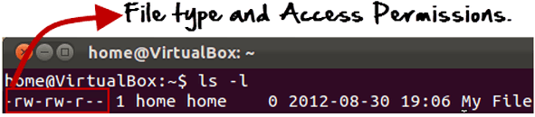
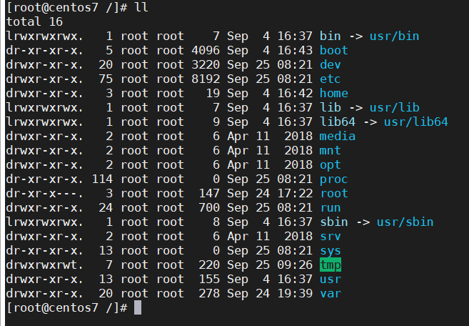
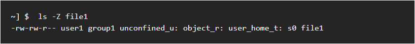
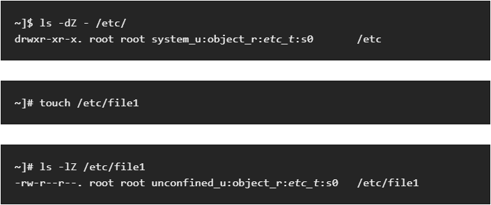

## Linux permissions

Khái niệm về quyền và quyền sở hữu là rất quan trọng trong Linux.

#### Quyền sở hữu các tệp Linux

Mỗi tệp và thư mục trên hệ thống Unix / Linux của bạn được gán 3 loại chủ sở hữu, được đưa ra dưới đây.

- User

Một người dùng là chủ sở hữu của tập tin. Theo mặc định, người tạo tệp trở thành chủ sở hữu của nó.

- Group

Một nhóm người dùng có thể chứa nhiều người dùng. Tất cả người dùng thuộc một nhóm sẽ có cùng quyền truy cập vào tệp. Giả sử bạn có một dự án trong đó một số người yêu cầu quyền truy cập vào một tệp. Thay vì gán quyền theo cách thủ công cho mỗi người dùng, bạn có thể thêm tất cả người dùng vào một nhóm và gán quyền nhóm cho tệp để chỉ thành viên nhóm này và không ai khác có thể đọc hoặc sửa đổi tệp.

- Other

Bất kỳ người dùng khác có quyền truy cập vào một tập tin. Người này không tạo tệp, cũng không thuộc nhóm người dùng có thể sở hữu tệp.

> Bây giờ, câu hỏi lớn đặt ra là làm thế nào Linux phân biệt giữa ba loại người dùng này để người dùng 'A' không thể ảnh hưởng đến một tệp chứa một số thông tin / dữ liệu quan trọng của người dùng khác. Giống như bạn không muốn đồng nghiệp của mình, người làm việc trên máy tính Linux của bạn, xem hình ảnh của bạn. Đây là nơi Quyền được đặt và chúng xác định hành vi của người dùng.

#### Quyền

Mỗi tệp và thư mục trong hệ thống UNIX / Linux của bạn có 3 quyền sau được xác định cho cả 3 chủ sở hữu được đề cập ở trên.

- Read: Quyền này cho phép bạn mở và đọc tệp. Đọc quyền trên một thư mục cung cấp cho bạn khả năng liệt kê nội dung của nó.

- Write: Quyền ghi cho phép bạn sửa đổi nội dung của tệp. Quyền ghi trên thư mục cung cấp cho bạn quyền để thêm, xóa và đổi tên các tệp được lưu trữ trong thư mục. Hãy xem xét một kịch bản mà bạn có quyền ghi trên tệp nhưng không có quyền ghi trên thư mục nơi tệp được lưu trữ. Bạn sẽ có thể sửa đổi nội dung tập tin. Nhưng bạn sẽ không thể đổi tên, di chuyển hoặc xóa tệp khỏi thư mục.

- Execute: Trong Windows, một chương trình thực thi thường có phần mở rộng ".exe" và bạn có thể dễ dàng chạy. Trong Unix / Linux, bạn không thể chạy chương trình trừ khi quyền thực thi được đặt. Nếu quyền thực thi không được đặt, bạn vẫn có thể xem / sửa đổi mã chương trình (được cung cấp quyền đọc & ghi), nhưng không chạy được.

Ngoài ra, còn có các quyền đặc biệt như set user id, set group id hay sticky bit, có thể xem thêm tại [đây](https://github.com/nvtien996/thuctap062019/blob/master/Tiennv/Tim_hieu_Linux_co_ban/18.Phan_quyen_nang_cao_%20SUID_SGID_Sticky_Bit_va_chi_so_umask.md)

Ví dụ như khi chạy lệnh "ls -l" trên terminal

Ý nghĩa của các field là:

File Access Permission: rw-rw-r--
Số liên kết: 1
File Owner: home
Group: home
File Size (bytes): 0
Lần hiệu chỉnh cuối: 2012-08-30
Last Modification Time: 19:06
File name: My File

Ngoài ra, qua lệnh "ls –l" chúng ta sẽ biết được là tập tin hay thư mục dựa theo:

Nếu kí tự đầu tiên là (-), thì đây là tập tin.
Nếu kí tự đầu tiên là d, thì đối tượng là thư mục.
Nếu kí tự đầu tiên là l, thì đầy là một liên kết (symbolic link) trỏ đến một file khác (gần giống với shortcut trên Windows OS).
Nếu kí tự đầu tiên là b, đối tượng là block device ví dụ như disk drive.
Nếu kí tự đầu tiên là c, đối tượng là character device như serial port.

Trên các hệ thống Linux mới, khi chạy lệnh "ll" hoặc "ls -l" ta còn thấy có thêm 1 ký tự đằng sau các quyền cơ bản

Nếu bạn quan sát, bạn sẽ tìm thấy ký tự thứ 11 cho trường quyền 10 ký tự ban đầu có sẵn trong Linux. Nó là 1 ký tự duy nhất chỉ định xem phương thức truy cập thay thế có áp dụng cho tệp hay không. Khi ký tự này là khoảng trắng, không có phương thức truy cập thay thế. Một ký tự "." chỉ ra một tệp có bối cảnh bảo mật, nhưng không có phương thức truy cập thay thế nào khác. Một tệp với bất kỳ sự kết hợp nào khác của các phương thức truy cập thay thế được đánh dấu bằng ký tự "+", ví dụ như trong trường hợp [Danh sách điều khiển truy cập](https://wiki.archlinux.org/index.php/Access_Control_Lists).

Đây là tính năng mới và có sẵn trong Linux khi SELinux được bao gồm trong gói từ RHEL5 +.

Khi sử dụng SELinux (Linux được tăng cường bảo mật), các quyền của tệp / thư mục được đặt theo cách khác nhau. Dấu chấm cho biết rằng các tệp / thư mục được đặt với một số loại quyền của SELinux trên chúng.

Trên các hệ thống chạy SELinux, tất cả các quy trình và tệp được dán nhãn theo cách thể hiện thông tin liên quan đến bảo mật. Thông tin này được gọi là SELinux context. Đối với các tệp, điều này được xem bằng lệnh "ls -Z":

Trong ví dụ này, SELinux cung cấp cho người dùng (unconfined_u), vai trò (object_r), loại (user_home_t) và mức (s0). Thông tin này được sử dụng để đưa ra quyết định kiểm soát truy cập. Trên các hệ thống DAC, quyền truy cập được kiểm soát dựa trên ID người dùng và nhóm Linux. Các quy tắc chính sách của Selinux được kiểm tra sau các quy tắc của DAC. Các quy tắc chính sách của Selinux không được sử dụng nếu quy tắc DAC từ chối truy cập trước tiên.

> Theo mặc định, các tệp và thư mục mới được tạo kế thừa loại SELinux của thư mục mẹ của chúng. Ví dụ: khi tạo một tệp mới trong /etc/ thư mục được gắn nhãn loại etc_t, tệp mới sẽ kế thừa cùng loại:
