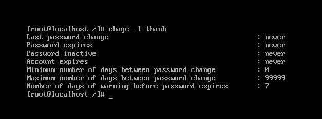

## User trong Linux

Khái niệm User dùng để định danh cho một người dùng trong hệ thống. User là người có thể truy cập đến hệ thống. User có username và password.

Có hai loại user: super user và regular user. Với tài khoản super user: root - có thể làm bất cứ điều gì muốn trên hệ thống. Để tạo một người dùng mới, thay đổi thuộc tính của một người dùng cũng như xóa bỏ một người dùng chỉ khi có quyền của root. Mỗi user còn có một định danh riêng gọi là UID. Định danh của người dùng bình thường sử dụng giá trị bắt đầu từ 500.

- Tạo user:

cú pháp: `useradd [option] username`

các option:
-c “Thông tin người dùng”
-d <Thư mục cá nhân>
-m : Tạo thư mục cá nhân nếu chưa tồn tại
-g <nhóm của người dùng>

- Đặt mật khẩu cho user:

cú pháp: `passwd username` sau đó nhập mật khẩu

Cũng giống như Microsoft Windows bạn vẫn có thể đặt những ràng buộc về mật khẩu cho user. Ví dụ như:
	
	- Bắt buộc sử dụng mật khẩu có độ khó cao.
	- Bắt buộc thay đổi mật khẩu sau một khoảng thời gian.
	- Số lần cho phép nhập sai mật khẩu.
	- Quy định độ dài tối thiểu và độ dài tối đa của mật khẩu.

Bằng cách chỉnh sửa các thông số trong file /etc/login.defs.

Để xem các quy tắc đã được thiết lập cho một user ta sử dụng lệnh `chage`:

- Thay đổi thông tin cá nhân của user:

cú pháp: `usermod [option] username`

Các tùy chọn của lệnh:
-c, comment : thay đổi thông tin cá nhân của tài khoản người dùng
-d, home_dir : thay đổi thư mục cá nhân của tài khoản người dùng
-e, expire_date : thay đổi thời điểm hết hạn của tài khoản người dùng (YYYYMM-DD)
-f, inactive_days : thiết đặt số ngày hết hiệu lực của mật khẩu trước khi tài khoản người dùng hết hạn sử dụng
-g, initial_group : tùy chọn này thay đổi tên hoặc số khởi tạo đăng nhập nhóm người dùng
-G, group : thay đổi danh sách các nhóm phụ mà người dùng cũng là thành viên thuộc các nhóm đó. Mỗi nhóm sẽ được ngăn cách với nhóm khác bởi dấu "," mặc định người dùng sẽ thuộc vào nhóm khởi tạo
-l, login_name : thay đổi tên đăng nhập của người dùng. Trong một số trường hợp, tên thư mục riêng của người dùng có thể sẽ thay đổi để tham chiếu đến tên đăng nhập mới
-p, passwd : thay đổi mật khẩu đăng nhập của tài khoản người dùng
-s, shell : thay đổi shell đăng nhập
-u, uid : thay đổi uid người dùng

- Xóa user:

cú pháp: `userdel username`