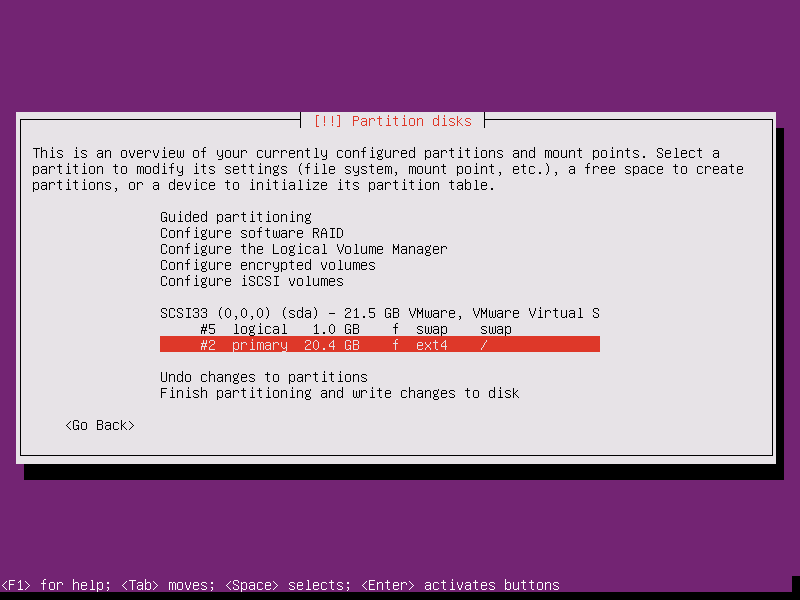

## 4 cách phân vùng ổ cứng khi cài đặt Ubuntu, sự khác nhau

Chọn phân vùng ổ cứng cho Ubuntu, có 4 sự lựa chọn:

- Guided - use entire disk : máy tính sẽ tự động phân vùng cho ổ cứng. Sử dụng cho ổ cứng chưa từng được phân vùng, máy tính sẽ tự động format lại toàn bộ ổ cứng và định dạng cho từng vùng đã chia.

Sau đó, hệ thống sẽ tự tạo 2 phân vùng trong ổ cứng bao gồm #1 là phân cùng `ext4` và #5 là phân vùng `swap`.

- Guided - use entire disk and with set up LVM : tự động phân vùng bằng LVM (Logical Volume Management). LVM là một kỹ thuật cho phép tạo ra các vùng không gian đĩa cứng ảo khiến cho việc thay đổi dung lượng dễ dàng hơn. LVM giúp bạn:
	- Nới rộng hoặc thu hẹp không gian lưu trữ mà không cần phải chia lại partition trên đĩa cứng.
	- Gom nhiều ổ đĩa cứng vật lý thành một ổ đĩa ảo có dung lượng lớn hơn.

Một số khái niệm cơ bản cần nắm:
	- Physical volumes: là những đĩa cứng vật lý hoặc partition trên nó như: /dev/sda hoặc /dev/sdb1.
	- Volume groups: là một nhóm bao gồm các Physical volumes. Bạn có thể xem Volume group như 1 “ổ đĩa ảo”.
	- Logical volumes: có thể xem như là các “phân vùng ảo” trên “ổ đĩa ảo” bạn có thể thêm vào, gỡ bỏ và thay đổi kích thước một cách nhanh chóng.

- Guided - use entire disk and with set encrypted up LVM : giống lựa chọn thứ hai nhưng ổ cứng sẽ được mã hóa để tăng tính bảo mật

Sau đó bạn sẽ nhận được yêu cầu tạo mật khẩu để bảo vệ ổ đĩa

như hình bên dưới, phân vùng #5 đã được mã hóa

Khi bạn khởi động Ubuntu, hệ thống sẽ yêu cầu nhập mật khẩu ổ đĩa để bắt đầu boot

- Manual : phân vùng thủ công

Khi bạn chon phân vùng thủ công, sẽ có tùy chọn `Configure iSCSI volumes`.

`iSCSI` là viết tắt của Internet Small Computer Systems Interface, một giao thức Internet (IP) lưu trữ dựa trên tiêu chuẩn kết nối mạng để liên kết các cơ sở lưu trữ dữ liệu. Nó cung cấp quyền truy cập cấp khối cho các thiết bị lưu trữ bằng cách thực hiện các lệnh SCSI qua kết nối TCP/IP. iSCSI được sử dụng để tạo điều kiện chuyển dữ liệu qua mạng nội bộ và để quản lý lưu trữ trên một khoảng cách dài. Nó có thể được sử dụng để truyền dữ liệu qua mạng cục bộ (LAN), mạng diện rộng (WAN) hoặc Internet và có thể cho phép lưu trữ và truy xuất dữ liệu độc lập với vị trí.

Nhưng ở đây ta chỉ chọn ổ cứng và cài đặt bình thường

Chọn ổ cứng còn trống để tiến hành việc phân vùng

Tại đây, ta có thể tiến hành phân vùng thủ công với tùy chọn `Create a new partition` hoặc tự dộng với tùy chọn `Automatically partition the free space`.

Ở đây tôi sẽ chia làm 2 phân vùng `swap` và phân vùng `\` chứa thư mục root của HĐH.

