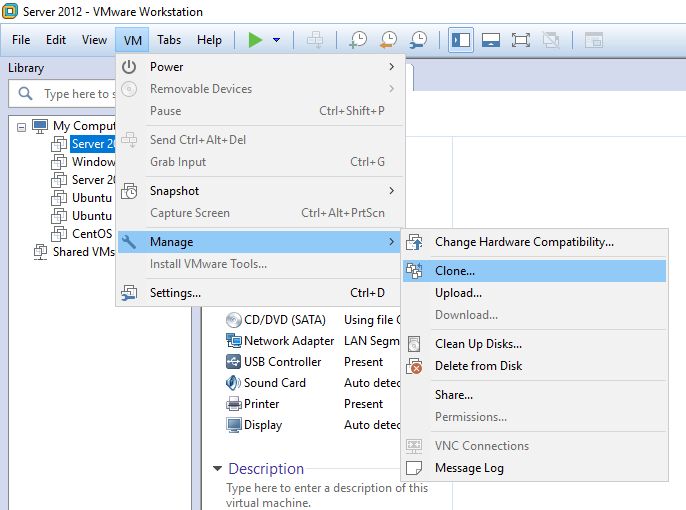
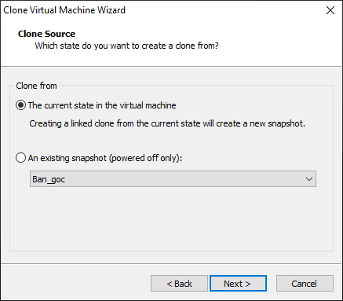
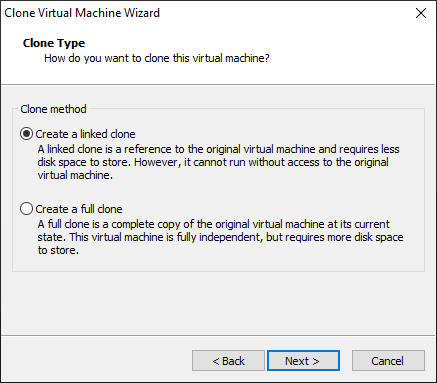
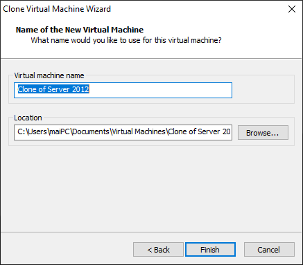

## Clone máy ảo trong VMware

Đúng như tên gọi của nó: Clone – bản sao. Khi sử dụng tính năng này, phần mềm sẽ tự tạo ra một bản sao giống hệt như bản gốc của bạn có trước đó, với cách làm này, chúng ta sẽ rất tiết kiệm thời gian cho việc lặp đi lặp lại cài đặt các máy ảo có cấu hình giống nhau. Clone máy ảo có 2 loại:

- Full Clone: Là bản sao máy ảo đầy đủ, tất cả các hình ảnh đĩa được chép vào ổ đĩa ảo mới (độc lập với máy ảo ban đầu). Các Clone này cũng hoạt động độc lập với máy ảo ban đầu.
- Linked Clone: Là bản sao của máy ảo mới nhưng ổ đĩa ảo này sử dụng là của máy ảo ban đầu, nghĩa là khi bạn thao tác trên máy ảo mới thì sẽ tác động tới máy ảo ban đầu (ghi dữ liệu vào, xóa,...). Nếu xóa máy ảo ban đầu thì máy ảo clone cũng sẽ không sử dụng được.

Các bước để thực hiện clone máy ảo trong VMware:

B1: Chọn máy ảo muốn clone rồi chọn menu `VM` -> `Manage` -> `Clone...`

B2: Hộp thoại `Clone Virtual Machine Wizard` xuất hiên, bấm `Next` để tiếp tục. Tại đây có 2 lựa chọn là `The current state in the virtual machine` và `An existing snapshot`.
	
Lựa chọn đầu tiên cho phép bạn clone máy ảo ngay tại trạng thái hiện tại của máy ảo gốc, tùy chọn này làm việc ngay cả khi máy ảo đang hoạt động.
	
Lựa chọn thứ 2 là clone từ 1 bản snapshot có sẵn của máy ảo gốc. (Snapshot của VMware là bản sao của tệp đĩa máy ảo (VMDK) tại một thời điểm nhất định. Snapshot cung cấp bản ghi các thay đổi của ổ đĩa ảo và được sử dụng để khôi phục VM vào một thời điểm cụ thể khi xảy ra sự cố hay lỗi hệ thống). Tùy chọn này chỉ làm việc khi máy ảo ở trạng thái không hoạt động.

Sau đó bấm `Next` để tiếp tục.

B3: Lúc này sẽ có 2 phương thức clone như đã nêu ở trên, đó là `Create a linked clone` và `Create a full clone`. `Linked clone` chỉ là 1 bản tham chiếu đến máy ảo gốc và cần ít dung lượng ổ cứng để lưu trữ hơn. Tuy nhiên nó không thể chạy nếu không truy cập vào máy ảo gốc ban đầu. Còn `Full clone` là 1 bản sao độc lập so với bản gốc, vì vậy nó có thể chạy mà không cần bản gốc. Nó cũng yêu cầu nhiều dung lượng ổ cứng để lưu trữ hơn. Đây là 1 sự lựa chọn khi muốn dùng máy ảo trên 1 máy tính khác mà không muốn cài lại.

Sau đó bấm `Next` để tiếp tục.

B4: Đặt tên cho bản sao và chọn nơi lưu trữ, sau đó bấm `Finish` để bắt đầu việc clone máy ảo.

