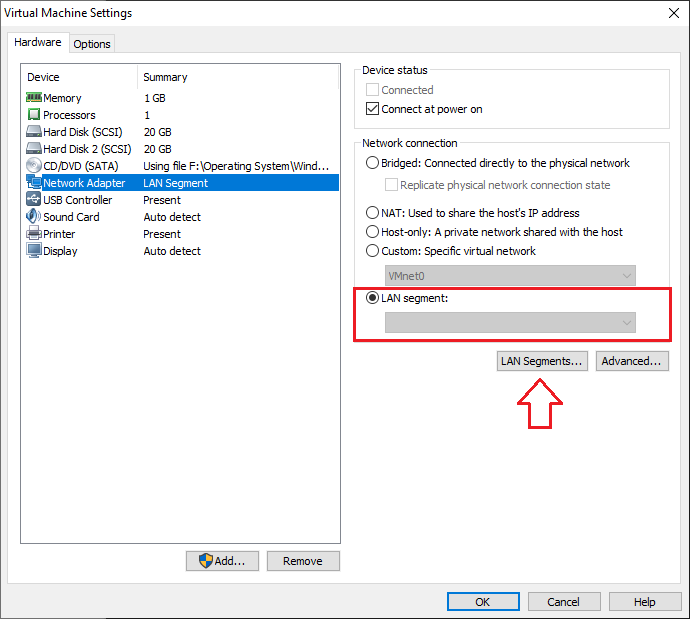
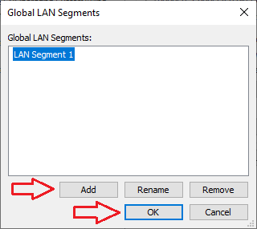
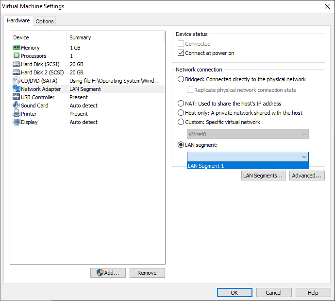
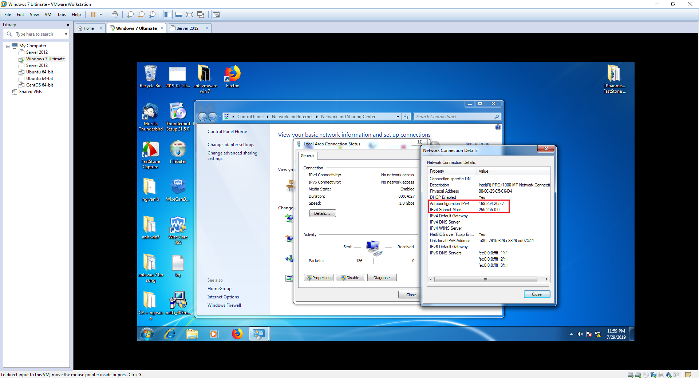
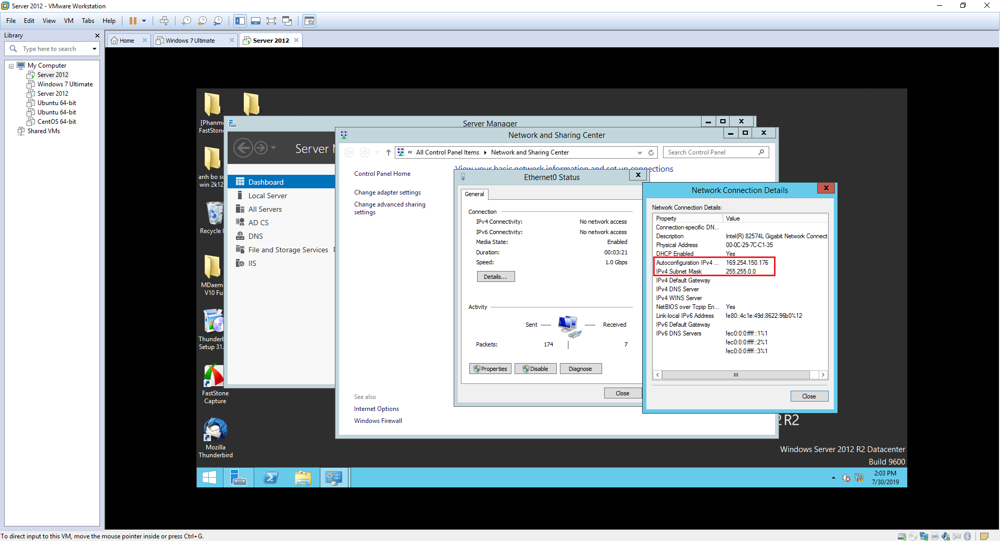
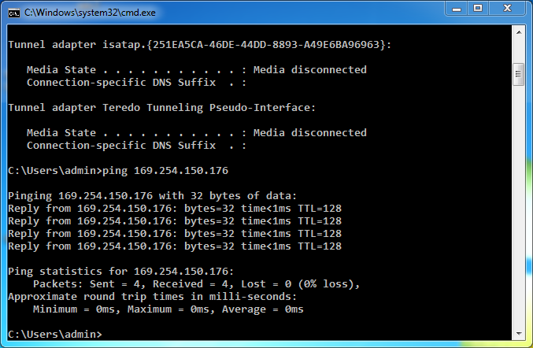
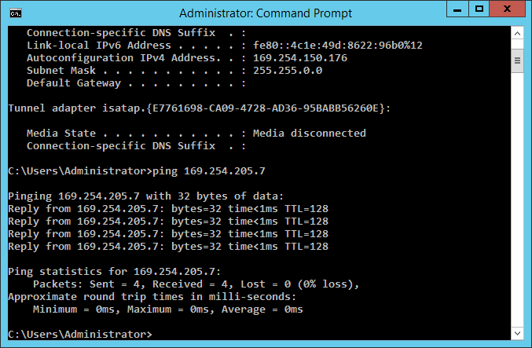
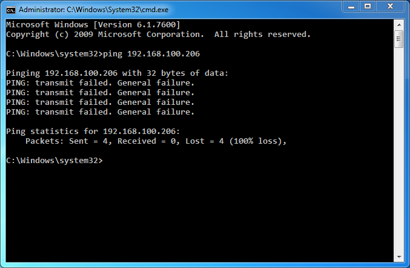
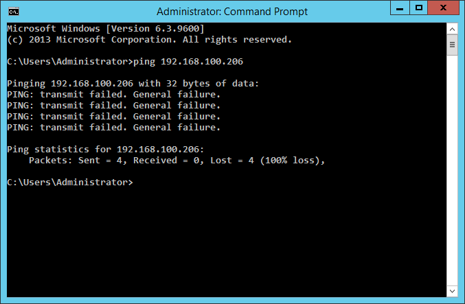

## LAN Segment trên VMware

LAN Segment là1 1 mạng riêng được tạo cho 1 nhóm máy ảo. Với tính năng phân đoạn Ethernet, các máy ảo sẽ không nhận địa chỉ IP từ máy chủ DHCP cục bộ. Ví dụ 1 máy ảo được cấu hình như 1 phân đoạn LAN sẽ nhận được địa chỉ IP từ dải mạng 169.254.0.0/16 theo APIPA (địa chỉ IP riêng tự động). Tuy vậy, ta cũng có thể đặt địa chỉ IP cho các máy ảo.

Trong các phiên bản VMware 8 trở về trước, cấu trúc mạng này được gọi là `Team`. Với các phiên bản mới của VMware, cấu trức `Team` hiện được gọi là các `LAN Segment`.

Để biết thêm thông tin về Microsoft APIPA, hãy truy cập vào [đây](https://support.microsoft.com/en-us/help/220874/how-to-use-automatic-tcp-ip-addressing-without-a-dhcp-server).

- Để tạo 1 LAN Segment gồm nhiều máy ảo, ta có thể làm theo các bước sau:
	
	- B1: Để thêm các máy ảo vào cùng 1 mạng, bạn cần tạo 1 phân đoạn mạng mới. Chọn 1 máy ảo và tại mục `Devices`, chọn `Network Adapter`
	
	
	
	- B2: Khi xuất hiện hộp thoại `Virtual Machine Settings`, chọn mục `LAN segment` rồi bấm `LAN segmnets...`
	
	
	
	- B3: Hộp thoại `Global LAN Segments` xuất hiện, tại đây ta có thể thêm, sửa, xóa các LAN segment. Bấm `Add` để thêm 1 LAN segment, đặt tên cho nó rồi chọn `OK`.
	
	
	
	- B4: Lúc này tại mục `LAN segment` đã có thể chọn được phân đoạn mạng vừa tạo.
	
	
	
	- B5: Sang máy ảo 2 và chọn `LAN Segment` giống với máy 1.
	
	- B6: Sau khi tạo xong, bạn có thể kiểm tra IP được gán theo APIPA cho máy 1 theo ảnh dưới
	
	
	
	IP máy 2
	
	
	
Trong 1 LAN Segment, các máy ảo là thành viên của cùng 1 LAN Segment có thể giao tiếp được với nhau. Bây giờ, ta có thể kiểm tra kết nối mạng bằng cách ping 2 máy cho nhau

từ máy 1 ping đến máy 2

từ máy 2 ping lại máy 1

với các máy ảo chạy HĐH Windows, khi không ping được thì hãy xem lại thiết lập trong Windows Firewall.

Tuy vậy nhưng các máy ảo trong 1 LAN Segment lại không thể truy cập mạng vật lý bên ngoài. Ping mạng vật lý 192.168.100.0/24 từ máy ảo 1 và 2 rồi xác minh kết quả

IP máy thật

ping từ máy 1

ping từ máy 2

