## Thực hành

### Yêu cầu:

[1. Khởi tạo một network VMnet 10 sử dụng subnet: 192.168.220.0/24, cấp DHCP từ 192.168.220.10 -> 192.168.220.50, và máy ảo gắn sử dụng card này có thể đi ra internet](#mot)

[2. Khởi tạo một máy ảo Windown 10 từ ISO. Gồm  2 CPU, 2GB RAM, 32 GB ổ cứng  và sử dụng card mạng trên để ra internet. Không có sound card và USB Controller.](#hai)

[3. Khởi tạo một bản snapshot cho máy ảo sau khi cài đặt xong.](#ba)

[4. Gắn hai card mạng cho một máy ảo trên Vmware, một để Nat, một để Briged](#bon)

[5. Tạo một con máy Ubuntu 16, 2 card mạng, cấu hình định tuyến cho ra ngoài mạng (1 Nat, 1 briged)](#nam)

### Thực hành:

1. Khởi tạo một network VMnet 10 sử dụng subnet: 192.168.220.0/24, cấp DHCP từ 192.168.220.10 -> 192.168.220.50, và máy ảo gắn sử dụng card này có thể đi ra internet

- Vào mục `Edit` -> `Virtual Network Editor`

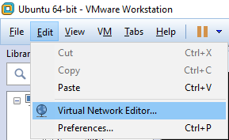

- Chọn `Change Settings` rồi bấm `Yes`

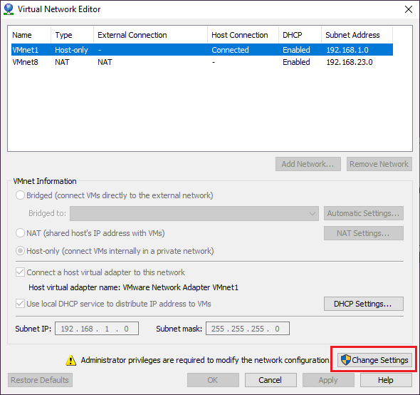

- Bấm `Add Network...`

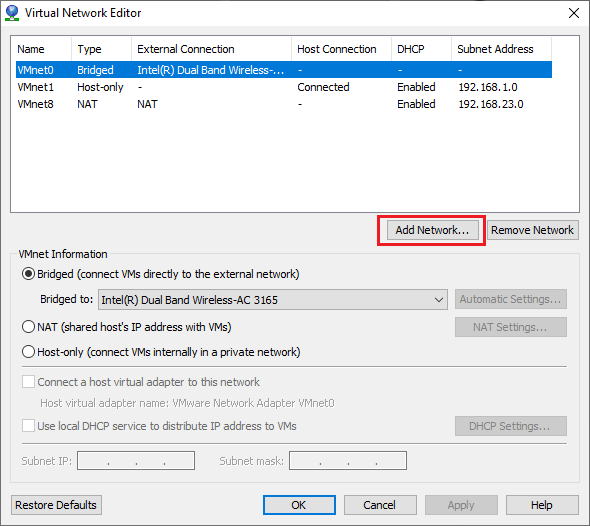

- Chọn VMnet10 trong mục `Add a Virtual Network` rồi bấm `OK`

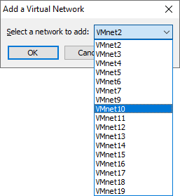

- Chọn VMnet10 và chỉnh theo yêu cầu (subnet IP: 192.168.220.0/24, DHCP từ .10 -> .50, có thể kết nối internet) nên ta chọn chế độ NAT. Mặc định thì VMware sẽ dặt VMnet8 ở chế độ NAT nên ta sẽ không thể dặt VMnet10 là NAT, vì vậy ta cần chình VMnet8 thành Bridged hoặc Host-only rồi mới chỉnh được VMnet10.

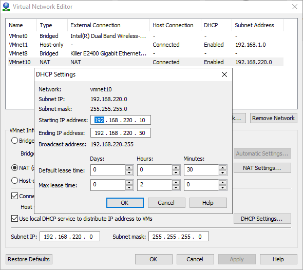

- Bấm `Apply` rồi `OK` để xác nhận.

2. Khởi tạo một máy ảo Windown 10 từ ISO. Gồm  2 CPU, 2GB RAM, 32 GB ổ cứng  và sử dụng card mạng trên để ra internet. Không có sound card và USB Controller.

- Tiến hành cài đặt máy ảo từ file ISO. Ở đây tôi dùng phiên bản Win 7 thay thế cho Win 10.

- Chỉnh sửa máy ảo theo yêu cầu.

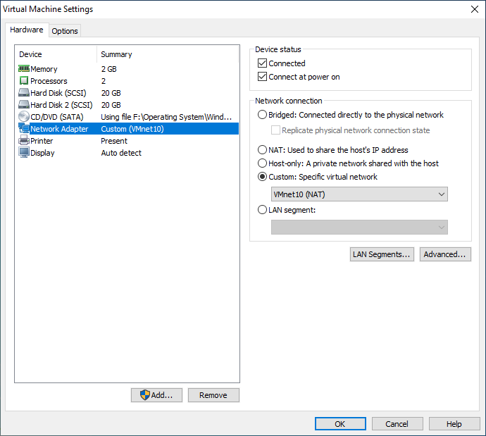

- Sau đó tiến hành cài đặt và bật máy ảo lên để kiểm tra

IP máy ảo

truy cập trang web wwww.google.com từ máy ảo

3. Khởi tạo một bản snapshot cho máy ảo sau khi cài đặt xong.

- Chuột phải vào máy ảo, chọn `Snapshot` -> `Take Snapshot...` để tạo snapshot cho máy ảo.

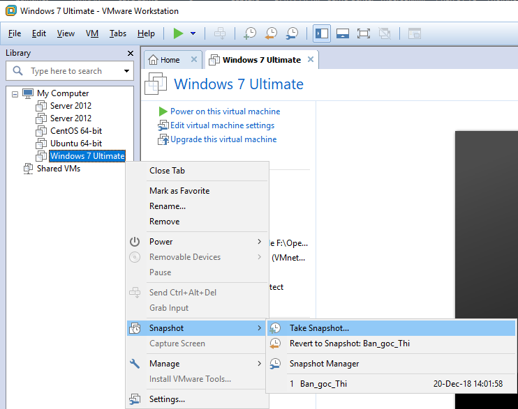

- Đặt tên cho bản snapshot rồi bấm `Take Snapshot`

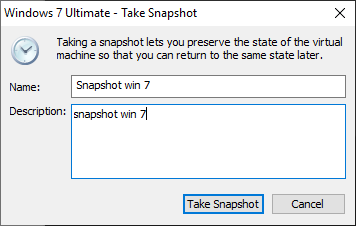

4. Gắn hai card mạng cho một máy ảo trên Vmware, một để Nat, một để Briged

- Để gắn 2 card mạng vào 1 máy ảo trên VMware, ta cần chỉnh sửa máy ảo đó.

- Bấm `Add...` rồi `Yes` để thêm thiết bị vào máy ảo

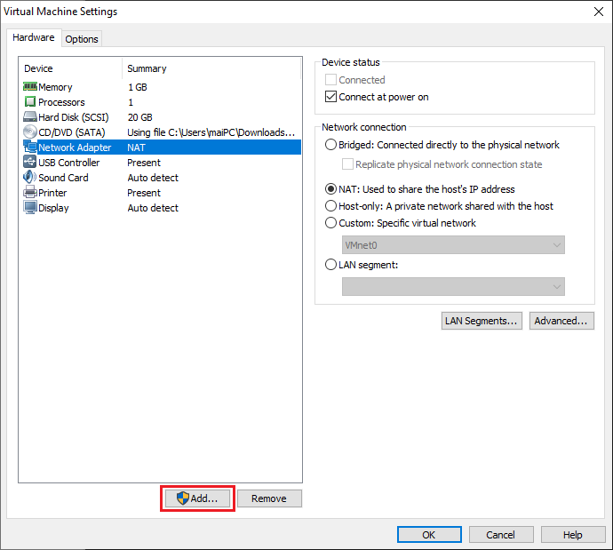

- Trong mục `Add Hardware Wizard` chọn `Network Adapter` rồi `Next`

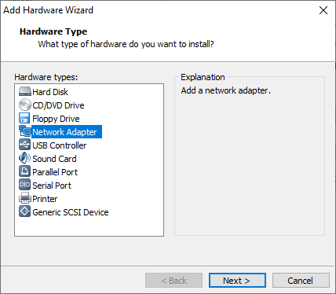

- Trong phần `Network Adapter Type` chọn `Bridged` vì ta đã có sẵn 1 card ảo để ở chế độ NAT

- Cuối cùng bấm `Finish` để kết thúc

5. Tạo một con máy Ubuntu 16, 2 card mạng, cấu hình định tuyến cho ra ngoài mạng (1 Nat, 1 briged)

- Tiến hành cài đặt máy ảo Ubuntu như hướng dẫn [sau](https://github.com/nvtien996/Ubuntu#caidatubuntuserver16.04trenvmware)

- Tại phần `Customize Hardware...` ta tiến hành chỉnh sửa và thêm card mạng cho máy ảo.

- Network Adapter chọn VMnet10 (NAT) vì ta đã cấu hình cho nó ở chế độ NAT như bên [trên](#mot)

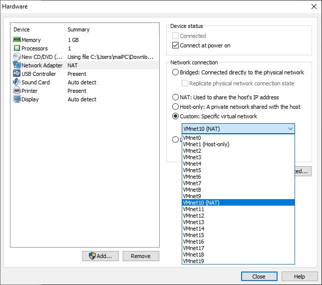

- Bấm `Add...` để thêm thiết bị vào máy ảo, ở đây ta thêm 1 network adapter nữa

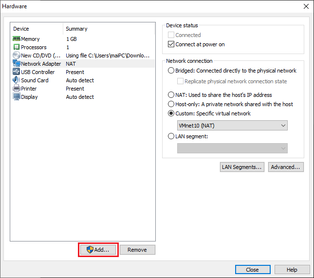

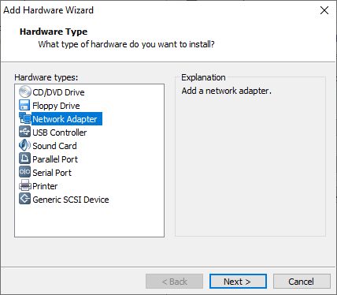

chọn chế độ Bridged rồi bấm `Finish`

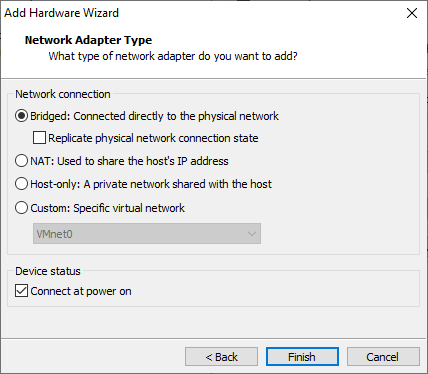

- Khi cài đặt, Ubuntu sẽ nhận diện ra 2 card mạng và hỏi bạn xem card nào là chính, ở đây tôi chọn card ens33 là card chính

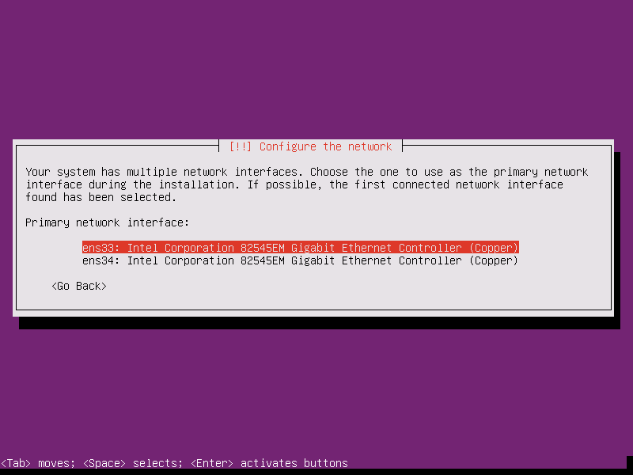

- Tiếp tục cài đặt Ubuntu như bình thường

- Khởi động máy ảo và đăng nhập

- Gõ câu lệnh `ip a` để xem các network interfaces trong máy

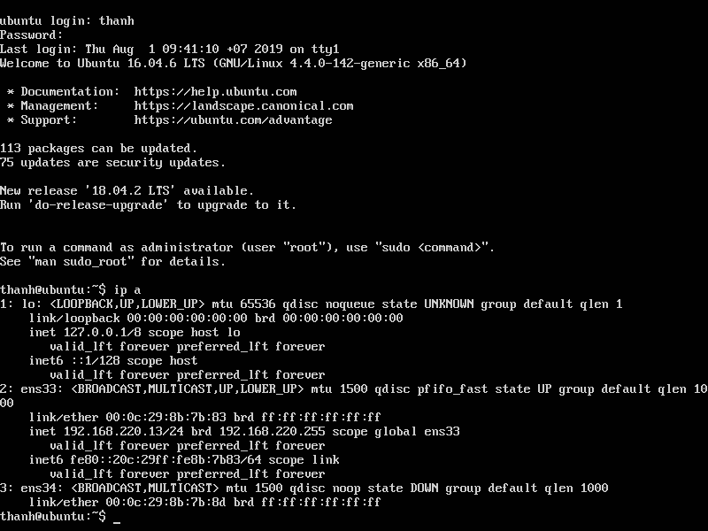

- Quan sát thấy card ens34 chưa được khai báo, ta mở file: `/etc/network/interfaces`, rồi add thêm card ens34 chế độ dhcp (cấp phát địa chỉ ip động cho card ens34) bằng câu lệnh `sudo vi /etc/network/interfaces`

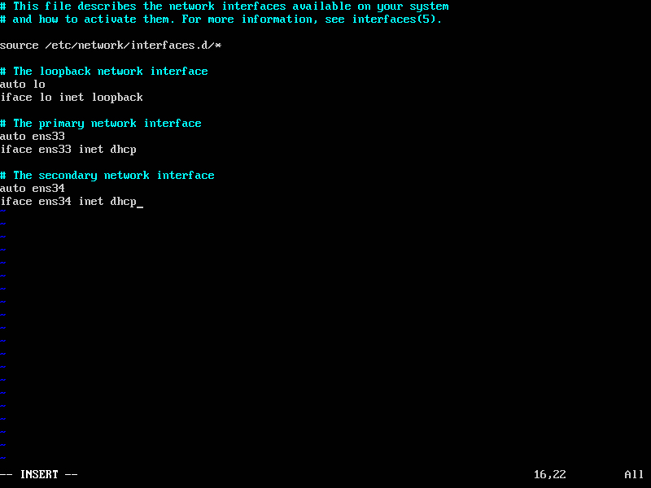

- Lưu lại file cấu hình và gõ câu lệnh `ifup ens34` để bật card ens34 lên

- Gõ `ip a` để xem lại các thông số trên các network interfaces

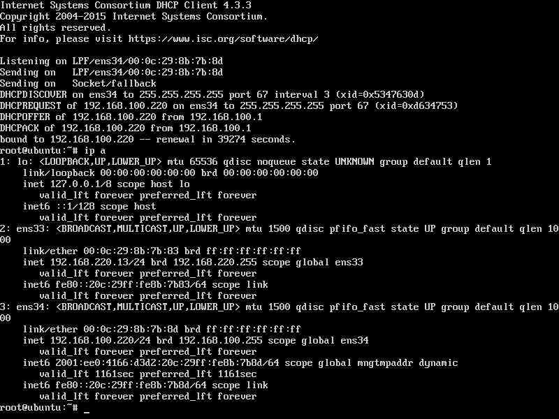

- Ping thử đến trang web google.com từ máy ảo

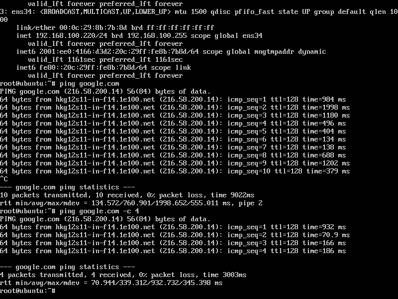