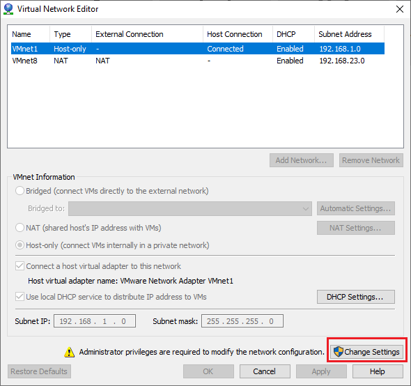
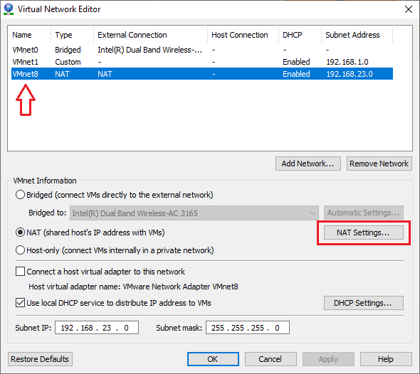
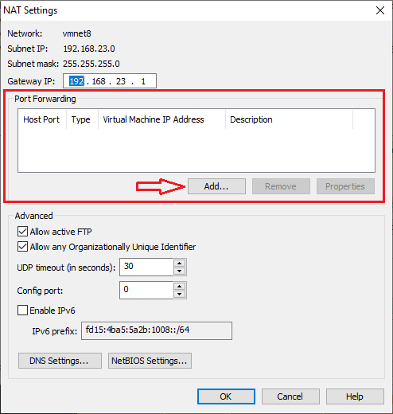
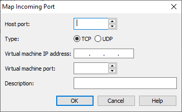

## Tìm hiểu NAT Advance, port forwarding

Port Forwarding là gì, khái niệm này thực ra là một quá trình chuyển tiếp của một port cụ thể từ hệ thống mạng này sang một mạng khác. Điều này cho phép người dùng bên ngoài có thể dễ dàng truy cập vào mạng nội bộ bên trong thông qua bộ định tuyến đã mở NAT – Network Address Translation.

Khi một máy ảo trong VMWare sử dụng card mạng NAT thì sẽ được NAT ra ngoài mạng qua địa chỉ của máy thật, và các máy từ mạng ngoài sẽ không thể truy cập vào các máy trong dải NAT đó. Nếu muốn truy cập vào được (ví dụ truy cập từ xa vào một máy ảo bên trong đang sử dụng NAT) thì cần tạo đường kết nối và cho phép máy bên ngoài truy câp vào.

Nếu đang sử dụng DHCP, địa chỉ IP có thể sẽ bị thay đổi, điều này khiến bạn phải thiết lập lại Port Forwarding. Và cách tốt nhất để giải quyết vấn đề này chính là cấu hình lại địa chỉ IP tĩnh của máy tính.

Để thực hiện advanced NAT và port forwarding trên VMWare, ta làm như sau:

- Truy cập menu`Edit` -> `Virtual Network Editor…` chọn `Change Settings` rồi `Yes`

- Chọn `VMnet8` rồi bấm `NAT Settings...`

- Tại mục `Port Forwarding` bấm `Add...`

- Hộp thoại `Map Incoming Port` hiện ra, tại đây:
	- Mục `Host port` điền port của máy thật chưa sử dụng
	- Mục `Virtual machine IP address` điền địa chỉ IP tĩnh của máy ảo
	- Mục `Virtual port` điền 22 hoặc 23. Đây là 2 port của các giao thức Telnet và SSH cho phép kết nối từ xa.
	- Cuối cùng bấm `OK` để lưu lại.
