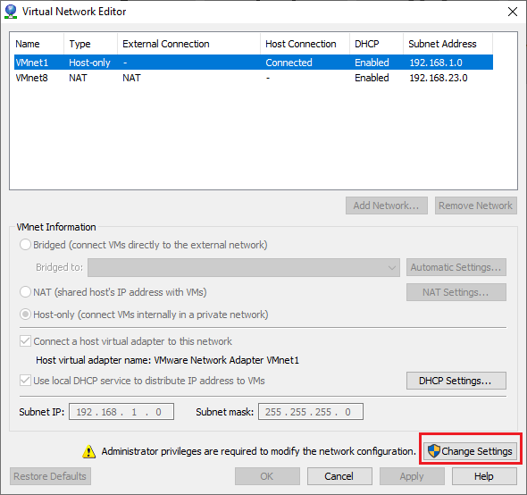

## Tìm hiểu các chế độ card mạng trong VMware Workstation, sự khác biệt

### VMware Workstation là 1 phần mềm ảo hóa nổi tiếng của công ty VMware Inc. Với VMware Workstation, bạn có thể chạy đồng thời nhiều hệ điều hành cùng lúc trên cùng một PC, giúp cho viêc học tập nghiên cứu trở nên dễ dàng hơn.

Mặc định khi khi cài đặt VMware, phần mềm sẽ cài đặt sẵn cho chúng ta 3 card mạng ảo.

> VMnet0 chế độ Bridged
VMnet1 chế độ Host-only
VMnet8 chế độ NAT

Ta có thể thêm, bớt, chỉnh các option của VMnet bằng cách vào menu `Edit` -> `Virtual Network Editor…` chọn `Change Settings` rồi `Yes`

- Chế độ Bridged

Ở chế độ này thì card mạng trên máy ảo sẽ được gắn vào VMnet0 và VMnet0 này liên kết trực tiếp với card mạng vật lý. Ở chế độ này máy ảo sẽ kết nối internet thông qua card mạng vật lý và có chung lớp mạng với card mạng vật lý. Lúc này, máy ảo sẽ đóng vai trò như một máy trong mạng thật, có thể nhận DHCP từ mạng ngoài, hoặc đặt IP tĩnh cùng dải với mạng ngoài để giao tiếp với các máy ngoài mạng hoặc kết nối Internet.

- Chế độ Host-only

Máy ảo được kết nối với VMnet có tính năng Host-only, trong trường hợp này là VMnet1. VNnet Host-only kết nối với  một card mạng ảo tương ứng ngoài máy thật. Ở chế độ này, các máy ảo không có kết nối vào mạng vật lý bên ngoài hay internet thông qua máy thật, có nghĩa là mạng VMnet Host-only và mạng vật lý hoàn toàn tách biệt. IP của máy ảo được cấp bởi DHCP của VMnet tương ứng. Trong nhiều trường hợp đặc biệt cần cấu hình riêng, ta có thể tắt DHCP trên VMnet và cấu hình địa chỉ IP tĩnh cùng dải để kết nối với nhau.

- Chế độ NAT

Ở chế độ này, card mạng của máy ảo kết nối với VMnet8, VNnet8 cho phép máy ảo đi ra mạng vật lý bên ngoài internet thông qua cơ chế NAT (NAT device) và máy thật sẽ đóng vai trò NAT server cho các máy ảo. Lúc này lớp mạng bên trong máy ảo khác hoàn toàn với lớp mạng của card vật lý bên ngoài, hai mạng hoàn toàn tách biệt, máy ảo sẽ được cấu hình NAT và sử dụng IP của máy thật để giao tiếp với mạng ngoài. IP của card mạng máy ảo sẽ được cấp bởi DHCP của VMnet8, trong trường hợp bạn muốn thiết lập IP tĩnh cho card mạng máy ảo bạn phải đảm bảo chung lớp mạng với VNnet8 thì máy ảo mới có thể kết nối internet.

