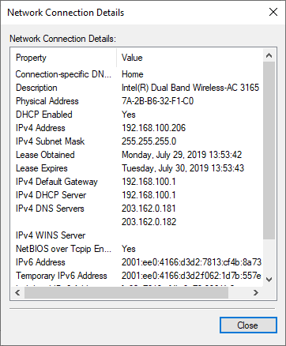
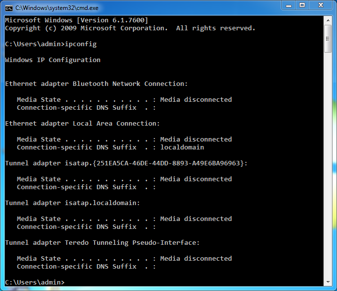
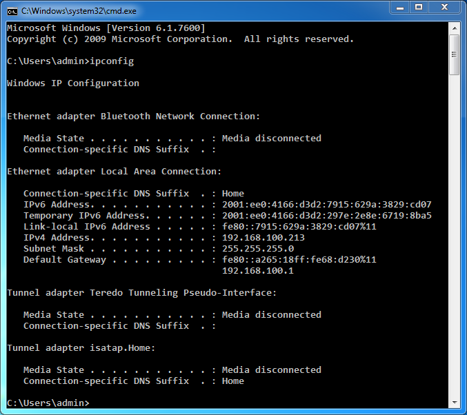
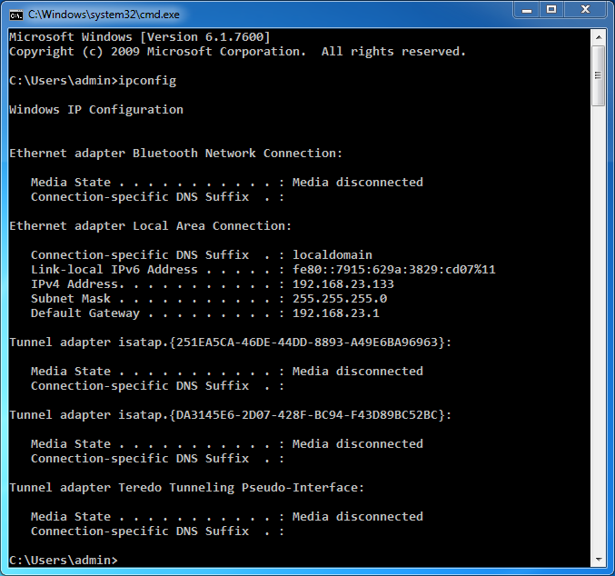
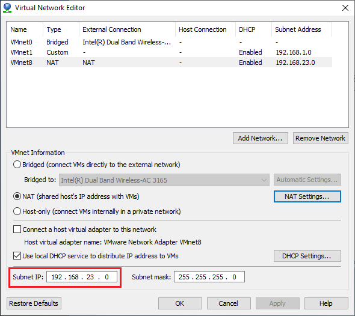
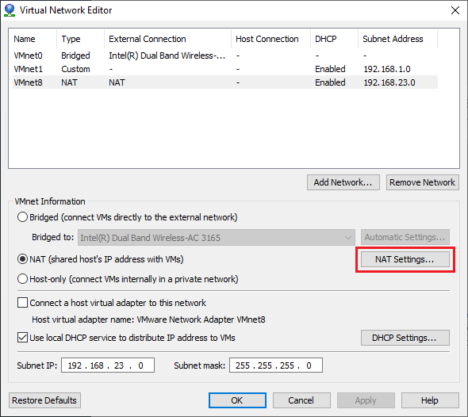
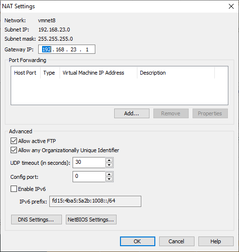

## Tìm hiểu gateway của 3 kiểu mạng trong VMware

Điạ chỉ ip cũng như default gateway của máy thật

#### Chế độ Host-only

Khi bạn cài 1 máy ảo trong VMware và để card mạng ở chế độ Host-only và gõ lệnh `ipconfig` đối với Windows hoặc `ifcònig` với Linux, thì bạn sẽ không thấy được ip máy ảo cũng như địa chỉ gateway vì ở chế độ này máy ảo sẽ không được kết nối mạng.

#### Chế độ Bridged

Ở chế độ này máy ảo sẽ kết nối internet thông qua card mạng vật lý và có chung lớp mạng với card mạng vật lý. Lúc này, máy ảo sẽ đóng vai trò như một máy trong mạng thật, có thể nhận DHCP từ mạng ngoài, hoặc đặt IP tĩnh cùng dải với mạng ngoài để giao tiếp với các máy ngoài mạng hoặc kết nối Internet. Do vậy, địa chỉ gateway ở đây sẽ là điạ chỉ gateway của mạng bên ngoài mà máy ảo kết nối đến (thường là gateway của router).

#### Chế độ NAT

Ở chế độ này, card mạng của máy ảo kết nối với VMnet8, VNnet8 cho phép máy ảo đi ra mạng vật lý bên ngoài internet thông qua cơ chế NAT (NAT device) và máy thật sẽ đóng vai trò NAT server cho các máy ảo. Lúc này lớp mạng bên trong máy ảo khác hoàn toàn với lớp mạng của card vật lý bên ngoài, hai mạng hoàn toàn tách biệt, máy ảo sẽ được cấu hình NAT và sử dụng IP của máy thật để giao tiếp với mạng ngoài. IP của card mạng máy ảo sẽ được cấp bởi DHCP của VMnet8, trong trường hợp bạn muốn thiết lập IP tĩnh cho card mạng máy ảo bạn phải đảm bảo địa chỉ IP cùng chung lớp mạng với VNnet8 thì máy ảo mới có thể kết nối internet. Về nguyên tắc bạn có thể cho rằng VMware cũng sẽ tự tạo ra một NIC ảo trên máy thật (như là 2 NIC ảo VMwareNetwork  Adapter VMnet1  và  8) để làm gateway rồi NAT giữa gateway này và NIC thật nhưng trên thực tế VMwaređã không làm như vậy, thay vào đó nó tạo ra một virtual NAT device làm gateway. Lẽ dĩ nhiên NAT device cũng phải có địa chỉ IP như NIC vậy nhưng bạn không thể cấu hình nó như một NIC được. Trong Windows nếu vào Control Panel\Network Connection bạn sẽ không tìm thấy NAT device này.

Nếu muốn thay đổi dải mạng cũng như địa chỉ gateway này, ta có thể truy cập vào menu `Edit` -> `Virtual Network Editor…` chọn `Change Settings` rồi `Yes`

tại mục Subnet IP, ta có thể thay đổi dải mạng cho máy ảo

còn nếu muốn thay đổi địa chỉ gateway, bấm `NAT Settings...`

sau đó, nhập địa chỉ tại mục `Gateway IP`

